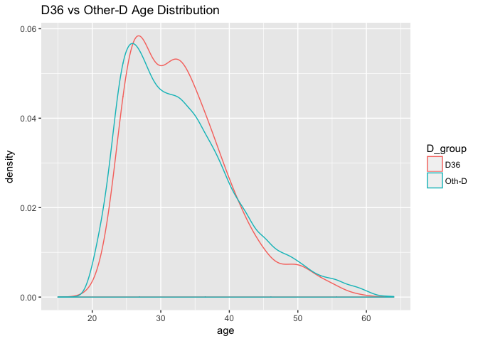

# OSS RL Aug-Sep 2017 analysis on D36

## Summary of RL finalized
<table class="table table-striped table-hover" style="margin-left: auto; margin-right: auto;">
<thead><tr>
<th style="text-align:left;">   </th>
   <th style="text-align:right;"> 201708 </th>
   <th style="text-align:right;"> 201709 </th>
  </tr></thead>
<tbody>
<tr>
<td style="text-align:left;"> A </td>
   <td style="text-align:right;"> 8255 </td>
   <td style="text-align:right;"> 4945 </td>
  </tr>
<tr>
<td style="text-align:left;"> C </td>
   <td style="text-align:right;"> 2915 </td>
   <td style="text-align:right;"> 2064 </td>
  </tr>
<tr>
<td style="text-align:left;"> D </td>
   <td style="text-align:right;"> 17526 </td>
   <td style="text-align:right;"> 11927 </td>
  </tr>
</tbody>
</table>

# Explore
Plot age distribution D36 vs others D

<!-- -->
