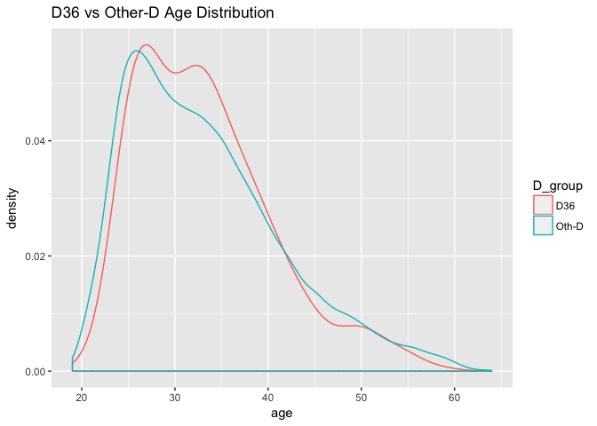

# OSS RL Aug-Sep 2017 analysis on D36


## Key number summary
<table class="table table-striped table-hover" style="width: auto !important; ">
<thead><tr>
<th style="text-align:left;"> kpi </th>
   <th style="text-align:right;"> 201708 </th>
   <th style="text-align:right;"> 201709 </th>
  </tr></thead>
<tbody>
<tr>
<td style="text-align:left;"> finalize </td>
   <td style="text-align:right;"> 8,255 </td>
   <td style="text-align:right;"> 4,945 </td>
  </tr>
<tr>
<td style="text-align:left;"> appr </td>
   <td style="text-align:right;"> 8,255 </td>
   <td style="text-align:right;"> 4,945 </td>
  </tr>
<tr>
<td style="text-align:left;"> loansize_amt </td>
   <td style="text-align:right;"> 451,506,000 </td>
   <td style="text-align:right;"> 241,133,600 </td>
  </tr>
<tr>
<td style="text-align:left;"> fdd_amt </td>
   <td style="text-align:right;"> 218,738,000 </td>
   <td style="text-align:right;"> 126,435,400 </td>
  </tr>
</tbody>
</table>

## Key Kpi by Month
### Approved Performance

% Approval rate, Avg Loansize, Avg FDD, % Early 60D
<table class="table table-striped table-hover" style="width: auto !important; ">
<thead><tr>
<th style="text-align:left;"> kpi </th>
   <th style="text-align:right;"> 201708 </th>
   <th style="text-align:right;"> 201709 </th>
  </tr></thead>
<tbody>
<tr>
<td style="text-align:left;"> avg_fdd </td>
   <td style="text-align:right;"> 26,497.64 </td>
   <td style="text-align:right;"> 25,568.33 </td>
  </tr>
<tr>
<td style="text-align:left;"> avg_loansize </td>
   <td style="text-align:right;"> 54,918.35 </td>
   <td style="text-align:right;"> 49,121.56 </td>
  </tr>
<tr>
<td style="text-align:left;"> per_appr </td>
   <td style="text-align:right;"> 28.77 </td>
   <td style="text-align:right;"> 26.11 </td>
  </tr>
<tr>
<td style="text-align:left;"> per_early60D </td>
   <td style="text-align:right;"> 5.44 </td>
   <td style="text-align:right;"> 0.00 </td>
  </tr>
</tbody>
</table>

### Finalized Performance
Top Decline Reason

```
## Selecting by 201709
```

<table class="table table-striped table-hover" style="width: auto !important; ">
<thead><tr>
<th style="text-align:left;"> result_description </th>
   <th style="text-align:right;"> 201708 </th>
   <th style="text-align:right;"> 201709 </th>
   <th style="text-align:left;"> reason_desc </th>
  </tr></thead>
<tbody>
<tr>
<td style="text-align:left;"> D09 </td>
   <td style="text-align:right;"> 3,464 </td>
   <td style="text-align:right;"> 1,464 </td>
   <td style="text-align:left;"> ประมาณการรายได้ไม่เพียงพอต่อการชำระหนี้ </td>
  </tr>
<tr>
<td style="text-align:left;"> D11 </td>
   <td style="text-align:right;"> 5,675 </td>
   <td style="text-align:right;"> 3,723 </td>
   <td style="text-align:left;"> credit scoring ต่ำกว่าเกณฑ์ที่กำหนด </td>
  </tr>
<tr>
<td style="text-align:left;"> D24 </td>
   <td style="text-align:right;"> 4,956 </td>
   <td style="text-align:right;"> 3,397 </td>
   <td style="text-align:left;"> ประวัติ NCB Negative ออกจดหมายแจ้งลูกค้า </td>
  </tr>
<tr>
<td style="text-align:left;"> D30 </td>
   <td style="text-align:right;"> 196 </td>
   <td style="text-align:right;"> 566 </td>
   <td style="text-align:left;"> ภาระหนี้ใน NCB สูง ออกจดหมายแจ้งลูกค้า </td>
  </tr>
<tr>
<td style="text-align:left;"> D36 </td>
   <td style="text-align:right;"> NA </td>
   <td style="text-align:right;"> 612 </td>
   <td style="text-align:left;"> สินเชื่อบุคคลเกินเกณฑ์ BOT ออกจดหมาย NCB </td>
  </tr>
</tbody>
</table>

Top Cancel Reason

```
## Selecting by 201709
```

<table class="table table-striped table-hover" style="width: auto !important; ">
<thead><tr>
<th style="text-align:left;"> result_description </th>
   <th style="text-align:right;"> 201708 </th>
   <th style="text-align:right;"> 201709 </th>
   <th style="text-align:left;"> reason_desc </th>
  </tr></thead>
<tbody>
<tr>
<td style="text-align:left;"> C01 </td>
   <td style="text-align:right;"> 740 </td>
   <td style="text-align:right;"> 477 </td>
   <td style="text-align:left;"> ลูกค้ายกเลิกใบสมัคร/ไม่รับเงินโอนก้อนแรก </td>
  </tr>
<tr>
<td style="text-align:left;"> C02 </td>
   <td style="text-align:right;"> 595 </td>
   <td style="text-align:right;"> 550 </td>
   <td style="text-align:left;"> Consent ไม่สมบูรณ์ / NCB ไม่ยอมรับ </td>
  </tr>
<tr>
<td style="text-align:left;"> C03 </td>
   <td style="text-align:right;"> 122 </td>
   <td style="text-align:right;"> 109 </td>
   <td style="text-align:left;"> ส่ง SMS ติดต่อผู้สมัคร </td>
  </tr>
<tr>
<td style="text-align:left;"> C04 </td>
   <td style="text-align:right;"> 680 </td>
   <td style="text-align:right;"> 428 </td>
   <td style="text-align:left;"> ส่ง SMS แจ้งใบสมัคร หรือเอกสารประกอบฯ ไม่สมบูรณ์ </td>
  </tr>
<tr>
<td style="text-align:left;"> C74 </td>
   <td style="text-align:right;"> 630 </td>
   <td style="text-align:right;"> 379 </td>
   <td style="text-align:left;"> สมัครสินเชื่อซ้ำประเภท / ส่งใบสมัครซ้ำซ้อน </td>
  </tr>
</tbody>
</table>

Customer income range table
<table class="table table-striped table-hover" style="width: auto !important; ">
<thead><tr>
<th style="text-align:left;"> income_range </th>
   <th style="text-align:right;"> 201708 </th>
   <th style="text-align:right;"> 201709 </th>
  </tr></thead>
<tbody>
<tr>
<td style="text-align:left;"> 10,000-14,999 </td>
   <td style="text-align:right;"> 5,627 </td>
   <td style="text-align:right;"> 3,022 </td>
  </tr>
<tr>
<td style="text-align:left;"> 15,000-19,999 </td>
   <td style="text-align:right;"> 10,563 </td>
   <td style="text-align:right;"> 6,631 </td>
  </tr>
<tr>
<td style="text-align:left;"> 20,000-29,999 </td>
   <td style="text-align:right;"> 7,443 </td>
   <td style="text-align:right;"> 5,145 </td>
  </tr>
<tr>
<td style="text-align:left;"> 30,000 up </td>
   <td style="text-align:right;"> 4,261 </td>
   <td style="text-align:right;"> 3,642 </td>
  </tr>
</tbody>
</table>

Customer income density, (interactive graph)

```
## 
## Attaching package: 'plotly'
```

```
## The following object is masked from 'package:ggplot2':
## 
##     last_plot
```

```
## The following object is masked from 'package:stats':
## 
##     filter
```

```
## The following object is masked from 'package:graphics':
## 
##     layout
```

```
## We recommend that you use the dev version of ggplot2 with `ggplotly()`
## Install it with: `devtools::install_github('hadley/ggplot2')`
```

```
## Warning: Removed 159 rows containing non-finite values (stat_density).
```

<!--html_preserve--><div id="31d152efe5e" style="width:672px;height:480px;" class="plotly html-widget"></div>
<script type="application/json" data-for="31d152efe5e">{"x":{"data":[{"x":[3.69897000433602,3.701860652584,3.70475130083199,3.70764194907997,3.71053259732795,3.71342324557594,3.71631389382392,3.7192045420719,3.72209519031989,3.72498583856787,3.72787648681586,3.73076713506384,3.73365778331182,3.73654843155981,3.73943907980779,3.74232972805577,3.74522037630376,3.74811102455174,3.75100167279972,3.75389232104771,3.75678296929569,3.75967361754368,3.76256426579166,3.76545491403964,3.76834556228763,3.77123621053561,3.77412685878359,3.77701750703158,3.77990815527956,3.78279880352755,3.78568945177553,3.78858010002351,3.7914707482715,3.79436139651948,3.79725204476746,3.80014269301545,3.80303334126343,3.80592398951141,3.8088146377594,3.81170528600738,3.81459593425537,3.81748658250335,3.82037723075133,3.82326787899932,3.8261585272473,3.82904917549528,3.83193982374327,3.83483047199125,3.83772112023924,3.84061176848722,3.8435024167352,3.84639306498319,3.84928371323117,3.85217436147915,3.85506500972714,3.85795565797512,3.86084630622311,3.86373695447109,3.86662760271907,3.86951825096706,3.87240889921504,3.87529954746302,3.87819019571101,3.88108084395899,3.88397149220697,3.88686214045496,3.88975278870294,3.89264343695093,3.89553408519891,3.89842473344689,3.90131538169488,3.90420602994286,3.90709667819084,3.90998732643883,3.91287797468681,3.9157686229348,3.91865927118278,3.92154991943076,3.92444056767875,3.92733121592673,3.93022186417471,3.9331125124227,3.93600316067068,3.93889380891866,3.94178445716665,3.94467510541463,3.94756575366262,3.9504564019106,3.95334705015858,3.95623769840657,3.95912834665455,3.96201899490253,3.96490964315052,3.9678002913985,3.97069093964648,3.97358158789447,3.97647223614245,3.97936288439044,3.98225353263842,3.9851441808864,3.98803482913439,3.99092547738237,3.99381612563035,3.99670677387834,3.99959742212632,4.00248807037431,4.00537871862229,4.00826936687027,4.01116001511826,4.01405066336624,4.01694131161422,4.01983195986221,4.02272260811019,4.02561325635818,4.02850390460616,4.03139455285414,4.03428520110213,4.03717584935011,4.04006649759809,4.04295714584608,4.04584779409406,4.04873844234204,4.05162909059003,4.05451973883801,4.057410387086,4.06030103533398,4.06319168358196,4.06608233182995,4.06897298007793,4.07186362832591,4.0747542765739,4.07764492482188,4.08053557306986,4.08342622131785,4.08631686956583,4.08920751781382,4.0920981660618,4.09498881430978,4.09787946255777,4.10077011080575,4.10366075905373,4.10655140730172,4.1094420555497,4.11233270379769,4.11522335204567,4.11811400029365,4.12100464854164,4.12389529678962,4.1267859450376,4.12967659328559,4.13256724153357,4.13545788978155,4.13834853802954,4.14123918627752,4.14412983452551,4.14702048277349,4.14991113102147,4.15280177926946,4.15569242751744,4.15858307576542,4.16147372401341,4.16436437226139,4.16725502050938,4.17014566875736,4.17303631700534,4.17592696525333,4.17881761350131,4.18170826174929,4.18459890999728,4.18748955824526,4.19038020649324,4.19327085474123,4.19616150298921,4.1990521512372,4.20194279948518,4.20483344773316,4.20772409598115,4.21061474422913,4.21350539247711,4.2163960407251,4.21928668897308,4.22217733722107,4.22506798546905,4.22795863371703,4.23084928196502,4.233739930213,4.23663057846098,4.23952122670897,4.24241187495695,4.24530252320494,4.24819317145292,4.2510838197009,4.25397446794889,4.25686511619687,4.25975576444485,4.26264641269284,4.26553706094082,4.2684277091888,4.27131835743679,4.27420900568477,4.27709965393276,4.27999030218074,4.28288095042872,4.28577159867671,4.28866224692469,4.29155289517267,4.29444354342066,4.29733419166864,4.30022483991663,4.30311548816461,4.30600613641259,4.30889678466058,4.31178743290856,4.31467808115654,4.31756872940453,4.32045937765251,4.32335002590049,4.32624067414848,4.32913132239646,4.33202197064445,4.33491261889243,4.33780326714041,4.3406939153884,4.34358456363638,4.34647521188436,4.34936586013235,4.35225650838033,4.35514715662832,4.3580378048763,4.36092845312428,4.36381910137227,4.36670974962025,4.36960039786823,4.37249104611622,4.3753816943642,4.37827234261218,4.38116299086017,4.38405363910815,4.38694428735614,4.38983493560412,4.3927255838521,4.39561623210009,4.39850688034807,4.40139752859605,4.40428817684404,4.40717882509202,4.41006947334001,4.41296012158799,4.41585076983597,4.41874141808396,4.42163206633194,4.42452271457992,4.42741336282791,4.43030401107589,4.43319465932387,4.43608530757186,4.43897595581984,4.44186660406783,4.44475725231581,4.44764790056379,4.45053854881178,4.45342919705976,4.45631984530774,4.45921049355573,4.46210114180371,4.46499179005169,4.46788243829968,4.47077308654766,4.47366373479565,4.47655438304363,4.47944503129161,4.4823356795396,4.48522632778758,4.48811697603556,4.49100762428355,4.49389827253153,4.49678892077952,4.4996795690275,4.50257021727548,4.50546086552347,4.50835151377145,4.51124216201943,4.51413281026742,4.5170234585154,4.51991410676338,4.52280475501137,4.52569540325935,4.52858605150734,4.53147669975532,4.5343673480033,4.53725799625129,4.54014864449927,4.54303929274725,4.54592994099524,4.54882058924322,4.55171123749121,4.55460188573919,4.55749253398717,4.56038318223516,4.56327383048314,4.56616447873112,4.56905512697911,4.57194577522709,4.57483642347507,4.57772707172306,4.58061771997104,4.58350836821903,4.58639901646701,4.58928966471499,4.59218031296298,4.59507096121096,4.59796160945894,4.60085225770693,4.60374290595491,4.6066335542029,4.60952420245088,4.61241485069886,4.61530549894685,4.61819614719483,4.62108679544281,4.6239774436908,4.62686809193878,4.62975874018677,4.63264938843475,4.63554003668273,4.63843068493072,4.6413213331787,4.64421198142668,4.64710262967467,4.64999327792265,4.65288392617063,4.65577457441862,4.6586652226666,4.66155587091459,4.66444651916257,4.66733716741055,4.67022781565854,4.67311846390652,4.6760091121545,4.67889976040249,4.68179040865047,4.68468105689846,4.68757170514644,4.69046235339442,4.69335300164241,4.69624364989039,4.69913429813837,4.70202494638636,4.70491559463434,4.70780624288232,4.71069689113031,4.71358753937829,4.71647818762628,4.71936883587426,4.72225948412224,4.72515013237023,4.72804078061821,4.73093142886619,4.73382207711418,4.73671272536216,4.73960337361015,4.74249402185813,4.74538467010611,4.7482753183541,4.75116596660208,4.75405661485006,4.75694726309805,4.75983791134603,4.76272855959401,4.765619207842,4.76850985608998,4.77140050433797,4.77429115258595,4.77718180083393,4.78007244908192,4.7829630973299,4.78585374557788,4.78874439382587,4.79163504207385,4.79452569032184,4.79741633856982,4.8003069868178,4.80319763506579,4.80608828331377,4.80897893156175,4.81186957980974,4.81476022805772,4.8176508763057,4.82054152455369,4.82343217280167,4.82632282104966,4.82921346929764,4.83210411754562,4.83499476579361,4.83788541404159,4.84077606228957,4.84366671053756,4.84655735878554,4.84944800703352,4.85233865528151,4.85522930352949,4.85811995177748,4.86101060002546,4.86390124827344,4.86679189652143,4.86968254476941,4.87257319301739,4.87546384126538,4.87835448951336,4.88124513776135,4.88413578600933,4.88702643425731,4.8899170825053,4.89280773075328,4.89569837900126,4.89858902724925,4.90147967549723,4.90437032374521,4.9072609719932,4.91015162024118,4.91304226848917,4.91593291673715,4.91882356498513,4.92171421323312,4.9246048614811,4.92749550972908,4.93038615797707,4.93327680622505,4.93616745447304,4.93905810272102,4.941948750969,4.94483939921699,4.94773004746497,4.95062069571295,4.95351134396094,4.95640199220892,4.9592926404569,4.96218328870489,4.96507393695287,4.96796458520086,4.97085523344884,4.97374588169682,4.97663652994481,4.97952717819279,4.98241782644077,4.98530847468876,4.98819912293674,4.99108977118473,4.99398041943271,4.99687106768069,4.99976171592868,5.00265236417666,5.00554301242464,5.00843366067263,5.01132430892061,5.01421495716859,5.01710560541658,5.01999625366456,5.02288690191255,5.02577755016053,5.02866819840851,5.0315588466565,5.03444949490448,5.03734014315246,5.04023079140045,5.04312143964843,5.04601208789642,5.0489027361444,5.05179338439238,5.05468403264037,5.05757468088835,5.06046532913633,5.06335597738432,5.0662466256323,5.06913727388029,5.07202792212827,5.07491857037625,5.07780921862424,5.08069986687222,5.0835905151202,5.08648116336819,5.08937181161617,5.09226245986415,5.09515310811214,5.09804375636012,5.10093440460811,5.10382505285609,5.10671570110407,5.10960634935206,5.11249699760004,5.11538764584802,5.11827829409601,5.12116894234399,5.12405959059198,5.12695023883996,5.12984088708794,5.13273153533593,5.13562218358391,5.13851283183189,5.14140348007988,5.14429412832786,5.14718477657584,5.15007542482383,5.15296607307181,5.15585672131979,5.15874736956778,5.16163801781576,5.16452866606375,5.16741931431173,5.17030996255971,5.1732006108077,5.17609125905568,5.17609125905568,5.1732006108077,5.17030996255971,5.16741931431173,5.16452866606375,5.16163801781576,5.15874736956778,5.15585672131979,5.15296607307181,5.15007542482383,5.14718477657584,5.14429412832786,5.14140348007988,5.13851283183189,5.13562218358391,5.13273153533593,5.12984088708794,5.12695023883996,5.12405959059198,5.12116894234399,5.11827829409601,5.11538764584802,5.11249699760004,5.10960634935206,5.10671570110407,5.10382505285609,5.10093440460811,5.09804375636012,5.09515310811214,5.09226245986415,5.08937181161617,5.08648116336819,5.0835905151202,5.08069986687222,5.07780921862424,5.07491857037625,5.07202792212827,5.06913727388029,5.0662466256323,5.06335597738432,5.06046532913633,5.05757468088835,5.05468403264037,5.05179338439238,5.0489027361444,5.04601208789642,5.04312143964843,5.04023079140045,5.03734014315246,5.03444949490448,5.0315588466565,5.02866819840851,5.02577755016053,5.02288690191255,5.01999625366456,5.01710560541658,5.01421495716859,5.01132430892061,5.00843366067263,5.00554301242464,5.00265236417666,4.99976171592868,4.99687106768069,4.99398041943271,4.99108977118473,4.98819912293674,4.98530847468876,4.98241782644077,4.97952717819279,4.97663652994481,4.97374588169682,4.97085523344884,4.96796458520086,4.96507393695287,4.96218328870489,4.9592926404569,4.95640199220892,4.95351134396094,4.95062069571295,4.94773004746497,4.94483939921699,4.941948750969,4.93905810272102,4.93616745447304,4.93327680622505,4.93038615797707,4.92749550972908,4.9246048614811,4.92171421323312,4.91882356498513,4.91593291673715,4.91304226848917,4.91015162024118,4.9072609719932,4.90437032374521,4.90147967549723,4.89858902724925,4.89569837900126,4.89280773075328,4.8899170825053,4.88702643425731,4.88413578600933,4.88124513776135,4.87835448951336,4.87546384126538,4.87257319301739,4.86968254476941,4.86679189652143,4.86390124827344,4.86101060002546,4.85811995177748,4.85522930352949,4.85233865528151,4.84944800703352,4.84655735878554,4.84366671053756,4.84077606228957,4.83788541404159,4.83499476579361,4.83210411754562,4.82921346929764,4.82632282104966,4.82343217280167,4.82054152455369,4.8176508763057,4.81476022805772,4.81186957980974,4.80897893156175,4.80608828331377,4.80319763506579,4.8003069868178,4.79741633856982,4.79452569032184,4.79163504207385,4.78874439382587,4.78585374557788,4.7829630973299,4.78007244908192,4.77718180083393,4.77429115258595,4.77140050433797,4.76850985608998,4.765619207842,4.76272855959401,4.75983791134603,4.75694726309805,4.75405661485006,4.75116596660208,4.7482753183541,4.74538467010611,4.74249402185813,4.73960337361015,4.73671272536216,4.73382207711418,4.73093142886619,4.72804078061821,4.72515013237023,4.72225948412224,4.71936883587426,4.71647818762628,4.71358753937829,4.71069689113031,4.70780624288232,4.70491559463434,4.70202494638636,4.69913429813837,4.69624364989039,4.69335300164241,4.69046235339442,4.68757170514644,4.68468105689846,4.68179040865047,4.67889976040249,4.6760091121545,4.67311846390652,4.67022781565854,4.66733716741055,4.66444651916257,4.66155587091459,4.6586652226666,4.65577457441862,4.65288392617063,4.64999327792265,4.64710262967467,4.64421198142668,4.6413213331787,4.63843068493072,4.63554003668273,4.63264938843475,4.62975874018677,4.62686809193878,4.6239774436908,4.62108679544281,4.61819614719483,4.61530549894685,4.61241485069886,4.60952420245088,4.6066335542029,4.60374290595491,4.60085225770693,4.59796160945894,4.59507096121096,4.59218031296298,4.58928966471499,4.58639901646701,4.58350836821903,4.58061771997104,4.57772707172306,4.57483642347507,4.57194577522709,4.56905512697911,4.56616447873112,4.56327383048314,4.56038318223516,4.55749253398717,4.55460188573919,4.55171123749121,4.54882058924322,4.54592994099524,4.54303929274725,4.54014864449927,4.53725799625129,4.5343673480033,4.53147669975532,4.52858605150734,4.52569540325935,4.52280475501137,4.51991410676338,4.5170234585154,4.51413281026742,4.51124216201943,4.50835151377145,4.50546086552347,4.50257021727548,4.4996795690275,4.49678892077952,4.49389827253153,4.49100762428355,4.48811697603556,4.48522632778758,4.4823356795396,4.47944503129161,4.47655438304363,4.47366373479565,4.47077308654766,4.46788243829968,4.46499179005169,4.46210114180371,4.45921049355573,4.45631984530774,4.45342919705976,4.45053854881178,4.44764790056379,4.44475725231581,4.44186660406783,4.43897595581984,4.43608530757186,4.43319465932387,4.43030401107589,4.42741336282791,4.42452271457992,4.42163206633194,4.41874141808396,4.41585076983597,4.41296012158799,4.41006947334001,4.40717882509202,4.40428817684404,4.40139752859605,4.39850688034807,4.39561623210009,4.3927255838521,4.38983493560412,4.38694428735614,4.38405363910815,4.38116299086017,4.37827234261218,4.3753816943642,4.37249104611622,4.36960039786823,4.36670974962025,4.36381910137227,4.36092845312428,4.3580378048763,4.35514715662832,4.35225650838033,4.34936586013235,4.34647521188436,4.34358456363638,4.3406939153884,4.33780326714041,4.33491261889243,4.33202197064445,4.32913132239646,4.32624067414848,4.32335002590049,4.32045937765251,4.31756872940453,4.31467808115654,4.31178743290856,4.30889678466058,4.30600613641259,4.30311548816461,4.30022483991663,4.29733419166864,4.29444354342066,4.29155289517267,4.28866224692469,4.28577159867671,4.28288095042872,4.27999030218074,4.27709965393276,4.27420900568477,4.27131835743679,4.2684277091888,4.26553706094082,4.26264641269284,4.25975576444485,4.25686511619687,4.25397446794889,4.2510838197009,4.24819317145292,4.24530252320494,4.24241187495695,4.23952122670897,4.23663057846098,4.233739930213,4.23084928196502,4.22795863371703,4.22506798546905,4.22217733722107,4.21928668897308,4.2163960407251,4.21350539247711,4.21061474422913,4.20772409598115,4.20483344773316,4.20194279948518,4.1990521512372,4.19616150298921,4.19327085474123,4.19038020649324,4.18748955824526,4.18459890999728,4.18170826174929,4.17881761350131,4.17592696525333,4.17303631700534,4.17014566875736,4.16725502050938,4.16436437226139,4.16147372401341,4.15858307576542,4.15569242751744,4.15280177926946,4.14991113102147,4.14702048277349,4.14412983452551,4.14123918627752,4.13834853802954,4.13545788978155,4.13256724153357,4.12967659328559,4.1267859450376,4.12389529678962,4.12100464854164,4.11811400029365,4.11522335204567,4.11233270379769,4.1094420555497,4.10655140730172,4.10366075905373,4.10077011080575,4.09787946255777,4.09498881430978,4.0920981660618,4.08920751781382,4.08631686956583,4.08342622131785,4.08053557306986,4.07764492482188,4.0747542765739,4.07186362832591,4.06897298007793,4.06608233182995,4.06319168358196,4.06030103533398,4.057410387086,4.05451973883801,4.05162909059003,4.04873844234204,4.04584779409406,4.04295714584608,4.04006649759809,4.03717584935011,4.03428520110213,4.03139455285414,4.02850390460616,4.02561325635818,4.02272260811019,4.01983195986221,4.01694131161422,4.01405066336624,4.01116001511826,4.00826936687027,4.00537871862229,4.00248807037431,3.99959742212632,3.99670677387834,3.99381612563035,3.99092547738237,3.98803482913439,3.9851441808864,3.98225353263842,3.97936288439044,3.97647223614245,3.97358158789447,3.97069093964648,3.9678002913985,3.96490964315052,3.96201899490253,3.95912834665455,3.95623769840657,3.95334705015858,3.9504564019106,3.94756575366262,3.94467510541463,3.94178445716665,3.93889380891866,3.93600316067068,3.9331125124227,3.93022186417471,3.92733121592673,3.92444056767875,3.92154991943076,3.91865927118278,3.9157686229348,3.91287797468681,3.90998732643883,3.90709667819084,3.90420602994286,3.90131538169488,3.89842473344689,3.89553408519891,3.89264343695093,3.88975278870294,3.88686214045496,3.88397149220697,3.88108084395899,3.87819019571101,3.87529954746302,3.87240889921504,3.86951825096706,3.86662760271907,3.86373695447109,3.86084630622311,3.85795565797512,3.85506500972714,3.85217436147915,3.84928371323117,3.84639306498319,3.8435024167352,3.84061176848722,3.83772112023924,3.83483047199125,3.83193982374327,3.82904917549528,3.8261585272473,3.82326787899932,3.82037723075133,3.81748658250335,3.81459593425537,3.81170528600738,3.8088146377594,3.80592398951141,3.80303334126343,3.80014269301545,3.79725204476746,3.79436139651948,3.7914707482715,3.78858010002351,3.78568945177553,3.78279880352755,3.77990815527956,3.77701750703158,3.77412685878359,3.77123621053561,3.76834556228763,3.76545491403964,3.76256426579166,3.75967361754368,3.75678296929569,3.75389232104771,3.75100167279972,3.74811102455174,3.74522037630376,3.74232972805577,3.73943907980779,3.73654843155981,3.73365778331182,3.73076713506384,3.72787648681586,3.72498583856787,3.72209519031989,3.7192045420719,3.71631389382392,3.71342324557594,3.71053259732795,3.70764194907997,3.70475130083199,3.701860652584,3.69897000433602,3.69897000433602],"y":[0,0,0,0,0,0,0,0,0,0,0,0,0,0,0,0,0,0,0,0,0,0,0,0,0,0,0,0,0,0,0,0,0,0,0,0,0,0,0,0,0,0,0,0,0,0,0,0,0,0,0,0,0,0,0,0,0,0,0,0,0,0,0,0,0,0,0,0,0,0,0,0,0,0,0,0,0,0,0,0,0,0,0,0,0,0,0,0,0,0,0,0,0,0,0,0,0,0,0,0,0,0,0,0,0,0,0,0,0,0,0,0,0,0,0,0,0,0,0,0,0,0,0,0,0,0,0,0,0,0,0,0,0,0,0,0,0,0,0,0,0,0,0,0,0,0,0,0,0,0,0,0,0,0,0,0,0,0,0,0,0,0,0,0,0,0,0,0,0,0,0,0,0,0,0,0,0,0,0,0,0,0,0,0,0,0,0,0,0,0,0,0,0,0,0,0,0,0,0,0,0,0,0,0,0,0,0,0,0,0,0,0,0,0,0,0,0,0,0,0,0,0,0,0,0,0,0,0,0,0,0,0,0,0,0,0,0,0,0,0,0,0,0,0,0,0,0,0,0,0,0,0,0,0,0,0,0,0,0,0,0,0,0,0,0,0,0,0,0,0,0,0,0,0,0,0,0,0,0,0,0,0,0,0,0,0,0,0,0,0,0,0,0,0,0,0,0,0,0,0,0,0,0,0,0,0,0,0,0,0,0,0,0,0,0,0,0,0,0,0,0,0,0,0,0,0,0,0,0,0,0,0,0,0,0,0,0,0,0,0,0,0,0,0,0,0,0,0,0,0,0,0,0,0,0,0,0,0,0,0,0,0,0,0,0,0,0,0,0,0,0,0,0,0,0,0,0,0,0,0,0,0,0,0,0,0,0,0,0,0,0,0,0,0,0,0,0,0,0,0,0,0,0,0,0,0,0,0,0,0,0,0,0,0,0,0,0,0,0,0,0,0,0,0,0,0,0,0,0,0,0,0,0,0,0,0,0,0,0,0,0,0,0,0,0,0,0,0,0,0,0,0,0,0,0,0,0,0,0,0,0,0,0,0,0,0,0,0,0,0,0,0,0,0,0,0,0,0,0,0,0,0,0,0,0,0,0,0,0,0,0,0,0,0,0,0,0,0,0,0,0,0,0,0,0,0,0,0,0,0,0,0,0.00974817347101878,0.010543910605173,0.0113058273715159,0.012042625895253,0.01276601331556,0.0134879335048364,0.0142176265266149,0.0149589649582641,0.0157078414290702,0.0164485434206866,0.0171595047426702,0.0178149564805784,0.0183876660719026,0.0188520322029976,0.0191870213748705,0.0193786803026785,0.0194220478123583,0.0193223796035418,0.0190956768768424,0.0187656687017724,0.018377091916258,0.0179828219387387,0.0176351401285697,0.017388045379429,0.0172935076963902,0.0173973012748097,0.017734729413321,0.0183266622179527,0.0191763774440542,0.02026770970131,0.0215680242531635,0.0230234940353633,0.0245473864347633,0.026067543954161,0.027515725744171,0.0288338938485491,0.0299790651989655,0.030926237773927,0.0316691909456215,0.0322192593227809,0.0326024526709421,0.032855508671763,0.0330185033693663,0.0331499238007913,0.0332941970705034,0.0334918348024112,0.0337793925341511,0.034188817077314,0.03474661061062,0.0354726236802818,0.0363784644435461,0.037465694297528,0.0387241442065778,0.0401377562400124,0.0416580545988233,0.0432293634332142,0.0447965172177244,0.0463040491583411,0.0477013482449343,0.0489472686501092,0.0500135513087322,0.0508865836966177,0.0515672574724374,0.0520689605234963,0.052409366288986,0.0526151239976668,0.0527221566446013,0.0527502802084479,0.0527131462882929,0.0526188137248229,0.0524716343195959,0.052274987526639,0.0520343090506395,0.0517598430145185,0.0514686019479402,0.0511854166558345,0.0509504984566274,0.0507995963745308,0.0507682643669269,0.0508870558137144,0.0511779775247515,0.0516518699074327,0.052307047565272,0.0531293590621664,0.0540936385684544,0.0551663449241331,0.0563090341283378,0.0574811936564557,0.0586408610504574,0.0597601063516703,0.0608206553737612,0.0618141747662609,0.0627426082664106,0.0636180289173268,0.0644620874003881,0.0653050830813043,0.0661846371926159,0.0671439188585552,0.068238898176051,0.0695244186080288,0.0710346991158311,0.072802929286802,0.07485115396891,0.0771877846746764,0.0798058428105484,0.0826820918130416,0.0857771842215043,0.0890369182700823,0.0923946613962199,0.0957734506978939,0.0990784520474434,0.102233229653194,0.105173952270917,0.107852396110082,0.110239088814494,0.112324384369466,0.11411732058972,0.115642449453553,0.116935160450427,0.118036295304381,0.118987035967894,0.119817818757557,0.120574581470723,0.121287336150566,0.121986944552503,0.122710001440446,0.123501484546936,0.124415118953436,0.12551090291076,0.126849788789304,0.128486091717334,0.13045874083536,0.1328051736457,0.13549010482449,0.1384422814935,0.14158030762071,0.144808919598799,0.148031110340011,0.151160497794104,0.154132170296842,0.156910555580658,0.159493361092396,0.161911259035437,0.164223324061007,0.166525661596238,0.168920764361781,0.171504660264561,0.174368696919617,0.177596011005126,0.181259326153792,0.185419367925444,0.190123153275536,0.195401537446284,0.201265657897537,0.207705880010954,0.214716386720936,0.222146173373285,0.22986344038507,0.237700359218598,0.245459820333601,0.252926610548178,0.259882545975222,0.266124537533686,0.271484069535153,0.275846172605235,0.279165713698358,0.281408471638169,0.282794395338358,0.283572223508661,0.284018855147799,0.284437041272892,0.285126326694917,0.28635390071521,0.288328497348047,0.291180236617189,0.294948774814029,0.299581362584131,0.304967170682795,0.310862281307924,0.316989363753896,0.323122572262981,0.329077263634145,0.33473223250009,0.3400431920279,0.345046196546058,0.349850829658178,0.35462408988712,0.359566915012724,0.364899125106572,0.370856180131754,0.377509891354916,0.384888031209831,0.392938051034116,0.401532740615818,0.410484329609863,0.419565128594532,0.428532213807403,0.437153312629242,0.44523096724919,0.452622256813182,0.459177665059769,0.464982207494887,0.470127252329358,0.47474373953698,0.478989772485543,0.483031154917596,0.487023027101421,0.491094237995628,0.49533567703013,0.499793365274685,0.504466705785777,0.509317040303815,0.514244169097984,0.519142406524831,0.523918236675312,0.528501176282313,0.532858933277188,0.53700853434995,0.541021865711345,0.54502466133318,0.54918875231416,0.55371829827151,0.558863228475566,0.564890912480578,0.571934123584844,0.580127988964086,0.589569257561334,0.600323275654423,0.612435100999249,0.625941601496636,0.640881172383789,0.657298055643731,0.675239130014518,0.694754193913878,0.715990470211077,0.738721727927605,0.762797917736098,0.787981940091115,0.81395463862569,0.840330841394068,0.866683801905647,0.892574093433878,0.917578491434333,0.941314668112178,0.963458609577488,0.983579408113126,1.00159370316838,1.01744787147817,1.03110944204997,1.0426147362841,1.052076869999,1.05969473156145,1.06575945701735,1.07065479414162,1.07484832398302,1.07887170995592,1.08334565509274,1.08891211890403,1.09600778322872,1.1049715188742,1.11599081156607,1.12908481420888,1.14410337382261,1.16074310036994,1.17858008188174,1.19711726783273,1.21584290503298,1.23427995566527,1.25202221475073,1.26899247295385,1.28529545202974,1.30123289805474,1.31727072225864,1.33398633822222,1.35200262333998,1.37191615921044,1.39422775499415,1.41928278841628,1.44722769979706,1.47822697276339,1.51163774931079,1.54690234063412,1.58338037813049,1.62040042314523,1.65733734946486,1.69368638138092,1.72912481412358,1.7635524694357,1.79710295239561,1.83011993211082,1.86313658793684,1.89675777705499,1.93136571705201,1.96708905330705,2.00372470725326,2.04070808395152,2.07713958801538,2.11186752012643,2.14361946891878,2.17116708004055,2.19350330201703,2.20978141879073,2.2198256930198,2.22473195395873,2.22570260210855,2.22431856079088,2.22236600952859,2.22164220016466,2.22376354572173,2.22999760353368,2.24113710017918,2.25742917793328,2.27859844505545,2.30403364097806,2.33197618547019,2.36102981401321,2.38985727579779,2.41734309860189,2.44272443017541,2.46567785112508,2.48635492896882,2.50536460158948,2.52370583957872,2.54265904178986,2.56396394227851,2.58905526771246,2.61902469518066,2.65469755541845,2.69653103546745,2.74460300889382,2.79863881076999,2.85806708088456,2.92209112858774,2.98975870308739,3.06001119272733,3.13168463128278,3.20317912024968,3.27271668517389,3.33813692830044,3.39672868948693,3.44521660776468,3.47986342162311,3.49670217062944,3.49188969496789,3.46214899893853,3.40524612874881,3.31980556143454,3.20581315340272,3.06930604152603,2.91556895738928,2.75099842994769,2.58251507157653,2.41694624204942,2.26045606214147,2.11808592840212,1.99344861441504,1.88859550985446,1.80405242228461,1.74070710769809,1.69444636782593,1.66241827171758,1.64168362953742,1.62934646469009,1.62276324285441,1.61969210170947,1.6183805364575,1.61759211846075,1.61657462952038,1.61497404914632,1.61265269377649,1.60960430836919,1.60565666858072,1.60029623728388,1.59262341247611,1.58135947197595,1.5649341261905,1.54164548015074,1.50987314537036,1.468316110467,1.41622085274707,1.35319111276335,1.28006135127266,1.19944575417291,1.11381075132885,1.02594570755058,0.938691576121263,0.854683319218622,0.776137166396255,0.704704885420678,0.641406503384588,0.586641548256062,0.540335069703924,0.50252044521868,0.471502439279992,0.446370114531146,0.42625860995357,0.410404178317394,0.398165961402593,0.389022128366891,0.382549755619749,0.378397946839534,0.376262417700402,0.375867370436237,0.377060796294507,0.379488732085797,0.382922023078761,0.387187954339175,0.392124782097979,0.397558178695589,0.403270384814651,0.408967555864412,0.414252367163132,0.418609426621478,0.421410282554633,0.421770851402057,0.418841336537243,0.412115627872526,0.40114767705275,0.385741225408769,0.365991921475977,0.342297589330974,0.315335038807381,0.286006274902149,0.255360865291826,0.224504191693166,0.194549107880714,0.166650896179041,0.141395014331234,0.119205027425961,0.100274551529129,0.084591245746529,0.071973424177536,0.0621133555263685,0.054621974171056,0.0490707617305502,0.0450278090251129,0.0420863727492886,0.0399247947579277,0.038154279633788,0.0365590306102107,0.0349906663995772,0.0333583753959195,0.0316213193864861,0.029779453841807,0.0278634409775264,0.0259243215216044,0.024023594652343,0.0222243158619985,0.0205985639732966,0.0191905315893552,0.0180195208976344,0.0170957471993163,0.0164155982137944,0.0159636258625626,0.0157148647045961,0.0156371742203604,0.0156934058181046,0.0158432987989159,0.0160451016517318,0.0162555264401663,0.0164269234517949,0.0165225035699218,0.0165109175356176,0.0163671157113348,0.0160736238593054,0.0156215203532491,0.0150109678935036,0.0142511821909793,0.0133597694576176,0.0123614294504244,0.0112857285094587,0.0101662836482702,0.00904324080257457,0.0079462053870434,0.00690027202836655,0.00592511928683952,0.00503471007539871,0.00423752189818707,0.00353718273871261,0.00293336128365996,0.0024227541471301,0.00200002714225074,0.00166484111248071,0.00140357623868178,0.00120680877846565,0.00106665570338564,0.000975079884360265,0.000923952109160001,0.000905177578664013,0.000910899269018997,0.000933766555426567,0.000967237016557055,0.00100586464470128,0.00104541763880031,0.00108301248144194,0.00111768664240964,0.0011494638278549,0.00117893750360747,0.00120688941065946,0.00123395039086173,0.0012603436465875,0.00128573380646255,0.00130918732221006,0.00132923309364465,0.00134380848369379,0.00135007497111434,0.00134644144871391,0.0013311427605032,0.00130283305600393,0.00126071436720017,0.00120463882655473,0.00113517675113374,0],"text":["density: 0.0011351768<br />monthly_salary: 3.698970<br />factor(month): 201708","density: 0.0012046388<br />monthly_salary: 3.701861<br />factor(month): 201708","density: 0.0012607144<br />monthly_salary: 3.704751<br />factor(month): 201708","density: 0.0013028331<br />monthly_salary: 3.707642<br />factor(month): 201708","density: 0.0013311428<br />monthly_salary: 3.710533<br />factor(month): 201708","density: 0.0013464414<br />monthly_salary: 3.713423<br />factor(month): 201708","density: 0.0013500750<br />monthly_salary: 3.716314<br />factor(month): 201708","density: 0.0013438085<br />monthly_salary: 3.719205<br />factor(month): 201708","density: 0.0013292331<br />monthly_salary: 3.722095<br />factor(month): 201708","density: 0.0013091873<br />monthly_salary: 3.724986<br />factor(month): 201708","density: 0.0012857338<br />monthly_salary: 3.727876<br />factor(month): 201708","density: 0.0012603436<br />monthly_salary: 3.730767<br />factor(month): 201708","density: 0.0012339504<br />monthly_salary: 3.733658<br />factor(month): 201708","density: 0.0012068894<br />monthly_salary: 3.736548<br />factor(month): 201708","density: 0.0011789375<br />monthly_salary: 3.739439<br />factor(month): 201708","density: 0.0011494638<br />monthly_salary: 3.742330<br />factor(month): 201708","density: 0.0011176866<br />monthly_salary: 3.745220<br />factor(month): 201708","density: 0.0010830125<br />monthly_salary: 3.748111<br />factor(month): 201708","density: 0.0010454176<br />monthly_salary: 3.751002<br />factor(month): 201708","density: 0.0010058646<br />monthly_salary: 3.753892<br />factor(month): 201708","density: 0.0009672370<br />monthly_salary: 3.756783<br />factor(month): 201708","density: 0.0009337666<br />monthly_salary: 3.759674<br />factor(month): 201708","density: 0.0009108993<br />monthly_salary: 3.762564<br />factor(month): 201708","density: 0.0009051776<br />monthly_salary: 3.765455<br />factor(month): 201708","density: 0.0009239521<br />monthly_salary: 3.768346<br />factor(month): 201708","density: 0.0009750799<br />monthly_salary: 3.771236<br />factor(month): 201708","density: 0.0010666557<br />monthly_salary: 3.774127<br />factor(month): 201708","density: 0.0012068088<br />monthly_salary: 3.777018<br />factor(month): 201708","density: 0.0014035762<br />monthly_salary: 3.779908<br />factor(month): 201708","density: 0.0016648411<br />monthly_salary: 3.782799<br />factor(month): 201708","density: 0.0020000271<br />monthly_salary: 3.785689<br />factor(month): 201708","density: 0.0024227541<br />monthly_salary: 3.788580<br />factor(month): 201708","density: 0.0029333613<br />monthly_salary: 3.791471<br />factor(month): 201708","density: 0.0035371827<br />monthly_salary: 3.794361<br />factor(month): 201708","density: 0.0042375219<br />monthly_salary: 3.797252<br />factor(month): 201708","density: 0.0050347101<br />monthly_salary: 3.800143<br />factor(month): 201708","density: 0.0059251193<br />monthly_salary: 3.803033<br />factor(month): 201708","density: 0.0069002720<br />monthly_salary: 3.805924<br />factor(month): 201708","density: 0.0079462054<br />monthly_salary: 3.808815<br />factor(month): 201708","density: 0.0090432408<br />monthly_salary: 3.811705<br />factor(month): 201708","density: 0.0101662836<br />monthly_salary: 3.814596<br />factor(month): 201708","density: 0.0112857285<br />monthly_salary: 3.817487<br />factor(month): 201708","density: 0.0123614295<br />monthly_salary: 3.820377<br />factor(month): 201708","density: 0.0133597695<br />monthly_salary: 3.823268<br />factor(month): 201708","density: 0.0142511822<br />monthly_salary: 3.826159<br />factor(month): 201708","density: 0.0150109679<br />monthly_salary: 3.829049<br />factor(month): 201708","density: 0.0156215204<br />monthly_salary: 3.831940<br />factor(month): 201708","density: 0.0160736239<br />monthly_salary: 3.834830<br />factor(month): 201708","density: 0.0163671157<br />monthly_salary: 3.837721<br />factor(month): 201708","density: 0.0165109175<br />monthly_salary: 3.840612<br />factor(month): 201708","density: 0.0165225036<br />monthly_salary: 3.843502<br />factor(month): 201708","density: 0.0164269235<br />monthly_salary: 3.846393<br />factor(month): 201708","density: 0.0162555264<br />monthly_salary: 3.849284<br />factor(month): 201708","density: 0.0160451017<br />monthly_salary: 3.852174<br />factor(month): 201708","density: 0.0158432988<br />monthly_salary: 3.855065<br />factor(month): 201708","density: 0.0156934058<br />monthly_salary: 3.857956<br />factor(month): 201708","density: 0.0156371742<br />monthly_salary: 3.860846<br />factor(month): 201708","density: 0.0157148647<br />monthly_salary: 3.863737<br />factor(month): 201708","density: 0.0159636259<br />monthly_salary: 3.866628<br />factor(month): 201708","density: 0.0164155982<br />monthly_salary: 3.869518<br />factor(month): 201708","density: 0.0170957472<br />monthly_salary: 3.872409<br />factor(month): 201708","density: 0.0180195209<br />monthly_salary: 3.875300<br />factor(month): 201708","density: 0.0191905316<br />monthly_salary: 3.878190<br />factor(month): 201708","density: 0.0205985640<br />monthly_salary: 3.881081<br />factor(month): 201708","density: 0.0222243159<br />monthly_salary: 3.883971<br />factor(month): 201708","density: 0.0240235947<br />monthly_salary: 3.886862<br />factor(month): 201708","density: 0.0259243215<br />monthly_salary: 3.889753<br />factor(month): 201708","density: 0.0278634410<br />monthly_salary: 3.892643<br />factor(month): 201708","density: 0.0297794538<br />monthly_salary: 3.895534<br />factor(month): 201708","density: 0.0316213194<br />monthly_salary: 3.898425<br />factor(month): 201708","density: 0.0333583754<br />monthly_salary: 3.901315<br />factor(month): 201708","density: 0.0349906664<br />monthly_salary: 3.904206<br />factor(month): 201708","density: 0.0365590306<br />monthly_salary: 3.907097<br />factor(month): 201708","density: 0.0381542796<br />monthly_salary: 3.909987<br />factor(month): 201708","density: 0.0399247948<br />monthly_salary: 3.912878<br />factor(month): 201708","density: 0.0420863727<br />monthly_salary: 3.915769<br />factor(month): 201708","density: 0.0450278090<br />monthly_salary: 3.918659<br />factor(month): 201708","density: 0.0490707617<br />monthly_salary: 3.921550<br />factor(month): 201708","density: 0.0546219742<br />monthly_salary: 3.924441<br />factor(month): 201708","density: 0.0621133555<br />monthly_salary: 3.927331<br />factor(month): 201708","density: 0.0719734242<br />monthly_salary: 3.930222<br />factor(month): 201708","density: 0.0845912457<br />monthly_salary: 3.933113<br />factor(month): 201708","density: 0.1002745515<br />monthly_salary: 3.936003<br />factor(month): 201708","density: 0.1192050274<br />monthly_salary: 3.938894<br />factor(month): 201708","density: 0.1413950143<br />monthly_salary: 3.941784<br />factor(month): 201708","density: 0.1666508962<br />monthly_salary: 3.944675<br />factor(month): 201708","density: 0.1945491079<br />monthly_salary: 3.947566<br />factor(month): 201708","density: 0.2245041917<br />monthly_salary: 3.950456<br />factor(month): 201708","density: 0.2553608653<br />monthly_salary: 3.953347<br />factor(month): 201708","density: 0.2860062749<br />monthly_salary: 3.956238<br />factor(month): 201708","density: 0.3153350388<br />monthly_salary: 3.959128<br />factor(month): 201708","density: 0.3422975893<br />monthly_salary: 3.962019<br />factor(month): 201708","density: 0.3659919215<br />monthly_salary: 3.964910<br />factor(month): 201708","density: 0.3857412254<br />monthly_salary: 3.967800<br />factor(month): 201708","density: 0.4011476771<br />monthly_salary: 3.970691<br />factor(month): 201708","density: 0.4121156279<br />monthly_salary: 3.973582<br />factor(month): 201708","density: 0.4188413365<br />monthly_salary: 3.976472<br />factor(month): 201708","density: 0.4217708514<br />monthly_salary: 3.979363<br />factor(month): 201708","density: 0.4214102826<br />monthly_salary: 3.982254<br />factor(month): 201708","density: 0.4186094266<br />monthly_salary: 3.985144<br />factor(month): 201708","density: 0.4142523672<br />monthly_salary: 3.988035<br />factor(month): 201708","density: 0.4089675559<br />monthly_salary: 3.990925<br />factor(month): 201708","density: 0.4032703848<br />monthly_salary: 3.993816<br />factor(month): 201708","density: 0.3975581787<br />monthly_salary: 3.996707<br />factor(month): 201708","density: 0.3921247821<br />monthly_salary: 3.999597<br />factor(month): 201708","density: 0.3871879543<br />monthly_salary: 4.002488<br />factor(month): 201708","density: 0.3829220231<br />monthly_salary: 4.005379<br />factor(month): 201708","density: 0.3794887321<br />monthly_salary: 4.008269<br />factor(month): 201708","density: 0.3770607963<br />monthly_salary: 4.011160<br />factor(month): 201708","density: 0.3758673704<br />monthly_salary: 4.014051<br />factor(month): 201708","density: 0.3762624177<br />monthly_salary: 4.016941<br />factor(month): 201708","density: 0.3783979468<br />monthly_salary: 4.019832<br />factor(month): 201708","density: 0.3825497556<br />monthly_salary: 4.022723<br />factor(month): 201708","density: 0.3890221284<br />monthly_salary: 4.025613<br />factor(month): 201708","density: 0.3981659614<br />monthly_salary: 4.028504<br />factor(month): 201708","density: 0.4104041783<br />monthly_salary: 4.031395<br />factor(month): 201708","density: 0.4262586100<br />monthly_salary: 4.034285<br />factor(month): 201708","density: 0.4463701145<br />monthly_salary: 4.037176<br />factor(month): 201708","density: 0.4715024393<br />monthly_salary: 4.040066<br />factor(month): 201708","density: 0.5025204452<br />monthly_salary: 4.042957<br />factor(month): 201708","density: 0.5403350697<br />monthly_salary: 4.045848<br />factor(month): 201708","density: 0.5866415483<br />monthly_salary: 4.048738<br />factor(month): 201708","density: 0.6414065034<br />monthly_salary: 4.051629<br />factor(month): 201708","density: 0.7047048854<br />monthly_salary: 4.054520<br />factor(month): 201708","density: 0.7761371664<br />monthly_salary: 4.057410<br />factor(month): 201708","density: 0.8546833192<br />monthly_salary: 4.060301<br />factor(month): 201708","density: 0.9386915761<br />monthly_salary: 4.063192<br />factor(month): 201708","density: 1.0259457076<br />monthly_salary: 4.066082<br />factor(month): 201708","density: 1.1138107513<br />monthly_salary: 4.068973<br />factor(month): 201708","density: 1.1994457542<br />monthly_salary: 4.071864<br />factor(month): 201708","density: 1.2800613513<br />monthly_salary: 4.074754<br />factor(month): 201708","density: 1.3531911128<br />monthly_salary: 4.077645<br />factor(month): 201708","density: 1.4162208527<br />monthly_salary: 4.080536<br />factor(month): 201708","density: 1.4683161105<br />monthly_salary: 4.083426<br />factor(month): 201708","density: 1.5098731454<br />monthly_salary: 4.086317<br />factor(month): 201708","density: 1.5416454802<br />monthly_salary: 4.089208<br />factor(month): 201708","density: 1.5649341262<br />monthly_salary: 4.092098<br />factor(month): 201708","density: 1.5813594720<br />monthly_salary: 4.094989<br />factor(month): 201708","density: 1.5926234125<br />monthly_salary: 4.097879<br />factor(month): 201708","density: 1.6002962373<br />monthly_salary: 4.100770<br />factor(month): 201708","density: 1.6056566686<br />monthly_salary: 4.103661<br />factor(month): 201708","density: 1.6096043084<br />monthly_salary: 4.106551<br />factor(month): 201708","density: 1.6126526938<br />monthly_salary: 4.109442<br />factor(month): 201708","density: 1.6149740491<br />monthly_salary: 4.112333<br />factor(month): 201708","density: 1.6165746295<br />monthly_salary: 4.115223<br />factor(month): 201708","density: 1.6175921185<br />monthly_salary: 4.118114<br />factor(month): 201708","density: 1.6183805365<br />monthly_salary: 4.121005<br />factor(month): 201708","density: 1.6196921017<br />monthly_salary: 4.123895<br />factor(month): 201708","density: 1.6227632429<br />monthly_salary: 4.126786<br />factor(month): 201708","density: 1.6293464647<br />monthly_salary: 4.129677<br />factor(month): 201708","density: 1.6416836295<br />monthly_salary: 4.132567<br />factor(month): 201708","density: 1.6624182717<br />monthly_salary: 4.135458<br />factor(month): 201708","density: 1.6944463678<br />monthly_salary: 4.138349<br />factor(month): 201708","density: 1.7407071077<br />monthly_salary: 4.141239<br />factor(month): 201708","density: 1.8040524223<br />monthly_salary: 4.144130<br />factor(month): 201708","density: 1.8885955099<br />monthly_salary: 4.147020<br />factor(month): 201708","density: 1.9934486144<br />monthly_salary: 4.149911<br />factor(month): 201708","density: 2.1180859284<br />monthly_salary: 4.152802<br />factor(month): 201708","density: 2.2604560621<br />monthly_salary: 4.155692<br />factor(month): 201708","density: 2.4169462420<br />monthly_salary: 4.158583<br />factor(month): 201708","density: 2.5825150716<br />monthly_salary: 4.161474<br />factor(month): 201708","density: 2.7509984299<br />monthly_salary: 4.164364<br />factor(month): 201708","density: 2.9155689574<br />monthly_salary: 4.167255<br />factor(month): 201708","density: 3.0693060415<br />monthly_salary: 4.170146<br />factor(month): 201708","density: 3.2058131534<br />monthly_salary: 4.173036<br />factor(month): 201708","density: 3.3198055614<br />monthly_salary: 4.175927<br />factor(month): 201708","density: 3.4052461287<br />monthly_salary: 4.178818<br />factor(month): 201708","density: 3.4621489989<br />monthly_salary: 4.181708<br />factor(month): 201708","density: 3.4918896950<br />monthly_salary: 4.184599<br />factor(month): 201708","density: 3.4967021706<br />monthly_salary: 4.187490<br />factor(month): 201708","density: 3.4798634216<br />monthly_salary: 4.190380<br />factor(month): 201708","density: 3.4452166078<br />monthly_salary: 4.193271<br />factor(month): 201708","density: 3.3967286895<br />monthly_salary: 4.196162<br />factor(month): 201708","density: 3.3381369283<br />monthly_salary: 4.199052<br />factor(month): 201708","density: 3.2727166852<br />monthly_salary: 4.201943<br />factor(month): 201708","density: 3.2031791202<br />monthly_salary: 4.204833<br />factor(month): 201708","density: 3.1316846313<br />monthly_salary: 4.207724<br />factor(month): 201708","density: 3.0600111927<br />monthly_salary: 4.210615<br />factor(month): 201708","density: 2.9897587031<br />monthly_salary: 4.213505<br />factor(month): 201708","density: 2.9220911286<br />monthly_salary: 4.216396<br />factor(month): 201708","density: 2.8580670809<br />monthly_salary: 4.219287<br />factor(month): 201708","density: 2.7986388108<br />monthly_salary: 4.222177<br />factor(month): 201708","density: 2.7446030089<br />monthly_salary: 4.225068<br />factor(month): 201708","density: 2.6965310355<br />monthly_salary: 4.227959<br />factor(month): 201708","density: 2.6546975554<br />monthly_salary: 4.230849<br />factor(month): 201708","density: 2.6190246952<br />monthly_salary: 4.233740<br />factor(month): 201708","density: 2.5890552677<br />monthly_salary: 4.236631<br />factor(month): 201708","density: 2.5639639423<br />monthly_salary: 4.239521<br />factor(month): 201708","density: 2.5426590418<br />monthly_salary: 4.242412<br />factor(month): 201708","density: 2.5237058396<br />monthly_salary: 4.245303<br />factor(month): 201708","density: 2.5053646016<br />monthly_salary: 4.248193<br />factor(month): 201708","density: 2.4863549290<br />monthly_salary: 4.251084<br />factor(month): 201708","density: 2.4656778511<br />monthly_salary: 4.253974<br />factor(month): 201708","density: 2.4427244302<br />monthly_salary: 4.256865<br />factor(month): 201708","density: 2.4173430986<br />monthly_salary: 4.259756<br />factor(month): 201708","density: 2.3898572758<br />monthly_salary: 4.262646<br />factor(month): 201708","density: 2.3610298140<br />monthly_salary: 4.265537<br />factor(month): 201708","density: 2.3319761855<br />monthly_salary: 4.268428<br />factor(month): 201708","density: 2.3040336410<br />monthly_salary: 4.271318<br />factor(month): 201708","density: 2.2785984451<br />monthly_salary: 4.274209<br />factor(month): 201708","density: 2.2574291779<br />monthly_salary: 4.277100<br />factor(month): 201708","density: 2.2411371002<br />monthly_salary: 4.279990<br />factor(month): 201708","density: 2.2299976035<br />monthly_salary: 4.282881<br />factor(month): 201708","density: 2.2237635457<br />monthly_salary: 4.285772<br />factor(month): 201708","density: 2.2216422002<br />monthly_salary: 4.288662<br />factor(month): 201708","density: 2.2223660095<br />monthly_salary: 4.291553<br />factor(month): 201708","density: 2.2243185608<br />monthly_salary: 4.294444<br />factor(month): 201708","density: 2.2257026021<br />monthly_salary: 4.297334<br />factor(month): 201708","density: 2.2247319540<br />monthly_salary: 4.300225<br />factor(month): 201708","density: 2.2198256930<br />monthly_salary: 4.303115<br />factor(month): 201708","density: 2.2097814188<br />monthly_salary: 4.306006<br />factor(month): 201708","density: 2.1935033020<br />monthly_salary: 4.308897<br />factor(month): 201708","density: 2.1711670800<br />monthly_salary: 4.311787<br />factor(month): 201708","density: 2.1436194689<br />monthly_salary: 4.314678<br />factor(month): 201708","density: 2.1118675201<br />monthly_salary: 4.317569<br />factor(month): 201708","density: 2.0771395880<br />monthly_salary: 4.320459<br />factor(month): 201708","density: 2.0407080840<br />monthly_salary: 4.323350<br />factor(month): 201708","density: 2.0037247073<br />monthly_salary: 4.326241<br />factor(month): 201708","density: 1.9670890533<br />monthly_salary: 4.329131<br />factor(month): 201708","density: 1.9313657171<br />monthly_salary: 4.332022<br />factor(month): 201708","density: 1.8967577771<br />monthly_salary: 4.334913<br />factor(month): 201708","density: 1.8631365879<br />monthly_salary: 4.337803<br />factor(month): 201708","density: 1.8301199321<br />monthly_salary: 4.340694<br />factor(month): 201708","density: 1.7971029524<br />monthly_salary: 4.343585<br />factor(month): 201708","density: 1.7635524694<br />monthly_salary: 4.346475<br />factor(month): 201708","density: 1.7291248141<br />monthly_salary: 4.349366<br />factor(month): 201708","density: 1.6936863814<br />monthly_salary: 4.352257<br />factor(month): 201708","density: 1.6573373495<br />monthly_salary: 4.355147<br />factor(month): 201708","density: 1.6204004231<br />monthly_salary: 4.358038<br />factor(month): 201708","density: 1.5833803781<br />monthly_salary: 4.360928<br />factor(month): 201708","density: 1.5469023406<br />monthly_salary: 4.363819<br />factor(month): 201708","density: 1.5116377493<br />monthly_salary: 4.366710<br />factor(month): 201708","density: 1.4782269728<br />monthly_salary: 4.369600<br />factor(month): 201708","density: 1.4472276998<br />monthly_salary: 4.372491<br />factor(month): 201708","density: 1.4192827884<br />monthly_salary: 4.375382<br />factor(month): 201708","density: 1.3942277550<br />monthly_salary: 4.378272<br />factor(month): 201708","density: 1.3719161592<br />monthly_salary: 4.381163<br />factor(month): 201708","density: 1.3520026233<br />monthly_salary: 4.384054<br />factor(month): 201708","density: 1.3339863382<br />monthly_salary: 4.386944<br />factor(month): 201708","density: 1.3172707223<br />monthly_salary: 4.389835<br />factor(month): 201708","density: 1.3012328981<br />monthly_salary: 4.392726<br />factor(month): 201708","density: 1.2852954520<br />monthly_salary: 4.395616<br />factor(month): 201708","density: 1.2689924730<br />monthly_salary: 4.398507<br />factor(month): 201708","density: 1.2520222148<br />monthly_salary: 4.401398<br />factor(month): 201708","density: 1.2342799557<br />monthly_salary: 4.404288<br />factor(month): 201708","density: 1.2158429050<br />monthly_salary: 4.407179<br />factor(month): 201708","density: 1.1971172678<br />monthly_salary: 4.410069<br />factor(month): 201708","density: 1.1785800819<br />monthly_salary: 4.412960<br />factor(month): 201708","density: 1.1607431004<br />monthly_salary: 4.415851<br />factor(month): 201708","density: 1.1441033738<br />monthly_salary: 4.418741<br />factor(month): 201708","density: 1.1290848142<br />monthly_salary: 4.421632<br />factor(month): 201708","density: 1.1159908116<br />monthly_salary: 4.424523<br />factor(month): 201708","density: 1.1049715189<br />monthly_salary: 4.427413<br />factor(month): 201708","density: 1.0960077832<br />monthly_salary: 4.430304<br />factor(month): 201708","density: 1.0889121189<br />monthly_salary: 4.433195<br />factor(month): 201708","density: 1.0833456551<br />monthly_salary: 4.436085<br />factor(month): 201708","density: 1.0788717100<br />monthly_salary: 4.438976<br />factor(month): 201708","density: 1.0748483240<br />monthly_salary: 4.441867<br />factor(month): 201708","density: 1.0706547941<br />monthly_salary: 4.444757<br />factor(month): 201708","density: 1.0657594570<br />monthly_salary: 4.447648<br />factor(month): 201708","density: 1.0596947316<br />monthly_salary: 4.450539<br />factor(month): 201708","density: 1.0520768700<br />monthly_salary: 4.453429<br />factor(month): 201708","density: 1.0426147363<br />monthly_salary: 4.456320<br />factor(month): 201708","density: 1.0311094420<br />monthly_salary: 4.459210<br />factor(month): 201708","density: 1.0174478715<br />monthly_salary: 4.462101<br />factor(month): 201708","density: 1.0015937032<br />monthly_salary: 4.464992<br />factor(month): 201708","density: 0.9835794081<br />monthly_salary: 4.467882<br />factor(month): 201708","density: 0.9634586096<br />monthly_salary: 4.470773<br />factor(month): 201708","density: 0.9413146681<br />monthly_salary: 4.473664<br />factor(month): 201708","density: 0.9175784914<br />monthly_salary: 4.476554<br />factor(month): 201708","density: 0.8925740934<br />monthly_salary: 4.479445<br />factor(month): 201708","density: 0.8666838019<br />monthly_salary: 4.482336<br />factor(month): 201708","density: 0.8403308414<br />monthly_salary: 4.485226<br />factor(month): 201708","density: 0.8139546386<br />monthly_salary: 4.488117<br />factor(month): 201708","density: 0.7879819401<br />monthly_salary: 4.491008<br />factor(month): 201708","density: 0.7627979177<br />monthly_salary: 4.493898<br />factor(month): 201708","density: 0.7387217279<br />monthly_salary: 4.496789<br />factor(month): 201708","density: 0.7159904702<br />monthly_salary: 4.499680<br />factor(month): 201708","density: 0.6947541939<br />monthly_salary: 4.502570<br />factor(month): 201708","density: 0.6752391300<br />monthly_salary: 4.505461<br />factor(month): 201708","density: 0.6572980556<br />monthly_salary: 4.508352<br />factor(month): 201708","density: 0.6408811724<br />monthly_salary: 4.511242<br />factor(month): 201708","density: 0.6259416015<br />monthly_salary: 4.514133<br />factor(month): 201708","density: 0.6124351010<br />monthly_salary: 4.517023<br />factor(month): 201708","density: 0.6003232757<br />monthly_salary: 4.519914<br />factor(month): 201708","density: 0.5895692576<br />monthly_salary: 4.522805<br />factor(month): 201708","density: 0.5801279890<br />monthly_salary: 4.525695<br />factor(month): 201708","density: 0.5719341236<br />monthly_salary: 4.528586<br />factor(month): 201708","density: 0.5648909125<br />monthly_salary: 4.531477<br />factor(month): 201708","density: 0.5588632285<br />monthly_salary: 4.534367<br />factor(month): 201708","density: 0.5537182983<br />monthly_salary: 4.537258<br />factor(month): 201708","density: 0.5491887523<br />monthly_salary: 4.540149<br />factor(month): 201708","density: 0.5450246613<br />monthly_salary: 4.543039<br />factor(month): 201708","density: 0.5410218657<br />monthly_salary: 4.545930<br />factor(month): 201708","density: 0.5370085343<br />monthly_salary: 4.548821<br />factor(month): 201708","density: 0.5328589333<br />monthly_salary: 4.551711<br />factor(month): 201708","density: 0.5285011763<br />monthly_salary: 4.554602<br />factor(month): 201708","density: 0.5239182367<br />monthly_salary: 4.557493<br />factor(month): 201708","density: 0.5191424065<br />monthly_salary: 4.560383<br />factor(month): 201708","density: 0.5142441691<br />monthly_salary: 4.563274<br />factor(month): 201708","density: 0.5093170403<br />monthly_salary: 4.566164<br />factor(month): 201708","density: 0.5044667058<br />monthly_salary: 4.569055<br />factor(month): 201708","density: 0.4997933653<br />monthly_salary: 4.571946<br />factor(month): 201708","density: 0.4953356770<br />monthly_salary: 4.574836<br />factor(month): 201708","density: 0.4910942380<br />monthly_salary: 4.577727<br />factor(month): 201708","density: 0.4870230271<br />monthly_salary: 4.580618<br />factor(month): 201708","density: 0.4830311549<br />monthly_salary: 4.583508<br />factor(month): 201708","density: 0.4789897725<br />monthly_salary: 4.586399<br />factor(month): 201708","density: 0.4747437395<br />monthly_salary: 4.589290<br />factor(month): 201708","density: 0.4701272523<br />monthly_salary: 4.592180<br />factor(month): 201708","density: 0.4649822075<br />monthly_salary: 4.595071<br />factor(month): 201708","density: 0.4591776651<br />monthly_salary: 4.597962<br />factor(month): 201708","density: 0.4526222568<br />monthly_salary: 4.600852<br />factor(month): 201708","density: 0.4452309672<br />monthly_salary: 4.603743<br />factor(month): 201708","density: 0.4371533126<br />monthly_salary: 4.606634<br />factor(month): 201708","density: 0.4285322138<br />monthly_salary: 4.609524<br />factor(month): 201708","density: 0.4195651286<br />monthly_salary: 4.612415<br />factor(month): 201708","density: 0.4104843296<br />monthly_salary: 4.615305<br />factor(month): 201708","density: 0.4015327406<br />monthly_salary: 4.618196<br />factor(month): 201708","density: 0.3929380510<br />monthly_salary: 4.621087<br />factor(month): 201708","density: 0.3848880312<br />monthly_salary: 4.623977<br />factor(month): 201708","density: 0.3775098914<br />monthly_salary: 4.626868<br />factor(month): 201708","density: 0.3708561801<br />monthly_salary: 4.629759<br />factor(month): 201708","density: 0.3648991251<br />monthly_salary: 4.632649<br />factor(month): 201708","density: 0.3595669150<br />monthly_salary: 4.635540<br />factor(month): 201708","density: 0.3546240899<br />monthly_salary: 4.638431<br />factor(month): 201708","density: 0.3498508297<br />monthly_salary: 4.641321<br />factor(month): 201708","density: 0.3450461965<br />monthly_salary: 4.644212<br />factor(month): 201708","density: 0.3400431920<br />monthly_salary: 4.647103<br />factor(month): 201708","density: 0.3347322325<br />monthly_salary: 4.649993<br />factor(month): 201708","density: 0.3290772636<br />monthly_salary: 4.652884<br />factor(month): 201708","density: 0.3231225723<br />monthly_salary: 4.655775<br />factor(month): 201708","density: 0.3169893638<br />monthly_salary: 4.658665<br />factor(month): 201708","density: 0.3108622813<br />monthly_salary: 4.661556<br />factor(month): 201708","density: 0.3049671707<br />monthly_salary: 4.664447<br />factor(month): 201708","density: 0.2995813626<br />monthly_salary: 4.667337<br />factor(month): 201708","density: 0.2949487748<br />monthly_salary: 4.670228<br />factor(month): 201708","density: 0.2911802366<br />monthly_salary: 4.673118<br />factor(month): 201708","density: 0.2883284973<br />monthly_salary: 4.676009<br />factor(month): 201708","density: 0.2863539007<br />monthly_salary: 4.678900<br />factor(month): 201708","density: 0.2851263267<br />monthly_salary: 4.681790<br />factor(month): 201708","density: 0.2844370413<br />monthly_salary: 4.684681<br />factor(month): 201708","density: 0.2840188551<br />monthly_salary: 4.687572<br />factor(month): 201708","density: 0.2835722235<br />monthly_salary: 4.690462<br />factor(month): 201708","density: 0.2827943953<br />monthly_salary: 4.693353<br />factor(month): 201708","density: 0.2814084716<br />monthly_salary: 4.696244<br />factor(month): 201708","density: 0.2791657137<br />monthly_salary: 4.699134<br />factor(month): 201708","density: 0.2758461726<br />monthly_salary: 4.702025<br />factor(month): 201708","density: 0.2714840695<br />monthly_salary: 4.704916<br />factor(month): 201708","density: 0.2661245375<br />monthly_salary: 4.707806<br />factor(month): 201708","density: 0.2598825460<br />monthly_salary: 4.710697<br />factor(month): 201708","density: 0.2529266105<br />monthly_salary: 4.713588<br />factor(month): 201708","density: 0.2454598203<br />monthly_salary: 4.716478<br />factor(month): 201708","density: 0.2377003592<br />monthly_salary: 4.719369<br />factor(month): 201708","density: 0.2298634404<br />monthly_salary: 4.722259<br />factor(month): 201708","density: 0.2221461734<br />monthly_salary: 4.725150<br />factor(month): 201708","density: 0.2147163867<br />monthly_salary: 4.728041<br />factor(month): 201708","density: 0.2077058800<br />monthly_salary: 4.730931<br />factor(month): 201708","density: 0.2012656579<br />monthly_salary: 4.733822<br />factor(month): 201708","density: 0.1954015374<br />monthly_salary: 4.736713<br />factor(month): 201708","density: 0.1901231533<br />monthly_salary: 4.739603<br />factor(month): 201708","density: 0.1854193679<br />monthly_salary: 4.742494<br />factor(month): 201708","density: 0.1812593262<br />monthly_salary: 4.745385<br />factor(month): 201708","density: 0.1775960110<br />monthly_salary: 4.748275<br />factor(month): 201708","density: 0.1743686969<br />monthly_salary: 4.751166<br />factor(month): 201708","density: 0.1715046603<br />monthly_salary: 4.754057<br />factor(month): 201708","density: 0.1689207644<br />monthly_salary: 4.756947<br />factor(month): 201708","density: 0.1665256616<br />monthly_salary: 4.759838<br />factor(month): 201708","density: 0.1642233241<br />monthly_salary: 4.762729<br />factor(month): 201708","density: 0.1619112590<br />monthly_salary: 4.765619<br />factor(month): 201708","density: 0.1594933611<br />monthly_salary: 4.768510<br />factor(month): 201708","density: 0.1569105556<br />monthly_salary: 4.771401<br />factor(month): 201708","density: 0.1541321703<br />monthly_salary: 4.774291<br />factor(month): 201708","density: 0.1511604978<br />monthly_salary: 4.777182<br />factor(month): 201708","density: 0.1480311103<br />monthly_salary: 4.780072<br />factor(month): 201708","density: 0.1448089196<br />monthly_salary: 4.782963<br />factor(month): 201708","density: 0.1415803076<br />monthly_salary: 4.785854<br />factor(month): 201708","density: 0.1384422815<br />monthly_salary: 4.788744<br />factor(month): 201708","density: 0.1354901048<br />monthly_salary: 4.791635<br />factor(month): 201708","density: 0.1328051736<br />monthly_salary: 4.794526<br />factor(month): 201708","density: 0.1304587408<br />monthly_salary: 4.797416<br />factor(month): 201708","density: 0.1284860917<br />monthly_salary: 4.800307<br />factor(month): 201708","density: 0.1268497888<br />monthly_salary: 4.803198<br />factor(month): 201708","density: 0.1255109029<br />monthly_salary: 4.806088<br />factor(month): 201708","density: 0.1244151190<br />monthly_salary: 4.808979<br />factor(month): 201708","density: 0.1235014845<br />monthly_salary: 4.811870<br />factor(month): 201708","density: 0.1227100014<br />monthly_salary: 4.814760<br />factor(month): 201708","density: 0.1219869446<br />monthly_salary: 4.817651<br />factor(month): 201708","density: 0.1212873362<br />monthly_salary: 4.820542<br />factor(month): 201708","density: 0.1205745815<br />monthly_salary: 4.823432<br />factor(month): 201708","density: 0.1198178188<br />monthly_salary: 4.826323<br />factor(month): 201708","density: 0.1189870360<br />monthly_salary: 4.829213<br />factor(month): 201708","density: 0.1180362953<br />monthly_salary: 4.832104<br />factor(month): 201708","density: 0.1169351605<br />monthly_salary: 4.834995<br />factor(month): 201708","density: 0.1156424495<br />monthly_salary: 4.837885<br />factor(month): 201708","density: 0.1141173206<br />monthly_salary: 4.840776<br />factor(month): 201708","density: 0.1123243844<br />monthly_salary: 4.843667<br />factor(month): 201708","density: 0.1102390888<br />monthly_salary: 4.846557<br />factor(month): 201708","density: 0.1078523961<br />monthly_salary: 4.849448<br />factor(month): 201708","density: 0.1051739523<br />monthly_salary: 4.852339<br />factor(month): 201708","density: 0.1022332297<br />monthly_salary: 4.855229<br />factor(month): 201708","density: 0.0990784520<br />monthly_salary: 4.858120<br />factor(month): 201708","density: 0.0957734507<br />monthly_salary: 4.861011<br />factor(month): 201708","density: 0.0923946614<br />monthly_salary: 4.863901<br />factor(month): 201708","density: 0.0890369183<br />monthly_salary: 4.866792<br />factor(month): 201708","density: 0.0857771842<br />monthly_salary: 4.869683<br />factor(month): 201708","density: 0.0826820918<br />monthly_salary: 4.872573<br />factor(month): 201708","density: 0.0798058428<br />monthly_salary: 4.875464<br />factor(month): 201708","density: 0.0771877847<br />monthly_salary: 4.878354<br />factor(month): 201708","density: 0.0748511540<br />monthly_salary: 4.881245<br />factor(month): 201708","density: 0.0728029293<br />monthly_salary: 4.884136<br />factor(month): 201708","density: 0.0710346991<br />monthly_salary: 4.887026<br />factor(month): 201708","density: 0.0695244186<br />monthly_salary: 4.889917<br />factor(month): 201708","density: 0.0682388982<br />monthly_salary: 4.892808<br />factor(month): 201708","density: 0.0671439189<br />monthly_salary: 4.895698<br />factor(month): 201708","density: 0.0661846372<br />monthly_salary: 4.898589<br />factor(month): 201708","density: 0.0653050831<br />monthly_salary: 4.901480<br />factor(month): 201708","density: 0.0644620874<br />monthly_salary: 4.904370<br />factor(month): 201708","density: 0.0636180289<br />monthly_salary: 4.907261<br />factor(month): 201708","density: 0.0627426083<br />monthly_salary: 4.910152<br />factor(month): 201708","density: 0.0618141748<br />monthly_salary: 4.913042<br />factor(month): 201708","density: 0.0608206554<br />monthly_salary: 4.915933<br />factor(month): 201708","density: 0.0597601064<br />monthly_salary: 4.918824<br />factor(month): 201708","density: 0.0586408611<br />monthly_salary: 4.921714<br />factor(month): 201708","density: 0.0574811937<br />monthly_salary: 4.924605<br />factor(month): 201708","density: 0.0563090341<br />monthly_salary: 4.927496<br />factor(month): 201708","density: 0.0551663449<br />monthly_salary: 4.930386<br />factor(month): 201708","density: 0.0540936386<br />monthly_salary: 4.933277<br />factor(month): 201708","density: 0.0531293591<br />monthly_salary: 4.936167<br />factor(month): 201708","density: 0.0523070476<br />monthly_salary: 4.939058<br />factor(month): 201708","density: 0.0516518699<br />monthly_salary: 4.941949<br />factor(month): 201708","density: 0.0511779775<br />monthly_salary: 4.944839<br />factor(month): 201708","density: 0.0508870558<br />monthly_salary: 4.947730<br />factor(month): 201708","density: 0.0507682644<br />monthly_salary: 4.950621<br />factor(month): 201708","density: 0.0507995964<br />monthly_salary: 4.953511<br />factor(month): 201708","density: 0.0509504985<br />monthly_salary: 4.956402<br />factor(month): 201708","density: 0.0511854167<br />monthly_salary: 4.959293<br />factor(month): 201708","density: 0.0514686019<br />monthly_salary: 4.962183<br />factor(month): 201708","density: 0.0517598430<br />monthly_salary: 4.965074<br />factor(month): 201708","density: 0.0520343091<br />monthly_salary: 4.967965<br />factor(month): 201708","density: 0.0522749875<br />monthly_salary: 4.970855<br />factor(month): 201708","density: 0.0524716343<br />monthly_salary: 4.973746<br />factor(month): 201708","density: 0.0526188137<br />monthly_salary: 4.976637<br />factor(month): 201708","density: 0.0527131463<br />monthly_salary: 4.979527<br />factor(month): 201708","density: 0.0527502802<br />monthly_salary: 4.982418<br />factor(month): 201708","density: 0.0527221566<br />monthly_salary: 4.985308<br />factor(month): 201708","density: 0.0526151240<br />monthly_salary: 4.988199<br />factor(month): 201708","density: 0.0524093663<br />monthly_salary: 4.991090<br />factor(month): 201708","density: 0.0520689605<br />monthly_salary: 4.993980<br />factor(month): 201708","density: 0.0515672575<br />monthly_salary: 4.996871<br />factor(month): 201708","density: 0.0508865837<br />monthly_salary: 4.999762<br />factor(month): 201708","density: 0.0500135513<br />monthly_salary: 5.002652<br />factor(month): 201708","density: 0.0489472687<br />monthly_salary: 5.005543<br />factor(month): 201708","density: 0.0477013482<br />monthly_salary: 5.008434<br />factor(month): 201708","density: 0.0463040492<br />monthly_salary: 5.011324<br />factor(month): 201708","density: 0.0447965172<br />monthly_salary: 5.014215<br />factor(month): 201708","density: 0.0432293634<br />monthly_salary: 5.017106<br />factor(month): 201708","density: 0.0416580546<br />monthly_salary: 5.019996<br />factor(month): 201708","density: 0.0401377562<br />monthly_salary: 5.022887<br />factor(month): 201708","density: 0.0387241442<br />monthly_salary: 5.025778<br />factor(month): 201708","density: 0.0374656943<br />monthly_salary: 5.028668<br />factor(month): 201708","density: 0.0363784644<br />monthly_salary: 5.031559<br />factor(month): 201708","density: 0.0354726237<br />monthly_salary: 5.034449<br />factor(month): 201708","density: 0.0347466106<br />monthly_salary: 5.037340<br />factor(month): 201708","density: 0.0341888171<br />monthly_salary: 5.040231<br />factor(month): 201708","density: 0.0337793925<br />monthly_salary: 5.043121<br />factor(month): 201708","density: 0.0334918348<br />monthly_salary: 5.046012<br />factor(month): 201708","density: 0.0332941971<br />monthly_salary: 5.048903<br />factor(month): 201708","density: 0.0331499238<br />monthly_salary: 5.051793<br />factor(month): 201708","density: 0.0330185034<br />monthly_salary: 5.054684<br />factor(month): 201708","density: 0.0328555087<br />monthly_salary: 5.057575<br />factor(month): 201708","density: 0.0326024527<br />monthly_salary: 5.060465<br />factor(month): 201708","density: 0.0322192593<br />monthly_salary: 5.063356<br />factor(month): 201708","density: 0.0316691909<br />monthly_salary: 5.066247<br />factor(month): 201708","density: 0.0309262378<br />monthly_salary: 5.069137<br />factor(month): 201708","density: 0.0299790652<br />monthly_salary: 5.072028<br />factor(month): 201708","density: 0.0288338938<br />monthly_salary: 5.074919<br />factor(month): 201708","density: 0.0275157257<br />monthly_salary: 5.077809<br />factor(month): 201708","density: 0.0260675440<br />monthly_salary: 5.080700<br />factor(month): 201708","density: 0.0245473864<br />monthly_salary: 5.083591<br />factor(month): 201708","density: 0.0230234940<br />monthly_salary: 5.086481<br />factor(month): 201708","density: 0.0215680243<br />monthly_salary: 5.089372<br />factor(month): 201708","density: 0.0202677097<br />monthly_salary: 5.092262<br />factor(month): 201708","density: 0.0191763774<br />monthly_salary: 5.095153<br />factor(month): 201708","density: 0.0183266622<br />monthly_salary: 5.098044<br />factor(month): 201708","density: 0.0177347294<br />monthly_salary: 5.100934<br />factor(month): 201708","density: 0.0173973013<br />monthly_salary: 5.103825<br />factor(month): 201708","density: 0.0172935077<br />monthly_salary: 5.106716<br />factor(month): 201708","density: 0.0173880454<br />monthly_salary: 5.109606<br />factor(month): 201708","density: 0.0176351401<br />monthly_salary: 5.112497<br />factor(month): 201708","density: 0.0179828219<br />monthly_salary: 5.115388<br />factor(month): 201708","density: 0.0183770919<br />monthly_salary: 5.118278<br />factor(month): 201708","density: 0.0187656687<br />monthly_salary: 5.121169<br />factor(month): 201708","density: 0.0190956769<br />monthly_salary: 5.124060<br />factor(month): 201708","density: 0.0193223796<br />monthly_salary: 5.126950<br />factor(month): 201708","density: 0.0194220478<br />monthly_salary: 5.129841<br />factor(month): 201708","density: 0.0193786803<br />monthly_salary: 5.132732<br />factor(month): 201708","density: 0.0191870214<br />monthly_salary: 5.135622<br />factor(month): 201708","density: 0.0188520322<br />monthly_salary: 5.138513<br />factor(month): 201708","density: 0.0183876661<br />monthly_salary: 5.141403<br />factor(month): 201708","density: 0.0178149565<br />monthly_salary: 5.144294<br />factor(month): 201708","density: 0.0171595047<br />monthly_salary: 5.147185<br />factor(month): 201708","density: 0.0164485434<br />monthly_salary: 5.150075<br />factor(month): 201708","density: 0.0157078414<br />monthly_salary: 5.152966<br />factor(month): 201708","density: 0.0149589650<br />monthly_salary: 5.155857<br />factor(month): 201708","density: 0.0142176265<br />monthly_salary: 5.158747<br />factor(month): 201708","density: 0.0134879335<br />monthly_salary: 5.161638<br />factor(month): 201708","density: 0.0127660133<br />monthly_salary: 5.164529<br />factor(month): 201708","density: 0.0120426259<br />monthly_salary: 5.167419<br />factor(month): 201708","density: 0.0113058274<br />monthly_salary: 5.170310<br />factor(month): 201708","density: 0.0105439106<br />monthly_salary: 5.173201<br />factor(month): 201708","density: 0.0097481735<br />monthly_salary: 5.176091<br />factor(month): 201708","density: 0.0097481735<br />monthly_salary: 5.176091<br />factor(month): 201708","density: 0.0105439106<br />monthly_salary: 5.173201<br />factor(month): 201708","density: 0.0113058274<br />monthly_salary: 5.170310<br />factor(month): 201708","density: 0.0120426259<br />monthly_salary: 5.167419<br />factor(month): 201708","density: 0.0127660133<br />monthly_salary: 5.164529<br />factor(month): 201708","density: 0.0134879335<br />monthly_salary: 5.161638<br />factor(month): 201708","density: 0.0142176265<br />monthly_salary: 5.158747<br />factor(month): 201708","density: 0.0149589650<br />monthly_salary: 5.155857<br />factor(month): 201708","density: 0.0157078414<br />monthly_salary: 5.152966<br />factor(month): 201708","density: 0.0164485434<br />monthly_salary: 5.150075<br />factor(month): 201708","density: 0.0171595047<br />monthly_salary: 5.147185<br />factor(month): 201708","density: 0.0178149565<br />monthly_salary: 5.144294<br />factor(month): 201708","density: 0.0183876661<br />monthly_salary: 5.141403<br />factor(month): 201708","density: 0.0188520322<br />monthly_salary: 5.138513<br />factor(month): 201708","density: 0.0191870214<br />monthly_salary: 5.135622<br />factor(month): 201708","density: 0.0193786803<br />monthly_salary: 5.132732<br />factor(month): 201708","density: 0.0194220478<br />monthly_salary: 5.129841<br />factor(month): 201708","density: 0.0193223796<br />monthly_salary: 5.126950<br />factor(month): 201708","density: 0.0190956769<br />monthly_salary: 5.124060<br />factor(month): 201708","density: 0.0187656687<br />monthly_salary: 5.121169<br />factor(month): 201708","density: 0.0183770919<br />monthly_salary: 5.118278<br />factor(month): 201708","density: 0.0179828219<br />monthly_salary: 5.115388<br />factor(month): 201708","density: 0.0176351401<br />monthly_salary: 5.112497<br />factor(month): 201708","density: 0.0173880454<br />monthly_salary: 5.109606<br />factor(month): 201708","density: 0.0172935077<br />monthly_salary: 5.106716<br />factor(month): 201708","density: 0.0173973013<br />monthly_salary: 5.103825<br />factor(month): 201708","density: 0.0177347294<br />monthly_salary: 5.100934<br />factor(month): 201708","density: 0.0183266622<br />monthly_salary: 5.098044<br />factor(month): 201708","density: 0.0191763774<br />monthly_salary: 5.095153<br />factor(month): 201708","density: 0.0202677097<br />monthly_salary: 5.092262<br />factor(month): 201708","density: 0.0215680243<br />monthly_salary: 5.089372<br />factor(month): 201708","density: 0.0230234940<br />monthly_salary: 5.086481<br />factor(month): 201708","density: 0.0245473864<br />monthly_salary: 5.083591<br />factor(month): 201708","density: 0.0260675440<br />monthly_salary: 5.080700<br />factor(month): 201708","density: 0.0275157257<br />monthly_salary: 5.077809<br />factor(month): 201708","density: 0.0288338938<br />monthly_salary: 5.074919<br />factor(month): 201708","density: 0.0299790652<br />monthly_salary: 5.072028<br />factor(month): 201708","density: 0.0309262378<br />monthly_salary: 5.069137<br />factor(month): 201708","density: 0.0316691909<br />monthly_salary: 5.066247<br />factor(month): 201708","density: 0.0322192593<br />monthly_salary: 5.063356<br />factor(month): 201708","density: 0.0326024527<br />monthly_salary: 5.060465<br />factor(month): 201708","density: 0.0328555087<br />monthly_salary: 5.057575<br />factor(month): 201708","density: 0.0330185034<br />monthly_salary: 5.054684<br />factor(month): 201708","density: 0.0331499238<br />monthly_salary: 5.051793<br />factor(month): 201708","density: 0.0332941971<br />monthly_salary: 5.048903<br />factor(month): 201708","density: 0.0334918348<br />monthly_salary: 5.046012<br />factor(month): 201708","density: 0.0337793925<br />monthly_salary: 5.043121<br />factor(month): 201708","density: 0.0341888171<br />monthly_salary: 5.040231<br />factor(month): 201708","density: 0.0347466106<br />monthly_salary: 5.037340<br />factor(month): 201708","density: 0.0354726237<br />monthly_salary: 5.034449<br />factor(month): 201708","density: 0.0363784644<br />monthly_salary: 5.031559<br />factor(month): 201708","density: 0.0374656943<br />monthly_salary: 5.028668<br />factor(month): 201708","density: 0.0387241442<br />monthly_salary: 5.025778<br />factor(month): 201708","density: 0.0401377562<br />monthly_salary: 5.022887<br />factor(month): 201708","density: 0.0416580546<br />monthly_salary: 5.019996<br />factor(month): 201708","density: 0.0432293634<br />monthly_salary: 5.017106<br />factor(month): 201708","density: 0.0447965172<br />monthly_salary: 5.014215<br />factor(month): 201708","density: 0.0463040492<br />monthly_salary: 5.011324<br />factor(month): 201708","density: 0.0477013482<br />monthly_salary: 5.008434<br />factor(month): 201708","density: 0.0489472687<br />monthly_salary: 5.005543<br />factor(month): 201708","density: 0.0500135513<br />monthly_salary: 5.002652<br />factor(month): 201708","density: 0.0508865837<br />monthly_salary: 4.999762<br />factor(month): 201708","density: 0.0515672575<br />monthly_salary: 4.996871<br />factor(month): 201708","density: 0.0520689605<br />monthly_salary: 4.993980<br />factor(month): 201708","density: 0.0524093663<br />monthly_salary: 4.991090<br />factor(month): 201708","density: 0.0526151240<br />monthly_salary: 4.988199<br />factor(month): 201708","density: 0.0527221566<br />monthly_salary: 4.985308<br />factor(month): 201708","density: 0.0527502802<br />monthly_salary: 4.982418<br />factor(month): 201708","density: 0.0527131463<br />monthly_salary: 4.979527<br />factor(month): 201708","density: 0.0526188137<br />monthly_salary: 4.976637<br />factor(month): 201708","density: 0.0524716343<br />monthly_salary: 4.973746<br />factor(month): 201708","density: 0.0522749875<br />monthly_salary: 4.970855<br />factor(month): 201708","density: 0.0520343091<br />monthly_salary: 4.967965<br />factor(month): 201708","density: 0.0517598430<br />monthly_salary: 4.965074<br />factor(month): 201708","density: 0.0514686019<br />monthly_salary: 4.962183<br />factor(month): 201708","density: 0.0511854167<br />monthly_salary: 4.959293<br />factor(month): 201708","density: 0.0509504985<br />monthly_salary: 4.956402<br />factor(month): 201708","density: 0.0507995964<br />monthly_salary: 4.953511<br />factor(month): 201708","density: 0.0507682644<br />monthly_salary: 4.950621<br />factor(month): 201708","density: 0.0508870558<br />monthly_salary: 4.947730<br />factor(month): 201708","density: 0.0511779775<br />monthly_salary: 4.944839<br />factor(month): 201708","density: 0.0516518699<br />monthly_salary: 4.941949<br />factor(month): 201708","density: 0.0523070476<br />monthly_salary: 4.939058<br />factor(month): 201708","density: 0.0531293591<br />monthly_salary: 4.936167<br />factor(month): 201708","density: 0.0540936386<br />monthly_salary: 4.933277<br />factor(month): 201708","density: 0.0551663449<br />monthly_salary: 4.930386<br />factor(month): 201708","density: 0.0563090341<br />monthly_salary: 4.927496<br />factor(month): 201708","density: 0.0574811937<br />monthly_salary: 4.924605<br />factor(month): 201708","density: 0.0586408611<br />monthly_salary: 4.921714<br />factor(month): 201708","density: 0.0597601064<br />monthly_salary: 4.918824<br />factor(month): 201708","density: 0.0608206554<br />monthly_salary: 4.915933<br />factor(month): 201708","density: 0.0618141748<br />monthly_salary: 4.913042<br />factor(month): 201708","density: 0.0627426083<br />monthly_salary: 4.910152<br />factor(month): 201708","density: 0.0636180289<br />monthly_salary: 4.907261<br />factor(month): 201708","density: 0.0644620874<br />monthly_salary: 4.904370<br />factor(month): 201708","density: 0.0653050831<br />monthly_salary: 4.901480<br />factor(month): 201708","density: 0.0661846372<br />monthly_salary: 4.898589<br />factor(month): 201708","density: 0.0671439189<br />monthly_salary: 4.895698<br />factor(month): 201708","density: 0.0682388982<br />monthly_salary: 4.892808<br />factor(month): 201708","density: 0.0695244186<br />monthly_salary: 4.889917<br />factor(month): 201708","density: 0.0710346991<br />monthly_salary: 4.887026<br />factor(month): 201708","density: 0.0728029293<br />monthly_salary: 4.884136<br />factor(month): 201708","density: 0.0748511540<br />monthly_salary: 4.881245<br />factor(month): 201708","density: 0.0771877847<br />monthly_salary: 4.878354<br />factor(month): 201708","density: 0.0798058428<br />monthly_salary: 4.875464<br />factor(month): 201708","density: 0.0826820918<br />monthly_salary: 4.872573<br />factor(month): 201708","density: 0.0857771842<br />monthly_salary: 4.869683<br />factor(month): 201708","density: 0.0890369183<br />monthly_salary: 4.866792<br />factor(month): 201708","density: 0.0923946614<br />monthly_salary: 4.863901<br />factor(month): 201708","density: 0.0957734507<br />monthly_salary: 4.861011<br />factor(month): 201708","density: 0.0990784520<br />monthly_salary: 4.858120<br />factor(month): 201708","density: 0.1022332297<br />monthly_salary: 4.855229<br />factor(month): 201708","density: 0.1051739523<br />monthly_salary: 4.852339<br />factor(month): 201708","density: 0.1078523961<br />monthly_salary: 4.849448<br />factor(month): 201708","density: 0.1102390888<br />monthly_salary: 4.846557<br />factor(month): 201708","density: 0.1123243844<br />monthly_salary: 4.843667<br />factor(month): 201708","density: 0.1141173206<br />monthly_salary: 4.840776<br />factor(month): 201708","density: 0.1156424495<br />monthly_salary: 4.837885<br />factor(month): 201708","density: 0.1169351605<br />monthly_salary: 4.834995<br />factor(month): 201708","density: 0.1180362953<br />monthly_salary: 4.832104<br />factor(month): 201708","density: 0.1189870360<br />monthly_salary: 4.829213<br />factor(month): 201708","density: 0.1198178188<br />monthly_salary: 4.826323<br />factor(month): 201708","density: 0.1205745815<br />monthly_salary: 4.823432<br />factor(month): 201708","density: 0.1212873362<br />monthly_salary: 4.820542<br />factor(month): 201708","density: 0.1219869446<br />monthly_salary: 4.817651<br />factor(month): 201708","density: 0.1227100014<br />monthly_salary: 4.814760<br />factor(month): 201708","density: 0.1235014845<br />monthly_salary: 4.811870<br />factor(month): 201708","density: 0.1244151190<br />monthly_salary: 4.808979<br />factor(month): 201708","density: 0.1255109029<br />monthly_salary: 4.806088<br />factor(month): 201708","density: 0.1268497888<br />monthly_salary: 4.803198<br />factor(month): 201708","density: 0.1284860917<br />monthly_salary: 4.800307<br />factor(month): 201708","density: 0.1304587408<br />monthly_salary: 4.797416<br />factor(month): 201708","density: 0.1328051736<br />monthly_salary: 4.794526<br />factor(month): 201708","density: 0.1354901048<br />monthly_salary: 4.791635<br />factor(month): 201708","density: 0.1384422815<br />monthly_salary: 4.788744<br />factor(month): 201708","density: 0.1415803076<br />monthly_salary: 4.785854<br />factor(month): 201708","density: 0.1448089196<br />monthly_salary: 4.782963<br />factor(month): 201708","density: 0.1480311103<br />monthly_salary: 4.780072<br />factor(month): 201708","density: 0.1511604978<br />monthly_salary: 4.777182<br />factor(month): 201708","density: 0.1541321703<br />monthly_salary: 4.774291<br />factor(month): 201708","density: 0.1569105556<br />monthly_salary: 4.771401<br />factor(month): 201708","density: 0.1594933611<br />monthly_salary: 4.768510<br />factor(month): 201708","density: 0.1619112590<br />monthly_salary: 4.765619<br />factor(month): 201708","density: 0.1642233241<br />monthly_salary: 4.762729<br />factor(month): 201708","density: 0.1665256616<br />monthly_salary: 4.759838<br />factor(month): 201708","density: 0.1689207644<br />monthly_salary: 4.756947<br />factor(month): 201708","density: 0.1715046603<br />monthly_salary: 4.754057<br />factor(month): 201708","density: 0.1743686969<br />monthly_salary: 4.751166<br />factor(month): 201708","density: 0.1775960110<br />monthly_salary: 4.748275<br />factor(month): 201708","density: 0.1812593262<br />monthly_salary: 4.745385<br />factor(month): 201708","density: 0.1854193679<br />monthly_salary: 4.742494<br />factor(month): 201708","density: 0.1901231533<br />monthly_salary: 4.739603<br />factor(month): 201708","density: 0.1954015374<br />monthly_salary: 4.736713<br />factor(month): 201708","density: 0.2012656579<br />monthly_salary: 4.733822<br />factor(month): 201708","density: 0.2077058800<br />monthly_salary: 4.730931<br />factor(month): 201708","density: 0.2147163867<br />monthly_salary: 4.728041<br />factor(month): 201708","density: 0.2221461734<br />monthly_salary: 4.725150<br />factor(month): 201708","density: 0.2298634404<br />monthly_salary: 4.722259<br />factor(month): 201708","density: 0.2377003592<br />monthly_salary: 4.719369<br />factor(month): 201708","density: 0.2454598203<br />monthly_salary: 4.716478<br />factor(month): 201708","density: 0.2529266105<br />monthly_salary: 4.713588<br />factor(month): 201708","density: 0.2598825460<br />monthly_salary: 4.710697<br />factor(month): 201708","density: 0.2661245375<br />monthly_salary: 4.707806<br />factor(month): 201708","density: 0.2714840695<br />monthly_salary: 4.704916<br />factor(month): 201708","density: 0.2758461726<br />monthly_salary: 4.702025<br />factor(month): 201708","density: 0.2791657137<br />monthly_salary: 4.699134<br />factor(month): 201708","density: 0.2814084716<br />monthly_salary: 4.696244<br />factor(month): 201708","density: 0.2827943953<br />monthly_salary: 4.693353<br />factor(month): 201708","density: 0.2835722235<br />monthly_salary: 4.690462<br />factor(month): 201708","density: 0.2840188551<br />monthly_salary: 4.687572<br />factor(month): 201708","density: 0.2844370413<br />monthly_salary: 4.684681<br />factor(month): 201708","density: 0.2851263267<br />monthly_salary: 4.681790<br />factor(month): 201708","density: 0.2863539007<br />monthly_salary: 4.678900<br />factor(month): 201708","density: 0.2883284973<br />monthly_salary: 4.676009<br />factor(month): 201708","density: 0.2911802366<br />monthly_salary: 4.673118<br />factor(month): 201708","density: 0.2949487748<br />monthly_salary: 4.670228<br />factor(month): 201708","density: 0.2995813626<br />monthly_salary: 4.667337<br />factor(month): 201708","density: 0.3049671707<br />monthly_salary: 4.664447<br />factor(month): 201708","density: 0.3108622813<br />monthly_salary: 4.661556<br />factor(month): 201708","density: 0.3169893638<br />monthly_salary: 4.658665<br />factor(month): 201708","density: 0.3231225723<br />monthly_salary: 4.655775<br />factor(month): 201708","density: 0.3290772636<br />monthly_salary: 4.652884<br />factor(month): 201708","density: 0.3347322325<br />monthly_salary: 4.649993<br />factor(month): 201708","density: 0.3400431920<br />monthly_salary: 4.647103<br />factor(month): 201708","density: 0.3450461965<br />monthly_salary: 4.644212<br />factor(month): 201708","density: 0.3498508297<br />monthly_salary: 4.641321<br />factor(month): 201708","density: 0.3546240899<br />monthly_salary: 4.638431<br />factor(month): 201708","density: 0.3595669150<br />monthly_salary: 4.635540<br />factor(month): 201708","density: 0.3648991251<br />monthly_salary: 4.632649<br />factor(month): 201708","density: 0.3708561801<br />monthly_salary: 4.629759<br />factor(month): 201708","density: 0.3775098914<br />monthly_salary: 4.626868<br />factor(month): 201708","density: 0.3848880312<br />monthly_salary: 4.623977<br />factor(month): 201708","density: 0.3929380510<br />monthly_salary: 4.621087<br />factor(month): 201708","density: 0.4015327406<br />monthly_salary: 4.618196<br />factor(month): 201708","density: 0.4104843296<br />monthly_salary: 4.615305<br />factor(month): 201708","density: 0.4195651286<br />monthly_salary: 4.612415<br />factor(month): 201708","density: 0.4285322138<br />monthly_salary: 4.609524<br />factor(month): 201708","density: 0.4371533126<br />monthly_salary: 4.606634<br />factor(month): 201708","density: 0.4452309672<br />monthly_salary: 4.603743<br />factor(month): 201708","density: 0.4526222568<br />monthly_salary: 4.600852<br />factor(month): 201708","density: 0.4591776651<br />monthly_salary: 4.597962<br />factor(month): 201708","density: 0.4649822075<br />monthly_salary: 4.595071<br />factor(month): 201708","density: 0.4701272523<br />monthly_salary: 4.592180<br />factor(month): 201708","density: 0.4747437395<br />monthly_salary: 4.589290<br />factor(month): 201708","density: 0.4789897725<br />monthly_salary: 4.586399<br />factor(month): 201708","density: 0.4830311549<br />monthly_salary: 4.583508<br />factor(month): 201708","density: 0.4870230271<br />monthly_salary: 4.580618<br />factor(month): 201708","density: 0.4910942380<br />monthly_salary: 4.577727<br />factor(month): 201708","density: 0.4953356770<br />monthly_salary: 4.574836<br />factor(month): 201708","density: 0.4997933653<br />monthly_salary: 4.571946<br />factor(month): 201708","density: 0.5044667058<br />monthly_salary: 4.569055<br />factor(month): 201708","density: 0.5093170403<br />monthly_salary: 4.566164<br />factor(month): 201708","density: 0.5142441691<br />monthly_salary: 4.563274<br />factor(month): 201708","density: 0.5191424065<br />monthly_salary: 4.560383<br />factor(month): 201708","density: 0.5239182367<br />monthly_salary: 4.557493<br />factor(month): 201708","density: 0.5285011763<br />monthly_salary: 4.554602<br />factor(month): 201708","density: 0.5328589333<br />monthly_salary: 4.551711<br />factor(month): 201708","density: 0.5370085343<br />monthly_salary: 4.548821<br />factor(month): 201708","density: 0.5410218657<br />monthly_salary: 4.545930<br />factor(month): 201708","density: 0.5450246613<br />monthly_salary: 4.543039<br />factor(month): 201708","density: 0.5491887523<br />monthly_salary: 4.540149<br />factor(month): 201708","density: 0.5537182983<br />monthly_salary: 4.537258<br />factor(month): 201708","density: 0.5588632285<br />monthly_salary: 4.534367<br />factor(month): 201708","density: 0.5648909125<br />monthly_salary: 4.531477<br />factor(month): 201708","density: 0.5719341236<br />monthly_salary: 4.528586<br />factor(month): 201708","density: 0.5801279890<br />monthly_salary: 4.525695<br />factor(month): 201708","density: 0.5895692576<br />monthly_salary: 4.522805<br />factor(month): 201708","density: 0.6003232757<br />monthly_salary: 4.519914<br />factor(month): 201708","density: 0.6124351010<br />monthly_salary: 4.517023<br />factor(month): 201708","density: 0.6259416015<br />monthly_salary: 4.514133<br />factor(month): 201708","density: 0.6408811724<br />monthly_salary: 4.511242<br />factor(month): 201708","density: 0.6572980556<br />monthly_salary: 4.508352<br />factor(month): 201708","density: 0.6752391300<br />monthly_salary: 4.505461<br />factor(month): 201708","density: 0.6947541939<br />monthly_salary: 4.502570<br />factor(month): 201708","density: 0.7159904702<br />monthly_salary: 4.499680<br />factor(month): 201708","density: 0.7387217279<br />monthly_salary: 4.496789<br />factor(month): 201708","density: 0.7627979177<br />monthly_salary: 4.493898<br />factor(month): 201708","density: 0.7879819401<br />monthly_salary: 4.491008<br />factor(month): 201708","density: 0.8139546386<br />monthly_salary: 4.488117<br />factor(month): 201708","density: 0.8403308414<br />monthly_salary: 4.485226<br />factor(month): 201708","density: 0.8666838019<br />monthly_salary: 4.482336<br />factor(month): 201708","density: 0.8925740934<br />monthly_salary: 4.479445<br />factor(month): 201708","density: 0.9175784914<br />monthly_salary: 4.476554<br />factor(month): 201708","density: 0.9413146681<br />monthly_salary: 4.473664<br />factor(month): 201708","density: 0.9634586096<br />monthly_salary: 4.470773<br />factor(month): 201708","density: 0.9835794081<br />monthly_salary: 4.467882<br />factor(month): 201708","density: 1.0015937032<br />monthly_salary: 4.464992<br />factor(month): 201708","density: 1.0174478715<br />monthly_salary: 4.462101<br />factor(month): 201708","density: 1.0311094420<br />monthly_salary: 4.459210<br />factor(month): 201708","density: 1.0426147363<br />monthly_salary: 4.456320<br />factor(month): 201708","density: 1.0520768700<br />monthly_salary: 4.453429<br />factor(month): 201708","density: 1.0596947316<br />monthly_salary: 4.450539<br />factor(month): 201708","density: 1.0657594570<br />monthly_salary: 4.447648<br />factor(month): 201708","density: 1.0706547941<br />monthly_salary: 4.444757<br />factor(month): 201708","density: 1.0748483240<br />monthly_salary: 4.441867<br />factor(month): 201708","density: 1.0788717100<br />monthly_salary: 4.438976<br />factor(month): 201708","density: 1.0833456551<br />monthly_salary: 4.436085<br />factor(month): 201708","density: 1.0889121189<br />monthly_salary: 4.433195<br />factor(month): 201708","density: 1.0960077832<br />monthly_salary: 4.430304<br />factor(month): 201708","density: 1.1049715189<br />monthly_salary: 4.427413<br />factor(month): 201708","density: 1.1159908116<br />monthly_salary: 4.424523<br />factor(month): 201708","density: 1.1290848142<br />monthly_salary: 4.421632<br />factor(month): 201708","density: 1.1441033738<br />monthly_salary: 4.418741<br />factor(month): 201708","density: 1.1607431004<br />monthly_salary: 4.415851<br />factor(month): 201708","density: 1.1785800819<br />monthly_salary: 4.412960<br />factor(month): 201708","density: 1.1971172678<br />monthly_salary: 4.410069<br />factor(month): 201708","density: 1.2158429050<br />monthly_salary: 4.407179<br />factor(month): 201708","density: 1.2342799557<br />monthly_salary: 4.404288<br />factor(month): 201708","density: 1.2520222148<br />monthly_salary: 4.401398<br />factor(month): 201708","density: 1.2689924730<br />monthly_salary: 4.398507<br />factor(month): 201708","density: 1.2852954520<br />monthly_salary: 4.395616<br />factor(month): 201708","density: 1.3012328981<br />monthly_salary: 4.392726<br />factor(month): 201708","density: 1.3172707223<br />monthly_salary: 4.389835<br />factor(month): 201708","density: 1.3339863382<br />monthly_salary: 4.386944<br />factor(month): 201708","density: 1.3520026233<br />monthly_salary: 4.384054<br />factor(month): 201708","density: 1.3719161592<br />monthly_salary: 4.381163<br />factor(month): 201708","density: 1.3942277550<br />monthly_salary: 4.378272<br />factor(month): 201708","density: 1.4192827884<br />monthly_salary: 4.375382<br />factor(month): 201708","density: 1.4472276998<br />monthly_salary: 4.372491<br />factor(month): 201708","density: 1.4782269728<br />monthly_salary: 4.369600<br />factor(month): 201708","density: 1.5116377493<br />monthly_salary: 4.366710<br />factor(month): 201708","density: 1.5469023406<br />monthly_salary: 4.363819<br />factor(month): 201708","density: 1.5833803781<br />monthly_salary: 4.360928<br />factor(month): 201708","density: 1.6204004231<br />monthly_salary: 4.358038<br />factor(month): 201708","density: 1.6573373495<br />monthly_salary: 4.355147<br />factor(month): 201708","density: 1.6936863814<br />monthly_salary: 4.352257<br />factor(month): 201708","density: 1.7291248141<br />monthly_salary: 4.349366<br />factor(month): 201708","density: 1.7635524694<br />monthly_salary: 4.346475<br />factor(month): 201708","density: 1.7971029524<br />monthly_salary: 4.343585<br />factor(month): 201708","density: 1.8301199321<br />monthly_salary: 4.340694<br />factor(month): 201708","density: 1.8631365879<br />monthly_salary: 4.337803<br />factor(month): 201708","density: 1.8967577771<br />monthly_salary: 4.334913<br />factor(month): 201708","density: 1.9313657171<br />monthly_salary: 4.332022<br />factor(month): 201708","density: 1.9670890533<br />monthly_salary: 4.329131<br />factor(month): 201708","density: 2.0037247073<br />monthly_salary: 4.326241<br />factor(month): 201708","density: 2.0407080840<br />monthly_salary: 4.323350<br />factor(month): 201708","density: 2.0771395880<br />monthly_salary: 4.320459<br />factor(month): 201708","density: 2.1118675201<br />monthly_salary: 4.317569<br />factor(month): 201708","density: 2.1436194689<br />monthly_salary: 4.314678<br />factor(month): 201708","density: 2.1711670800<br />monthly_salary: 4.311787<br />factor(month): 201708","density: 2.1935033020<br />monthly_salary: 4.308897<br />factor(month): 201708","density: 2.2097814188<br />monthly_salary: 4.306006<br />factor(month): 201708","density: 2.2198256930<br />monthly_salary: 4.303115<br />factor(month): 201708","density: 2.2247319540<br />monthly_salary: 4.300225<br />factor(month): 201708","density: 2.2257026021<br />monthly_salary: 4.297334<br />factor(month): 201708","density: 2.2243185608<br />monthly_salary: 4.294444<br />factor(month): 201708","density: 2.2223660095<br />monthly_salary: 4.291553<br />factor(month): 201708","density: 2.2216422002<br />monthly_salary: 4.288662<br />factor(month): 201708","density: 2.2237635457<br />monthly_salary: 4.285772<br />factor(month): 201708","density: 2.2299976035<br />monthly_salary: 4.282881<br />factor(month): 201708","density: 2.2411371002<br />monthly_salary: 4.279990<br />factor(month): 201708","density: 2.2574291779<br />monthly_salary: 4.277100<br />factor(month): 201708","density: 2.2785984451<br />monthly_salary: 4.274209<br />factor(month): 201708","density: 2.3040336410<br />monthly_salary: 4.271318<br />factor(month): 201708","density: 2.3319761855<br />monthly_salary: 4.268428<br />factor(month): 201708","density: 2.3610298140<br />monthly_salary: 4.265537<br />factor(month): 201708","density: 2.3898572758<br />monthly_salary: 4.262646<br />factor(month): 201708","density: 2.4173430986<br />monthly_salary: 4.259756<br />factor(month): 201708","density: 2.4427244302<br />monthly_salary: 4.256865<br />factor(month): 201708","density: 2.4656778511<br />monthly_salary: 4.253974<br />factor(month): 201708","density: 2.4863549290<br />monthly_salary: 4.251084<br />factor(month): 201708","density: 2.5053646016<br />monthly_salary: 4.248193<br />factor(month): 201708","density: 2.5237058396<br />monthly_salary: 4.245303<br />factor(month): 201708","density: 2.5426590418<br />monthly_salary: 4.242412<br />factor(month): 201708","density: 2.5639639423<br />monthly_salary: 4.239521<br />factor(month): 201708","density: 2.5890552677<br />monthly_salary: 4.236631<br />factor(month): 201708","density: 2.6190246952<br />monthly_salary: 4.233740<br />factor(month): 201708","density: 2.6546975554<br />monthly_salary: 4.230849<br />factor(month): 201708","density: 2.6965310355<br />monthly_salary: 4.227959<br />factor(month): 201708","density: 2.7446030089<br />monthly_salary: 4.225068<br />factor(month): 201708","density: 2.7986388108<br />monthly_salary: 4.222177<br />factor(month): 201708","density: 2.8580670809<br />monthly_salary: 4.219287<br />factor(month): 201708","density: 2.9220911286<br />monthly_salary: 4.216396<br />factor(month): 201708","density: 2.9897587031<br />monthly_salary: 4.213505<br />factor(month): 201708","density: 3.0600111927<br />monthly_salary: 4.210615<br />factor(month): 201708","density: 3.1316846313<br />monthly_salary: 4.207724<br />factor(month): 201708","density: 3.2031791202<br />monthly_salary: 4.204833<br />factor(month): 201708","density: 3.2727166852<br />monthly_salary: 4.201943<br />factor(month): 201708","density: 3.3381369283<br />monthly_salary: 4.199052<br />factor(month): 201708","density: 3.3967286895<br />monthly_salary: 4.196162<br />factor(month): 201708","density: 3.4452166078<br />monthly_salary: 4.193271<br />factor(month): 201708","density: 3.4798634216<br />monthly_salary: 4.190380<br />factor(month): 201708","density: 3.4967021706<br />monthly_salary: 4.187490<br />factor(month): 201708","density: 3.4918896950<br />monthly_salary: 4.184599<br />factor(month): 201708","density: 3.4621489989<br />monthly_salary: 4.181708<br />factor(month): 201708","density: 3.4052461287<br />monthly_salary: 4.178818<br />factor(month): 201708","density: 3.3198055614<br />monthly_salary: 4.175927<br />factor(month): 201708","density: 3.2058131534<br />monthly_salary: 4.173036<br />factor(month): 201708","density: 3.0693060415<br />monthly_salary: 4.170146<br />factor(month): 201708","density: 2.9155689574<br />monthly_salary: 4.167255<br />factor(month): 201708","density: 2.7509984299<br />monthly_salary: 4.164364<br />factor(month): 201708","density: 2.5825150716<br />monthly_salary: 4.161474<br />factor(month): 201708","density: 2.4169462420<br />monthly_salary: 4.158583<br />factor(month): 201708","density: 2.2604560621<br />monthly_salary: 4.155692<br />factor(month): 201708","density: 2.1180859284<br />monthly_salary: 4.152802<br />factor(month): 201708","density: 1.9934486144<br />monthly_salary: 4.149911<br />factor(month): 201708","density: 1.8885955099<br />monthly_salary: 4.147020<br />factor(month): 201708","density: 1.8040524223<br />monthly_salary: 4.144130<br />factor(month): 201708","density: 1.7407071077<br />monthly_salary: 4.141239<br />factor(month): 201708","density: 1.6944463678<br />monthly_salary: 4.138349<br />factor(month): 201708","density: 1.6624182717<br />monthly_salary: 4.135458<br />factor(month): 201708","density: 1.6416836295<br />monthly_salary: 4.132567<br />factor(month): 201708","density: 1.6293464647<br />monthly_salary: 4.129677<br />factor(month): 201708","density: 1.6227632429<br />monthly_salary: 4.126786<br />factor(month): 201708","density: 1.6196921017<br />monthly_salary: 4.123895<br />factor(month): 201708","density: 1.6183805365<br />monthly_salary: 4.121005<br />factor(month): 201708","density: 1.6175921185<br />monthly_salary: 4.118114<br />factor(month): 201708","density: 1.6165746295<br />monthly_salary: 4.115223<br />factor(month): 201708","density: 1.6149740491<br />monthly_salary: 4.112333<br />factor(month): 201708","density: 1.6126526938<br />monthly_salary: 4.109442<br />factor(month): 201708","density: 1.6096043084<br />monthly_salary: 4.106551<br />factor(month): 201708","density: 1.6056566686<br />monthly_salary: 4.103661<br />factor(month): 201708","density: 1.6002962373<br />monthly_salary: 4.100770<br />factor(month): 201708","density: 1.5926234125<br />monthly_salary: 4.097879<br />factor(month): 201708","density: 1.5813594720<br />monthly_salary: 4.094989<br />factor(month): 201708","density: 1.5649341262<br />monthly_salary: 4.092098<br />factor(month): 201708","density: 1.5416454802<br />monthly_salary: 4.089208<br />factor(month): 201708","density: 1.5098731454<br />monthly_salary: 4.086317<br />factor(month): 201708","density: 1.4683161105<br />monthly_salary: 4.083426<br />factor(month): 201708","density: 1.4162208527<br />monthly_salary: 4.080536<br />factor(month): 201708","density: 1.3531911128<br />monthly_salary: 4.077645<br />factor(month): 201708","density: 1.2800613513<br />monthly_salary: 4.074754<br />factor(month): 201708","density: 1.1994457542<br />monthly_salary: 4.071864<br />factor(month): 201708","density: 1.1138107513<br />monthly_salary: 4.068973<br />factor(month): 201708","density: 1.0259457076<br />monthly_salary: 4.066082<br />factor(month): 201708","density: 0.9386915761<br />monthly_salary: 4.063192<br />factor(month): 201708","density: 0.8546833192<br />monthly_salary: 4.060301<br />factor(month): 201708","density: 0.7761371664<br />monthly_salary: 4.057410<br />factor(month): 201708","density: 0.7047048854<br />monthly_salary: 4.054520<br />factor(month): 201708","density: 0.6414065034<br />monthly_salary: 4.051629<br />factor(month): 201708","density: 0.5866415483<br />monthly_salary: 4.048738<br />factor(month): 201708","density: 0.5403350697<br />monthly_salary: 4.045848<br />factor(month): 201708","density: 0.5025204452<br />monthly_salary: 4.042957<br />factor(month): 201708","density: 0.4715024393<br />monthly_salary: 4.040066<br />factor(month): 201708","density: 0.4463701145<br />monthly_salary: 4.037176<br />factor(month): 201708","density: 0.4262586100<br />monthly_salary: 4.034285<br />factor(month): 201708","density: 0.4104041783<br />monthly_salary: 4.031395<br />factor(month): 201708","density: 0.3981659614<br />monthly_salary: 4.028504<br />factor(month): 201708","density: 0.3890221284<br />monthly_salary: 4.025613<br />factor(month): 201708","density: 0.3825497556<br />monthly_salary: 4.022723<br />factor(month): 201708","density: 0.3783979468<br />monthly_salary: 4.019832<br />factor(month): 201708","density: 0.3762624177<br />monthly_salary: 4.016941<br />factor(month): 201708","density: 0.3758673704<br />monthly_salary: 4.014051<br />factor(month): 201708","density: 0.3770607963<br />monthly_salary: 4.011160<br />factor(month): 201708","density: 0.3794887321<br />monthly_salary: 4.008269<br />factor(month): 201708","density: 0.3829220231<br />monthly_salary: 4.005379<br />factor(month): 201708","density: 0.3871879543<br />monthly_salary: 4.002488<br />factor(month): 201708","density: 0.3921247821<br />monthly_salary: 3.999597<br />factor(month): 201708","density: 0.3975581787<br />monthly_salary: 3.996707<br />factor(month): 201708","density: 0.4032703848<br />monthly_salary: 3.993816<br />factor(month): 201708","density: 0.4089675559<br />monthly_salary: 3.990925<br />factor(month): 201708","density: 0.4142523672<br />monthly_salary: 3.988035<br />factor(month): 201708","density: 0.4186094266<br />monthly_salary: 3.985144<br />factor(month): 201708","density: 0.4214102826<br />monthly_salary: 3.982254<br />factor(month): 201708","density: 0.4217708514<br />monthly_salary: 3.979363<br />factor(month): 201708","density: 0.4188413365<br />monthly_salary: 3.976472<br />factor(month): 201708","density: 0.4121156279<br />monthly_salary: 3.973582<br />factor(month): 201708","density: 0.4011476771<br />monthly_salary: 3.970691<br />factor(month): 201708","density: 0.3857412254<br />monthly_salary: 3.967800<br />factor(month): 201708","density: 0.3659919215<br />monthly_salary: 3.964910<br />factor(month): 201708","density: 0.3422975893<br />monthly_salary: 3.962019<br />factor(month): 201708","density: 0.3153350388<br />monthly_salary: 3.959128<br />factor(month): 201708","density: 0.2860062749<br />monthly_salary: 3.956238<br />factor(month): 201708","density: 0.2553608653<br />monthly_salary: 3.953347<br />factor(month): 201708","density: 0.2245041917<br />monthly_salary: 3.950456<br />factor(month): 201708","density: 0.1945491079<br />monthly_salary: 3.947566<br />factor(month): 201708","density: 0.1666508962<br />monthly_salary: 3.944675<br />factor(month): 201708","density: 0.1413950143<br />monthly_salary: 3.941784<br />factor(month): 201708","density: 0.1192050274<br />monthly_salary: 3.938894<br />factor(month): 201708","density: 0.1002745515<br />monthly_salary: 3.936003<br />factor(month): 201708","density: 0.0845912457<br />monthly_salary: 3.933113<br />factor(month): 201708","density: 0.0719734242<br />monthly_salary: 3.930222<br />factor(month): 201708","density: 0.0621133555<br />monthly_salary: 3.927331<br />factor(month): 201708","density: 0.0546219742<br />monthly_salary: 3.924441<br />factor(month): 201708","density: 0.0490707617<br />monthly_salary: 3.921550<br />factor(month): 201708","density: 0.0450278090<br />monthly_salary: 3.918659<br />factor(month): 201708","density: 0.0420863727<br />monthly_salary: 3.915769<br />factor(month): 201708","density: 0.0399247948<br />monthly_salary: 3.912878<br />factor(month): 201708","density: 0.0381542796<br />monthly_salary: 3.909987<br />factor(month): 201708","density: 0.0365590306<br />monthly_salary: 3.907097<br />factor(month): 201708","density: 0.0349906664<br />monthly_salary: 3.904206<br />factor(month): 201708","density: 0.0333583754<br />monthly_salary: 3.901315<br />factor(month): 201708","density: 0.0316213194<br />monthly_salary: 3.898425<br />factor(month): 201708","density: 0.0297794538<br />monthly_salary: 3.895534<br />factor(month): 201708","density: 0.0278634410<br />monthly_salary: 3.892643<br />factor(month): 201708","density: 0.0259243215<br />monthly_salary: 3.889753<br />factor(month): 201708","density: 0.0240235947<br />monthly_salary: 3.886862<br />factor(month): 201708","density: 0.0222243159<br />monthly_salary: 3.883971<br />factor(month): 201708","density: 0.0205985640<br />monthly_salary: 3.881081<br />factor(month): 201708","density: 0.0191905316<br />monthly_salary: 3.878190<br />factor(month): 201708","density: 0.0180195209<br />monthly_salary: 3.875300<br />factor(month): 201708","density: 0.0170957472<br />monthly_salary: 3.872409<br />factor(month): 201708","density: 0.0164155982<br />monthly_salary: 3.869518<br />factor(month): 201708","density: 0.0159636259<br />monthly_salary: 3.866628<br />factor(month): 201708","density: 0.0157148647<br />monthly_salary: 3.863737<br />factor(month): 201708","density: 0.0156371742<br />monthly_salary: 3.860846<br />factor(month): 201708","density: 0.0156934058<br />monthly_salary: 3.857956<br />factor(month): 201708","density: 0.0158432988<br />monthly_salary: 3.855065<br />factor(month): 201708","density: 0.0160451017<br />monthly_salary: 3.852174<br />factor(month): 201708","density: 0.0162555264<br />monthly_salary: 3.849284<br />factor(month): 201708","density: 0.0164269235<br />monthly_salary: 3.846393<br />factor(month): 201708","density: 0.0165225036<br />monthly_salary: 3.843502<br />factor(month): 201708","density: 0.0165109175<br />monthly_salary: 3.840612<br />factor(month): 201708","density: 0.0163671157<br />monthly_salary: 3.837721<br />factor(month): 201708","density: 0.0160736239<br />monthly_salary: 3.834830<br />factor(month): 201708","density: 0.0156215204<br />monthly_salary: 3.831940<br />factor(month): 201708","density: 0.0150109679<br />monthly_salary: 3.829049<br />factor(month): 201708","density: 0.0142511822<br />monthly_salary: 3.826159<br />factor(month): 201708","density: 0.0133597695<br />monthly_salary: 3.823268<br />factor(month): 201708","density: 0.0123614295<br />monthly_salary: 3.820377<br />factor(month): 201708","density: 0.0112857285<br />monthly_salary: 3.817487<br />factor(month): 201708","density: 0.0101662836<br />monthly_salary: 3.814596<br />factor(month): 201708","density: 0.0090432408<br />monthly_salary: 3.811705<br />factor(month): 201708","density: 0.0079462054<br />monthly_salary: 3.808815<br />factor(month): 201708","density: 0.0069002720<br />monthly_salary: 3.805924<br />factor(month): 201708","density: 0.0059251193<br />monthly_salary: 3.803033<br />factor(month): 201708","density: 0.0050347101<br />monthly_salary: 3.800143<br />factor(month): 201708","density: 0.0042375219<br />monthly_salary: 3.797252<br />factor(month): 201708","density: 0.0035371827<br />monthly_salary: 3.794361<br />factor(month): 201708","density: 0.0029333613<br />monthly_salary: 3.791471<br />factor(month): 201708","density: 0.0024227541<br />monthly_salary: 3.788580<br />factor(month): 201708","density: 0.0020000271<br />monthly_salary: 3.785689<br />factor(month): 201708","density: 0.0016648411<br />monthly_salary: 3.782799<br />factor(month): 201708","density: 0.0014035762<br />monthly_salary: 3.779908<br />factor(month): 201708","density: 0.0012068088<br />monthly_salary: 3.777018<br />factor(month): 201708","density: 0.0010666557<br />monthly_salary: 3.774127<br />factor(month): 201708","density: 0.0009750799<br />monthly_salary: 3.771236<br />factor(month): 201708","density: 0.0009239521<br />monthly_salary: 3.768346<br />factor(month): 201708","density: 0.0009051776<br />monthly_salary: 3.765455<br />factor(month): 201708","density: 0.0009108993<br />monthly_salary: 3.762564<br />factor(month): 201708","density: 0.0009337666<br />monthly_salary: 3.759674<br />factor(month): 201708","density: 0.0009672370<br />monthly_salary: 3.756783<br />factor(month): 201708","density: 0.0010058646<br />monthly_salary: 3.753892<br />factor(month): 201708","density: 0.0010454176<br />monthly_salary: 3.751002<br />factor(month): 201708","density: 0.0010830125<br />monthly_salary: 3.748111<br />factor(month): 201708","density: 0.0011176866<br />monthly_salary: 3.745220<br />factor(month): 201708","density: 0.0011494638<br />monthly_salary: 3.742330<br />factor(month): 201708","density: 0.0011789375<br />monthly_salary: 3.739439<br />factor(month): 201708","density: 0.0012068894<br />monthly_salary: 3.736548<br />factor(month): 201708","density: 0.0012339504<br />monthly_salary: 3.733658<br />factor(month): 201708","density: 0.0012603436<br />monthly_salary: 3.730767<br />factor(month): 201708","density: 0.0012857338<br />monthly_salary: 3.727876<br />factor(month): 201708","density: 0.0013091873<br />monthly_salary: 3.724986<br />factor(month): 201708","density: 0.0013292331<br />monthly_salary: 3.722095<br />factor(month): 201708","density: 0.0013438085<br />monthly_salary: 3.719205<br />factor(month): 201708","density: 0.0013500750<br />monthly_salary: 3.716314<br />factor(month): 201708","density: 0.0013464414<br />monthly_salary: 3.713423<br />factor(month): 201708","density: 0.0013311428<br />monthly_salary: 3.710533<br />factor(month): 201708","density: 0.0013028331<br />monthly_salary: 3.707642<br />factor(month): 201708","density: 0.0012607144<br />monthly_salary: 3.704751<br />factor(month): 201708","density: 0.0012046388<br />monthly_salary: 3.701861<br />factor(month): 201708","density: 0.0011351768<br />monthly_salary: 3.698970<br />factor(month): 201708","density: 0.0011351768<br />monthly_salary: 3.698970<br />factor(month): 201708"],"type":"scatter","mode":"lines","line":{"width":1.88976377952756,"color":"rgba(248,118,109,1)","dash":"solid"},"fill":"toself","fillcolor":"transparent","hoveron":"points","name":"201708","legendgroup":"201708","showlegend":true,"xaxis":"x","yaxis":"y","hoverinfo":"text","frame":null},{"x":[3.69897000433602,3.701860652584,3.70475130083199,3.70764194907997,3.71053259732795,3.71342324557594,3.71631389382392,3.7192045420719,3.72209519031989,3.72498583856787,3.72787648681586,3.73076713506384,3.73365778331182,3.73654843155981,3.73943907980779,3.74232972805577,3.74522037630376,3.74811102455174,3.75100167279972,3.75389232104771,3.75678296929569,3.75967361754368,3.76256426579166,3.76545491403964,3.76834556228763,3.77123621053561,3.77412685878359,3.77701750703158,3.77990815527956,3.78279880352755,3.78568945177553,3.78858010002351,3.7914707482715,3.79436139651948,3.79725204476746,3.80014269301545,3.80303334126343,3.80592398951141,3.8088146377594,3.81170528600738,3.81459593425537,3.81748658250335,3.82037723075133,3.82326787899932,3.8261585272473,3.82904917549528,3.83193982374327,3.83483047199125,3.83772112023924,3.84061176848722,3.8435024167352,3.84639306498319,3.84928371323117,3.85217436147915,3.85506500972714,3.85795565797512,3.86084630622311,3.86373695447109,3.86662760271907,3.86951825096706,3.87240889921504,3.87529954746302,3.87819019571101,3.88108084395899,3.88397149220697,3.88686214045496,3.88975278870294,3.89264343695093,3.89553408519891,3.89842473344689,3.90131538169488,3.90420602994286,3.90709667819084,3.90998732643883,3.91287797468681,3.9157686229348,3.91865927118278,3.92154991943076,3.92444056767875,3.92733121592673,3.93022186417471,3.9331125124227,3.93600316067068,3.93889380891866,3.94178445716665,3.94467510541463,3.94756575366262,3.9504564019106,3.95334705015858,3.95623769840657,3.95912834665455,3.96201899490253,3.96490964315052,3.9678002913985,3.97069093964648,3.97358158789447,3.97647223614245,3.97936288439044,3.98225353263842,3.9851441808864,3.98803482913439,3.99092547738237,3.99381612563035,3.99670677387834,3.99959742212632,4.00248807037431,4.00537871862229,4.00826936687027,4.01116001511826,4.01405066336624,4.01694131161422,4.01983195986221,4.02272260811019,4.02561325635818,4.02850390460616,4.03139455285414,4.03428520110213,4.03717584935011,4.04006649759809,4.04295714584608,4.04584779409406,4.04873844234204,4.05162909059003,4.05451973883801,4.057410387086,4.06030103533398,4.06319168358196,4.06608233182995,4.06897298007793,4.07186362832591,4.0747542765739,4.07764492482188,4.08053557306986,4.08342622131785,4.08631686956583,4.08920751781382,4.0920981660618,4.09498881430978,4.09787946255777,4.10077011080575,4.10366075905373,4.10655140730172,4.1094420555497,4.11233270379769,4.11522335204567,4.11811400029365,4.12100464854164,4.12389529678962,4.1267859450376,4.12967659328559,4.13256724153357,4.13545788978155,4.13834853802954,4.14123918627752,4.14412983452551,4.14702048277349,4.14991113102147,4.15280177926946,4.15569242751744,4.15858307576542,4.16147372401341,4.16436437226139,4.16725502050938,4.17014566875736,4.17303631700534,4.17592696525333,4.17881761350131,4.18170826174929,4.18459890999728,4.18748955824526,4.19038020649324,4.19327085474123,4.19616150298921,4.1990521512372,4.20194279948518,4.20483344773316,4.20772409598115,4.21061474422913,4.21350539247711,4.2163960407251,4.21928668897308,4.22217733722107,4.22506798546905,4.22795863371703,4.23084928196502,4.233739930213,4.23663057846098,4.23952122670897,4.24241187495695,4.24530252320494,4.24819317145292,4.2510838197009,4.25397446794889,4.25686511619687,4.25975576444485,4.26264641269284,4.26553706094082,4.2684277091888,4.27131835743679,4.27420900568477,4.27709965393276,4.27999030218074,4.28288095042872,4.28577159867671,4.28866224692469,4.29155289517267,4.29444354342066,4.29733419166864,4.30022483991663,4.30311548816461,4.30600613641259,4.30889678466058,4.31178743290856,4.31467808115654,4.31756872940453,4.32045937765251,4.32335002590049,4.32624067414848,4.32913132239646,4.33202197064445,4.33491261889243,4.33780326714041,4.3406939153884,4.34358456363638,4.34647521188436,4.34936586013235,4.35225650838033,4.35514715662832,4.3580378048763,4.36092845312428,4.36381910137227,4.36670974962025,4.36960039786823,4.37249104611622,4.3753816943642,4.37827234261218,4.38116299086017,4.38405363910815,4.38694428735614,4.38983493560412,4.3927255838521,4.39561623210009,4.39850688034807,4.40139752859605,4.40428817684404,4.40717882509202,4.41006947334001,4.41296012158799,4.41585076983597,4.41874141808396,4.42163206633194,4.42452271457992,4.42741336282791,4.43030401107589,4.43319465932387,4.43608530757186,4.43897595581984,4.44186660406783,4.44475725231581,4.44764790056379,4.45053854881178,4.45342919705976,4.45631984530774,4.45921049355573,4.46210114180371,4.46499179005169,4.46788243829968,4.47077308654766,4.47366373479565,4.47655438304363,4.47944503129161,4.4823356795396,4.48522632778758,4.48811697603556,4.49100762428355,4.49389827253153,4.49678892077952,4.4996795690275,4.50257021727548,4.50546086552347,4.50835151377145,4.51124216201943,4.51413281026742,4.5170234585154,4.51991410676338,4.52280475501137,4.52569540325935,4.52858605150734,4.53147669975532,4.5343673480033,4.53725799625129,4.54014864449927,4.54303929274725,4.54592994099524,4.54882058924322,4.55171123749121,4.55460188573919,4.55749253398717,4.56038318223516,4.56327383048314,4.56616447873112,4.56905512697911,4.57194577522709,4.57483642347507,4.57772707172306,4.58061771997104,4.58350836821903,4.58639901646701,4.58928966471499,4.59218031296298,4.59507096121096,4.59796160945894,4.60085225770693,4.60374290595491,4.6066335542029,4.60952420245088,4.61241485069886,4.61530549894685,4.61819614719483,4.62108679544281,4.6239774436908,4.62686809193878,4.62975874018677,4.63264938843475,4.63554003668273,4.63843068493072,4.6413213331787,4.64421198142668,4.64710262967467,4.64999327792265,4.65288392617063,4.65577457441862,4.6586652226666,4.66155587091459,4.66444651916257,4.66733716741055,4.67022781565854,4.67311846390652,4.6760091121545,4.67889976040249,4.68179040865047,4.68468105689846,4.68757170514644,4.69046235339442,4.69335300164241,4.69624364989039,4.69913429813837,4.70202494638636,4.70491559463434,4.70780624288232,4.71069689113031,4.71358753937829,4.71647818762628,4.71936883587426,4.72225948412224,4.72515013237023,4.72804078061821,4.73093142886619,4.73382207711418,4.73671272536216,4.73960337361015,4.74249402185813,4.74538467010611,4.7482753183541,4.75116596660208,4.75405661485006,4.75694726309805,4.75983791134603,4.76272855959401,4.765619207842,4.76850985608998,4.77140050433797,4.77429115258595,4.77718180083393,4.78007244908192,4.7829630973299,4.78585374557788,4.78874439382587,4.79163504207385,4.79452569032184,4.79741633856982,4.8003069868178,4.80319763506579,4.80608828331377,4.80897893156175,4.81186957980974,4.81476022805772,4.8176508763057,4.82054152455369,4.82343217280167,4.82632282104966,4.82921346929764,4.83210411754562,4.83499476579361,4.83788541404159,4.84077606228957,4.84366671053756,4.84655735878554,4.84944800703352,4.85233865528151,4.85522930352949,4.85811995177748,4.86101060002546,4.86390124827344,4.86679189652143,4.86968254476941,4.87257319301739,4.87546384126538,4.87835448951336,4.88124513776135,4.88413578600933,4.88702643425731,4.8899170825053,4.89280773075328,4.89569837900126,4.89858902724925,4.90147967549723,4.90437032374521,4.9072609719932,4.91015162024118,4.91304226848917,4.91593291673715,4.91882356498513,4.92171421323312,4.9246048614811,4.92749550972908,4.93038615797707,4.93327680622505,4.93616745447304,4.93905810272102,4.941948750969,4.94483939921699,4.94773004746497,4.95062069571295,4.95351134396094,4.95640199220892,4.9592926404569,4.96218328870489,4.96507393695287,4.96796458520086,4.97085523344884,4.97374588169682,4.97663652994481,4.97952717819279,4.98241782644077,4.98530847468876,4.98819912293674,4.99108977118473,4.99398041943271,4.99687106768069,4.99976171592868,5.00265236417666,5.00554301242464,5.00843366067263,5.01132430892061,5.01421495716859,5.01710560541658,5.01999625366456,5.02288690191255,5.02577755016053,5.02866819840851,5.0315588466565,5.03444949490448,5.03734014315246,5.04023079140045,5.04312143964843,5.04601208789642,5.0489027361444,5.05179338439238,5.05468403264037,5.05757468088835,5.06046532913633,5.06335597738432,5.0662466256323,5.06913727388029,5.07202792212827,5.07491857037625,5.07780921862424,5.08069986687222,5.0835905151202,5.08648116336819,5.08937181161617,5.09226245986415,5.09515310811214,5.09804375636012,5.10093440460811,5.10382505285609,5.10671570110407,5.10960634935206,5.11249699760004,5.11538764584802,5.11827829409601,5.12116894234399,5.12405959059198,5.12695023883996,5.12984088708794,5.13273153533593,5.13562218358391,5.13851283183189,5.14140348007988,5.14429412832786,5.14718477657584,5.15007542482383,5.15296607307181,5.15585672131979,5.15874736956778,5.16163801781576,5.16452866606375,5.16741931431173,5.17030996255971,5.1732006108077,5.17609125905568,5.17609125905568,5.17609125905568,5.1732006108077,5.17030996255971,5.16741931431173,5.16452866606375,5.16163801781576,5.15874736956778,5.15585672131979,5.15296607307181,5.15007542482383,5.14718477657584,5.14429412832786,5.14140348007988,5.13851283183189,5.13562218358391,5.13273153533593,5.12984088708794,5.12695023883996,5.12405959059198,5.12116894234399,5.11827829409601,5.11538764584802,5.11249699760004,5.10960634935206,5.10671570110407,5.10382505285609,5.10093440460811,5.09804375636012,5.09515310811214,5.09226245986415,5.08937181161617,5.08648116336819,5.0835905151202,5.08069986687222,5.07780921862424,5.07491857037625,5.07202792212827,5.06913727388029,5.0662466256323,5.06335597738432,5.06046532913633,5.05757468088835,5.05468403264037,5.05179338439238,5.0489027361444,5.04601208789642,5.04312143964843,5.04023079140045,5.03734014315246,5.03444949490448,5.0315588466565,5.02866819840851,5.02577755016053,5.02288690191255,5.01999625366456,5.01710560541658,5.01421495716859,5.01132430892061,5.00843366067263,5.00554301242464,5.00265236417666,4.99976171592868,4.99687106768069,4.99398041943271,4.99108977118473,4.98819912293674,4.98530847468876,4.98241782644077,4.97952717819279,4.97663652994481,4.97374588169682,4.97085523344884,4.96796458520086,4.96507393695287,4.96218328870489,4.9592926404569,4.95640199220892,4.95351134396094,4.95062069571295,4.94773004746497,4.94483939921699,4.941948750969,4.93905810272102,4.93616745447304,4.93327680622505,4.93038615797707,4.92749550972908,4.9246048614811,4.92171421323312,4.91882356498513,4.91593291673715,4.91304226848917,4.91015162024118,4.9072609719932,4.90437032374521,4.90147967549723,4.89858902724925,4.89569837900126,4.89280773075328,4.8899170825053,4.88702643425731,4.88413578600933,4.88124513776135,4.87835448951336,4.87546384126538,4.87257319301739,4.86968254476941,4.86679189652143,4.86390124827344,4.86101060002546,4.85811995177748,4.85522930352949,4.85233865528151,4.84944800703352,4.84655735878554,4.84366671053756,4.84077606228957,4.83788541404159,4.83499476579361,4.83210411754562,4.82921346929764,4.82632282104966,4.82343217280167,4.82054152455369,4.8176508763057,4.81476022805772,4.81186957980974,4.80897893156175,4.80608828331377,4.80319763506579,4.8003069868178,4.79741633856982,4.79452569032184,4.79163504207385,4.78874439382587,4.78585374557788,4.7829630973299,4.78007244908192,4.77718180083393,4.77429115258595,4.77140050433797,4.76850985608998,4.765619207842,4.76272855959401,4.75983791134603,4.75694726309805,4.75405661485006,4.75116596660208,4.7482753183541,4.74538467010611,4.74249402185813,4.73960337361015,4.73671272536216,4.73382207711418,4.73093142886619,4.72804078061821,4.72515013237023,4.72225948412224,4.71936883587426,4.71647818762628,4.71358753937829,4.71069689113031,4.70780624288232,4.70491559463434,4.70202494638636,4.69913429813837,4.69624364989039,4.69335300164241,4.69046235339442,4.68757170514644,4.68468105689846,4.68179040865047,4.67889976040249,4.6760091121545,4.67311846390652,4.67022781565854,4.66733716741055,4.66444651916257,4.66155587091459,4.6586652226666,4.65577457441862,4.65288392617063,4.64999327792265,4.64710262967467,4.64421198142668,4.6413213331787,4.63843068493072,4.63554003668273,4.63264938843475,4.62975874018677,4.62686809193878,4.6239774436908,4.62108679544281,4.61819614719483,4.61530549894685,4.61241485069886,4.60952420245088,4.6066335542029,4.60374290595491,4.60085225770693,4.59796160945894,4.59507096121096,4.59218031296298,4.58928966471499,4.58639901646701,4.58350836821903,4.58061771997104,4.57772707172306,4.57483642347507,4.57194577522709,4.56905512697911,4.56616447873112,4.56327383048314,4.56038318223516,4.55749253398717,4.55460188573919,4.55171123749121,4.54882058924322,4.54592994099524,4.54303929274725,4.54014864449927,4.53725799625129,4.5343673480033,4.53147669975532,4.52858605150734,4.52569540325935,4.52280475501137,4.51991410676338,4.5170234585154,4.51413281026742,4.51124216201943,4.50835151377145,4.50546086552347,4.50257021727548,4.4996795690275,4.49678892077952,4.49389827253153,4.49100762428355,4.48811697603556,4.48522632778758,4.4823356795396,4.47944503129161,4.47655438304363,4.47366373479565,4.47077308654766,4.46788243829968,4.46499179005169,4.46210114180371,4.45921049355573,4.45631984530774,4.45342919705976,4.45053854881178,4.44764790056379,4.44475725231581,4.44186660406783,4.43897595581984,4.43608530757186,4.43319465932387,4.43030401107589,4.42741336282791,4.42452271457992,4.42163206633194,4.41874141808396,4.41585076983597,4.41296012158799,4.41006947334001,4.40717882509202,4.40428817684404,4.40139752859605,4.39850688034807,4.39561623210009,4.3927255838521,4.38983493560412,4.38694428735614,4.38405363910815,4.38116299086017,4.37827234261218,4.3753816943642,4.37249104611622,4.36960039786823,4.36670974962025,4.36381910137227,4.36092845312428,4.3580378048763,4.35514715662832,4.35225650838033,4.34936586013235,4.34647521188436,4.34358456363638,4.3406939153884,4.33780326714041,4.33491261889243,4.33202197064445,4.32913132239646,4.32624067414848,4.32335002590049,4.32045937765251,4.31756872940453,4.31467808115654,4.31178743290856,4.30889678466058,4.30600613641259,4.30311548816461,4.30022483991663,4.29733419166864,4.29444354342066,4.29155289517267,4.28866224692469,4.28577159867671,4.28288095042872,4.27999030218074,4.27709965393276,4.27420900568477,4.27131835743679,4.2684277091888,4.26553706094082,4.26264641269284,4.25975576444485,4.25686511619687,4.25397446794889,4.2510838197009,4.24819317145292,4.24530252320494,4.24241187495695,4.23952122670897,4.23663057846098,4.233739930213,4.23084928196502,4.22795863371703,4.22506798546905,4.22217733722107,4.21928668897308,4.2163960407251,4.21350539247711,4.21061474422913,4.20772409598115,4.20483344773316,4.20194279948518,4.1990521512372,4.19616150298921,4.19327085474123,4.19038020649324,4.18748955824526,4.18459890999728,4.18170826174929,4.17881761350131,4.17592696525333,4.17303631700534,4.17014566875736,4.16725502050938,4.16436437226139,4.16147372401341,4.15858307576542,4.15569242751744,4.15280177926946,4.14991113102147,4.14702048277349,4.14412983452551,4.14123918627752,4.13834853802954,4.13545788978155,4.13256724153357,4.12967659328559,4.1267859450376,4.12389529678962,4.12100464854164,4.11811400029365,4.11522335204567,4.11233270379769,4.1094420555497,4.10655140730172,4.10366075905373,4.10077011080575,4.09787946255777,4.09498881430978,4.0920981660618,4.08920751781382,4.08631686956583,4.08342622131785,4.08053557306986,4.07764492482188,4.0747542765739,4.07186362832591,4.06897298007793,4.06608233182995,4.06319168358196,4.06030103533398,4.057410387086,4.05451973883801,4.05162909059003,4.04873844234204,4.04584779409406,4.04295714584608,4.04006649759809,4.03717584935011,4.03428520110213,4.03139455285414,4.02850390460616,4.02561325635818,4.02272260811019,4.01983195986221,4.01694131161422,4.01405066336624,4.01116001511826,4.00826936687027,4.00537871862229,4.00248807037431,3.99959742212632,3.99670677387834,3.99381612563035,3.99092547738237,3.98803482913439,3.9851441808864,3.98225353263842,3.97936288439044,3.97647223614245,3.97358158789447,3.97069093964648,3.9678002913985,3.96490964315052,3.96201899490253,3.95912834665455,3.95623769840657,3.95334705015858,3.9504564019106,3.94756575366262,3.94467510541463,3.94178445716665,3.93889380891866,3.93600316067068,3.9331125124227,3.93022186417471,3.92733121592673,3.92444056767875,3.92154991943076,3.91865927118278,3.9157686229348,3.91287797468681,3.90998732643883,3.90709667819084,3.90420602994286,3.90131538169488,3.89842473344689,3.89553408519891,3.89264343695093,3.88975278870294,3.88686214045496,3.88397149220697,3.88108084395899,3.87819019571101,3.87529954746302,3.87240889921504,3.86951825096706,3.86662760271907,3.86373695447109,3.86084630622311,3.85795565797512,3.85506500972714,3.85217436147915,3.84928371323117,3.84639306498319,3.8435024167352,3.84061176848722,3.83772112023924,3.83483047199125,3.83193982374327,3.82904917549528,3.8261585272473,3.82326787899932,3.82037723075133,3.81748658250335,3.81459593425537,3.81170528600738,3.8088146377594,3.80592398951141,3.80303334126343,3.80014269301545,3.79725204476746,3.79436139651948,3.7914707482715,3.78858010002351,3.78568945177553,3.78279880352755,3.77990815527956,3.77701750703158,3.77412685878359,3.77123621053561,3.76834556228763,3.76545491403964,3.76256426579166,3.75967361754368,3.75678296929569,3.75389232104771,3.75100167279972,3.74811102455174,3.74522037630376,3.74232972805577,3.73943907980779,3.73654843155981,3.73365778331182,3.73076713506384,3.72787648681586,3.72498583856787,3.72209519031989,3.7192045420719,3.71631389382392,3.71342324557594,3.71053259732795,3.70764194907997,3.70475130083199,3.701860652584,3.69897000433602,3.69897000433602],"y":[0,0,0,0,0,0,0,0,0,0,0,0,0,0,0,0,0,0,0,0,0,0,0,0,0,0,0,0,0,0,0,0,0,0,0,0,0,0,0,0,0,0,0,0,0,0,0,0,0,0,0,0,0,0,0,0,0,0,0,0,0,0,0,0,0,0,0,0,0,0,0,0,0,0,0,0,0,0,0,0,0,0,0,0,0,0,0,0,0,0,0,0,0,0,0,0,0,0,0,0,0,0,0,0,0,0,0,0,0,0,0,0,0,0,0,0,0,0,0,0,0,0,0,0,0,0,0,0,0,0,0,0,0,0,0,0,0,0,0,0,0,0,0,0,0,0,0,0,0,0,0,0,0,0,0,0,0,0,0,0,0,0,0,0,0,0,0,0,0,0,0,0,0,0,0,0,0,0,0,0,0,0,0,0,0,0,0,0,0,0,0,0,0,0,0,0,0,0,0,0,0,0,0,0,0,0,0,0,0,0,0,0,0,0,0,0,0,0,0,0,0,0,0,0,0,0,0,0,0,0,0,0,0,0,0,0,0,0,0,0,0,0,0,0,0,0,0,0,0,0,0,0,0,0,0,0,0,0,0,0,0,0,0,0,0,0,0,0,0,0,0,0,0,0,0,0,0,0,0,0,0,0,0,0,0,0,0,0,0,0,0,0,0,0,0,0,0,0,0,0,0,0,0,0,0,0,0,0,0,0,0,0,0,0,0,0,0,0,0,0,0,0,0,0,0,0,0,0,0,0,0,0,0,0,0,0,0,0,0,0,0,0,0,0,0,0,0,0,0,0,0,0,0,0,0,0,0,0,0,0,0,0,0,0,0,0,0,0,0,0,0,0,0,0,0,0,0,0,0,0,0,0,0,0,0,0,0,0,0,0,0,0,0,0,0,0,0,0,0,0,0,0,0,0,0,0,0,0,0,0,0,0,0,0,0,0,0,0,0,0,0,0,0,0,0,0,0,0,0,0,0,0,0,0,0,0,0,0,0,0,0,0,0,0,0,0,0,0,0,0,0,0,0,0,0,0,0,0,0,0,0,0,0,0,0,0,0,0,0,0,0,0,0,0,0,0,0,0,0,0,0,0,0,0,0,0,0,0,0,0,0,0,0,0,0,0,0,0,0,0,0,0,0,0,0,0,0,0,0,0,0,0,0,0.00784577463130111,0.00864409718066608,0.00945646516577274,0.0102782732555207,0.0111053868728324,0.0119334546120041,0.0127592103983671,0.0135804908013322,0.0143959983690068,0.0152055095518348,0.0160101028908563,0.0168123847411281,0.0176166861346463,0.0184293922882387,0.0192624675348045,0.0201255654699859,0.0210305136777057,0.0219896547202293,0.023015103843085,0.0241179077399195,0.0253071413238174,0.0265889845367309,0.0279658258837599,0.0294436839716534,0.0310051290306465,0.0326305889803355,0.0342981432630229,0.035980967875205,0.0376482742372809,0.0392665569481914,0.0408011079836964,0.0422177403011918,0.0434743281660439,0.0445353606957036,0.0453960943693416,0.0460483884487562,0.0464934635928761,0.0467421706522775,0.0468147960869757,0.0467404174702741,0.0465558390134401,0.0463040222298578,0.0460399172251845,0.0458218185362742,0.0456982535679367,0.0457142233823662,0.0459093388183787,0.0463161751803524,0.0469588942474683,0.0478521775548801,0.0490005099151324,0.0504210165127101,0.0520730369391475,0.0539177312966682,0.0559170190890627,0.0580271576328777,0.0602006613025292,0.062388320260983,0.0645412267560169,0.0666127172658317,0.0685503758085427,0.0703076968946234,0.071868314579766,0.0732135993409367,0.0743325117626437,0.075221318417933,0.0758830871796255,0.0763270071656481,0.0765675759976229,0.0766215843668868,0.0764984099244801,0.0762461068629649,0.0758906283259583,0.0754575744400508,0.074971378194677,0.0744546157975328,0.0739274706859901,0.0734073762016612,0.0729088567858928,0.0724482044776851,0.072033073657881,0.0716687627170959,0.0713607331914101,0.0711141486553904,0.070934421563193,0.07082765059157,0.0708009281739362,0.0708625102506518,0.0710284926948745,0.0713140398794018,0.0717236097934212,0.0722699505909345,0.0729664814448068,0.0738272633523365,0.0748669820190754,0.0761009059129616,0.0775447755407243,0.0792181818204553,0.0811654969026345,0.0833729678196309,0.0858514887462614,0.0886077145226889,0.0916426364386668,0.0949502163093813,0.098516197497123,0.102317212005638,0.106320300391167,0.110492641471828,0.114758950271921,0.119053959511581,0.123314300664922,0.127476850615006,0.131481802780673,0.135275648581459,0.138813888737954,0.142063305465067,0.144984529776911,0.147569867743649,0.149857197004919,0.151872858353853,0.153652906757628,0.155240760754366,0.156684651263152,0.158034988509737,0.159341754022506,0.160652832706003,0.16202080433235,0.163474663194004,0.16503413204588,0.166708562482665,0.168496923402806,0.170388420074657,0.172363772030979,0.174397149091189,0.176458733101122,0.178514084158931,0.180533580261399,0.182502316035682,0.184417156795201,0.186288705990505,0.188142090675365,0.190016671363916,0.191964688706073,0.194048924087292,0.196358056003681,0.198985208382976,0.201984327735127,0.205417437690411,0.209336117179137,0.213779237237933,0.218771301982615,0.224321336333425,0.230422242065886,0.237058906377314,0.244228642751525,0.251804322140335,0.259706743417509,0.267843586927973,0.276111635048827,0.284399783175514,0.292592872463071,0.300576311867973,0.30824138989596,0.315435942426447,0.322110640288893,0.328238150418318,0.333809522997455,0.33884691869393,0.34340282416798,0.347557437667574,0.351414382460425,0.355095008370418,0.358739407477336,0.36251387275017,0.366546371627614,0.370948500427053,0.375814613901636,0.381219967628883,0.387220191406135,0.393851871813158,0.401133962968651,0.409081815944026,0.417742991195875,0.427012097705541,0.436849618849231,0.447204727026921,0.458014413242455,0.469202491400401,0.480678785166835,0.492338812201994,0.504064278838371,0.515697659740888,0.52707989959436,0.538073249080375,0.548546610838439,0.558385600575759,0.567500417474017,0.575833136583528,0.583363880341564,0.590115340134169,0.596118479970498,0.601521212104481,0.606542754875513,0.611377171001872,0.616231466165969,0.621312678633076,0.626814650295689,0.632905303924269,0.6397152529703,0.647345416556537,0.655898137480025,0.665228163815834,0.675237076012027,0.685790127730386,0.696728733773987,0.707884391662326,0.719093055787525,0.730208976082239,0.741117026406591,0.751709327636647,0.761996830424423,0.77203161739199,0.781898720294746,0.791713917839027,0.801612519860076,0.811736905118043,0.822223586971967,0.833190567611898,0.844766487487997,0.856995278253404,0.869808900673124,0.883128204940392,0.896826157293087,0.910733922012665,0.924649840152756,0.938350973697688,0.951606772273094,0.96417485363232,0.975748477652561,0.986277137327255,0.995695952263741,1.00400959817642,1.01129476069933,1.01769818761021,1.02343052416104,1.02875634368395,1.03398100396862,1.03950987856624,1.04571377240474,1.05290021841978,1.06135089541102,1.07130610296302,1.08295808873354,1.09644658574105,1.11185617845859,1.12921506246482,1.1486172865523,1.1699386315076,1.19287799659304,1.21721305783356,1.24267437424971,1.26895240947308,1.29570731385117,1.32258157193506,1.34921539470374,1.37524279059901,1.40022938047027,1.42403082700056,1.44651978130043,1.46766124719578,1.48751477342262,1.50623037814082,1.52403841063277,1.54123391249474,1.5581563871741,1.57522688022974,1.59283788077007,1.61127946803438,1.63078295722774,1.65150807875435,1.67353862791186,1.69688339700762,1.72148182261738,1.74721353331775,1.77396028671401,1.80146612981239,1.82944531972525,1.85767526698737,1.8859389554912,1.91402787939888,1.94174260293362,1.96889163802253,1.99528948534728,2.0207267332783,2.04489538911865,2.06773685076968,2.08910763507296,2.10889574902231,2.12703323103302,2.14350822347289,2.15837508156804,2.17176106829655,2.18386827482651,2.19490402038269,2.20536335065039,2.21563703482749,2.22608813473114,2.23704472465992,2.24877564849659,2.26147098647285,2.27522899550313,2.29005092285753,2.30589742961943,2.32253560077522,2.33966550018664,2.35704829710524,2.37447421645178,2.39178956583614,2.40891825635641,2.42587625104879,2.44277782597563,2.45984646615382,2.47748896704545,2.49606068932875,2.51594563704528,2.53750772721006,2.56106129188958,2.58684392301804,2.61499235820346,2.64552177249756,2.67830851858237,2.71323216879972,2.74951078692126,2.78638950513599,2.82296682727699,2.85815986434348,2.89071311870091,2.91921682937873,2.94213704297611,2.95785929595535,2.96397030050718,2.95866571352311,2.94124816449372,2.91077601794973,2.86672438302411,2.80905422507026,2.7382566052687,2.65536697182998,2.56194597483124,2.45987203991477,2.35161103797218,2.24078702460316,2.13008991782728,2.02205263058502,1.91892834674989,1.8225926333783,1.73447500586981,1.65552265920076,1.58619714265482,1.52757176946457,1.47810068973021,1.43680404670433,1.40271365026517,1.37478405084897,1.35195918799659,1.33322361365,1.3176367107909,1.30434954519068,1.29265794362427,1.28172460385061,1.27084114792007,1.25940190703852,1.24679700833271,1.2324093606386,1.21562333577288,1.19584481420201,1.17253122547811,1.14510453025429,1.11288934801122,1.07627894085359,1.03544950869592,0.990790437655523,0.942888690560372,0.892499069122004,0.840502813618257,0.787857712440395,0.735543510423396,0.684787626301333,0.636403872923562,0.591018898775491,0.54912466451682,0.511055249586426,0.476995665968773,0.44699793535618,0.421002092386067,0.398859742052248,0.380607347012006,0.365873556260365,0.354153537062317,0.345160051587368,0.338607604919041,0.334215319997324,0.33170776864053,0.330814266549594,0.331267074153752,0.332821694254636,0.335211565380448,0.338042236414724,0.341022598032017,0.343850748569538,0.346215402528628,0.347799684971342,0.348287566894988,0.347373020895536,0.344771784345778,0.33997297979638,0.332985374799771,0.323756841729789,0.312293177068053,0.298691342618052,0.283138429153866,0.265905173691153,0.247334255838964,0.22782392245702,0.207811097889233,0.187843488913204,0.168360854736218,0.149727972465236,0.132249204125721,0.116159856664674,0.101622220996041,0.088726040755836,0.0774929550760423,0.0679320230110621,0.0600386767303974,0.0535036879489826,0.0481712795572194,0.0438790160062166,0.0404658643110674,0.0377785045198925,0.0356759072712248,0.0340322739157852,0.032738505237266,0.0317227504261659,0.03087436451405,0.0301352785436018,0.0294621464130432,0.0288213754113359,0.0281876424860305,0.0275426123009483,0.026873859745004,0.0261739792338292,0.0254372981637277,0.0246660823476032,0.0238670021959705,0.023046545407854,0.0222123256791553,0.0213723923567386,0.0205345654331641,0.0197058298093779,0.0188918235448646,0.0180971301313969,0.0173250059092066,0.0165725662427796,0.0158373767458931,0.015115969262518,0.0144043438665738,0.0136984814229765,0.0129948278720311,0.0122907157183031,0.0115846932637413,0.0108768161538917,0.01016956882019,0.00946650660103604,0.00877217567881685,0.00809182327192942,0.00743106842087219,0.00679557498334163,0.006190746220755,0.00562145771516026,0.00509528786360486,0.00461495192947918,0.00417991166988894,0.00379099006713683,0.00344819352506547,0.00315083571263181,0.00289767392669553,0.00268704490741961,0.002516987726576,0.00238656959025283,0.00229540867426456,0.00223708927444668,0.00220890301925053,0.00220786117336223,0.0022306128950311,0.00227337581993816,0.00233189175862034,0.00240141873854361,0.00247676875208875,0.00255149869086708,0.00261900754714064,0.00267379835995232,0.00271083885781556,0.00272581486272183,0.00271535271674567,0.00267720134839906,0.00261036095925156,0.00251514771618607,0.00239134005643428,0.00224342695217727,0.00207716215912922,0.00189741240634673,0],"text":["density: 0.0018974124<br />monthly_salary: 3.698970<br />factor(month): 201709","density: 0.0020771622<br />monthly_salary: 3.701861<br />factor(month): 201709","density: 0.0022434270<br />monthly_salary: 3.704751<br />factor(month): 201709","density: 0.0023913401<br />monthly_salary: 3.707642<br />factor(month): 201709","density: 0.0025151477<br />monthly_salary: 3.710533<br />factor(month): 201709","density: 0.0026103610<br />monthly_salary: 3.713423<br />factor(month): 201709","density: 0.0026772013<br />monthly_salary: 3.716314<br />factor(month): 201709","density: 0.0027153527<br />monthly_salary: 3.719205<br />factor(month): 201709","density: 0.0027258149<br />monthly_salary: 3.722095<br />factor(month): 201709","density: 0.0027108389<br />monthly_salary: 3.724986<br />factor(month): 201709","density: 0.0026737984<br />monthly_salary: 3.727876<br />factor(month): 201709","density: 0.0026190075<br />monthly_salary: 3.730767<br />factor(month): 201709","density: 0.0025514987<br />monthly_salary: 3.733658<br />factor(month): 201709","density: 0.0024767688<br />monthly_salary: 3.736548<br />factor(month): 201709","density: 0.0024014187<br />monthly_salary: 3.739439<br />factor(month): 201709","density: 0.0023318918<br />monthly_salary: 3.742330<br />factor(month): 201709","density: 0.0022733758<br />monthly_salary: 3.745220<br />factor(month): 201709","density: 0.0022306129<br />monthly_salary: 3.748111<br />factor(month): 201709","density: 0.0022078612<br />monthly_salary: 3.751002<br />factor(month): 201709","density: 0.0022089030<br />monthly_salary: 3.753892<br />factor(month): 201709","density: 0.0022370893<br />monthly_salary: 3.756783<br />factor(month): 201709","density: 0.0022954087<br />monthly_salary: 3.759674<br />factor(month): 201709","density: 0.0023865696<br />monthly_salary: 3.762564<br />factor(month): 201709","density: 0.0025169877<br />monthly_salary: 3.765455<br />factor(month): 201709","density: 0.0026870449<br />monthly_salary: 3.768346<br />factor(month): 201709","density: 0.0028976739<br />monthly_salary: 3.771236<br />factor(month): 201709","density: 0.0031508357<br />monthly_salary: 3.774127<br />factor(month): 201709","density: 0.0034481935<br />monthly_salary: 3.777018<br />factor(month): 201709","density: 0.0037909901<br />monthly_salary: 3.779908<br />factor(month): 201709","density: 0.0041799117<br />monthly_salary: 3.782799<br />factor(month): 201709","density: 0.0046149519<br />monthly_salary: 3.785689<br />factor(month): 201709","density: 0.0050952879<br />monthly_salary: 3.788580<br />factor(month): 201709","density: 0.0056214577<br />monthly_salary: 3.791471<br />factor(month): 201709","density: 0.0061907462<br />monthly_salary: 3.794361<br />factor(month): 201709","density: 0.0067955750<br />monthly_salary: 3.797252<br />factor(month): 201709","density: 0.0074310684<br />monthly_salary: 3.800143<br />factor(month): 201709","density: 0.0080918233<br />monthly_salary: 3.803033<br />factor(month): 201709","density: 0.0087721757<br />monthly_salary: 3.805924<br />factor(month): 201709","density: 0.0094665066<br />monthly_salary: 3.808815<br />factor(month): 201709","density: 0.0101695688<br />monthly_salary: 3.811705<br />factor(month): 201709","density: 0.0108768162<br />monthly_salary: 3.814596<br />factor(month): 201709","density: 0.0115846933<br />monthly_salary: 3.817487<br />factor(month): 201709","density: 0.0122907157<br />monthly_salary: 3.820377<br />factor(month): 201709","density: 0.0129948279<br />monthly_salary: 3.823268<br />factor(month): 201709","density: 0.0136984814<br />monthly_salary: 3.826159<br />factor(month): 201709","density: 0.0144043439<br />monthly_salary: 3.829049<br />factor(month): 201709","density: 0.0151159693<br />monthly_salary: 3.831940<br />factor(month): 201709","density: 0.0158373767<br />monthly_salary: 3.834830<br />factor(month): 201709","density: 0.0165725662<br />monthly_salary: 3.837721<br />factor(month): 201709","density: 0.0173250059<br />monthly_salary: 3.840612<br />factor(month): 201709","density: 0.0180971301<br />monthly_salary: 3.843502<br />factor(month): 201709","density: 0.0188918235<br />monthly_salary: 3.846393<br />factor(month): 201709","density: 0.0197058298<br />monthly_salary: 3.849284<br />factor(month): 201709","density: 0.0205345654<br />monthly_salary: 3.852174<br />factor(month): 201709","density: 0.0213723924<br />monthly_salary: 3.855065<br />factor(month): 201709","density: 0.0222123257<br />monthly_salary: 3.857956<br />factor(month): 201709","density: 0.0230465454<br />monthly_salary: 3.860846<br />factor(month): 201709","density: 0.0238670022<br />monthly_salary: 3.863737<br />factor(month): 201709","density: 0.0246660823<br />monthly_salary: 3.866628<br />factor(month): 201709","density: 0.0254372982<br />monthly_salary: 3.869518<br />factor(month): 201709","density: 0.0261739792<br />monthly_salary: 3.872409<br />factor(month): 201709","density: 0.0268738597<br />monthly_salary: 3.875300<br />factor(month): 201709","density: 0.0275426123<br />monthly_salary: 3.878190<br />factor(month): 201709","density: 0.0281876425<br />monthly_salary: 3.881081<br />factor(month): 201709","density: 0.0288213754<br />monthly_salary: 3.883971<br />factor(month): 201709","density: 0.0294621464<br />monthly_salary: 3.886862<br />factor(month): 201709","density: 0.0301352785<br />monthly_salary: 3.889753<br />factor(month): 201709","density: 0.0308743645<br />monthly_salary: 3.892643<br />factor(month): 201709","density: 0.0317227504<br />monthly_salary: 3.895534<br />factor(month): 201709","density: 0.0327385052<br />monthly_salary: 3.898425<br />factor(month): 201709","density: 0.0340322739<br />monthly_salary: 3.901315<br />factor(month): 201709","density: 0.0356759073<br />monthly_salary: 3.904206<br />factor(month): 201709","density: 0.0377785045<br />monthly_salary: 3.907097<br />factor(month): 201709","density: 0.0404658643<br />monthly_salary: 3.909987<br />factor(month): 201709","density: 0.0438790160<br />monthly_salary: 3.912878<br />factor(month): 201709","density: 0.0481712796<br />monthly_salary: 3.915769<br />factor(month): 201709","density: 0.0535036879<br />monthly_salary: 3.918659<br />factor(month): 201709","density: 0.0600386767<br />monthly_salary: 3.921550<br />factor(month): 201709","density: 0.0679320230<br />monthly_salary: 3.924441<br />factor(month): 201709","density: 0.0774929551<br />monthly_salary: 3.927331<br />factor(month): 201709","density: 0.0887260408<br />monthly_salary: 3.930222<br />factor(month): 201709","density: 0.1016222210<br />monthly_salary: 3.933113<br />factor(month): 201709","density: 0.1161598567<br />monthly_salary: 3.936003<br />factor(month): 201709","density: 0.1322492041<br />monthly_salary: 3.938894<br />factor(month): 201709","density: 0.1497279725<br />monthly_salary: 3.941784<br />factor(month): 201709","density: 0.1683608547<br />monthly_salary: 3.944675<br />factor(month): 201709","density: 0.1878434889<br />monthly_salary: 3.947566<br />factor(month): 201709","density: 0.2078110979<br />monthly_salary: 3.950456<br />factor(month): 201709","density: 0.2278239225<br />monthly_salary: 3.953347<br />factor(month): 201709","density: 0.2473342558<br />monthly_salary: 3.956238<br />factor(month): 201709","density: 0.2659051737<br />monthly_salary: 3.959128<br />factor(month): 201709","density: 0.2831384292<br />monthly_salary: 3.962019<br />factor(month): 201709","density: 0.2986913426<br />monthly_salary: 3.964910<br />factor(month): 201709","density: 0.3122931771<br />monthly_salary: 3.967800<br />factor(month): 201709","density: 0.3237568417<br />monthly_salary: 3.970691<br />factor(month): 201709","density: 0.3329853748<br />monthly_salary: 3.973582<br />factor(month): 201709","density: 0.3399729798<br />monthly_salary: 3.976472<br />factor(month): 201709","density: 0.3447717843<br />monthly_salary: 3.979363<br />factor(month): 201709","density: 0.3473730209<br />monthly_salary: 3.982254<br />factor(month): 201709","density: 0.3482875669<br />monthly_salary: 3.985144<br />factor(month): 201709","density: 0.3477996850<br />monthly_salary: 3.988035<br />factor(month): 201709","density: 0.3462154025<br />monthly_salary: 3.990925<br />factor(month): 201709","density: 0.3438507486<br />monthly_salary: 3.993816<br />factor(month): 201709","density: 0.3410225980<br />monthly_salary: 3.996707<br />factor(month): 201709","density: 0.3380422364<br />monthly_salary: 3.999597<br />factor(month): 201709","density: 0.3352115654<br />monthly_salary: 4.002488<br />factor(month): 201709","density: 0.3328216943<br />monthly_salary: 4.005379<br />factor(month): 201709","density: 0.3312670742<br />monthly_salary: 4.008269<br />factor(month): 201709","density: 0.3308142665<br />monthly_salary: 4.011160<br />factor(month): 201709","density: 0.3317077686<br />monthly_salary: 4.014051<br />factor(month): 201709","density: 0.3342153200<br />monthly_salary: 4.016941<br />factor(month): 201709","density: 0.3386076049<br />monthly_salary: 4.019832<br />factor(month): 201709","density: 0.3451600516<br />monthly_salary: 4.022723<br />factor(month): 201709","density: 0.3541535371<br />monthly_salary: 4.025613<br />factor(month): 201709","density: 0.3658735563<br />monthly_salary: 4.028504<br />factor(month): 201709","density: 0.3806073470<br />monthly_salary: 4.031395<br />factor(month): 201709","density: 0.3988597421<br />monthly_salary: 4.034285<br />factor(month): 201709","density: 0.4210020924<br />monthly_salary: 4.037176<br />factor(month): 201709","density: 0.4469979354<br />monthly_salary: 4.040066<br />factor(month): 201709","density: 0.4769956660<br />monthly_salary: 4.042957<br />factor(month): 201709","density: 0.5110552496<br />monthly_salary: 4.045848<br />factor(month): 201709","density: 0.5491246645<br />monthly_salary: 4.048738<br />factor(month): 201709","density: 0.5910188988<br />monthly_salary: 4.051629<br />factor(month): 201709","density: 0.6364038729<br />monthly_salary: 4.054520<br />factor(month): 201709","density: 0.6847876263<br />monthly_salary: 4.057410<br />factor(month): 201709","density: 0.7355435104<br />monthly_salary: 4.060301<br />factor(month): 201709","density: 0.7878577124<br />monthly_salary: 4.063192<br />factor(month): 201709","density: 0.8405028136<br />monthly_salary: 4.066082<br />factor(month): 201709","density: 0.8924990691<br />monthly_salary: 4.068973<br />factor(month): 201709","density: 0.9428886906<br />monthly_salary: 4.071864<br />factor(month): 201709","density: 0.9907904377<br />monthly_salary: 4.074754<br />factor(month): 201709","density: 1.0354495087<br />monthly_salary: 4.077645<br />factor(month): 201709","density: 1.0762789409<br />monthly_salary: 4.080536<br />factor(month): 201709","density: 1.1128893480<br />monthly_salary: 4.083426<br />factor(month): 201709","density: 1.1451045303<br />monthly_salary: 4.086317<br />factor(month): 201709","density: 1.1725312255<br />monthly_salary: 4.089208<br />factor(month): 201709","density: 1.1958448142<br />monthly_salary: 4.092098<br />factor(month): 201709","density: 1.2156233358<br />monthly_salary: 4.094989<br />factor(month): 201709","density: 1.2324093606<br />monthly_salary: 4.097879<br />factor(month): 201709","density: 1.2467970083<br />monthly_salary: 4.100770<br />factor(month): 201709","density: 1.2594019070<br />monthly_salary: 4.103661<br />factor(month): 201709","density: 1.2708411479<br />monthly_salary: 4.106551<br />factor(month): 201709","density: 1.2817246039<br />monthly_salary: 4.109442<br />factor(month): 201709","density: 1.2926579436<br />monthly_salary: 4.112333<br />factor(month): 201709","density: 1.3043495452<br />monthly_salary: 4.115223<br />factor(month): 201709","density: 1.3176367108<br />monthly_salary: 4.118114<br />factor(month): 201709","density: 1.3332236136<br />monthly_salary: 4.121005<br />factor(month): 201709","density: 1.3519591880<br />monthly_salary: 4.123895<br />factor(month): 201709","density: 1.3747840508<br />monthly_salary: 4.126786<br />factor(month): 201709","density: 1.4027136503<br />monthly_salary: 4.129677<br />factor(month): 201709","density: 1.4368040467<br />monthly_salary: 4.132567<br />factor(month): 201709","density: 1.4781006897<br />monthly_salary: 4.135458<br />factor(month): 201709","density: 1.5275717695<br />monthly_salary: 4.138349<br />factor(month): 201709","density: 1.5861971427<br />monthly_salary: 4.141239<br />factor(month): 201709","density: 1.6555226592<br />monthly_salary: 4.144130<br />factor(month): 201709","density: 1.7344750059<br />monthly_salary: 4.147020<br />factor(month): 201709","density: 1.8225926334<br />monthly_salary: 4.149911<br />factor(month): 201709","density: 1.9189283467<br />monthly_salary: 4.152802<br />factor(month): 201709","density: 2.0220526306<br />monthly_salary: 4.155692<br />factor(month): 201709","density: 2.1300899178<br />monthly_salary: 4.158583<br />factor(month): 201709","density: 2.2407870246<br />monthly_salary: 4.161474<br />factor(month): 201709","density: 2.3516110380<br />monthly_salary: 4.164364<br />factor(month): 201709","density: 2.4598720399<br />monthly_salary: 4.167255<br />factor(month): 201709","density: 2.5619459748<br />monthly_salary: 4.170146<br />factor(month): 201709","density: 2.6553669718<br />monthly_salary: 4.173036<br />factor(month): 201709","density: 2.7382566053<br />monthly_salary: 4.175927<br />factor(month): 201709","density: 2.8090542251<br />monthly_salary: 4.178818<br />factor(month): 201709","density: 2.8667243830<br />monthly_salary: 4.181708<br />factor(month): 201709","density: 2.9107760179<br />monthly_salary: 4.184599<br />factor(month): 201709","density: 2.9412481645<br />monthly_salary: 4.187490<br />factor(month): 201709","density: 2.9586657135<br />monthly_salary: 4.190380<br />factor(month): 201709","density: 2.9639703005<br />monthly_salary: 4.193271<br />factor(month): 201709","density: 2.9578592960<br />monthly_salary: 4.196162<br />factor(month): 201709","density: 2.9421370430<br />monthly_salary: 4.199052<br />factor(month): 201709","density: 2.9192168294<br />monthly_salary: 4.201943<br />factor(month): 201709","density: 2.8907131187<br />monthly_salary: 4.204833<br />factor(month): 201709","density: 2.8581598643<br />monthly_salary: 4.207724<br />factor(month): 201709","density: 2.8229668273<br />monthly_salary: 4.210615<br />factor(month): 201709","density: 2.7863895051<br />monthly_salary: 4.213505<br />factor(month): 201709","density: 2.7495107869<br />monthly_salary: 4.216396<br />factor(month): 201709","density: 2.7132321688<br />monthly_salary: 4.219287<br />factor(month): 201709","density: 2.6783085186<br />monthly_salary: 4.222177<br />factor(month): 201709","density: 2.6455217725<br />monthly_salary: 4.225068<br />factor(month): 201709","density: 2.6149923582<br />monthly_salary: 4.227959<br />factor(month): 201709","density: 2.5868439230<br />monthly_salary: 4.230849<br />factor(month): 201709","density: 2.5610612919<br />monthly_salary: 4.233740<br />factor(month): 201709","density: 2.5375077272<br />monthly_salary: 4.236631<br />factor(month): 201709","density: 2.5159456370<br />monthly_salary: 4.239521<br />factor(month): 201709","density: 2.4960606893<br />monthly_salary: 4.242412<br />factor(month): 201709","density: 2.4774889670<br />monthly_salary: 4.245303<br />factor(month): 201709","density: 2.4598464662<br />monthly_salary: 4.248193<br />factor(month): 201709","density: 2.4427778260<br />monthly_salary: 4.251084<br />factor(month): 201709","density: 2.4258762510<br />monthly_salary: 4.253974<br />factor(month): 201709","density: 2.4089182564<br />monthly_salary: 4.256865<br />factor(month): 201709","density: 2.3917895658<br />monthly_salary: 4.259756<br />factor(month): 201709","density: 2.3744742165<br />monthly_salary: 4.262646<br />factor(month): 201709","density: 2.3570482971<br />monthly_salary: 4.265537<br />factor(month): 201709","density: 2.3396655002<br />monthly_salary: 4.268428<br />factor(month): 201709","density: 2.3225356008<br />monthly_salary: 4.271318<br />factor(month): 201709","density: 2.3058974296<br />monthly_salary: 4.274209<br />factor(month): 201709","density: 2.2900509229<br />monthly_salary: 4.277100<br />factor(month): 201709","density: 2.2752289955<br />monthly_salary: 4.279990<br />factor(month): 201709","density: 2.2614709865<br />monthly_salary: 4.282881<br />factor(month): 201709","density: 2.2487756485<br />monthly_salary: 4.285772<br />factor(month): 201709","density: 2.2370447247<br />monthly_salary: 4.288662<br />factor(month): 201709","density: 2.2260881347<br />monthly_salary: 4.291553<br />factor(month): 201709","density: 2.2156370348<br />monthly_salary: 4.294444<br />factor(month): 201709","density: 2.2053633507<br />monthly_salary: 4.297334<br />factor(month): 201709","density: 2.1949040204<br />monthly_salary: 4.300225<br />factor(month): 201709","density: 2.1838682748<br />monthly_salary: 4.303115<br />factor(month): 201709","density: 2.1717610683<br />monthly_salary: 4.306006<br />factor(month): 201709","density: 2.1583750816<br />monthly_salary: 4.308897<br />factor(month): 201709","density: 2.1435082235<br />monthly_salary: 4.311787<br />factor(month): 201709","density: 2.1270332310<br />monthly_salary: 4.314678<br />factor(month): 201709","density: 2.1088957490<br />monthly_salary: 4.317569<br />factor(month): 201709","density: 2.0891076351<br />monthly_salary: 4.320459<br />factor(month): 201709","density: 2.0677368508<br />monthly_salary: 4.323350<br />factor(month): 201709","density: 2.0448953891<br />monthly_salary: 4.326241<br />factor(month): 201709","density: 2.0207267333<br />monthly_salary: 4.329131<br />factor(month): 201709","density: 1.9952894853<br />monthly_salary: 4.332022<br />factor(month): 201709","density: 1.9688916380<br />monthly_salary: 4.334913<br />factor(month): 201709","density: 1.9417426029<br />monthly_salary: 4.337803<br />factor(month): 201709","density: 1.9140278794<br />monthly_salary: 4.340694<br />factor(month): 201709","density: 1.8859389555<br />monthly_salary: 4.343585<br />factor(month): 201709","density: 1.8576752670<br />monthly_salary: 4.346475<br />factor(month): 201709","density: 1.8294453197<br />monthly_salary: 4.349366<br />factor(month): 201709","density: 1.8014661298<br />monthly_salary: 4.352257<br />factor(month): 201709","density: 1.7739602867<br />monthly_salary: 4.355147<br />factor(month): 201709","density: 1.7472135333<br />monthly_salary: 4.358038<br />factor(month): 201709","density: 1.7214818226<br />monthly_salary: 4.360928<br />factor(month): 201709","density: 1.6968833970<br />monthly_salary: 4.363819<br />factor(month): 201709","density: 1.6735386279<br />monthly_salary: 4.366710<br />factor(month): 201709","density: 1.6515080788<br />monthly_salary: 4.369600<br />factor(month): 201709","density: 1.6307829572<br />monthly_salary: 4.372491<br />factor(month): 201709","density: 1.6112794680<br />monthly_salary: 4.375382<br />factor(month): 201709","density: 1.5928378808<br />monthly_salary: 4.378272<br />factor(month): 201709","density: 1.5752268802<br />monthly_salary: 4.381163<br />factor(month): 201709","density: 1.5581563872<br />monthly_salary: 4.384054<br />factor(month): 201709","density: 1.5412339125<br />monthly_salary: 4.386944<br />factor(month): 201709","density: 1.5240384106<br />monthly_salary: 4.389835<br />factor(month): 201709","density: 1.5062303781<br />monthly_salary: 4.392726<br />factor(month): 201709","density: 1.4875147734<br />monthly_salary: 4.395616<br />factor(month): 201709","density: 1.4676612472<br />monthly_salary: 4.398507<br />factor(month): 201709","density: 1.4465197813<br />monthly_salary: 4.401398<br />factor(month): 201709","density: 1.4240308270<br />monthly_salary: 4.404288<br />factor(month): 201709","density: 1.4002293805<br />monthly_salary: 4.407179<br />factor(month): 201709","density: 1.3752427906<br />monthly_salary: 4.410069<br />factor(month): 201709","density: 1.3492153947<br />monthly_salary: 4.412960<br />factor(month): 201709","density: 1.3225815719<br />monthly_salary: 4.415851<br />factor(month): 201709","density: 1.2957073139<br />monthly_salary: 4.418741<br />factor(month): 201709","density: 1.2689524095<br />monthly_salary: 4.421632<br />factor(month): 201709","density: 1.2426743742<br />monthly_salary: 4.424523<br />factor(month): 201709","density: 1.2172130578<br />monthly_salary: 4.427413<br />factor(month): 201709","density: 1.1928779966<br />monthly_salary: 4.430304<br />factor(month): 201709","density: 1.1699386315<br />monthly_salary: 4.433195<br />factor(month): 201709","density: 1.1486172866<br />monthly_salary: 4.436085<br />factor(month): 201709","density: 1.1292150625<br />monthly_salary: 4.438976<br />factor(month): 201709","density: 1.1118561785<br />monthly_salary: 4.441867<br />factor(month): 201709","density: 1.0964465857<br />monthly_salary: 4.444757<br />factor(month): 201709","density: 1.0829580887<br />monthly_salary: 4.447648<br />factor(month): 201709","density: 1.0713061030<br />monthly_salary: 4.450539<br />factor(month): 201709","density: 1.0613508954<br />monthly_salary: 4.453429<br />factor(month): 201709","density: 1.0529002184<br />monthly_salary: 4.456320<br />factor(month): 201709","density: 1.0457137724<br />monthly_salary: 4.459210<br />factor(month): 201709","density: 1.0395098786<br />monthly_salary: 4.462101<br />factor(month): 201709","density: 1.0339810040<br />monthly_salary: 4.464992<br />factor(month): 201709","density: 1.0287563437<br />monthly_salary: 4.467882<br />factor(month): 201709","density: 1.0234305242<br />monthly_salary: 4.470773<br />factor(month): 201709","density: 1.0176981876<br />monthly_salary: 4.473664<br />factor(month): 201709","density: 1.0112947607<br />monthly_salary: 4.476554<br />factor(month): 201709","density: 1.0040095982<br />monthly_salary: 4.479445<br />factor(month): 201709","density: 0.9956959523<br />monthly_salary: 4.482336<br />factor(month): 201709","density: 0.9862771373<br />monthly_salary: 4.485226<br />factor(month): 201709","density: 0.9757484777<br />monthly_salary: 4.488117<br />factor(month): 201709","density: 0.9641748536<br />monthly_salary: 4.491008<br />factor(month): 201709","density: 0.9516067723<br />monthly_salary: 4.493898<br />factor(month): 201709","density: 0.9383509737<br />monthly_salary: 4.496789<br />factor(month): 201709","density: 0.9246498402<br />monthly_salary: 4.499680<br />factor(month): 201709","density: 0.9107339220<br />monthly_salary: 4.502570<br />factor(month): 201709","density: 0.8968261573<br />monthly_salary: 4.505461<br />factor(month): 201709","density: 0.8831282049<br />monthly_salary: 4.508352<br />factor(month): 201709","density: 0.8698089007<br />monthly_salary: 4.511242<br />factor(month): 201709","density: 0.8569952783<br />monthly_salary: 4.514133<br />factor(month): 201709","density: 0.8447664875<br />monthly_salary: 4.517023<br />factor(month): 201709","density: 0.8331905676<br />monthly_salary: 4.519914<br />factor(month): 201709","density: 0.8222235870<br />monthly_salary: 4.522805<br />factor(month): 201709","density: 0.8117369051<br />monthly_salary: 4.525695<br />factor(month): 201709","density: 0.8016125199<br />monthly_salary: 4.528586<br />factor(month): 201709","density: 0.7917139178<br />monthly_salary: 4.531477<br />factor(month): 201709","density: 0.7818987203<br />monthly_salary: 4.534367<br />factor(month): 201709","density: 0.7720316174<br />monthly_salary: 4.537258<br />factor(month): 201709","density: 0.7619968304<br />monthly_salary: 4.540149<br />factor(month): 201709","density: 0.7517093276<br />monthly_salary: 4.543039<br />factor(month): 201709","density: 0.7411170264<br />monthly_salary: 4.545930<br />factor(month): 201709","density: 0.7302089761<br />monthly_salary: 4.548821<br />factor(month): 201709","density: 0.7190930558<br />monthly_salary: 4.551711<br />factor(month): 201709","density: 0.7078843917<br />monthly_salary: 4.554602<br />factor(month): 201709","density: 0.6967287338<br />monthly_salary: 4.557493<br />factor(month): 201709","density: 0.6857901277<br />monthly_salary: 4.560383<br />factor(month): 201709","density: 0.6752370760<br />monthly_salary: 4.563274<br />factor(month): 201709","density: 0.6652281638<br />monthly_salary: 4.566164<br />factor(month): 201709","density: 0.6558981375<br />monthly_salary: 4.569055<br />factor(month): 201709","density: 0.6473454166<br />monthly_salary: 4.571946<br />factor(month): 201709","density: 0.6397152530<br />monthly_salary: 4.574836<br />factor(month): 201709","density: 0.6329053039<br />monthly_salary: 4.577727<br />factor(month): 201709","density: 0.6268146503<br />monthly_salary: 4.580618<br />factor(month): 201709","density: 0.6213126786<br />monthly_salary: 4.583508<br />factor(month): 201709","density: 0.6162314662<br />monthly_salary: 4.586399<br />factor(month): 201709","density: 0.6113771710<br />monthly_salary: 4.589290<br />factor(month): 201709","density: 0.6065427549<br />monthly_salary: 4.592180<br />factor(month): 201709","density: 0.6015212121<br />monthly_salary: 4.595071<br />factor(month): 201709","density: 0.5961184800<br />monthly_salary: 4.597962<br />factor(month): 201709","density: 0.5901153401<br />monthly_salary: 4.600852<br />factor(month): 201709","density: 0.5833638803<br />monthly_salary: 4.603743<br />factor(month): 201709","density: 0.5758331366<br />monthly_salary: 4.606634<br />factor(month): 201709","density: 0.5675004175<br />monthly_salary: 4.609524<br />factor(month): 201709","density: 0.5583856006<br />monthly_salary: 4.612415<br />factor(month): 201709","density: 0.5485466108<br />monthly_salary: 4.615305<br />factor(month): 201709","density: 0.5380732491<br />monthly_salary: 4.618196<br />factor(month): 201709","density: 0.5270798996<br />monthly_salary: 4.621087<br />factor(month): 201709","density: 0.5156976597<br />monthly_salary: 4.623977<br />factor(month): 201709","density: 0.5040642788<br />monthly_salary: 4.626868<br />factor(month): 201709","density: 0.4923388122<br />monthly_salary: 4.629759<br />factor(month): 201709","density: 0.4806787852<br />monthly_salary: 4.632649<br />factor(month): 201709","density: 0.4692024914<br />monthly_salary: 4.635540<br />factor(month): 201709","density: 0.4580144132<br />monthly_salary: 4.638431<br />factor(month): 201709","density: 0.4472047270<br />monthly_salary: 4.641321<br />factor(month): 201709","density: 0.4368496188<br />monthly_salary: 4.644212<br />factor(month): 201709","density: 0.4270120977<br />monthly_salary: 4.647103<br />factor(month): 201709","density: 0.4177429912<br />monthly_salary: 4.649993<br />factor(month): 201709","density: 0.4090818159<br />monthly_salary: 4.652884<br />factor(month): 201709","density: 0.4011339630<br />monthly_salary: 4.655775<br />factor(month): 201709","density: 0.3938518718<br />monthly_salary: 4.658665<br />factor(month): 201709","density: 0.3872201914<br />monthly_salary: 4.661556<br />factor(month): 201709","density: 0.3812199676<br />monthly_salary: 4.664447<br />factor(month): 201709","density: 0.3758146139<br />monthly_salary: 4.667337<br />factor(month): 201709","density: 0.3709485004<br />monthly_salary: 4.670228<br />factor(month): 201709","density: 0.3665463716<br />monthly_salary: 4.673118<br />factor(month): 201709","density: 0.3625138728<br />monthly_salary: 4.676009<br />factor(month): 201709","density: 0.3587394075<br />monthly_salary: 4.678900<br />factor(month): 201709","density: 0.3550950084<br />monthly_salary: 4.681790<br />factor(month): 201709","density: 0.3514143825<br />monthly_salary: 4.684681<br />factor(month): 201709","density: 0.3475574377<br />monthly_salary: 4.687572<br />factor(month): 201709","density: 0.3434028242<br />monthly_salary: 4.690462<br />factor(month): 201709","density: 0.3388469187<br />monthly_salary: 4.693353<br />factor(month): 201709","density: 0.3338095230<br />monthly_salary: 4.696244<br />factor(month): 201709","density: 0.3282381504<br />monthly_salary: 4.699134<br />factor(month): 201709","density: 0.3221106403<br />monthly_salary: 4.702025<br />factor(month): 201709","density: 0.3154359424<br />monthly_salary: 4.704916<br />factor(month): 201709","density: 0.3082413899<br />monthly_salary: 4.707806<br />factor(month): 201709","density: 0.3005763119<br />monthly_salary: 4.710697<br />factor(month): 201709","density: 0.2925928725<br />monthly_salary: 4.713588<br />factor(month): 201709","density: 0.2843997832<br />monthly_salary: 4.716478<br />factor(month): 201709","density: 0.2761116350<br />monthly_salary: 4.719369<br />factor(month): 201709","density: 0.2678435869<br />monthly_salary: 4.722259<br />factor(month): 201709","density: 0.2597067434<br />monthly_salary: 4.725150<br />factor(month): 201709","density: 0.2518043221<br />monthly_salary: 4.728041<br />factor(month): 201709","density: 0.2442286428<br />monthly_salary: 4.730931<br />factor(month): 201709","density: 0.2370589064<br />monthly_salary: 4.733822<br />factor(month): 201709","density: 0.2304222421<br />monthly_salary: 4.736713<br />factor(month): 201709","density: 0.2243213363<br />monthly_salary: 4.739603<br />factor(month): 201709","density: 0.2187713020<br />monthly_salary: 4.742494<br />factor(month): 201709","density: 0.2137792372<br />monthly_salary: 4.745385<br />factor(month): 201709","density: 0.2093361172<br />monthly_salary: 4.748275<br />factor(month): 201709","density: 0.2054174377<br />monthly_salary: 4.751166<br />factor(month): 201709","density: 0.2019843277<br />monthly_salary: 4.754057<br />factor(month): 201709","density: 0.1989852084<br />monthly_salary: 4.756947<br />factor(month): 201709","density: 0.1963580560<br />monthly_salary: 4.759838<br />factor(month): 201709","density: 0.1940489241<br />monthly_salary: 4.762729<br />factor(month): 201709","density: 0.1919646887<br />monthly_salary: 4.765619<br />factor(month): 201709","density: 0.1900166714<br />monthly_salary: 4.768510<br />factor(month): 201709","density: 0.1881420907<br />monthly_salary: 4.771401<br />factor(month): 201709","density: 0.1862887060<br />monthly_salary: 4.774291<br />factor(month): 201709","density: 0.1844171568<br />monthly_salary: 4.777182<br />factor(month): 201709","density: 0.1825023160<br />monthly_salary: 4.780072<br />factor(month): 201709","density: 0.1805335803<br />monthly_salary: 4.782963<br />factor(month): 201709","density: 0.1785140842<br />monthly_salary: 4.785854<br />factor(month): 201709","density: 0.1764587331<br />monthly_salary: 4.788744<br />factor(month): 201709","density: 0.1743971491<br />monthly_salary: 4.791635<br />factor(month): 201709","density: 0.1723637720<br />monthly_salary: 4.794526<br />factor(month): 201709","density: 0.1703884201<br />monthly_salary: 4.797416<br />factor(month): 201709","density: 0.1684969234<br />monthly_salary: 4.800307<br />factor(month): 201709","density: 0.1667085625<br />monthly_salary: 4.803198<br />factor(month): 201709","density: 0.1650341320<br />monthly_salary: 4.806088<br />factor(month): 201709","density: 0.1634746632<br />monthly_salary: 4.808979<br />factor(month): 201709","density: 0.1620208043<br />monthly_salary: 4.811870<br />factor(month): 201709","density: 0.1606528327<br />monthly_salary: 4.814760<br />factor(month): 201709","density: 0.1593417540<br />monthly_salary: 4.817651<br />factor(month): 201709","density: 0.1580349885<br />monthly_salary: 4.820542<br />factor(month): 201709","density: 0.1566846513<br />monthly_salary: 4.823432<br />factor(month): 201709","density: 0.1552407608<br />monthly_salary: 4.826323<br />factor(month): 201709","density: 0.1536529068<br />monthly_salary: 4.829213<br />factor(month): 201709","density: 0.1518728584<br />monthly_salary: 4.832104<br />factor(month): 201709","density: 0.1498571970<br />monthly_salary: 4.834995<br />factor(month): 201709","density: 0.1475698677<br />monthly_salary: 4.837885<br />factor(month): 201709","density: 0.1449845298<br />monthly_salary: 4.840776<br />factor(month): 201709","density: 0.1420633055<br />monthly_salary: 4.843667<br />factor(month): 201709","density: 0.1388138887<br />monthly_salary: 4.846557<br />factor(month): 201709","density: 0.1352756486<br />monthly_salary: 4.849448<br />factor(month): 201709","density: 0.1314818028<br />monthly_salary: 4.852339<br />factor(month): 201709","density: 0.1274768506<br />monthly_salary: 4.855229<br />factor(month): 201709","density: 0.1233143007<br />monthly_salary: 4.858120<br />factor(month): 201709","density: 0.1190539595<br />monthly_salary: 4.861011<br />factor(month): 201709","density: 0.1147589503<br />monthly_salary: 4.863901<br />factor(month): 201709","density: 0.1104926415<br />monthly_salary: 4.866792<br />factor(month): 201709","density: 0.1063203004<br />monthly_salary: 4.869683<br />factor(month): 201709","density: 0.1023172120<br />monthly_salary: 4.872573<br />factor(month): 201709","density: 0.0985161975<br />monthly_salary: 4.875464<br />factor(month): 201709","density: 0.0949502163<br />monthly_salary: 4.878354<br />factor(month): 201709","density: 0.0916426364<br />monthly_salary: 4.881245<br />factor(month): 201709","density: 0.0886077145<br />monthly_salary: 4.884136<br />factor(month): 201709","density: 0.0858514887<br />monthly_salary: 4.887026<br />factor(month): 201709","density: 0.0833729678<br />monthly_salary: 4.889917<br />factor(month): 201709","density: 0.0811654969<br />monthly_salary: 4.892808<br />factor(month): 201709","density: 0.0792181818<br />monthly_salary: 4.895698<br />factor(month): 201709","density: 0.0775447755<br />monthly_salary: 4.898589<br />factor(month): 201709","density: 0.0761009059<br />monthly_salary: 4.901480<br />factor(month): 201709","density: 0.0748669820<br />monthly_salary: 4.904370<br />factor(month): 201709","density: 0.0738272634<br />monthly_salary: 4.907261<br />factor(month): 201709","density: 0.0729664814<br />monthly_salary: 4.910152<br />factor(month): 201709","density: 0.0722699506<br />monthly_salary: 4.913042<br />factor(month): 201709","density: 0.0717236098<br />monthly_salary: 4.915933<br />factor(month): 201709","density: 0.0713140399<br />monthly_salary: 4.918824<br />factor(month): 201709","density: 0.0710284927<br />monthly_salary: 4.921714<br />factor(month): 201709","density: 0.0708625103<br />monthly_salary: 4.924605<br />factor(month): 201709","density: 0.0708009282<br />monthly_salary: 4.927496<br />factor(month): 201709","density: 0.0708276506<br />monthly_salary: 4.930386<br />factor(month): 201709","density: 0.0709344216<br />monthly_salary: 4.933277<br />factor(month): 201709","density: 0.0711141487<br />monthly_salary: 4.936167<br />factor(month): 201709","density: 0.0713607332<br />monthly_salary: 4.939058<br />factor(month): 201709","density: 0.0716687627<br />monthly_salary: 4.941949<br />factor(month): 201709","density: 0.0720330737<br />monthly_salary: 4.944839<br />factor(month): 201709","density: 0.0724482045<br />monthly_salary: 4.947730<br />factor(month): 201709","density: 0.0729088568<br />monthly_salary: 4.950621<br />factor(month): 201709","density: 0.0734073762<br />monthly_salary: 4.953511<br />factor(month): 201709","density: 0.0739274707<br />monthly_salary: 4.956402<br />factor(month): 201709","density: 0.0744546158<br />monthly_salary: 4.959293<br />factor(month): 201709","density: 0.0749713782<br />monthly_salary: 4.962183<br />factor(month): 201709","density: 0.0754575744<br />monthly_salary: 4.965074<br />factor(month): 201709","density: 0.0758906283<br />monthly_salary: 4.967965<br />factor(month): 201709","density: 0.0762461069<br />monthly_salary: 4.970855<br />factor(month): 201709","density: 0.0764984099<br />monthly_salary: 4.973746<br />factor(month): 201709","density: 0.0766215844<br />monthly_salary: 4.976637<br />factor(month): 201709","density: 0.0765675760<br />monthly_salary: 4.979527<br />factor(month): 201709","density: 0.0763270072<br />monthly_salary: 4.982418<br />factor(month): 201709","density: 0.0758830872<br />monthly_salary: 4.985308<br />factor(month): 201709","density: 0.0752213184<br />monthly_salary: 4.988199<br />factor(month): 201709","density: 0.0743325118<br />monthly_salary: 4.991090<br />factor(month): 201709","density: 0.0732135993<br />monthly_salary: 4.993980<br />factor(month): 201709","density: 0.0718683146<br />monthly_salary: 4.996871<br />factor(month): 201709","density: 0.0703076969<br />monthly_salary: 4.999762<br />factor(month): 201709","density: 0.0685503758<br />monthly_salary: 5.002652<br />factor(month): 201709","density: 0.0666127173<br />monthly_salary: 5.005543<br />factor(month): 201709","density: 0.0645412268<br />monthly_salary: 5.008434<br />factor(month): 201709","density: 0.0623883203<br />monthly_salary: 5.011324<br />factor(month): 201709","density: 0.0602006613<br />monthly_salary: 5.014215<br />factor(month): 201709","density: 0.0580271576<br />monthly_salary: 5.017106<br />factor(month): 201709","density: 0.0559170191<br />monthly_salary: 5.019996<br />factor(month): 201709","density: 0.0539177313<br />monthly_salary: 5.022887<br />factor(month): 201709","density: 0.0520730369<br />monthly_salary: 5.025778<br />factor(month): 201709","density: 0.0504210165<br />monthly_salary: 5.028668<br />factor(month): 201709","density: 0.0490005099<br />monthly_salary: 5.031559<br />factor(month): 201709","density: 0.0478521776<br />monthly_salary: 5.034449<br />factor(month): 201709","density: 0.0469588942<br />monthly_salary: 5.037340<br />factor(month): 201709","density: 0.0463161752<br />monthly_salary: 5.040231<br />factor(month): 201709","density: 0.0459093388<br />monthly_salary: 5.043121<br />factor(month): 201709","density: 0.0457142234<br />monthly_salary: 5.046012<br />factor(month): 201709","density: 0.0456982536<br />monthly_salary: 5.048903<br />factor(month): 201709","density: 0.0458218185<br />monthly_salary: 5.051793<br />factor(month): 201709","density: 0.0460399172<br />monthly_salary: 5.054684<br />factor(month): 201709","density: 0.0463040222<br />monthly_salary: 5.057575<br />factor(month): 201709","density: 0.0465558390<br />monthly_salary: 5.060465<br />factor(month): 201709","density: 0.0467404175<br />monthly_salary: 5.063356<br />factor(month): 201709","density: 0.0468147961<br />monthly_salary: 5.066247<br />factor(month): 201709","density: 0.0467421707<br />monthly_salary: 5.069137<br />factor(month): 201709","density: 0.0464934636<br />monthly_salary: 5.072028<br />factor(month): 201709","density: 0.0460483884<br />monthly_salary: 5.074919<br />factor(month): 201709","density: 0.0453960944<br />monthly_salary: 5.077809<br />factor(month): 201709","density: 0.0445353607<br />monthly_salary: 5.080700<br />factor(month): 201709","density: 0.0434743282<br />monthly_salary: 5.083591<br />factor(month): 201709","density: 0.0422177403<br />monthly_salary: 5.086481<br />factor(month): 201709","density: 0.0408011080<br />monthly_salary: 5.089372<br />factor(month): 201709","density: 0.0392665569<br />monthly_salary: 5.092262<br />factor(month): 201709","density: 0.0376482742<br />monthly_salary: 5.095153<br />factor(month): 201709","density: 0.0359809679<br />monthly_salary: 5.098044<br />factor(month): 201709","density: 0.0342981433<br />monthly_salary: 5.100934<br />factor(month): 201709","density: 0.0326305890<br />monthly_salary: 5.103825<br />factor(month): 201709","density: 0.0310051290<br />monthly_salary: 5.106716<br />factor(month): 201709","density: 0.0294436840<br />monthly_salary: 5.109606<br />factor(month): 201709","density: 0.0279658259<br />monthly_salary: 5.112497<br />factor(month): 201709","density: 0.0265889845<br />monthly_salary: 5.115388<br />factor(month): 201709","density: 0.0253071413<br />monthly_salary: 5.118278<br />factor(month): 201709","density: 0.0241179077<br />monthly_salary: 5.121169<br />factor(month): 201709","density: 0.0230151038<br />monthly_salary: 5.124060<br />factor(month): 201709","density: 0.0219896547<br />monthly_salary: 5.126950<br />factor(month): 201709","density: 0.0210305137<br />monthly_salary: 5.129841<br />factor(month): 201709","density: 0.0201255655<br />monthly_salary: 5.132732<br />factor(month): 201709","density: 0.0192624675<br />monthly_salary: 5.135622<br />factor(month): 201709","density: 0.0184293923<br />monthly_salary: 5.138513<br />factor(month): 201709","density: 0.0176166861<br />monthly_salary: 5.141403<br />factor(month): 201709","density: 0.0168123847<br />monthly_salary: 5.144294<br />factor(month): 201709","density: 0.0160101029<br />monthly_salary: 5.147185<br />factor(month): 201709","density: 0.0152055096<br />monthly_salary: 5.150075<br />factor(month): 201709","density: 0.0143959984<br />monthly_salary: 5.152966<br />factor(month): 201709","density: 0.0135804908<br />monthly_salary: 5.155857<br />factor(month): 201709","density: 0.0127592104<br />monthly_salary: 5.158747<br />factor(month): 201709","density: 0.0119334546<br />monthly_salary: 5.161638<br />factor(month): 201709","density: 0.0111053869<br />monthly_salary: 5.164529<br />factor(month): 201709","density: 0.0102782733<br />monthly_salary: 5.167419<br />factor(month): 201709","density: 0.0094564652<br />monthly_salary: 5.170310<br />factor(month): 201709","density: 0.0086440972<br />monthly_salary: 5.173201<br />factor(month): 201709","density: 0.0078457746<br />monthly_salary: 5.176091<br />factor(month): 201709","density: 0.0078457746<br />monthly_salary: 5.176091<br />factor(month): 201709","density: 0.0078457746<br />monthly_salary: 5.176091<br />factor(month): 201709","density: 0.0086440972<br />monthly_salary: 5.173201<br />factor(month): 201709","density: 0.0094564652<br />monthly_salary: 5.170310<br />factor(month): 201709","density: 0.0102782733<br />monthly_salary: 5.167419<br />factor(month): 201709","density: 0.0111053869<br />monthly_salary: 5.164529<br />factor(month): 201709","density: 0.0119334546<br />monthly_salary: 5.161638<br />factor(month): 201709","density: 0.0127592104<br />monthly_salary: 5.158747<br />factor(month): 201709","density: 0.0135804908<br />monthly_salary: 5.155857<br />factor(month): 201709","density: 0.0143959984<br />monthly_salary: 5.152966<br />factor(month): 201709","density: 0.0152055096<br />monthly_salary: 5.150075<br />factor(month): 201709","density: 0.0160101029<br />monthly_salary: 5.147185<br />factor(month): 201709","density: 0.0168123847<br />monthly_salary: 5.144294<br />factor(month): 201709","density: 0.0176166861<br />monthly_salary: 5.141403<br />factor(month): 201709","density: 0.0184293923<br />monthly_salary: 5.138513<br />factor(month): 201709","density: 0.0192624675<br />monthly_salary: 5.135622<br />factor(month): 201709","density: 0.0201255655<br />monthly_salary: 5.132732<br />factor(month): 201709","density: 0.0210305137<br />monthly_salary: 5.129841<br />factor(month): 201709","density: 0.0219896547<br />monthly_salary: 5.126950<br />factor(month): 201709","density: 0.0230151038<br />monthly_salary: 5.124060<br />factor(month): 201709","density: 0.0241179077<br />monthly_salary: 5.121169<br />factor(month): 201709","density: 0.0253071413<br />monthly_salary: 5.118278<br />factor(month): 201709","density: 0.0265889845<br />monthly_salary: 5.115388<br />factor(month): 201709","density: 0.0279658259<br />monthly_salary: 5.112497<br />factor(month): 201709","density: 0.0294436840<br />monthly_salary: 5.109606<br />factor(month): 201709","density: 0.0310051290<br />monthly_salary: 5.106716<br />factor(month): 201709","density: 0.0326305890<br />monthly_salary: 5.103825<br />factor(month): 201709","density: 0.0342981433<br />monthly_salary: 5.100934<br />factor(month): 201709","density: 0.0359809679<br />monthly_salary: 5.098044<br />factor(month): 201709","density: 0.0376482742<br />monthly_salary: 5.095153<br />factor(month): 201709","density: 0.0392665569<br />monthly_salary: 5.092262<br />factor(month): 201709","density: 0.0408011080<br />monthly_salary: 5.089372<br />factor(month): 201709","density: 0.0422177403<br />monthly_salary: 5.086481<br />factor(month): 201709","density: 0.0434743282<br />monthly_salary: 5.083591<br />factor(month): 201709","density: 0.0445353607<br />monthly_salary: 5.080700<br />factor(month): 201709","density: 0.0453960944<br />monthly_salary: 5.077809<br />factor(month): 201709","density: 0.0460483884<br />monthly_salary: 5.074919<br />factor(month): 201709","density: 0.0464934636<br />monthly_salary: 5.072028<br />factor(month): 201709","density: 0.0467421707<br />monthly_salary: 5.069137<br />factor(month): 201709","density: 0.0468147961<br />monthly_salary: 5.066247<br />factor(month): 201709","density: 0.0467404175<br />monthly_salary: 5.063356<br />factor(month): 201709","density: 0.0465558390<br />monthly_salary: 5.060465<br />factor(month): 201709","density: 0.0463040222<br />monthly_salary: 5.057575<br />factor(month): 201709","density: 0.0460399172<br />monthly_salary: 5.054684<br />factor(month): 201709","density: 0.0458218185<br />monthly_salary: 5.051793<br />factor(month): 201709","density: 0.0456982536<br />monthly_salary: 5.048903<br />factor(month): 201709","density: 0.0457142234<br />monthly_salary: 5.046012<br />factor(month): 201709","density: 0.0459093388<br />monthly_salary: 5.043121<br />factor(month): 201709","density: 0.0463161752<br />monthly_salary: 5.040231<br />factor(month): 201709","density: 0.0469588942<br />monthly_salary: 5.037340<br />factor(month): 201709","density: 0.0478521776<br />monthly_salary: 5.034449<br />factor(month): 201709","density: 0.0490005099<br />monthly_salary: 5.031559<br />factor(month): 201709","density: 0.0504210165<br />monthly_salary: 5.028668<br />factor(month): 201709","density: 0.0520730369<br />monthly_salary: 5.025778<br />factor(month): 201709","density: 0.0539177313<br />monthly_salary: 5.022887<br />factor(month): 201709","density: 0.0559170191<br />monthly_salary: 5.019996<br />factor(month): 201709","density: 0.0580271576<br />monthly_salary: 5.017106<br />factor(month): 201709","density: 0.0602006613<br />monthly_salary: 5.014215<br />factor(month): 201709","density: 0.0623883203<br />monthly_salary: 5.011324<br />factor(month): 201709","density: 0.0645412268<br />monthly_salary: 5.008434<br />factor(month): 201709","density: 0.0666127173<br />monthly_salary: 5.005543<br />factor(month): 201709","density: 0.0685503758<br />monthly_salary: 5.002652<br />factor(month): 201709","density: 0.0703076969<br />monthly_salary: 4.999762<br />factor(month): 201709","density: 0.0718683146<br />monthly_salary: 4.996871<br />factor(month): 201709","density: 0.0732135993<br />monthly_salary: 4.993980<br />factor(month): 201709","density: 0.0743325118<br />monthly_salary: 4.991090<br />factor(month): 201709","density: 0.0752213184<br />monthly_salary: 4.988199<br />factor(month): 201709","density: 0.0758830872<br />monthly_salary: 4.985308<br />factor(month): 201709","density: 0.0763270072<br />monthly_salary: 4.982418<br />factor(month): 201709","density: 0.0765675760<br />monthly_salary: 4.979527<br />factor(month): 201709","density: 0.0766215844<br />monthly_salary: 4.976637<br />factor(month): 201709","density: 0.0764984099<br />monthly_salary: 4.973746<br />factor(month): 201709","density: 0.0762461069<br />monthly_salary: 4.970855<br />factor(month): 201709","density: 0.0758906283<br />monthly_salary: 4.967965<br />factor(month): 201709","density: 0.0754575744<br />monthly_salary: 4.965074<br />factor(month): 201709","density: 0.0749713782<br />monthly_salary: 4.962183<br />factor(month): 201709","density: 0.0744546158<br />monthly_salary: 4.959293<br />factor(month): 201709","density: 0.0739274707<br />monthly_salary: 4.956402<br />factor(month): 201709","density: 0.0734073762<br />monthly_salary: 4.953511<br />factor(month): 201709","density: 0.0729088568<br />monthly_salary: 4.950621<br />factor(month): 201709","density: 0.0724482045<br />monthly_salary: 4.947730<br />factor(month): 201709","density: 0.0720330737<br />monthly_salary: 4.944839<br />factor(month): 201709","density: 0.0716687627<br />monthly_salary: 4.941949<br />factor(month): 201709","density: 0.0713607332<br />monthly_salary: 4.939058<br />factor(month): 201709","density: 0.0711141487<br />monthly_salary: 4.936167<br />factor(month): 201709","density: 0.0709344216<br />monthly_salary: 4.933277<br />factor(month): 201709","density: 0.0708276506<br />monthly_salary: 4.930386<br />factor(month): 201709","density: 0.0708009282<br />monthly_salary: 4.927496<br />factor(month): 201709","density: 0.0708625103<br />monthly_salary: 4.924605<br />factor(month): 201709","density: 0.0710284927<br />monthly_salary: 4.921714<br />factor(month): 201709","density: 0.0713140399<br />monthly_salary: 4.918824<br />factor(month): 201709","density: 0.0717236098<br />monthly_salary: 4.915933<br />factor(month): 201709","density: 0.0722699506<br />monthly_salary: 4.913042<br />factor(month): 201709","density: 0.0729664814<br />monthly_salary: 4.910152<br />factor(month): 201709","density: 0.0738272634<br />monthly_salary: 4.907261<br />factor(month): 201709","density: 0.0748669820<br />monthly_salary: 4.904370<br />factor(month): 201709","density: 0.0761009059<br />monthly_salary: 4.901480<br />factor(month): 201709","density: 0.0775447755<br />monthly_salary: 4.898589<br />factor(month): 201709","density: 0.0792181818<br />monthly_salary: 4.895698<br />factor(month): 201709","density: 0.0811654969<br />monthly_salary: 4.892808<br />factor(month): 201709","density: 0.0833729678<br />monthly_salary: 4.889917<br />factor(month): 201709","density: 0.0858514887<br />monthly_salary: 4.887026<br />factor(month): 201709","density: 0.0886077145<br />monthly_salary: 4.884136<br />factor(month): 201709","density: 0.0916426364<br />monthly_salary: 4.881245<br />factor(month): 201709","density: 0.0949502163<br />monthly_salary: 4.878354<br />factor(month): 201709","density: 0.0985161975<br />monthly_salary: 4.875464<br />factor(month): 201709","density: 0.1023172120<br />monthly_salary: 4.872573<br />factor(month): 201709","density: 0.1063203004<br />monthly_salary: 4.869683<br />factor(month): 201709","density: 0.1104926415<br />monthly_salary: 4.866792<br />factor(month): 201709","density: 0.1147589503<br />monthly_salary: 4.863901<br />factor(month): 201709","density: 0.1190539595<br />monthly_salary: 4.861011<br />factor(month): 201709","density: 0.1233143007<br />monthly_salary: 4.858120<br />factor(month): 201709","density: 0.1274768506<br />monthly_salary: 4.855229<br />factor(month): 201709","density: 0.1314818028<br />monthly_salary: 4.852339<br />factor(month): 201709","density: 0.1352756486<br />monthly_salary: 4.849448<br />factor(month): 201709","density: 0.1388138887<br />monthly_salary: 4.846557<br />factor(month): 201709","density: 0.1420633055<br />monthly_salary: 4.843667<br />factor(month): 201709","density: 0.1449845298<br />monthly_salary: 4.840776<br />factor(month): 201709","density: 0.1475698677<br />monthly_salary: 4.837885<br />factor(month): 201709","density: 0.1498571970<br />monthly_salary: 4.834995<br />factor(month): 201709","density: 0.1518728584<br />monthly_salary: 4.832104<br />factor(month): 201709","density: 0.1536529068<br />monthly_salary: 4.829213<br />factor(month): 201709","density: 0.1552407608<br />monthly_salary: 4.826323<br />factor(month): 201709","density: 0.1566846513<br />monthly_salary: 4.823432<br />factor(month): 201709","density: 0.1580349885<br />monthly_salary: 4.820542<br />factor(month): 201709","density: 0.1593417540<br />monthly_salary: 4.817651<br />factor(month): 201709","density: 0.1606528327<br />monthly_salary: 4.814760<br />factor(month): 201709","density: 0.1620208043<br />monthly_salary: 4.811870<br />factor(month): 201709","density: 0.1634746632<br />monthly_salary: 4.808979<br />factor(month): 201709","density: 0.1650341320<br />monthly_salary: 4.806088<br />factor(month): 201709","density: 0.1667085625<br />monthly_salary: 4.803198<br />factor(month): 201709","density: 0.1684969234<br />monthly_salary: 4.800307<br />factor(month): 201709","density: 0.1703884201<br />monthly_salary: 4.797416<br />factor(month): 201709","density: 0.1723637720<br />monthly_salary: 4.794526<br />factor(month): 201709","density: 0.1743971491<br />monthly_salary: 4.791635<br />factor(month): 201709","density: 0.1764587331<br />monthly_salary: 4.788744<br />factor(month): 201709","density: 0.1785140842<br />monthly_salary: 4.785854<br />factor(month): 201709","density: 0.1805335803<br />monthly_salary: 4.782963<br />factor(month): 201709","density: 0.1825023160<br />monthly_salary: 4.780072<br />factor(month): 201709","density: 0.1844171568<br />monthly_salary: 4.777182<br />factor(month): 201709","density: 0.1862887060<br />monthly_salary: 4.774291<br />factor(month): 201709","density: 0.1881420907<br />monthly_salary: 4.771401<br />factor(month): 201709","density: 0.1900166714<br />monthly_salary: 4.768510<br />factor(month): 201709","density: 0.1919646887<br />monthly_salary: 4.765619<br />factor(month): 201709","density: 0.1940489241<br />monthly_salary: 4.762729<br />factor(month): 201709","density: 0.1963580560<br />monthly_salary: 4.759838<br />factor(month): 201709","density: 0.1989852084<br />monthly_salary: 4.756947<br />factor(month): 201709","density: 0.2019843277<br />monthly_salary: 4.754057<br />factor(month): 201709","density: 0.2054174377<br />monthly_salary: 4.751166<br />factor(month): 201709","density: 0.2093361172<br />monthly_salary: 4.748275<br />factor(month): 201709","density: 0.2137792372<br />monthly_salary: 4.745385<br />factor(month): 201709","density: 0.2187713020<br />monthly_salary: 4.742494<br />factor(month): 201709","density: 0.2243213363<br />monthly_salary: 4.739603<br />factor(month): 201709","density: 0.2304222421<br />monthly_salary: 4.736713<br />factor(month): 201709","density: 0.2370589064<br />monthly_salary: 4.733822<br />factor(month): 201709","density: 0.2442286428<br />monthly_salary: 4.730931<br />factor(month): 201709","density: 0.2518043221<br />monthly_salary: 4.728041<br />factor(month): 201709","density: 0.2597067434<br />monthly_salary: 4.725150<br />factor(month): 201709","density: 0.2678435869<br />monthly_salary: 4.722259<br />factor(month): 201709","density: 0.2761116350<br />monthly_salary: 4.719369<br />factor(month): 201709","density: 0.2843997832<br />monthly_salary: 4.716478<br />factor(month): 201709","density: 0.2925928725<br />monthly_salary: 4.713588<br />factor(month): 201709","density: 0.3005763119<br />monthly_salary: 4.710697<br />factor(month): 201709","density: 0.3082413899<br />monthly_salary: 4.707806<br />factor(month): 201709","density: 0.3154359424<br />monthly_salary: 4.704916<br />factor(month): 201709","density: 0.3221106403<br />monthly_salary: 4.702025<br />factor(month): 201709","density: 0.3282381504<br />monthly_salary: 4.699134<br />factor(month): 201709","density: 0.3338095230<br />monthly_salary: 4.696244<br />factor(month): 201709","density: 0.3388469187<br />monthly_salary: 4.693353<br />factor(month): 201709","density: 0.3434028242<br />monthly_salary: 4.690462<br />factor(month): 201709","density: 0.3475574377<br />monthly_salary: 4.687572<br />factor(month): 201709","density: 0.3514143825<br />monthly_salary: 4.684681<br />factor(month): 201709","density: 0.3550950084<br />monthly_salary: 4.681790<br />factor(month): 201709","density: 0.3587394075<br />monthly_salary: 4.678900<br />factor(month): 201709","density: 0.3625138728<br />monthly_salary: 4.676009<br />factor(month): 201709","density: 0.3665463716<br />monthly_salary: 4.673118<br />factor(month): 201709","density: 0.3709485004<br />monthly_salary: 4.670228<br />factor(month): 201709","density: 0.3758146139<br />monthly_salary: 4.667337<br />factor(month): 201709","density: 0.3812199676<br />monthly_salary: 4.664447<br />factor(month): 201709","density: 0.3872201914<br />monthly_salary: 4.661556<br />factor(month): 201709","density: 0.3938518718<br />monthly_salary: 4.658665<br />factor(month): 201709","density: 0.4011339630<br />monthly_salary: 4.655775<br />factor(month): 201709","density: 0.4090818159<br />monthly_salary: 4.652884<br />factor(month): 201709","density: 0.4177429912<br />monthly_salary: 4.649993<br />factor(month): 201709","density: 0.4270120977<br />monthly_salary: 4.647103<br />factor(month): 201709","density: 0.4368496188<br />monthly_salary: 4.644212<br />factor(month): 201709","density: 0.4472047270<br />monthly_salary: 4.641321<br />factor(month): 201709","density: 0.4580144132<br />monthly_salary: 4.638431<br />factor(month): 201709","density: 0.4692024914<br />monthly_salary: 4.635540<br />factor(month): 201709","density: 0.4806787852<br />monthly_salary: 4.632649<br />factor(month): 201709","density: 0.4923388122<br />monthly_salary: 4.629759<br />factor(month): 201709","density: 0.5040642788<br />monthly_salary: 4.626868<br />factor(month): 201709","density: 0.5156976597<br />monthly_salary: 4.623977<br />factor(month): 201709","density: 0.5270798996<br />monthly_salary: 4.621087<br />factor(month): 201709","density: 0.5380732491<br />monthly_salary: 4.618196<br />factor(month): 201709","density: 0.5485466108<br />monthly_salary: 4.615305<br />factor(month): 201709","density: 0.5583856006<br />monthly_salary: 4.612415<br />factor(month): 201709","density: 0.5675004175<br />monthly_salary: 4.609524<br />factor(month): 201709","density: 0.5758331366<br />monthly_salary: 4.606634<br />factor(month): 201709","density: 0.5833638803<br />monthly_salary: 4.603743<br />factor(month): 201709","density: 0.5901153401<br />monthly_salary: 4.600852<br />factor(month): 201709","density: 0.5961184800<br />monthly_salary: 4.597962<br />factor(month): 201709","density: 0.6015212121<br />monthly_salary: 4.595071<br />factor(month): 201709","density: 0.6065427549<br />monthly_salary: 4.592180<br />factor(month): 201709","density: 0.6113771710<br />monthly_salary: 4.589290<br />factor(month): 201709","density: 0.6162314662<br />monthly_salary: 4.586399<br />factor(month): 201709","density: 0.6213126786<br />monthly_salary: 4.583508<br />factor(month): 201709","density: 0.6268146503<br />monthly_salary: 4.580618<br />factor(month): 201709","density: 0.6329053039<br />monthly_salary: 4.577727<br />factor(month): 201709","density: 0.6397152530<br />monthly_salary: 4.574836<br />factor(month): 201709","density: 0.6473454166<br />monthly_salary: 4.571946<br />factor(month): 201709","density: 0.6558981375<br />monthly_salary: 4.569055<br />factor(month): 201709","density: 0.6652281638<br />monthly_salary: 4.566164<br />factor(month): 201709","density: 0.6752370760<br />monthly_salary: 4.563274<br />factor(month): 201709","density: 0.6857901277<br />monthly_salary: 4.560383<br />factor(month): 201709","density: 0.6967287338<br />monthly_salary: 4.557493<br />factor(month): 201709","density: 0.7078843917<br />monthly_salary: 4.554602<br />factor(month): 201709","density: 0.7190930558<br />monthly_salary: 4.551711<br />factor(month): 201709","density: 0.7302089761<br />monthly_salary: 4.548821<br />factor(month): 201709","density: 0.7411170264<br />monthly_salary: 4.545930<br />factor(month): 201709","density: 0.7517093276<br />monthly_salary: 4.543039<br />factor(month): 201709","density: 0.7619968304<br />monthly_salary: 4.540149<br />factor(month): 201709","density: 0.7720316174<br />monthly_salary: 4.537258<br />factor(month): 201709","density: 0.7818987203<br />monthly_salary: 4.534367<br />factor(month): 201709","density: 0.7917139178<br />monthly_salary: 4.531477<br />factor(month): 201709","density: 0.8016125199<br />monthly_salary: 4.528586<br />factor(month): 201709","density: 0.8117369051<br />monthly_salary: 4.525695<br />factor(month): 201709","density: 0.8222235870<br />monthly_salary: 4.522805<br />factor(month): 201709","density: 0.8331905676<br />monthly_salary: 4.519914<br />factor(month): 201709","density: 0.8447664875<br />monthly_salary: 4.517023<br />factor(month): 201709","density: 0.8569952783<br />monthly_salary: 4.514133<br />factor(month): 201709","density: 0.8698089007<br />monthly_salary: 4.511242<br />factor(month): 201709","density: 0.8831282049<br />monthly_salary: 4.508352<br />factor(month): 201709","density: 0.8968261573<br />monthly_salary: 4.505461<br />factor(month): 201709","density: 0.9107339220<br />monthly_salary: 4.502570<br />factor(month): 201709","density: 0.9246498402<br />monthly_salary: 4.499680<br />factor(month): 201709","density: 0.9383509737<br />monthly_salary: 4.496789<br />factor(month): 201709","density: 0.9516067723<br />monthly_salary: 4.493898<br />factor(month): 201709","density: 0.9641748536<br />monthly_salary: 4.491008<br />factor(month): 201709","density: 0.9757484777<br />monthly_salary: 4.488117<br />factor(month): 201709","density: 0.9862771373<br />monthly_salary: 4.485226<br />factor(month): 201709","density: 0.9956959523<br />monthly_salary: 4.482336<br />factor(month): 201709","density: 1.0040095982<br />monthly_salary: 4.479445<br />factor(month): 201709","density: 1.0112947607<br />monthly_salary: 4.476554<br />factor(month): 201709","density: 1.0176981876<br />monthly_salary: 4.473664<br />factor(month): 201709","density: 1.0234305242<br />monthly_salary: 4.470773<br />factor(month): 201709","density: 1.0287563437<br />monthly_salary: 4.467882<br />factor(month): 201709","density: 1.0339810040<br />monthly_salary: 4.464992<br />factor(month): 201709","density: 1.0395098786<br />monthly_salary: 4.462101<br />factor(month): 201709","density: 1.0457137724<br />monthly_salary: 4.459210<br />factor(month): 201709","density: 1.0529002184<br />monthly_salary: 4.456320<br />factor(month): 201709","density: 1.0613508954<br />monthly_salary: 4.453429<br />factor(month): 201709","density: 1.0713061030<br />monthly_salary: 4.450539<br />factor(month): 201709","density: 1.0829580887<br />monthly_salary: 4.447648<br />factor(month): 201709","density: 1.0964465857<br />monthly_salary: 4.444757<br />factor(month): 201709","density: 1.1118561785<br />monthly_salary: 4.441867<br />factor(month): 201709","density: 1.1292150625<br />monthly_salary: 4.438976<br />factor(month): 201709","density: 1.1486172866<br />monthly_salary: 4.436085<br />factor(month): 201709","density: 1.1699386315<br />monthly_salary: 4.433195<br />factor(month): 201709","density: 1.1928779966<br />monthly_salary: 4.430304<br />factor(month): 201709","density: 1.2172130578<br />monthly_salary: 4.427413<br />factor(month): 201709","density: 1.2426743742<br />monthly_salary: 4.424523<br />factor(month): 201709","density: 1.2689524095<br />monthly_salary: 4.421632<br />factor(month): 201709","density: 1.2957073139<br />monthly_salary: 4.418741<br />factor(month): 201709","density: 1.3225815719<br />monthly_salary: 4.415851<br />factor(month): 201709","density: 1.3492153947<br />monthly_salary: 4.412960<br />factor(month): 201709","density: 1.3752427906<br />monthly_salary: 4.410069<br />factor(month): 201709","density: 1.4002293805<br />monthly_salary: 4.407179<br />factor(month): 201709","density: 1.4240308270<br />monthly_salary: 4.404288<br />factor(month): 201709","density: 1.4465197813<br />monthly_salary: 4.401398<br />factor(month): 201709","density: 1.4676612472<br />monthly_salary: 4.398507<br />factor(month): 201709","density: 1.4875147734<br />monthly_salary: 4.395616<br />factor(month): 201709","density: 1.5062303781<br />monthly_salary: 4.392726<br />factor(month): 201709","density: 1.5240384106<br />monthly_salary: 4.389835<br />factor(month): 201709","density: 1.5412339125<br />monthly_salary: 4.386944<br />factor(month): 201709","density: 1.5581563872<br />monthly_salary: 4.384054<br />factor(month): 201709","density: 1.5752268802<br />monthly_salary: 4.381163<br />factor(month): 201709","density: 1.5928378808<br />monthly_salary: 4.378272<br />factor(month): 201709","density: 1.6112794680<br />monthly_salary: 4.375382<br />factor(month): 201709","density: 1.6307829572<br />monthly_salary: 4.372491<br />factor(month): 201709","density: 1.6515080788<br />monthly_salary: 4.369600<br />factor(month): 201709","density: 1.6735386279<br />monthly_salary: 4.366710<br />factor(month): 201709","density: 1.6968833970<br />monthly_salary: 4.363819<br />factor(month): 201709","density: 1.7214818226<br />monthly_salary: 4.360928<br />factor(month): 201709","density: 1.7472135333<br />monthly_salary: 4.358038<br />factor(month): 201709","density: 1.7739602867<br />monthly_salary: 4.355147<br />factor(month): 201709","density: 1.8014661298<br />monthly_salary: 4.352257<br />factor(month): 201709","density: 1.8294453197<br />monthly_salary: 4.349366<br />factor(month): 201709","density: 1.8576752670<br />monthly_salary: 4.346475<br />factor(month): 201709","density: 1.8859389555<br />monthly_salary: 4.343585<br />factor(month): 201709","density: 1.9140278794<br />monthly_salary: 4.340694<br />factor(month): 201709","density: 1.9417426029<br />monthly_salary: 4.337803<br />factor(month): 201709","density: 1.9688916380<br />monthly_salary: 4.334913<br />factor(month): 201709","density: 1.9952894853<br />monthly_salary: 4.332022<br />factor(month): 201709","density: 2.0207267333<br />monthly_salary: 4.329131<br />factor(month): 201709","density: 2.0448953891<br />monthly_salary: 4.326241<br />factor(month): 201709","density: 2.0677368508<br />monthly_salary: 4.323350<br />factor(month): 201709","density: 2.0891076351<br />monthly_salary: 4.320459<br />factor(month): 201709","density: 2.1088957490<br />monthly_salary: 4.317569<br />factor(month): 201709","density: 2.1270332310<br />monthly_salary: 4.314678<br />factor(month): 201709","density: 2.1435082235<br />monthly_salary: 4.311787<br />factor(month): 201709","density: 2.1583750816<br />monthly_salary: 4.308897<br />factor(month): 201709","density: 2.1717610683<br />monthly_salary: 4.306006<br />factor(month): 201709","density: 2.1838682748<br />monthly_salary: 4.303115<br />factor(month): 201709","density: 2.1949040204<br />monthly_salary: 4.300225<br />factor(month): 201709","density: 2.2053633507<br />monthly_salary: 4.297334<br />factor(month): 201709","density: 2.2156370348<br />monthly_salary: 4.294444<br />factor(month): 201709","density: 2.2260881347<br />monthly_salary: 4.291553<br />factor(month): 201709","density: 2.2370447247<br />monthly_salary: 4.288662<br />factor(month): 201709","density: 2.2487756485<br />monthly_salary: 4.285772<br />factor(month): 201709","density: 2.2614709865<br />monthly_salary: 4.282881<br />factor(month): 201709","density: 2.2752289955<br />monthly_salary: 4.279990<br />factor(month): 201709","density: 2.2900509229<br />monthly_salary: 4.277100<br />factor(month): 201709","density: 2.3058974296<br />monthly_salary: 4.274209<br />factor(month): 201709","density: 2.3225356008<br />monthly_salary: 4.271318<br />factor(month): 201709","density: 2.3396655002<br />monthly_salary: 4.268428<br />factor(month): 201709","density: 2.3570482971<br />monthly_salary: 4.265537<br />factor(month): 201709","density: 2.3744742165<br />monthly_salary: 4.262646<br />factor(month): 201709","density: 2.3917895658<br />monthly_salary: 4.259756<br />factor(month): 201709","density: 2.4089182564<br />monthly_salary: 4.256865<br />factor(month): 201709","density: 2.4258762510<br />monthly_salary: 4.253974<br />factor(month): 201709","density: 2.4427778260<br />monthly_salary: 4.251084<br />factor(month): 201709","density: 2.4598464662<br />monthly_salary: 4.248193<br />factor(month): 201709","density: 2.4774889670<br />monthly_salary: 4.245303<br />factor(month): 201709","density: 2.4960606893<br />monthly_salary: 4.242412<br />factor(month): 201709","density: 2.5159456370<br />monthly_salary: 4.239521<br />factor(month): 201709","density: 2.5375077272<br />monthly_salary: 4.236631<br />factor(month): 201709","density: 2.5610612919<br />monthly_salary: 4.233740<br />factor(month): 201709","density: 2.5868439230<br />monthly_salary: 4.230849<br />factor(month): 201709","density: 2.6149923582<br />monthly_salary: 4.227959<br />factor(month): 201709","density: 2.6455217725<br />monthly_salary: 4.225068<br />factor(month): 201709","density: 2.6783085186<br />monthly_salary: 4.222177<br />factor(month): 201709","density: 2.7132321688<br />monthly_salary: 4.219287<br />factor(month): 201709","density: 2.7495107869<br />monthly_salary: 4.216396<br />factor(month): 201709","density: 2.7863895051<br />monthly_salary: 4.213505<br />factor(month): 201709","density: 2.8229668273<br />monthly_salary: 4.210615<br />factor(month): 201709","density: 2.8581598643<br />monthly_salary: 4.207724<br />factor(month): 201709","density: 2.8907131187<br />monthly_salary: 4.204833<br />factor(month): 201709","density: 2.9192168294<br />monthly_salary: 4.201943<br />factor(month): 201709","density: 2.9421370430<br />monthly_salary: 4.199052<br />factor(month): 201709","density: 2.9578592960<br />monthly_salary: 4.196162<br />factor(month): 201709","density: 2.9639703005<br />monthly_salary: 4.193271<br />factor(month): 201709","density: 2.9586657135<br />monthly_salary: 4.190380<br />factor(month): 201709","density: 2.9412481645<br />monthly_salary: 4.187490<br />factor(month): 201709","density: 2.9107760179<br />monthly_salary: 4.184599<br />factor(month): 201709","density: 2.8667243830<br />monthly_salary: 4.181708<br />factor(month): 201709","density: 2.8090542251<br />monthly_salary: 4.178818<br />factor(month): 201709","density: 2.7382566053<br />monthly_salary: 4.175927<br />factor(month): 201709","density: 2.6553669718<br />monthly_salary: 4.173036<br />factor(month): 201709","density: 2.5619459748<br />monthly_salary: 4.170146<br />factor(month): 201709","density: 2.4598720399<br />monthly_salary: 4.167255<br />factor(month): 201709","density: 2.3516110380<br />monthly_salary: 4.164364<br />factor(month): 201709","density: 2.2407870246<br />monthly_salary: 4.161474<br />factor(month): 201709","density: 2.1300899178<br />monthly_salary: 4.158583<br />factor(month): 201709","density: 2.0220526306<br />monthly_salary: 4.155692<br />factor(month): 201709","density: 1.9189283467<br />monthly_salary: 4.152802<br />factor(month): 201709","density: 1.8225926334<br />monthly_salary: 4.149911<br />factor(month): 201709","density: 1.7344750059<br />monthly_salary: 4.147020<br />factor(month): 201709","density: 1.6555226592<br />monthly_salary: 4.144130<br />factor(month): 201709","density: 1.5861971427<br />monthly_salary: 4.141239<br />factor(month): 201709","density: 1.5275717695<br />monthly_salary: 4.138349<br />factor(month): 201709","density: 1.4781006897<br />monthly_salary: 4.135458<br />factor(month): 201709","density: 1.4368040467<br />monthly_salary: 4.132567<br />factor(month): 201709","density: 1.4027136503<br />monthly_salary: 4.129677<br />factor(month): 201709","density: 1.3747840508<br />monthly_salary: 4.126786<br />factor(month): 201709","density: 1.3519591880<br />monthly_salary: 4.123895<br />factor(month): 201709","density: 1.3332236136<br />monthly_salary: 4.121005<br />factor(month): 201709","density: 1.3176367108<br />monthly_salary: 4.118114<br />factor(month): 201709","density: 1.3043495452<br />monthly_salary: 4.115223<br />factor(month): 201709","density: 1.2926579436<br />monthly_salary: 4.112333<br />factor(month): 201709","density: 1.2817246039<br />monthly_salary: 4.109442<br />factor(month): 201709","density: 1.2708411479<br />monthly_salary: 4.106551<br />factor(month): 201709","density: 1.2594019070<br />monthly_salary: 4.103661<br />factor(month): 201709","density: 1.2467970083<br />monthly_salary: 4.100770<br />factor(month): 201709","density: 1.2324093606<br />monthly_salary: 4.097879<br />factor(month): 201709","density: 1.2156233358<br />monthly_salary: 4.094989<br />factor(month): 201709","density: 1.1958448142<br />monthly_salary: 4.092098<br />factor(month): 201709","density: 1.1725312255<br />monthly_salary: 4.089208<br />factor(month): 201709","density: 1.1451045303<br />monthly_salary: 4.086317<br />factor(month): 201709","density: 1.1128893480<br />monthly_salary: 4.083426<br />factor(month): 201709","density: 1.0762789409<br />monthly_salary: 4.080536<br />factor(month): 201709","density: 1.0354495087<br />monthly_salary: 4.077645<br />factor(month): 201709","density: 0.9907904377<br />monthly_salary: 4.074754<br />factor(month): 201709","density: 0.9428886906<br />monthly_salary: 4.071864<br />factor(month): 201709","density: 0.8924990691<br />monthly_salary: 4.068973<br />factor(month): 201709","density: 0.8405028136<br />monthly_salary: 4.066082<br />factor(month): 201709","density: 0.7878577124<br />monthly_salary: 4.063192<br />factor(month): 201709","density: 0.7355435104<br />monthly_salary: 4.060301<br />factor(month): 201709","density: 0.6847876263<br />monthly_salary: 4.057410<br />factor(month): 201709","density: 0.6364038729<br />monthly_salary: 4.054520<br />factor(month): 201709","density: 0.5910188988<br />monthly_salary: 4.051629<br />factor(month): 201709","density: 0.5491246645<br />monthly_salary: 4.048738<br />factor(month): 201709","density: 0.5110552496<br />monthly_salary: 4.045848<br />factor(month): 201709","density: 0.4769956660<br />monthly_salary: 4.042957<br />factor(month): 201709","density: 0.4469979354<br />monthly_salary: 4.040066<br />factor(month): 201709","density: 0.4210020924<br />monthly_salary: 4.037176<br />factor(month): 201709","density: 0.3988597421<br />monthly_salary: 4.034285<br />factor(month): 201709","density: 0.3806073470<br />monthly_salary: 4.031395<br />factor(month): 201709","density: 0.3658735563<br />monthly_salary: 4.028504<br />factor(month): 201709","density: 0.3541535371<br />monthly_salary: 4.025613<br />factor(month): 201709","density: 0.3451600516<br />monthly_salary: 4.022723<br />factor(month): 201709","density: 0.3386076049<br />monthly_salary: 4.019832<br />factor(month): 201709","density: 0.3342153200<br />monthly_salary: 4.016941<br />factor(month): 201709","density: 0.3317077686<br />monthly_salary: 4.014051<br />factor(month): 201709","density: 0.3308142665<br />monthly_salary: 4.011160<br />factor(month): 201709","density: 0.3312670742<br />monthly_salary: 4.008269<br />factor(month): 201709","density: 0.3328216943<br />monthly_salary: 4.005379<br />factor(month): 201709","density: 0.3352115654<br />monthly_salary: 4.002488<br />factor(month): 201709","density: 0.3380422364<br />monthly_salary: 3.999597<br />factor(month): 201709","density: 0.3410225980<br />monthly_salary: 3.996707<br />factor(month): 201709","density: 0.3438507486<br />monthly_salary: 3.993816<br />factor(month): 201709","density: 0.3462154025<br />monthly_salary: 3.990925<br />factor(month): 201709","density: 0.3477996850<br />monthly_salary: 3.988035<br />factor(month): 201709","density: 0.3482875669<br />monthly_salary: 3.985144<br />factor(month): 201709","density: 0.3473730209<br />monthly_salary: 3.982254<br />factor(month): 201709","density: 0.3447717843<br />monthly_salary: 3.979363<br />factor(month): 201709","density: 0.3399729798<br />monthly_salary: 3.976472<br />factor(month): 201709","density: 0.3329853748<br />monthly_salary: 3.973582<br />factor(month): 201709","density: 0.3237568417<br />monthly_salary: 3.970691<br />factor(month): 201709","density: 0.3122931771<br />monthly_salary: 3.967800<br />factor(month): 201709","density: 0.2986913426<br />monthly_salary: 3.964910<br />factor(month): 201709","density: 0.2831384292<br />monthly_salary: 3.962019<br />factor(month): 201709","density: 0.2659051737<br />monthly_salary: 3.959128<br />factor(month): 201709","density: 0.2473342558<br />monthly_salary: 3.956238<br />factor(month): 201709","density: 0.2278239225<br />monthly_salary: 3.953347<br />factor(month): 201709","density: 0.2078110979<br />monthly_salary: 3.950456<br />factor(month): 201709","density: 0.1878434889<br />monthly_salary: 3.947566<br />factor(month): 201709","density: 0.1683608547<br />monthly_salary: 3.944675<br />factor(month): 201709","density: 0.1497279725<br />monthly_salary: 3.941784<br />factor(month): 201709","density: 0.1322492041<br />monthly_salary: 3.938894<br />factor(month): 201709","density: 0.1161598567<br />monthly_salary: 3.936003<br />factor(month): 201709","density: 0.1016222210<br />monthly_salary: 3.933113<br />factor(month): 201709","density: 0.0887260408<br />monthly_salary: 3.930222<br />factor(month): 201709","density: 0.0774929551<br />monthly_salary: 3.927331<br />factor(month): 201709","density: 0.0679320230<br />monthly_salary: 3.924441<br />factor(month): 201709","density: 0.0600386767<br />monthly_salary: 3.921550<br />factor(month): 201709","density: 0.0535036879<br />monthly_salary: 3.918659<br />factor(month): 201709","density: 0.0481712796<br />monthly_salary: 3.915769<br />factor(month): 201709","density: 0.0438790160<br />monthly_salary: 3.912878<br />factor(month): 201709","density: 0.0404658643<br />monthly_salary: 3.909987<br />factor(month): 201709","density: 0.0377785045<br />monthly_salary: 3.907097<br />factor(month): 201709","density: 0.0356759073<br />monthly_salary: 3.904206<br />factor(month): 201709","density: 0.0340322739<br />monthly_salary: 3.901315<br />factor(month): 201709","density: 0.0327385052<br />monthly_salary: 3.898425<br />factor(month): 201709","density: 0.0317227504<br />monthly_salary: 3.895534<br />factor(month): 201709","density: 0.0308743645<br />monthly_salary: 3.892643<br />factor(month): 201709","density: 0.0301352785<br />monthly_salary: 3.889753<br />factor(month): 201709","density: 0.0294621464<br />monthly_salary: 3.886862<br />factor(month): 201709","density: 0.0288213754<br />monthly_salary: 3.883971<br />factor(month): 201709","density: 0.0281876425<br />monthly_salary: 3.881081<br />factor(month): 201709","density: 0.0275426123<br />monthly_salary: 3.878190<br />factor(month): 201709","density: 0.0268738597<br />monthly_salary: 3.875300<br />factor(month): 201709","density: 0.0261739792<br />monthly_salary: 3.872409<br />factor(month): 201709","density: 0.0254372982<br />monthly_salary: 3.869518<br />factor(month): 201709","density: 0.0246660823<br />monthly_salary: 3.866628<br />factor(month): 201709","density: 0.0238670022<br />monthly_salary: 3.863737<br />factor(month): 201709","density: 0.0230465454<br />monthly_salary: 3.860846<br />factor(month): 201709","density: 0.0222123257<br />monthly_salary: 3.857956<br />factor(month): 201709","density: 0.0213723924<br />monthly_salary: 3.855065<br />factor(month): 201709","density: 0.0205345654<br />monthly_salary: 3.852174<br />factor(month): 201709","density: 0.0197058298<br />monthly_salary: 3.849284<br />factor(month): 201709","density: 0.0188918235<br />monthly_salary: 3.846393<br />factor(month): 201709","density: 0.0180971301<br />monthly_salary: 3.843502<br />factor(month): 201709","density: 0.0173250059<br />monthly_salary: 3.840612<br />factor(month): 201709","density: 0.0165725662<br />monthly_salary: 3.837721<br />factor(month): 201709","density: 0.0158373767<br />monthly_salary: 3.834830<br />factor(month): 201709","density: 0.0151159693<br />monthly_salary: 3.831940<br />factor(month): 201709","density: 0.0144043439<br />monthly_salary: 3.829049<br />factor(month): 201709","density: 0.0136984814<br />monthly_salary: 3.826159<br />factor(month): 201709","density: 0.0129948279<br />monthly_salary: 3.823268<br />factor(month): 201709","density: 0.0122907157<br />monthly_salary: 3.820377<br />factor(month): 201709","density: 0.0115846933<br />monthly_salary: 3.817487<br />factor(month): 201709","density: 0.0108768162<br />monthly_salary: 3.814596<br />factor(month): 201709","density: 0.0101695688<br />monthly_salary: 3.811705<br />factor(month): 201709","density: 0.0094665066<br />monthly_salary: 3.808815<br />factor(month): 201709","density: 0.0087721757<br />monthly_salary: 3.805924<br />factor(month): 201709","density: 0.0080918233<br />monthly_salary: 3.803033<br />factor(month): 201709","density: 0.0074310684<br />monthly_salary: 3.800143<br />factor(month): 201709","density: 0.0067955750<br />monthly_salary: 3.797252<br />factor(month): 201709","density: 0.0061907462<br />monthly_salary: 3.794361<br />factor(month): 201709","density: 0.0056214577<br />monthly_salary: 3.791471<br />factor(month): 201709","density: 0.0050952879<br />monthly_salary: 3.788580<br />factor(month): 201709","density: 0.0046149519<br />monthly_salary: 3.785689<br />factor(month): 201709","density: 0.0041799117<br />monthly_salary: 3.782799<br />factor(month): 201709","density: 0.0037909901<br />monthly_salary: 3.779908<br />factor(month): 201709","density: 0.0034481935<br />monthly_salary: 3.777018<br />factor(month): 201709","density: 0.0031508357<br />monthly_salary: 3.774127<br />factor(month): 201709","density: 0.0028976739<br />monthly_salary: 3.771236<br />factor(month): 201709","density: 0.0026870449<br />monthly_salary: 3.768346<br />factor(month): 201709","density: 0.0025169877<br />monthly_salary: 3.765455<br />factor(month): 201709","density: 0.0023865696<br />monthly_salary: 3.762564<br />factor(month): 201709","density: 0.0022954087<br />monthly_salary: 3.759674<br />factor(month): 201709","density: 0.0022370893<br />monthly_salary: 3.756783<br />factor(month): 201709","density: 0.0022089030<br />monthly_salary: 3.753892<br />factor(month): 201709","density: 0.0022078612<br />monthly_salary: 3.751002<br />factor(month): 201709","density: 0.0022306129<br />monthly_salary: 3.748111<br />factor(month): 201709","density: 0.0022733758<br />monthly_salary: 3.745220<br />factor(month): 201709","density: 0.0023318918<br />monthly_salary: 3.742330<br />factor(month): 201709","density: 0.0024014187<br />monthly_salary: 3.739439<br />factor(month): 201709","density: 0.0024767688<br />monthly_salary: 3.736548<br />factor(month): 201709","density: 0.0025514987<br />monthly_salary: 3.733658<br />factor(month): 201709","density: 0.0026190075<br />monthly_salary: 3.730767<br />factor(month): 201709","density: 0.0026737984<br />monthly_salary: 3.727876<br />factor(month): 201709","density: 0.0027108389<br />monthly_salary: 3.724986<br />factor(month): 201709","density: 0.0027258149<br />monthly_salary: 3.722095<br />factor(month): 201709","density: 0.0027153527<br />monthly_salary: 3.719205<br />factor(month): 201709","density: 0.0026772013<br />monthly_salary: 3.716314<br />factor(month): 201709","density: 0.0026103610<br />monthly_salary: 3.713423<br />factor(month): 201709","density: 0.0025151477<br />monthly_salary: 3.710533<br />factor(month): 201709","density: 0.0023913401<br />monthly_salary: 3.707642<br />factor(month): 201709","density: 0.0022434270<br />monthly_salary: 3.704751<br />factor(month): 201709","density: 0.0020771622<br />monthly_salary: 3.701861<br />factor(month): 201709","density: 0.0018974124<br />monthly_salary: 3.698970<br />factor(month): 201709","density: 0.0018974124<br />monthly_salary: 3.698970<br />factor(month): 201709"],"type":"scatter","mode":"lines","line":{"width":1.88976377952756,"color":"rgba(0,191,196,1)","dash":"solid"},"fill":"toself","fillcolor":"transparent","hoveron":"points","name":"201709","legendgroup":"201709","showlegend":true,"xaxis":"x","yaxis":"y","hoverinfo":"text","frame":null}],"layout":{"margin":{"t":26.2283105022831,"r":7.30593607305936,"b":40.1826484018265,"l":31.4155251141553},"plot_bgcolor":"rgba(235,235,235,1)","paper_bgcolor":"rgba(255,255,255,1)","font":{"color":"rgba(0,0,0,1)","family":"","size":14.6118721461187},"xaxis":{"domain":[0,1],"type":"linear","autorange":false,"tickmode":"array","range":[3.62511394160004,5.24994732179166],"ticktext":["10k","15k","20k","30k","40k","50k"],"tickvals":[4,4.17609125905568,4.30102999566398,4.47712125471966,4.60205999132796,4.69897000433602],"ticks":"outside","tickcolor":"rgba(51,51,51,1)","ticklen":3.65296803652968,"tickwidth":0.66417600664176,"showticklabels":true,"tickfont":{"color":"rgba(77,77,77,1)","family":"","size":11.689497716895},"tickangle":-0,"showline":false,"linecolor":null,"linewidth":0,"showgrid":true,"gridcolor":"rgba(255,255,255,1)","gridwidth":0.66417600664176,"zeroline":false,"anchor":"y","title":"monthly_salary","titlefont":{"color":"rgba(0,0,0,1)","family":"","size":14.6118721461187},"hoverformat":".2f"},"yaxis":{"domain":[0,1],"type":"linear","autorange":false,"tickmode":"array","range":[-0.174835108531472,3.67153727916091],"ticktext":["0","1","2","3"],"tickvals":[0,1,2,3],"ticks":"outside","tickcolor":"rgba(51,51,51,1)","ticklen":3.65296803652968,"tickwidth":0.66417600664176,"showticklabels":true,"tickfont":{"color":"rgba(77,77,77,1)","family":"","size":11.689497716895},"tickangle":-0,"showline":false,"linecolor":null,"linewidth":0,"showgrid":true,"gridcolor":"rgba(255,255,255,1)","gridwidth":0.66417600664176,"zeroline":false,"anchor":"x","title":"density","titlefont":{"color":"rgba(0,0,0,1)","family":"","size":14.6118721461187},"hoverformat":".2f"},"shapes":[{"type":"rect","fillcolor":null,"line":{"color":null,"width":0,"linetype":[]},"yref":"paper","xref":"paper","x0":0,"x1":1,"y0":0,"y1":1}],"showlegend":true,"legend":{"bgcolor":"rgba(255,255,255,1)","bordercolor":"transparent","borderwidth":1.88976377952756,"font":{"color":"rgba(0,0,0,1)","family":"","size":11.689497716895},"y":0.913385826771654},"annotations":[{"text":"factor(month)","x":1.02,"y":1,"showarrow":false,"ax":0,"ay":0,"font":{"color":"rgba(0,0,0,1)","family":"","size":14.6118721461187},"xref":"paper","yref":"paper","textangle":-0,"xanchor":"left","yanchor":"bottom","legendTitle":true}],"hovermode":"closest"},"source":"A","attrs":{"31d71322d19":{"x":{},"colour":{},"type":"ggplotly"}},"cur_data":"31d71322d19","visdat":{"31d71322d19":["function (y) ","x"]},"config":{"modeBarButtonsToAdd":[{"name":"Collaborate","icon":{"width":1000,"ascent":500,"descent":-50,"path":"M487 375c7-10 9-23 5-36l-79-259c-3-12-11-23-22-31-11-8-22-12-35-12l-263 0c-15 0-29 5-43 15-13 10-23 23-28 37-5 13-5 25-1 37 0 0 0 3 1 7 1 5 1 8 1 11 0 2 0 4-1 6 0 3-1 5-1 6 1 2 2 4 3 6 1 2 2 4 4 6 2 3 4 5 5 7 5 7 9 16 13 26 4 10 7 19 9 26 0 2 0 5 0 9-1 4-1 6 0 8 0 2 2 5 4 8 3 3 5 5 5 7 4 6 8 15 12 26 4 11 7 19 7 26 1 1 0 4 0 9-1 4-1 7 0 8 1 2 3 5 6 8 4 4 6 6 6 7 4 5 8 13 13 24 4 11 7 20 7 28 1 1 0 4 0 7-1 3-1 6-1 7 0 2 1 4 3 6 1 1 3 4 5 6 2 3 3 5 5 6 1 2 3 5 4 9 2 3 3 7 5 10 1 3 2 6 4 10 2 4 4 7 6 9 2 3 4 5 7 7 3 2 7 3 11 3 3 0 8 0 13-1l0-1c7 2 12 2 14 2l218 0c14 0 25-5 32-16 8-10 10-23 6-37l-79-259c-7-22-13-37-20-43-7-7-19-10-37-10l-248 0c-5 0-9-2-11-5-2-3-2-7 0-12 4-13 18-20 41-20l264 0c5 0 10 2 16 5 5 3 8 6 10 11l85 282c2 5 2 10 2 17 7-3 13-7 17-13z m-304 0c-1-3-1-5 0-7 1-1 3-2 6-2l174 0c2 0 4 1 7 2 2 2 4 4 5 7l6 18c0 3 0 5-1 7-1 1-3 2-6 2l-173 0c-3 0-5-1-8-2-2-2-4-4-4-7z m-24-73c-1-3-1-5 0-7 2-2 3-2 6-2l174 0c2 0 5 0 7 2 3 2 4 4 5 7l6 18c1 2 0 5-1 6-1 2-3 3-5 3l-174 0c-3 0-5-1-7-3-3-1-4-4-5-6z"},"click":"function(gd) { \n        // is this being viewed in RStudio?\n        if (location.search == '?viewer_pane=1') {\n          alert('To learn about plotly for collaboration, visit:\\n https://cpsievert.github.io/plotly_book/plot-ly-for-collaboration.html');\n        } else {\n          window.open('https://cpsievert.github.io/plotly_book/plot-ly-for-collaboration.html', '_blank');\n        }\n      }"}],"cloud":false},"highlight":{"on":"plotly_click","persistent":false,"dynamic":false,"selectize":false,"opacityDim":0.2,"selected":{"opacity":1}},"base_url":"https://plot.ly"},"evals":["config.modeBarButtonsToAdd.0.click"],"jsHooks":{"render":[{"code":"function(el, x) { var ctConfig = crosstalk.var('plotlyCrosstalkOpts').set({\"on\":\"plotly_click\",\"persistent\":false,\"dynamic\":false,\"selectize\":false,\"opacityDim\":0.2,\"selected\":{\"opacity\":1}}); }","data":null}]}}</script><!--/html_preserve-->

Customer age range table
<table class="table table-striped table-hover" style="width: auto !important; ">
<thead><tr>
<th style="text-align:left;"> cus_age_range </th>
   <th style="text-align:right;"> 201708 </th>
   <th style="text-align:right;"> 201709 </th>
  </tr></thead>
<tbody>
<tr>
<td style="text-align:left;"> 10-19 </td>
   <td style="text-align:right;"> NA </td>
   <td style="text-align:right;"> 2 </td>
  </tr>
<tr>
<td style="text-align:left;"> 20-26 </td>
   <td style="text-align:right;"> 7,542 </td>
   <td style="text-align:right;"> 5,058 </td>
  </tr>
<tr>
<td style="text-align:left;"> 27-30 </td>
   <td style="text-align:right;"> 5,770 </td>
   <td style="text-align:right;"> 3,634 </td>
  </tr>
<tr>
<td style="text-align:left;"> 31-40 </td>
   <td style="text-align:right;"> 10,210 </td>
   <td style="text-align:right;"> 6,695 </td>
  </tr>
<tr>
<td style="text-align:left;"> 41-50 </td>
   <td style="text-align:right;"> 3,919 </td>
   <td style="text-align:right;"> 2,661 </td>
  </tr>
<tr>
<td style="text-align:left;"> 51-60 </td>
   <td style="text-align:right;"> 1,230 </td>
   <td style="text-align:right;"> 873 </td>
  </tr>
<tr>
<td style="text-align:left;"> 61-90 </td>
   <td style="text-align:right;"> 25 </td>
   <td style="text-align:right;"> 13 </td>
  </tr>
</tbody>
</table>

Customer age density, (interactive graph)

```
## We recommend that you use the dev version of ggplot2 with `ggplotly()`
## Install it with: `devtools::install_github('hadley/ggplot2')`
```

<!--html_preserve--><div id="31d580929e5" style="width:672px;height:480px;" class="plotly html-widget"></div>
<script type="application/json" data-for="31d580929e5">{"x":{"data":[{"x":[19,19.0900195694716,19.1800391389432,19.2700587084149,19.3600782778865,19.4500978473581,19.5401174168297,19.6301369863014,19.720156555773,19.8101761252446,19.9001956947162,19.9902152641879,20.0802348336595,20.1702544031311,20.2602739726027,20.3502935420744,20.440313111546,20.5303326810176,20.6203522504892,20.7103718199609,20.8003913894325,20.8904109589041,20.9804305283757,21.0704500978474,21.160469667319,21.2504892367906,21.3405088062622,21.4305283757339,21.5205479452055,21.6105675146771,21.7005870841487,21.7906066536204,21.880626223092,21.9706457925636,22.0606653620352,22.1506849315068,22.2407045009785,22.3307240704501,22.4207436399217,22.5107632093933,22.600782778865,22.6908023483366,22.7808219178082,22.8708414872798,22.9608610567515,23.0508806262231,23.1409001956947,23.2309197651663,23.320939334638,23.4109589041096,23.5009784735812,23.5909980430528,23.6810176125245,23.7710371819961,23.8610567514677,23.9510763209393,24.041095890411,24.1311154598826,24.2211350293542,24.3111545988258,24.4011741682975,24.4911937377691,24.5812133072407,24.6712328767123,24.761252446184,24.8512720156556,24.9412915851272,25.0313111545988,25.1213307240705,25.2113502935421,25.3013698630137,25.3913894324853,25.4814090019569,25.5714285714286,25.6614481409002,25.7514677103718,25.8414872798434,25.9315068493151,26.0215264187867,26.1115459882583,26.2015655577299,26.2915851272016,26.3816046966732,26.4716242661448,26.5616438356164,26.6516634050881,26.7416829745597,26.8317025440313,26.9217221135029,27.0117416829746,27.1017612524462,27.1917808219178,27.2818003913894,27.3718199608611,27.4618395303327,27.5518590998043,27.6418786692759,27.7318982387476,27.8219178082192,27.9119373776908,28.0019569471624,28.091976516634,28.1819960861057,28.2720156555773,28.3620352250489,28.4520547945205,28.5420743639922,28.6320939334638,28.7221135029354,28.812133072407,28.9021526418787,28.9921722113503,29.0821917808219,29.1722113502935,29.2622309197652,29.3522504892368,29.4422700587084,29.53228962818,29.6223091976517,29.7123287671233,29.8023483365949,29.8923679060665,29.9823874755382,30.0724070450098,30.1624266144814,30.252446183953,30.3424657534247,30.4324853228963,30.5225048923679,30.6125244618395,30.7025440313112,30.7925636007828,30.8825831702544,30.972602739726,31.0626223091976,31.1526418786693,31.2426614481409,31.3326810176125,31.4227005870841,31.5127201565558,31.6027397260274,31.692759295499,31.7827788649706,31.8727984344423,31.9628180039139,32.0528375733855,32.1428571428571,32.2328767123288,32.3228962818004,32.412915851272,32.5029354207436,32.5929549902153,32.6829745596869,32.7729941291585,32.8630136986301,32.9530332681018,33.0430528375734,33.133072407045,33.2230919765166,33.3131115459883,33.4031311154599,33.4931506849315,33.5831702544031,33.6731898238748,33.7632093933464,33.853228962818,33.9432485322896,34.0332681017613,34.1232876712329,34.2133072407045,34.3033268101761,34.3933463796478,34.4833659491194,34.573385518591,34.6634050880626,34.7534246575342,34.8434442270059,34.9334637964775,35.0234833659491,35.1135029354207,35.2035225048924,35.293542074364,35.3835616438356,35.4735812133072,35.5636007827789,35.6536203522505,35.7436399217221,35.8336594911937,35.9236790606654,36.013698630137,36.1037181996086,36.1937377690802,36.2837573385519,36.3737769080235,36.4637964774951,36.5538160469667,36.6438356164384,36.73385518591,36.8238747553816,36.9138943248532,37.0039138943249,37.0939334637965,37.1839530332681,37.2739726027397,37.3639921722114,37.454011741683,37.5440313111546,37.6340508806262,37.7240704500978,37.8140900195695,37.9041095890411,37.9941291585127,38.0841487279843,38.174168297456,38.2641878669276,38.3542074363992,38.4442270058708,38.5342465753425,38.6242661448141,38.7142857142857,38.8043052837573,38.894324853229,38.9843444227006,39.0743639921722,39.1643835616438,39.2544031311155,39.3444227005871,39.4344422700587,39.5244618395303,39.614481409002,39.7045009784736,39.7945205479452,39.8845401174168,39.9745596868885,40.0645792563601,40.1545988258317,40.2446183953033,40.3346379647749,40.4246575342466,40.5146771037182,40.6046966731898,40.6947162426614,40.7847358121331,40.8747553816047,40.9647749510763,41.0547945205479,41.1448140900196,41.2348336594912,41.3248532289628,41.4148727984344,41.5048923679061,41.5949119373777,41.6849315068493,41.7749510763209,41.8649706457926,41.9549902152642,42.0450097847358,42.1350293542074,42.2250489236791,42.3150684931507,42.4050880626223,42.4951076320939,42.5851272015656,42.6751467710372,42.7651663405088,42.8551859099804,42.9452054794521,43.0352250489237,43.1252446183953,43.2152641878669,43.3052837573386,43.3953033268102,43.4853228962818,43.5753424657534,43.665362035225,43.7553816046967,43.8454011741683,43.9354207436399,44.0254403131115,44.1154598825832,44.2054794520548,44.2954990215264,44.385518590998,44.4755381604697,44.5655577299413,44.6555772994129,44.7455968688845,44.8356164383562,44.9256360078278,45.0156555772994,45.105675146771,45.1956947162427,45.2857142857143,45.3757338551859,45.4657534246575,45.5557729941292,45.6457925636008,45.7358121330724,45.825831702544,45.9158512720157,46.0058708414873,46.0958904109589,46.1859099804305,46.2759295499022,46.3659491193738,46.4559686888454,46.545988258317,46.6360078277886,46.7260273972603,46.8160469667319,46.9060665362035,46.9960861056751,47.0861056751468,47.1761252446184,47.26614481409,47.3561643835616,47.4461839530333,47.5362035225049,47.6262230919765,47.7162426614481,47.8062622309198,47.8962818003914,47.986301369863,48.0763209393346,48.1663405088063,48.2563600782779,48.3463796477495,48.4363992172211,48.5264187866928,48.6164383561644,48.706457925636,48.7964774951076,48.8864970645793,48.9765166340509,49.0665362035225,49.1565557729941,49.2465753424658,49.3365949119374,49.426614481409,49.5166340508806,49.6066536203522,49.6966731898239,49.7866927592955,49.8767123287671,49.9667318982387,50.0567514677104,50.146771037182,50.2367906066536,50.3268101761252,50.4168297455969,50.5068493150685,50.5968688845401,50.6868884540117,50.7769080234834,50.866927592955,50.9569471624266,51.0469667318982,51.1369863013699,51.2270058708415,51.3170254403131,51.4070450097847,51.4970645792564,51.587084148728,51.6771037181996,51.7671232876712,51.8571428571429,51.9471624266145,52.0371819960861,52.1272015655577,52.2172211350294,52.307240704501,52.3972602739726,52.4872798434442,52.5772994129158,52.6673189823875,52.7573385518591,52.8473581213307,52.9373776908023,53.027397260274,53.1174168297456,53.2074363992172,53.2974559686888,53.3874755381605,53.4774951076321,53.5675146771037,53.6575342465753,53.747553816047,53.8375733855186,53.9275929549902,54.0176125244618,54.1076320939335,54.1976516634051,54.2876712328767,54.3776908023483,54.46771037182,54.5577299412916,54.6477495107632,54.7377690802348,54.8277886497065,54.9178082191781,55.0078277886497,55.0978473581213,55.1878669275929,55.2778864970646,55.3679060665362,55.4579256360078,55.5479452054795,55.6379647749511,55.7279843444227,55.8180039138943,55.9080234833659,55.9980430528376,56.0880626223092,56.1780821917808,56.2681017612524,56.3581213307241,56.4481409001957,56.5381604696673,56.6281800391389,56.7181996086106,56.8082191780822,56.8982387475538,56.9882583170254,57.0782778864971,57.1682974559687,57.2583170254403,57.3483365949119,57.4383561643836,57.5283757338552,57.6183953033268,57.7084148727984,57.7984344422701,57.8884540117417,57.9784735812133,58.0684931506849,58.1585127201566,58.2485322896282,58.3385518590998,58.4285714285714,58.5185909980431,58.6086105675147,58.6986301369863,58.7886497064579,58.8786692759295,58.9686888454012,59.0587084148728,59.1487279843444,59.238747553816,59.3287671232877,59.4187866927593,59.5088062622309,59.5988258317025,59.6888454011742,59.7788649706458,59.8688845401174,59.958904109589,60.0489236790607,60.1389432485323,60.2289628180039,60.3189823874755,60.4090019569472,60.4990215264188,60.5890410958904,60.679060665362,60.7690802348337,60.8590998043053,60.9491193737769,61.0391389432485,61.1291585127202,61.2191780821918,61.3091976516634,61.399217221135,61.4892367906067,61.5792563600783,61.6692759295499,61.7592954990215,61.8493150684931,61.9393346379648,62.0293542074364,62.119373776908,62.2093933463796,62.2994129158513,62.3894324853229,62.4794520547945,62.5694716242661,62.6594911937378,62.7495107632094,62.839530332681,62.9295499021526,63.0195694716243,63.1095890410959,63.1996086105675,63.2896281800391,63.3796477495108,63.4696673189824,63.559686888454,63.6497064579256,63.7397260273973,63.8297455968689,63.9197651663405,64.0097847358121,64.0998043052838,64.1898238747554,64.279843444227,64.3698630136986,64.4598825831702,64.5499021526419,64.6399217221135,64.7299412915851,64.8199608610568,64.9099804305284,65,65,64.9099804305284,64.8199608610568,64.7299412915851,64.6399217221135,64.5499021526419,64.4598825831702,64.3698630136986,64.279843444227,64.1898238747554,64.0998043052838,64.0097847358121,63.9197651663405,63.8297455968689,63.7397260273973,63.6497064579256,63.559686888454,63.4696673189824,63.3796477495108,63.2896281800391,63.1996086105675,63.1095890410959,63.0195694716243,62.9295499021526,62.839530332681,62.7495107632094,62.6594911937378,62.5694716242661,62.4794520547945,62.3894324853229,62.2994129158513,62.2093933463796,62.119373776908,62.0293542074364,61.9393346379648,61.8493150684931,61.7592954990215,61.6692759295499,61.5792563600783,61.4892367906067,61.399217221135,61.3091976516634,61.2191780821918,61.1291585127202,61.0391389432485,60.9491193737769,60.8590998043053,60.7690802348337,60.679060665362,60.5890410958904,60.4990215264188,60.4090019569472,60.3189823874755,60.2289628180039,60.1389432485323,60.0489236790607,59.958904109589,59.8688845401174,59.7788649706458,59.6888454011742,59.5988258317025,59.5088062622309,59.4187866927593,59.3287671232877,59.238747553816,59.1487279843444,59.0587084148728,58.9686888454012,58.8786692759295,58.7886497064579,58.6986301369863,58.6086105675147,58.5185909980431,58.4285714285714,58.3385518590998,58.2485322896282,58.1585127201566,58.0684931506849,57.9784735812133,57.8884540117417,57.7984344422701,57.7084148727984,57.6183953033268,57.5283757338552,57.4383561643836,57.3483365949119,57.2583170254403,57.1682974559687,57.0782778864971,56.9882583170254,56.8982387475538,56.8082191780822,56.7181996086106,56.6281800391389,56.5381604696673,56.4481409001957,56.3581213307241,56.2681017612524,56.1780821917808,56.0880626223092,55.9980430528376,55.9080234833659,55.8180039138943,55.7279843444227,55.6379647749511,55.5479452054795,55.4579256360078,55.3679060665362,55.2778864970646,55.1878669275929,55.0978473581213,55.0078277886497,54.9178082191781,54.8277886497065,54.7377690802348,54.6477495107632,54.5577299412916,54.46771037182,54.3776908023483,54.2876712328767,54.1976516634051,54.1076320939335,54.0176125244618,53.9275929549902,53.8375733855186,53.747553816047,53.6575342465753,53.5675146771037,53.4774951076321,53.3874755381605,53.2974559686888,53.2074363992172,53.1174168297456,53.027397260274,52.9373776908023,52.8473581213307,52.7573385518591,52.6673189823875,52.5772994129158,52.4872798434442,52.3972602739726,52.307240704501,52.2172211350294,52.1272015655577,52.0371819960861,51.9471624266145,51.8571428571429,51.7671232876712,51.6771037181996,51.587084148728,51.4970645792564,51.4070450097847,51.3170254403131,51.2270058708415,51.1369863013699,51.0469667318982,50.9569471624266,50.866927592955,50.7769080234834,50.6868884540117,50.5968688845401,50.5068493150685,50.4168297455969,50.3268101761252,50.2367906066536,50.146771037182,50.0567514677104,49.9667318982387,49.8767123287671,49.7866927592955,49.6966731898239,49.6066536203522,49.5166340508806,49.426614481409,49.3365949119374,49.2465753424658,49.1565557729941,49.0665362035225,48.9765166340509,48.8864970645793,48.7964774951076,48.706457925636,48.6164383561644,48.5264187866928,48.4363992172211,48.3463796477495,48.2563600782779,48.1663405088063,48.0763209393346,47.986301369863,47.8962818003914,47.8062622309198,47.7162426614481,47.6262230919765,47.5362035225049,47.4461839530333,47.3561643835616,47.26614481409,47.1761252446184,47.0861056751468,46.9960861056751,46.9060665362035,46.8160469667319,46.7260273972603,46.6360078277886,46.545988258317,46.4559686888454,46.3659491193738,46.2759295499022,46.1859099804305,46.0958904109589,46.0058708414873,45.9158512720157,45.825831702544,45.7358121330724,45.6457925636008,45.5557729941292,45.4657534246575,45.3757338551859,45.2857142857143,45.1956947162427,45.105675146771,45.0156555772994,44.9256360078278,44.8356164383562,44.7455968688845,44.6555772994129,44.5655577299413,44.4755381604697,44.385518590998,44.2954990215264,44.2054794520548,44.1154598825832,44.0254403131115,43.9354207436399,43.8454011741683,43.7553816046967,43.665362035225,43.5753424657534,43.4853228962818,43.3953033268102,43.3052837573386,43.2152641878669,43.1252446183953,43.0352250489237,42.9452054794521,42.8551859099804,42.7651663405088,42.6751467710372,42.5851272015656,42.4951076320939,42.4050880626223,42.3150684931507,42.2250489236791,42.1350293542074,42.0450097847358,41.9549902152642,41.8649706457926,41.7749510763209,41.6849315068493,41.5949119373777,41.5048923679061,41.4148727984344,41.3248532289628,41.2348336594912,41.1448140900196,41.0547945205479,40.9647749510763,40.8747553816047,40.7847358121331,40.6947162426614,40.6046966731898,40.5146771037182,40.4246575342466,40.3346379647749,40.2446183953033,40.1545988258317,40.0645792563601,39.9745596868885,39.8845401174168,39.7945205479452,39.7045009784736,39.614481409002,39.5244618395303,39.4344422700587,39.3444227005871,39.2544031311155,39.1643835616438,39.0743639921722,38.9843444227006,38.894324853229,38.8043052837573,38.7142857142857,38.6242661448141,38.5342465753425,38.4442270058708,38.3542074363992,38.2641878669276,38.174168297456,38.0841487279843,37.9941291585127,37.9041095890411,37.8140900195695,37.7240704500978,37.6340508806262,37.5440313111546,37.454011741683,37.3639921722114,37.2739726027397,37.1839530332681,37.0939334637965,37.0039138943249,36.9138943248532,36.8238747553816,36.73385518591,36.6438356164384,36.5538160469667,36.4637964774951,36.3737769080235,36.2837573385519,36.1937377690802,36.1037181996086,36.013698630137,35.9236790606654,35.8336594911937,35.7436399217221,35.6536203522505,35.5636007827789,35.4735812133072,35.3835616438356,35.293542074364,35.2035225048924,35.1135029354207,35.0234833659491,34.9334637964775,34.8434442270059,34.7534246575342,34.6634050880626,34.573385518591,34.4833659491194,34.3933463796478,34.3033268101761,34.2133072407045,34.1232876712329,34.0332681017613,33.9432485322896,33.853228962818,33.7632093933464,33.6731898238748,33.5831702544031,33.4931506849315,33.4031311154599,33.3131115459883,33.2230919765166,33.133072407045,33.0430528375734,32.9530332681018,32.8630136986301,32.7729941291585,32.6829745596869,32.5929549902153,32.5029354207436,32.412915851272,32.3228962818004,32.2328767123288,32.1428571428571,32.0528375733855,31.9628180039139,31.8727984344423,31.7827788649706,31.692759295499,31.6027397260274,31.5127201565558,31.4227005870841,31.3326810176125,31.2426614481409,31.1526418786693,31.0626223091976,30.972602739726,30.8825831702544,30.7925636007828,30.7025440313112,30.6125244618395,30.5225048923679,30.4324853228963,30.3424657534247,30.252446183953,30.1624266144814,30.0724070450098,29.9823874755382,29.8923679060665,29.8023483365949,29.7123287671233,29.6223091976517,29.53228962818,29.4422700587084,29.3522504892368,29.2622309197652,29.1722113502935,29.0821917808219,28.9921722113503,28.9021526418787,28.812133072407,28.7221135029354,28.6320939334638,28.5420743639922,28.4520547945205,28.3620352250489,28.2720156555773,28.1819960861057,28.091976516634,28.0019569471624,27.9119373776908,27.8219178082192,27.7318982387476,27.6418786692759,27.5518590998043,27.4618395303327,27.3718199608611,27.2818003913894,27.1917808219178,27.1017612524462,27.0117416829746,26.9217221135029,26.8317025440313,26.7416829745597,26.6516634050881,26.5616438356164,26.4716242661448,26.3816046966732,26.2915851272016,26.2015655577299,26.1115459882583,26.0215264187867,25.9315068493151,25.8414872798434,25.7514677103718,25.6614481409002,25.5714285714286,25.4814090019569,25.3913894324853,25.3013698630137,25.2113502935421,25.1213307240705,25.0313111545988,24.9412915851272,24.8512720156556,24.761252446184,24.6712328767123,24.5812133072407,24.4911937377691,24.4011741682975,24.3111545988258,24.2211350293542,24.1311154598826,24.041095890411,23.9510763209393,23.8610567514677,23.7710371819961,23.6810176125245,23.5909980430528,23.5009784735812,23.4109589041096,23.320939334638,23.2309197651663,23.1409001956947,23.0508806262231,22.9608610567515,22.8708414872798,22.7808219178082,22.6908023483366,22.600782778865,22.5107632093933,22.4207436399217,22.3307240704501,22.2407045009785,22.1506849315068,22.0606653620352,21.9706457925636,21.880626223092,21.7906066536204,21.7005870841487,21.6105675146771,21.5205479452055,21.4305283757339,21.3405088062622,21.2504892367906,21.160469667319,21.0704500978474,20.9804305283757,20.8904109589041,20.8003913894325,20.7103718199609,20.6203522504892,20.5303326810176,20.440313111546,20.3502935420744,20.2602739726027,20.1702544031311,20.0802348336595,19.9902152641879,19.9001956947162,19.8101761252446,19.720156555773,19.6301369863014,19.5401174168297,19.4500978473581,19.3600782778865,19.2700587084149,19.1800391389432,19.0900195694716,19,19],"y":[0,0,0,0,0,0,0,0,0,0,0,0,0,0,0,0,0,0,0,0,0,0,0,0,0,0,0,0,0,0,0,0,0,0,0,0,0,0,0,0,0,0,0,0,0,0,0,0,0,0,0,0,0,0,0,0,0,0,0,0,0,0,0,0,0,0,0,0,0,0,0,0,0,0,0,0,0,0,0,0,0,0,0,0,0,0,0,0,0,0,0,0,0,0,0,0,0,0,0,0,0,0,0,0,0,0,0,0,0,0,0,0,0,0,0,0,0,0,0,0,0,0,0,0,0,0,0,0,0,0,0,0,0,0,0,0,0,0,0,0,0,0,0,0,0,0,0,0,0,0,0,0,0,0,0,0,0,0,0,0,0,0,0,0,0,0,0,0,0,0,0,0,0,0,0,0,0,0,0,0,0,0,0,0,0,0,0,0,0,0,0,0,0,0,0,0,0,0,0,0,0,0,0,0,0,0,0,0,0,0,0,0,0,0,0,0,0,0,0,0,0,0,0,0,0,0,0,0,0,0,0,0,0,0,0,0,0,0,0,0,0,0,0,0,0,0,0,0,0,0,0,0,0,0,0,0,0,0,0,0,0,0,0,0,0,0,0,0,0,0,0,0,0,0,0,0,0,0,0,0,0,0,0,0,0,0,0,0,0,0,0,0,0,0,0,0,0,0,0,0,0,0,0,0,0,0,0,0,0,0,0,0,0,0,0,0,0,0,0,0,0,0,0,0,0,0,0,0,0,0,0,0,0,0,0,0,0,0,0,0,0,0,0,0,0,0,0,0,0,0,0,0,0,0,0,0,0,0,0,0,0,0,0,0,0,0,0,0,0,0,0,0,0,0,0,0,0,0,0,0,0,0,0,0,0,0,0,0,0,0,0,0,0,0,0,0,0,0,0,0,0,0,0,0,0,0,0,0,0,0,0,0,0,0,0,0,0,0,0,0,0,0,0,0,0,0,0,0,0,0,0,0,0,0,0,0,0,0,0,0,0,0,0,0,0,0,0,0,0,0,0,0,0,0,0,0,0,0,0,0,0,0,0,0,0,0,0,0,0,0,0,0,0,0,0,0,0,0,0,0,0,0,0,0,0,0,0,0,0,0,0,0,0,0,0,0,0,0,0,0,0,0,0,0,0,0,0,0,0,0,0,0,5.34917387536743e-05,5.87341736306447e-05,6.42438656644868e-05,7.00057449094603e-05,7.600008979544e-05,8.22022192178201e-05,8.85969177488825e-05,9.51265671459729e-05,0.000101731091799107,0.000108360624543168,0.000114961867941113,0.000121479111627409,0.000127855416559219,0.00013399911143151,0.000139852305730471,0.000145387993212347,0.000150574154625157,0.000155391041892311,0.000159833259413287,0.000163911756814009,0.000167621363322405,0.000171069301163695,0.000174369179685137,0.000177636361692703,0.000181007499583535,0.000184639477929106,0.000188708025805195,0.00019354669214665,0.000199369863813896,0.00020636718071834,0.000214766232084552,0.000224794888385846,0.000236678442366772,0.000250636861598889,0.000267295844329879,0.000286628184682749,0.00030871186698587,0.000333704910470485,0.000361749452717487,0.000392971495178952,0.000427480816444082,0.000465969267607556,0.000508044080459719,0.000553648897548888,0.000602814671431465,0.000655556418098331,0.000711872678481318,0.000771744810886413,0.000835759553724113,0.000903255152562231,0.000974060710640042,0.00104804828092417,0.00112506298940208,0.00120492177401845,0.00128741228801774,0.00137266937511821,0.00145989529918316,0.00154873850886519,0.00163884203649784,0.00172982592305437,0.00182129042589014,0.00191281871801287,0.00200377873166483,0.00209372607931954,0.00218223830333895,0.00226890788624774,0.00235334787976785,0.00243519741820452,0.00251408546691496,0.00258908373041873,0.00266054567713508,0.00272832362137977,0.0027923247908119,0.00285251293331385,0.00290890936965864,0.00296151102292054,0.00300997562552613,0.00305521128734874,0.00309751078134716,0.00313720877151777,0.0031746761396976,0.00321031383383899,0.00324451764871611,0.00327774710845456,0.00331067495984907,0.00334372551940881,0.00337729997039962,0.00341176937033605,0.00344746811627205,0.00348476932936573,0.00352416467825071,0.00356554526766176,0.00360898498524132,0.00365450020610233,0.00370205119125928,0.0037515441937153,0.0038029191453705,0.00385603839080351,0.00391037543498796,0.00396563993507964,0.00402152357155199,0.00407770689809398,0.00413386625250424,0.00418963107489967,0.00424454825764852,0.00429840477211266,0.00435097168662152,0.00440205879155638,0.00445151843141256,0.00449924872735406,0.00454506044861683,0.00458889668547589,0.00463107507594007,0.00467173552183688,0.00471105837427968,0.00474925969708952,0.00478658599810053,0.00482329014145988,0.00485976320865795,0.00489636563549848,0.00493338366852449,0.00497108883479583,0.00500973273711145,0.00504954238791058,0.00509087113217216,0.00513393103253345,0.00517867612578519,0.00522516976573621,0.00527344369204774,0.00532350037235496,0.00537531574147568,0.00542901868878276,0.00548448004687777,0.00554145208753228,0.00559983928158745,0.00565954377784038,0.00572046810137057,0.00578251758693597,0.00584571392662863,0.00590991182649243,0.00597496264378036,0.00604081139097801,0.00610741322112722,0.00617473364180269,0.0062427486871674,0.00631153509536901,0.00638105717604445,0.00645128701824669,0.00652225704179107,0.00659401169529964,0.00666660747896032,0.00674011282608336,0.00681476759482132,0.00689061647220281,0.00696770408360832,0.00704613813849079,0.00712602494755871,0.00720746524816181,0.00729054964355228,0.00737562367874384,0.00746255521301519,0.00755124573723659,0.00764164102286172,0.00773364228609063,0.00782710382571212,0.00792183157973691,0.0080176755837676,0.00811411055667156,0.00821074055855122,0.00830718729613942,0.00840306404419301,0.00849798750052526,0.00859159035658901,0.00868318210222782,0.00877269215112253,0.0088600188435315,0.00894509784742803,0.00902795492369755,0.00910870851276631,0.00918757019127824,0.0092646657432143,0.00934078701618313,0.00941645984615915,0.00949221431989681,0.00956859261863944,0.00964613099092493,0.0097253415598367,0.0098072158024215,0.00989177480172943,0.00997923726565169,0.0100697410081788,0.0101633283716205,0.0102599487242542,0.0103594745541615,0.0104621107559021,0.0105669604066622,0.0106736787545748,0.0107819176781535,0.0108913415086893,0.0110016417360116,0.0111125561139276,0.0112239045237379,0.0113354894816722,0.011447292933208,0.0115593570002313,0.011671776288172,0.0117846886745934,0.0118982878424538,0.0120129512889984,0.0121287366220623,0.0122457886105529,0.0123642122939975,0.012484066193896,0.0126053573519867,0.0127280832271454,0.0128522456419604,0.0129774219897094,0.013103390529738,0.0132299129486883,0.0133567463650474,0.0134836555156171,0.013610408584743,0.0137367570070079,0.0138626474209861,0.0139880687212934,0.014113077381772,0.0142377980222491,0.0143624224129445,0.0144872419691759,0.0146127533171636,0.0147393329031794,0.0148674088460202,0.014997423904056,0.0151298252828059,0.0152650546504014,0.0154037975900532,0.0155468108097259,0.0156939764256434,0.0158455648653369,0.0160017934234003,0.0161628239694821,0.0163287613993697,0.0165000430867978,0.0166768312371731,0.0168583995518849,0.0170445793500385,0.0172351559927262,0.0174298723618693,0.0176284325221816,0.0178307768885533,0.0180364614258187,0.0182446936544368,0.018455056626555,0.0186671258012428,0.0188804742149852,0.0190946777928734,0.0193093111473528,0.0195238392491834,0.0197378765858208,0.0199511152582834,0.0201632912705643,0.020374189978026,0.0205836512379445,0.0207914021355904,0.0209974747424571,0.0212021092143925,0.0214054753659986,0.021607809238855,0.0218094096796379,0.0220106338980243,0.0222119770532059,0.022414069604078,0.0226174078922301,0.0228225028972661,0.0230298609253937,0.0232399729726355,0.0234533043138944,0.0236708370420703,0.023892799718077,0.0241191978250497,0.0243502236684661,0.0245859997393745,0.0248265782126461,0.0250719415175487,0.0253226438427116,0.0255780435532028,0.0258376142224916,0.0261010591225398,0.0263680474820815,0.0266382215953656,0.0269112039532084,0.0271868912696533,0.0274645186399564,0.0277435964653384,0.0280237623787654,0.0283046744763469,0.0285860148464873,0.0288674926569644,0.0291487757936151,0.0294296146140776,0.0297098528924511,0.0299893609547692,0.0302680406190647,0.0305458236861992,0.0308226700800351,0.0310984026595449,0.0313731874798751,0.031647086881107,0.0319201464921852,0.0321924150116969,0.0324639394445281,0.0327347601861519,0.0330047775187218,0.0332740984067157,0.0335426855090681,0.0338104551609422,0.0340772839586187,0.0343430057709387,0.034607409322159,0.0348698251902598,0.0351301546605839,0.035388016323507,0.0356429889327238,0.0358946257729859,0.0361424629191011,0.0363859968342794,0.0366237287795164,0.0368560781220912,0.0370826775367322,0.0373032200325274,0.0375174682269259,0.0377252623423785,0.0379264151944655,0.0381199019175726,0.0383071214564995,0.0384883439838846,0.0386639071019043,0.038834203695921,0.0389996685770242,0.0391606581834895,0.0393172211348793,0.0394705459174241,0.0396210149541399,0.0397689534915575,0.0399146230770778,0.0400582174217381,0.0401997867908218,0.0403391401891941,0.0404765515904455,0.0406119518676357,0.0407452639747562,0.0408764194506791,0.0410053746694436,0.04113202330615,0.0412562624355624,0.0413786323997849,0.0414994182805645,0.0416189791978888,0.0417377391529609,0.0418561750497831,0.0419748551282128,0.0420945454541172,0.0422156910424549,0.0423387004696487,0.0424638949231432,0.0425914931571129,0.0427215994915253,0.042854353005938,0.0429896226625655,0.0431267192743741,0.043265202473082,0.043404583719904,0.0435443549782989,0.0436840189351207,0.0438230401744854,0.0439609558873285,0.0440977343864468,0.0442334451401648,0.0443683383105337,0.0445028472516621,0.0446375857761906,0.0447735593716251,0.0449121626443865,0.0450543998050815,0.0452014269066286,0.0453543891481249,0.0455143833552362,0.0456824216681576,0.0458604115904139,0.0460491950575658,0.0462482337673017,0.0464576786636083,0.0466774865524866,0.0469074327055147,0.0471471280537776,0.0473969867499059,0.047655861555493,0.0479222242341322,0.0481953672656682,0.0484746291509182,0.0487594195079456,0.0490492409375575,0.04934425322494,0.0496439744573969,0.0499480302797304,0.0502565049781056,0.0505695658103781,0.0508874419643802,0.05121040147249,0.0515394976303623,0.0518746619801412,0.0522156607957723,0.0525625150373763,0.0529151260794504,0.0532732637808906,0.0536365572705032,0.0540050101451538,0.0543772243776207,0.0547520036779223,0.0551282792707032,0.0555048694302653,0.0558804901016256,0.0562537656499341,0.0566222869163023,0.0569844720992435,0.0573388697767183,0.0576837958799475,0.0580175201945096,0.0583382670178234,0.0586442149276627,0.0589302177070284,0.0591960285138654,0.0594402057682397,0.059660666922269,0.0598552738889534,0.0600218344977098,0.0601581049532928,0.0602553529413357,0.0603157045951127,0.0603375653764811,0.0603185644015599,0.0602563476230297,0.0601485941494606,0.0599930336051367,0.0597774220354312,0.0595081164366184,0.0591839346894681,0.0588032284822306,0.0583645486981888,0.0578666675328775,0.0573086004256688,0.0566773729884911,0.0559848031864372,0.0552312445027145,0.0544172805695674,0.0535438555643059,0.0526122817529414,0.0516237733283203,0.0505711896796836,0.0494682430193219,0.0483180744402066,0.0471241481977374,0.0458902299547639,0.0446203627320134,0.0433183361937822,0.0419857843196142,0.0406332890103193,0.0392657504315913,0.0378881072699033,0.0365052966251224,0.0351222136892548,0.0337439891125262,0.0323780612351132,0.0310278980854733,0.0296975057097358,0.0283905884167457,0.0271105223923477,0.0258603322154116,0.0246441182225981,0.023468851872807,0.0223307268009127,0.0212307948791081,0.0201697201963582,0.0191477935682866,0.0181649499982132,0.0172227376981372,0.0163237841611426,0.015461072675442,0.0146332111222376,0.0138386610604575,0.0130757743621577,0.0123428300108825,0.0116396912711393,0.0109660579556874,0.0103164098803809,0.00968927266950735,0.00908332620929533,0.00849742500981345,0.00793061538538824,0.00738345176776261,0.00685633472631807,0.00634679770708753,0.00585492126227446,0.00538095439473168,0.00492529103004493,0.00448844388595103,0.00407272324682707,0.00367970639602074,0.00330772158682164,0.00295732493308993,0.00262897292612127,0.00232299877756653,0],"text":["density: 2.322999e-03<br />age: 19.00000<br />factor(month): 201708","density: 2.628973e-03<br />age: 19.09002<br />factor(month): 201708","density: 2.957325e-03<br />age: 19.18004<br />factor(month): 201708","density: 3.307722e-03<br />age: 19.27006<br />factor(month): 201708","density: 3.679706e-03<br />age: 19.36008<br />factor(month): 201708","density: 4.072723e-03<br />age: 19.45010<br />factor(month): 201708","density: 4.488444e-03<br />age: 19.54012<br />factor(month): 201708","density: 4.925291e-03<br />age: 19.63014<br />factor(month): 201708","density: 5.380954e-03<br />age: 19.72016<br />factor(month): 201708","density: 5.854921e-03<br />age: 19.81018<br />factor(month): 201708","density: 6.346798e-03<br />age: 19.90020<br />factor(month): 201708","density: 6.856335e-03<br />age: 19.99022<br />factor(month): 201708","density: 7.383452e-03<br />age: 20.08023<br />factor(month): 201708","density: 7.930615e-03<br />age: 20.17025<br />factor(month): 201708","density: 8.497425e-03<br />age: 20.26027<br />factor(month): 201708","density: 9.083326e-03<br />age: 20.35029<br />factor(month): 201708","density: 9.689273e-03<br />age: 20.44031<br />factor(month): 201708","density: 1.031641e-02<br />age: 20.53033<br />factor(month): 201708","density: 1.096606e-02<br />age: 20.62035<br />factor(month): 201708","density: 1.163969e-02<br />age: 20.71037<br />factor(month): 201708","density: 1.234283e-02<br />age: 20.80039<br />factor(month): 201708","density: 1.307577e-02<br />age: 20.89041<br />factor(month): 201708","density: 1.383866e-02<br />age: 20.98043<br />factor(month): 201708","density: 1.463321e-02<br />age: 21.07045<br />factor(month): 201708","density: 1.546107e-02<br />age: 21.16047<br />factor(month): 201708","density: 1.632378e-02<br />age: 21.25049<br />factor(month): 201708","density: 1.722274e-02<br />age: 21.34051<br />factor(month): 201708","density: 1.816495e-02<br />age: 21.43053<br />factor(month): 201708","density: 1.914779e-02<br />age: 21.52055<br />factor(month): 201708","density: 2.016972e-02<br />age: 21.61057<br />factor(month): 201708","density: 2.123079e-02<br />age: 21.70059<br />factor(month): 201708","density: 2.233073e-02<br />age: 21.79061<br />factor(month): 201708","density: 2.346885e-02<br />age: 21.88063<br />factor(month): 201708","density: 2.464412e-02<br />age: 21.97065<br />factor(month): 201708","density: 2.586033e-02<br />age: 22.06067<br />factor(month): 201708","density: 2.711052e-02<br />age: 22.15068<br />factor(month): 201708","density: 2.839059e-02<br />age: 22.24070<br />factor(month): 201708","density: 2.969751e-02<br />age: 22.33072<br />factor(month): 201708","density: 3.102790e-02<br />age: 22.42074<br />factor(month): 201708","density: 3.237806e-02<br />age: 22.51076<br />factor(month): 201708","density: 3.374399e-02<br />age: 22.60078<br />factor(month): 201708","density: 3.512221e-02<br />age: 22.69080<br />factor(month): 201708","density: 3.650530e-02<br />age: 22.78082<br />factor(month): 201708","density: 3.788811e-02<br />age: 22.87084<br />factor(month): 201708","density: 3.926575e-02<br />age: 22.96086<br />factor(month): 201708","density: 4.063329e-02<br />age: 23.05088<br />factor(month): 201708","density: 4.198578e-02<br />age: 23.14090<br />factor(month): 201708","density: 4.331834e-02<br />age: 23.23092<br />factor(month): 201708","density: 4.462036e-02<br />age: 23.32094<br />factor(month): 201708","density: 4.589023e-02<br />age: 23.41096<br />factor(month): 201708","density: 4.712415e-02<br />age: 23.50098<br />factor(month): 201708","density: 4.831807e-02<br />age: 23.59100<br />factor(month): 201708","density: 4.946824e-02<br />age: 23.68102<br />factor(month): 201708","density: 5.057119e-02<br />age: 23.77104<br />factor(month): 201708","density: 5.162377e-02<br />age: 23.86106<br />factor(month): 201708","density: 5.261228e-02<br />age: 23.95108<br />factor(month): 201708","density: 5.354386e-02<br />age: 24.04110<br />factor(month): 201708","density: 5.441728e-02<br />age: 24.13112<br />factor(month): 201708","density: 5.523124e-02<br />age: 24.22114<br />factor(month): 201708","density: 5.598480e-02<br />age: 24.31115<br />factor(month): 201708","density: 5.667737e-02<br />age: 24.40117<br />factor(month): 201708","density: 5.730860e-02<br />age: 24.49119<br />factor(month): 201708","density: 5.786667e-02<br />age: 24.58121<br />factor(month): 201708","density: 5.836455e-02<br />age: 24.67123<br />factor(month): 201708","density: 5.880323e-02<br />age: 24.76125<br />factor(month): 201708","density: 5.918393e-02<br />age: 24.85127<br />factor(month): 201708","density: 5.950812e-02<br />age: 24.94129<br />factor(month): 201708","density: 5.977742e-02<br />age: 25.03131<br />factor(month): 201708","density: 5.999303e-02<br />age: 25.12133<br />factor(month): 201708","density: 6.014859e-02<br />age: 25.21135<br />factor(month): 201708","density: 6.025635e-02<br />age: 25.30137<br />factor(month): 201708","density: 6.031856e-02<br />age: 25.39139<br />factor(month): 201708","density: 6.033757e-02<br />age: 25.48141<br />factor(month): 201708","density: 6.031570e-02<br />age: 25.57143<br />factor(month): 201708","density: 6.025535e-02<br />age: 25.66145<br />factor(month): 201708","density: 6.015810e-02<br />age: 25.75147<br />factor(month): 201708","density: 6.002183e-02<br />age: 25.84149<br />factor(month): 201708","density: 5.985527e-02<br />age: 25.93151<br />factor(month): 201708","density: 5.966067e-02<br />age: 26.02153<br />factor(month): 201708","density: 5.944021e-02<br />age: 26.11155<br />factor(month): 201708","density: 5.919603e-02<br />age: 26.20157<br />factor(month): 201708","density: 5.893022e-02<br />age: 26.29159<br />factor(month): 201708","density: 5.864421e-02<br />age: 26.38160<br />factor(month): 201708","density: 5.833827e-02<br />age: 26.47162<br />factor(month): 201708","density: 5.801752e-02<br />age: 26.56164<br />factor(month): 201708","density: 5.768380e-02<br />age: 26.65166<br />factor(month): 201708","density: 5.733887e-02<br />age: 26.74168<br />factor(month): 201708","density: 5.698447e-02<br />age: 26.83170<br />factor(month): 201708","density: 5.662229e-02<br />age: 26.92172<br />factor(month): 201708","density: 5.625377e-02<br />age: 27.01174<br />factor(month): 201708","density: 5.588049e-02<br />age: 27.10176<br />factor(month): 201708","density: 5.550487e-02<br />age: 27.19178<br />factor(month): 201708","density: 5.512828e-02<br />age: 27.28180<br />factor(month): 201708","density: 5.475200e-02<br />age: 27.37182<br />factor(month): 201708","density: 5.437722e-02<br />age: 27.46184<br />factor(month): 201708","density: 5.400501e-02<br />age: 27.55186<br />factor(month): 201708","density: 5.363656e-02<br />age: 27.64188<br />factor(month): 201708","density: 5.327326e-02<br />age: 27.73190<br />factor(month): 201708","density: 5.291513e-02<br />age: 27.82192<br />factor(month): 201708","density: 5.256252e-02<br />age: 27.91194<br />factor(month): 201708","density: 5.221566e-02<br />age: 28.00196<br />factor(month): 201708","density: 5.187466e-02<br />age: 28.09198<br />factor(month): 201708","density: 5.153950e-02<br />age: 28.18200<br />factor(month): 201708","density: 5.121040e-02<br />age: 28.27202<br />factor(month): 201708","density: 5.088744e-02<br />age: 28.36204<br />factor(month): 201708","density: 5.056957e-02<br />age: 28.45205<br />factor(month): 201708","density: 5.025650e-02<br />age: 28.54207<br />factor(month): 201708","density: 4.994803e-02<br />age: 28.63209<br />factor(month): 201708","density: 4.964397e-02<br />age: 28.72211<br />factor(month): 201708","density: 4.934425e-02<br />age: 28.81213<br />factor(month): 201708","density: 4.904924e-02<br />age: 28.90215<br />factor(month): 201708","density: 4.875942e-02<br />age: 28.99217<br />factor(month): 201708","density: 4.847463e-02<br />age: 29.08219<br />factor(month): 201708","density: 4.819537e-02<br />age: 29.17221<br />factor(month): 201708","density: 4.792222e-02<br />age: 29.26223<br />factor(month): 201708","density: 4.765586e-02<br />age: 29.35225<br />factor(month): 201708","density: 4.739699e-02<br />age: 29.44227<br />factor(month): 201708","density: 4.714713e-02<br />age: 29.53229<br />factor(month): 201708","density: 4.690743e-02<br />age: 29.62231<br />factor(month): 201708","density: 4.667749e-02<br />age: 29.71233<br />factor(month): 201708","density: 4.645768e-02<br />age: 29.80235<br />factor(month): 201708","density: 4.624823e-02<br />age: 29.89237<br />factor(month): 201708","density: 4.604920e-02<br />age: 29.98239<br />factor(month): 201708","density: 4.586041e-02<br />age: 30.07241<br />factor(month): 201708","density: 4.568242e-02<br />age: 30.16243<br />factor(month): 201708","density: 4.551438e-02<br />age: 30.25245<br />factor(month): 201708","density: 4.535439e-02<br />age: 30.34247<br />factor(month): 201708","density: 4.520143e-02<br />age: 30.43249<br />factor(month): 201708","density: 4.505440e-02<br />age: 30.52250<br />factor(month): 201708","density: 4.491216e-02<br />age: 30.61252<br />factor(month): 201708","density: 4.477356e-02<br />age: 30.70254<br />factor(month): 201708","density: 4.463759e-02<br />age: 30.79256<br />factor(month): 201708","density: 4.450285e-02<br />age: 30.88258<br />factor(month): 201708","density: 4.436834e-02<br />age: 30.97260<br />factor(month): 201708","density: 4.423345e-02<br />age: 31.06262<br />factor(month): 201708","density: 4.409773e-02<br />age: 31.15264<br />factor(month): 201708","density: 4.396096e-02<br />age: 31.24266<br />factor(month): 201708","density: 4.382304e-02<br />age: 31.33268<br />factor(month): 201708","density: 4.368402e-02<br />age: 31.42270<br />factor(month): 201708","density: 4.354435e-02<br />age: 31.51272<br />factor(month): 201708","density: 4.340458e-02<br />age: 31.60274<br />factor(month): 201708","density: 4.326520e-02<br />age: 31.69276<br />factor(month): 201708","density: 4.312672e-02<br />age: 31.78278<br />factor(month): 201708","density: 4.298962e-02<br />age: 31.87280<br />factor(month): 201708","density: 4.285435e-02<br />age: 31.96282<br />factor(month): 201708","density: 4.272160e-02<br />age: 32.05284<br />factor(month): 201708","density: 4.259149e-02<br />age: 32.14286<br />factor(month): 201708","density: 4.246389e-02<br />age: 32.23288<br />factor(month): 201708","density: 4.233870e-02<br />age: 32.32290<br />factor(month): 201708","density: 4.221569e-02<br />age: 32.41292<br />factor(month): 201708","density: 4.209455e-02<br />age: 32.50294<br />factor(month): 201708","density: 4.197486e-02<br />age: 32.59295<br />factor(month): 201708","density: 4.185618e-02<br />age: 32.68297<br />factor(month): 201708","density: 4.173774e-02<br />age: 32.77299<br />factor(month): 201708","density: 4.161898e-02<br />age: 32.86301<br />factor(month): 201708","density: 4.149942e-02<br />age: 32.95303<br />factor(month): 201708","density: 4.137863e-02<br />age: 33.04305<br />factor(month): 201708","density: 4.125626e-02<br />age: 33.13307<br />factor(month): 201708","density: 4.113202e-02<br />age: 33.22309<br />factor(month): 201708","density: 4.100537e-02<br />age: 33.31311<br />factor(month): 201708","density: 4.087642e-02<br />age: 33.40313<br />factor(month): 201708","density: 4.074526e-02<br />age: 33.49315<br />factor(month): 201708","density: 4.061195e-02<br />age: 33.58317<br />factor(month): 201708","density: 4.047655e-02<br />age: 33.67319<br />factor(month): 201708","density: 4.033914e-02<br />age: 33.76321<br />factor(month): 201708","density: 4.019979e-02<br />age: 33.85323<br />factor(month): 201708","density: 4.005822e-02<br />age: 33.94325<br />factor(month): 201708","density: 3.991462e-02<br />age: 34.03327<br />factor(month): 201708","density: 3.976895e-02<br />age: 34.12329<br />factor(month): 201708","density: 3.962101e-02<br />age: 34.21331<br />factor(month): 201708","density: 3.947055e-02<br />age: 34.30333<br />factor(month): 201708","density: 3.931722e-02<br />age: 34.39335<br />factor(month): 201708","density: 3.916066e-02<br />age: 34.48337<br />factor(month): 201708","density: 3.899967e-02<br />age: 34.57339<br />factor(month): 201708","density: 3.883420e-02<br />age: 34.66341<br />factor(month): 201708","density: 3.866391e-02<br />age: 34.75342<br />factor(month): 201708","density: 3.848834e-02<br />age: 34.84344<br />factor(month): 201708","density: 3.830712e-02<br />age: 34.93346<br />factor(month): 201708","density: 3.811990e-02<br />age: 35.02348<br />factor(month): 201708","density: 3.792642e-02<br />age: 35.11350<br />factor(month): 201708","density: 3.772526e-02<br />age: 35.20352<br />factor(month): 201708","density: 3.751747e-02<br />age: 35.29354<br />factor(month): 201708","density: 3.730322e-02<br />age: 35.38356<br />factor(month): 201708","density: 3.708268e-02<br />age: 35.47358<br />factor(month): 201708","density: 3.685608e-02<br />age: 35.56360<br />factor(month): 201708","density: 3.662373e-02<br />age: 35.65362<br />factor(month): 201708","density: 3.638600e-02<br />age: 35.74364<br />factor(month): 201708","density: 3.614246e-02<br />age: 35.83366<br />factor(month): 201708","density: 3.589463e-02<br />age: 35.92368<br />factor(month): 201708","density: 3.564299e-02<br />age: 36.01370<br />factor(month): 201708","density: 3.538802e-02<br />age: 36.10372<br />factor(month): 201708","density: 3.513015e-02<br />age: 36.19374<br />factor(month): 201708","density: 3.486983e-02<br />age: 36.28376<br />factor(month): 201708","density: 3.460741e-02<br />age: 36.37378<br />factor(month): 201708","density: 3.434301e-02<br />age: 36.46380<br />factor(month): 201708","density: 3.407728e-02<br />age: 36.55382<br />factor(month): 201708","density: 3.381046e-02<br />age: 36.64384<br />factor(month): 201708","density: 3.354269e-02<br />age: 36.73386<br />factor(month): 201708","density: 3.327410e-02<br />age: 36.82387<br />factor(month): 201708","density: 3.300478e-02<br />age: 36.91389<br />factor(month): 201708","density: 3.273476e-02<br />age: 37.00391<br />factor(month): 201708","density: 3.246394e-02<br />age: 37.09393<br />factor(month): 201708","density: 3.219242e-02<br />age: 37.18395<br />factor(month): 201708","density: 3.192015e-02<br />age: 37.27397<br />factor(month): 201708","density: 3.164709e-02<br />age: 37.36399<br />factor(month): 201708","density: 3.137319e-02<br />age: 37.45401<br />factor(month): 201708","density: 3.109840e-02<br />age: 37.54403<br />factor(month): 201708","density: 3.082267e-02<br />age: 37.63405<br />factor(month): 201708","density: 3.054582e-02<br />age: 37.72407<br />factor(month): 201708","density: 3.026804e-02<br />age: 37.81409<br />factor(month): 201708","density: 2.998936e-02<br />age: 37.90411<br />factor(month): 201708","density: 2.970985e-02<br />age: 37.99413<br />factor(month): 201708","density: 2.942961e-02<br />age: 38.08415<br />factor(month): 201708","density: 2.914878e-02<br />age: 38.17417<br />factor(month): 201708","density: 2.886749e-02<br />age: 38.26419<br />factor(month): 201708","density: 2.858601e-02<br />age: 38.35421<br />factor(month): 201708","density: 2.830467e-02<br />age: 38.44423<br />factor(month): 201708","density: 2.802376e-02<br />age: 38.53425<br />factor(month): 201708","density: 2.774360e-02<br />age: 38.62427<br />factor(month): 201708","density: 2.746452e-02<br />age: 38.71429<br />factor(month): 201708","density: 2.718689e-02<br />age: 38.80431<br />factor(month): 201708","density: 2.691120e-02<br />age: 38.89432<br />factor(month): 201708","density: 2.663822e-02<br />age: 38.98434<br />factor(month): 201708","density: 2.636805e-02<br />age: 39.07436<br />factor(month): 201708","density: 2.610106e-02<br />age: 39.16438<br />factor(month): 201708","density: 2.583761e-02<br />age: 39.25440<br />factor(month): 201708","density: 2.557804e-02<br />age: 39.34442<br />factor(month): 201708","density: 2.532264e-02<br />age: 39.43444<br />factor(month): 201708","density: 2.507194e-02<br />age: 39.52446<br />factor(month): 201708","density: 2.482658e-02<br />age: 39.61448<br />factor(month): 201708","density: 2.458600e-02<br />age: 39.70450<br />factor(month): 201708","density: 2.435022e-02<br />age: 39.79452<br />factor(month): 201708","density: 2.411920e-02<br />age: 39.88454<br />factor(month): 201708","density: 2.389280e-02<br />age: 39.97456<br />factor(month): 201708","density: 2.367084e-02<br />age: 40.06458<br />factor(month): 201708","density: 2.345330e-02<br />age: 40.15460<br />factor(month): 201708","density: 2.323997e-02<br />age: 40.24462<br />factor(month): 201708","density: 2.302986e-02<br />age: 40.33464<br />factor(month): 201708","density: 2.282250e-02<br />age: 40.42466<br />factor(month): 201708","density: 2.261741e-02<br />age: 40.51468<br />factor(month): 201708","density: 2.241407e-02<br />age: 40.60470<br />factor(month): 201708","density: 2.221198e-02<br />age: 40.69472<br />factor(month): 201708","density: 2.201063e-02<br />age: 40.78474<br />factor(month): 201708","density: 2.180941e-02<br />age: 40.87476<br />factor(month): 201708","density: 2.160781e-02<br />age: 40.96477<br />factor(month): 201708","density: 2.140548e-02<br />age: 41.05479<br />factor(month): 201708","density: 2.120211e-02<br />age: 41.14481<br />factor(month): 201708","density: 2.099747e-02<br />age: 41.23483<br />factor(month): 201708","density: 2.079140e-02<br />age: 41.32485<br />factor(month): 201708","density: 2.058365e-02<br />age: 41.41487<br />factor(month): 201708","density: 2.037419e-02<br />age: 41.50489<br />factor(month): 201708","density: 2.016329e-02<br />age: 41.59491<br />factor(month): 201708","density: 1.995112e-02<br />age: 41.68493<br />factor(month): 201708","density: 1.973788e-02<br />age: 41.77495<br />factor(month): 201708","density: 1.952384e-02<br />age: 41.86497<br />factor(month): 201708","density: 1.930931e-02<br />age: 41.95499<br />factor(month): 201708","density: 1.909468e-02<br />age: 42.04501<br />factor(month): 201708","density: 1.888047e-02<br />age: 42.13503<br />factor(month): 201708","density: 1.866713e-02<br />age: 42.22505<br />factor(month): 201708","density: 1.845506e-02<br />age: 42.31507<br />factor(month): 201708","density: 1.824469e-02<br />age: 42.40509<br />factor(month): 201708","density: 1.803646e-02<br />age: 42.49511<br />factor(month): 201708","density: 1.783078e-02<br />age: 42.58513<br />factor(month): 201708","density: 1.762843e-02<br />age: 42.67515<br />factor(month): 201708","density: 1.742987e-02<br />age: 42.76517<br />factor(month): 201708","density: 1.723516e-02<br />age: 42.85519<br />factor(month): 201708","density: 1.704458e-02<br />age: 42.94521<br />factor(month): 201708","density: 1.685840e-02<br />age: 43.03523<br />factor(month): 201708","density: 1.667683e-02<br />age: 43.12524<br />factor(month): 201708","density: 1.650004e-02<br />age: 43.21526<br />factor(month): 201708","density: 1.632876e-02<br />age: 43.30528<br />factor(month): 201708","density: 1.616282e-02<br />age: 43.39530<br />factor(month): 201708","density: 1.600179e-02<br />age: 43.48532<br />factor(month): 201708","density: 1.584556e-02<br />age: 43.57534<br />factor(month): 201708","density: 1.569398e-02<br />age: 43.66536<br />factor(month): 201708","density: 1.554681e-02<br />age: 43.75538<br />factor(month): 201708","density: 1.540380e-02<br />age: 43.84540<br />factor(month): 201708","density: 1.526505e-02<br />age: 43.93542<br />factor(month): 201708","density: 1.512983e-02<br />age: 44.02544<br />factor(month): 201708","density: 1.499742e-02<br />age: 44.11546<br />factor(month): 201708","density: 1.486741e-02<br />age: 44.20548<br />factor(month): 201708","density: 1.473933e-02<br />age: 44.29550<br />factor(month): 201708","density: 1.461275e-02<br />age: 44.38552<br />factor(month): 201708","density: 1.448724e-02<br />age: 44.47554<br />factor(month): 201708","density: 1.436242e-02<br />age: 44.56556<br />factor(month): 201708","density: 1.423780e-02<br />age: 44.65558<br />factor(month): 201708","density: 1.411308e-02<br />age: 44.74560<br />factor(month): 201708","density: 1.398807e-02<br />age: 44.83562<br />factor(month): 201708","density: 1.386265e-02<br />age: 44.92564<br />factor(month): 201708","density: 1.373676e-02<br />age: 45.01566<br />factor(month): 201708","density: 1.361041e-02<br />age: 45.10568<br />factor(month): 201708","density: 1.348366e-02<br />age: 45.19569<br />factor(month): 201708","density: 1.335675e-02<br />age: 45.28571<br />factor(month): 201708","density: 1.322991e-02<br />age: 45.37573<br />factor(month): 201708","density: 1.310339e-02<br />age: 45.46575<br />factor(month): 201708","density: 1.297742e-02<br />age: 45.55577<br />factor(month): 201708","density: 1.285225e-02<br />age: 45.64579<br />factor(month): 201708","density: 1.272808e-02<br />age: 45.73581<br />factor(month): 201708","density: 1.260536e-02<br />age: 45.82583<br />factor(month): 201708","density: 1.248407e-02<br />age: 45.91585<br />factor(month): 201708","density: 1.236421e-02<br />age: 46.00587<br />factor(month): 201708","density: 1.224579e-02<br />age: 46.09589<br />factor(month): 201708","density: 1.212874e-02<br />age: 46.18591<br />factor(month): 201708","density: 1.201295e-02<br />age: 46.27593<br />factor(month): 201708","density: 1.189829e-02<br />age: 46.36595<br />factor(month): 201708","density: 1.178469e-02<br />age: 46.45597<br />factor(month): 201708","density: 1.167178e-02<br />age: 46.54599<br />factor(month): 201708","density: 1.155936e-02<br />age: 46.63601<br />factor(month): 201708","density: 1.144729e-02<br />age: 46.72603<br />factor(month): 201708","density: 1.133549e-02<br />age: 46.81605<br />factor(month): 201708","density: 1.122390e-02<br />age: 46.90607<br />factor(month): 201708","density: 1.111256e-02<br />age: 46.99609<br />factor(month): 201708","density: 1.100164e-02<br />age: 47.08611<br />factor(month): 201708","density: 1.089134e-02<br />age: 47.17613<br />factor(month): 201708","density: 1.078192e-02<br />age: 47.26614<br />factor(month): 201708","density: 1.067368e-02<br />age: 47.35616<br />factor(month): 201708","density: 1.056696e-02<br />age: 47.44618<br />factor(month): 201708","density: 1.046211e-02<br />age: 47.53620<br />factor(month): 201708","density: 1.035947e-02<br />age: 47.62622<br />factor(month): 201708","density: 1.025995e-02<br />age: 47.71624<br />factor(month): 201708","density: 1.016333e-02<br />age: 47.80626<br />factor(month): 201708","density: 1.006974e-02<br />age: 47.89628<br />factor(month): 201708","density: 9.979237e-03<br />age: 47.98630<br />factor(month): 201708","density: 9.891775e-03<br />age: 48.07632<br />factor(month): 201708","density: 9.807216e-03<br />age: 48.16634<br />factor(month): 201708","density: 9.725342e-03<br />age: 48.25636<br />factor(month): 201708","density: 9.646131e-03<br />age: 48.34638<br />factor(month): 201708","density: 9.568593e-03<br />age: 48.43640<br />factor(month): 201708","density: 9.492214e-03<br />age: 48.52642<br />factor(month): 201708","density: 9.416460e-03<br />age: 48.61644<br />factor(month): 201708","density: 9.340787e-03<br />age: 48.70646<br />factor(month): 201708","density: 9.264666e-03<br />age: 48.79648<br />factor(month): 201708","density: 9.187570e-03<br />age: 48.88650<br />factor(month): 201708","density: 9.108709e-03<br />age: 48.97652<br />factor(month): 201708","density: 9.027955e-03<br />age: 49.06654<br />factor(month): 201708","density: 8.945098e-03<br />age: 49.15656<br />factor(month): 201708","density: 8.860019e-03<br />age: 49.24658<br />factor(month): 201708","density: 8.772692e-03<br />age: 49.33659<br />factor(month): 201708","density: 8.683182e-03<br />age: 49.42661<br />factor(month): 201708","density: 8.591590e-03<br />age: 49.51663<br />factor(month): 201708","density: 8.497988e-03<br />age: 49.60665<br />factor(month): 201708","density: 8.403064e-03<br />age: 49.69667<br />factor(month): 201708","density: 8.307187e-03<br />age: 49.78669<br />factor(month): 201708","density: 8.210741e-03<br />age: 49.87671<br />factor(month): 201708","density: 8.114111e-03<br />age: 49.96673<br />factor(month): 201708","density: 8.017676e-03<br />age: 50.05675<br />factor(month): 201708","density: 7.921832e-03<br />age: 50.14677<br />factor(month): 201708","density: 7.827104e-03<br />age: 50.23679<br />factor(month): 201708","density: 7.733642e-03<br />age: 50.32681<br />factor(month): 201708","density: 7.641641e-03<br />age: 50.41683<br />factor(month): 201708","density: 7.551246e-03<br />age: 50.50685<br />factor(month): 201708","density: 7.462555e-03<br />age: 50.59687<br />factor(month): 201708","density: 7.375624e-03<br />age: 50.68689<br />factor(month): 201708","density: 7.290550e-03<br />age: 50.77691<br />factor(month): 201708","density: 7.207465e-03<br />age: 50.86693<br />factor(month): 201708","density: 7.126025e-03<br />age: 50.95695<br />factor(month): 201708","density: 7.046138e-03<br />age: 51.04697<br />factor(month): 201708","density: 6.967704e-03<br />age: 51.13699<br />factor(month): 201708","density: 6.890616e-03<br />age: 51.22701<br />factor(month): 201708","density: 6.814768e-03<br />age: 51.31703<br />factor(month): 201708","density: 6.740113e-03<br />age: 51.40705<br />factor(month): 201708","density: 6.666607e-03<br />age: 51.49706<br />factor(month): 201708","density: 6.594012e-03<br />age: 51.58708<br />factor(month): 201708","density: 6.522257e-03<br />age: 51.67710<br />factor(month): 201708","density: 6.451287e-03<br />age: 51.76712<br />factor(month): 201708","density: 6.381057e-03<br />age: 51.85714<br />factor(month): 201708","density: 6.311535e-03<br />age: 51.94716<br />factor(month): 201708","density: 6.242749e-03<br />age: 52.03718<br />factor(month): 201708","density: 6.174734e-03<br />age: 52.12720<br />factor(month): 201708","density: 6.107413e-03<br />age: 52.21722<br />factor(month): 201708","density: 6.040811e-03<br />age: 52.30724<br />factor(month): 201708","density: 5.974963e-03<br />age: 52.39726<br />factor(month): 201708","density: 5.909912e-03<br />age: 52.48728<br />factor(month): 201708","density: 5.845714e-03<br />age: 52.57730<br />factor(month): 201708","density: 5.782518e-03<br />age: 52.66732<br />factor(month): 201708","density: 5.720468e-03<br />age: 52.75734<br />factor(month): 201708","density: 5.659544e-03<br />age: 52.84736<br />factor(month): 201708","density: 5.599839e-03<br />age: 52.93738<br />factor(month): 201708","density: 5.541452e-03<br />age: 53.02740<br />factor(month): 201708","density: 5.484480e-03<br />age: 53.11742<br />factor(month): 201708","density: 5.429019e-03<br />age: 53.20744<br />factor(month): 201708","density: 5.375316e-03<br />age: 53.29746<br />factor(month): 201708","density: 5.323500e-03<br />age: 53.38748<br />factor(month): 201708","density: 5.273444e-03<br />age: 53.47750<br />factor(month): 201708","density: 5.225170e-03<br />age: 53.56751<br />factor(month): 201708","density: 5.178676e-03<br />age: 53.65753<br />factor(month): 201708","density: 5.133931e-03<br />age: 53.74755<br />factor(month): 201708","density: 5.090871e-03<br />age: 53.83757<br />factor(month): 201708","density: 5.049542e-03<br />age: 53.92759<br />factor(month): 201708","density: 5.009733e-03<br />age: 54.01761<br />factor(month): 201708","density: 4.971089e-03<br />age: 54.10763<br />factor(month): 201708","density: 4.933384e-03<br />age: 54.19765<br />factor(month): 201708","density: 4.896366e-03<br />age: 54.28767<br />factor(month): 201708","density: 4.859763e-03<br />age: 54.37769<br />factor(month): 201708","density: 4.823290e-03<br />age: 54.46771<br />factor(month): 201708","density: 4.786586e-03<br />age: 54.55773<br />factor(month): 201708","density: 4.749260e-03<br />age: 54.64775<br />factor(month): 201708","density: 4.711058e-03<br />age: 54.73777<br />factor(month): 201708","density: 4.671736e-03<br />age: 54.82779<br />factor(month): 201708","density: 4.631075e-03<br />age: 54.91781<br />factor(month): 201708","density: 4.588897e-03<br />age: 55.00783<br />factor(month): 201708","density: 4.545060e-03<br />age: 55.09785<br />factor(month): 201708","density: 4.499249e-03<br />age: 55.18787<br />factor(month): 201708","density: 4.451518e-03<br />age: 55.27789<br />factor(month): 201708","density: 4.402059e-03<br />age: 55.36791<br />factor(month): 201708","density: 4.350972e-03<br />age: 55.45793<br />factor(month): 201708","density: 4.298405e-03<br />age: 55.54795<br />factor(month): 201708","density: 4.244548e-03<br />age: 55.63796<br />factor(month): 201708","density: 4.189631e-03<br />age: 55.72798<br />factor(month): 201708","density: 4.133866e-03<br />age: 55.81800<br />factor(month): 201708","density: 4.077707e-03<br />age: 55.90802<br />factor(month): 201708","density: 4.021524e-03<br />age: 55.99804<br />factor(month): 201708","density: 3.965640e-03<br />age: 56.08806<br />factor(month): 201708","density: 3.910375e-03<br />age: 56.17808<br />factor(month): 201708","density: 3.856038e-03<br />age: 56.26810<br />factor(month): 201708","density: 3.802919e-03<br />age: 56.35812<br />factor(month): 201708","density: 3.751544e-03<br />age: 56.44814<br />factor(month): 201708","density: 3.702051e-03<br />age: 56.53816<br />factor(month): 201708","density: 3.654500e-03<br />age: 56.62818<br />factor(month): 201708","density: 3.608985e-03<br />age: 56.71820<br />factor(month): 201708","density: 3.565545e-03<br />age: 56.80822<br />factor(month): 201708","density: 3.524165e-03<br />age: 56.89824<br />factor(month): 201708","density: 3.484769e-03<br />age: 56.98826<br />factor(month): 201708","density: 3.447468e-03<br />age: 57.07828<br />factor(month): 201708","density: 3.411769e-03<br />age: 57.16830<br />factor(month): 201708","density: 3.377300e-03<br />age: 57.25832<br />factor(month): 201708","density: 3.343726e-03<br />age: 57.34834<br />factor(month): 201708","density: 3.310675e-03<br />age: 57.43836<br />factor(month): 201708","density: 3.277747e-03<br />age: 57.52838<br />factor(month): 201708","density: 3.244518e-03<br />age: 57.61840<br />factor(month): 201708","density: 3.210314e-03<br />age: 57.70841<br />factor(month): 201708","density: 3.174676e-03<br />age: 57.79843<br />factor(month): 201708","density: 3.137209e-03<br />age: 57.88845<br />factor(month): 201708","density: 3.097511e-03<br />age: 57.97847<br />factor(month): 201708","density: 3.055211e-03<br />age: 58.06849<br />factor(month): 201708","density: 3.009976e-03<br />age: 58.15851<br />factor(month): 201708","density: 2.961511e-03<br />age: 58.24853<br />factor(month): 201708","density: 2.908909e-03<br />age: 58.33855<br />factor(month): 201708","density: 2.852513e-03<br />age: 58.42857<br />factor(month): 201708","density: 2.792325e-03<br />age: 58.51859<br />factor(month): 201708","density: 2.728324e-03<br />age: 58.60861<br />factor(month): 201708","density: 2.660546e-03<br />age: 58.69863<br />factor(month): 201708","density: 2.589084e-03<br />age: 58.78865<br />factor(month): 201708","density: 2.514085e-03<br />age: 58.87867<br />factor(month): 201708","density: 2.435197e-03<br />age: 58.96869<br />factor(month): 201708","density: 2.353348e-03<br />age: 59.05871<br />factor(month): 201708","density: 2.268908e-03<br />age: 59.14873<br />factor(month): 201708","density: 2.182238e-03<br />age: 59.23875<br />factor(month): 201708","density: 2.093726e-03<br />age: 59.32877<br />factor(month): 201708","density: 2.003779e-03<br />age: 59.41879<br />factor(month): 201708","density: 1.912819e-03<br />age: 59.50881<br />factor(month): 201708","density: 1.821290e-03<br />age: 59.59883<br />factor(month): 201708","density: 1.729826e-03<br />age: 59.68885<br />factor(month): 201708","density: 1.638842e-03<br />age: 59.77886<br />factor(month): 201708","density: 1.548739e-03<br />age: 59.86888<br />factor(month): 201708","density: 1.459895e-03<br />age: 59.95890<br />factor(month): 201708","density: 1.372669e-03<br />age: 60.04892<br />factor(month): 201708","density: 1.287412e-03<br />age: 60.13894<br />factor(month): 201708","density: 1.204922e-03<br />age: 60.22896<br />factor(month): 201708","density: 1.125063e-03<br />age: 60.31898<br />factor(month): 201708","density: 1.048048e-03<br />age: 60.40900<br />factor(month): 201708","density: 9.740607e-04<br />age: 60.49902<br />factor(month): 201708","density: 9.032552e-04<br />age: 60.58904<br />factor(month): 201708","density: 8.357596e-04<br />age: 60.67906<br />factor(month): 201708","density: 7.717448e-04<br />age: 60.76908<br />factor(month): 201708","density: 7.118727e-04<br />age: 60.85910<br />factor(month): 201708","density: 6.555564e-04<br />age: 60.94912<br />factor(month): 201708","density: 6.028147e-04<br />age: 61.03914<br />factor(month): 201708","density: 5.536489e-04<br />age: 61.12916<br />factor(month): 201708","density: 5.080441e-04<br />age: 61.21918<br />factor(month): 201708","density: 4.659693e-04<br />age: 61.30920<br />factor(month): 201708","density: 4.274808e-04<br />age: 61.39922<br />factor(month): 201708","density: 3.929715e-04<br />age: 61.48924<br />factor(month): 201708","density: 3.617495e-04<br />age: 61.57926<br />factor(month): 201708","density: 3.337049e-04<br />age: 61.66928<br />factor(month): 201708","density: 3.087119e-04<br />age: 61.75930<br />factor(month): 201708","density: 2.866282e-04<br />age: 61.84932<br />factor(month): 201708","density: 2.672958e-04<br />age: 61.93933<br />factor(month): 201708","density: 2.506369e-04<br />age: 62.02935<br />factor(month): 201708","density: 2.366784e-04<br />age: 62.11937<br />factor(month): 201708","density: 2.247949e-04<br />age: 62.20939<br />factor(month): 201708","density: 2.147662e-04<br />age: 62.29941<br />factor(month): 201708","density: 2.063672e-04<br />age: 62.38943<br />factor(month): 201708","density: 1.993699e-04<br />age: 62.47945<br />factor(month): 201708","density: 1.935467e-04<br />age: 62.56947<br />factor(month): 201708","density: 1.887080e-04<br />age: 62.65949<br />factor(month): 201708","density: 1.846395e-04<br />age: 62.74951<br />factor(month): 201708","density: 1.810075e-04<br />age: 62.83953<br />factor(month): 201708","density: 1.776364e-04<br />age: 62.92955<br />factor(month): 201708","density: 1.743692e-04<br />age: 63.01957<br />factor(month): 201708","density: 1.710693e-04<br />age: 63.10959<br />factor(month): 201708","density: 1.676214e-04<br />age: 63.19961<br />factor(month): 201708","density: 1.639118e-04<br />age: 63.28963<br />factor(month): 201708","density: 1.598333e-04<br />age: 63.37965<br />factor(month): 201708","density: 1.553910e-04<br />age: 63.46967<br />factor(month): 201708","density: 1.505742e-04<br />age: 63.55969<br />factor(month): 201708","density: 1.453880e-04<br />age: 63.64971<br />factor(month): 201708","density: 1.398523e-04<br />age: 63.73973<br />factor(month): 201708","density: 1.339991e-04<br />age: 63.82975<br />factor(month): 201708","density: 1.278554e-04<br />age: 63.91977<br />factor(month): 201708","density: 1.214791e-04<br />age: 64.00978<br />factor(month): 201708","density: 1.149619e-04<br />age: 64.09980<br />factor(month): 201708","density: 1.083606e-04<br />age: 64.18982<br />factor(month): 201708","density: 1.017311e-04<br />age: 64.27984<br />factor(month): 201708","density: 9.512657e-05<br />age: 64.36986<br />factor(month): 201708","density: 8.859692e-05<br />age: 64.45988<br />factor(month): 201708","density: 8.220222e-05<br />age: 64.54990<br />factor(month): 201708","density: 7.600009e-05<br />age: 64.63992<br />factor(month): 201708","density: 7.000574e-05<br />age: 64.72994<br />factor(month): 201708","density: 6.424387e-05<br />age: 64.81996<br />factor(month): 201708","density: 5.873417e-05<br />age: 64.90998<br />factor(month): 201708","density: 5.349174e-05<br />age: 65.00000<br />factor(month): 201708","density: 5.349174e-05<br />age: 65.00000<br />factor(month): 201708","density: 5.873417e-05<br />age: 64.90998<br />factor(month): 201708","density: 6.424387e-05<br />age: 64.81996<br />factor(month): 201708","density: 7.000574e-05<br />age: 64.72994<br />factor(month): 201708","density: 7.600009e-05<br />age: 64.63992<br />factor(month): 201708","density: 8.220222e-05<br />age: 64.54990<br />factor(month): 201708","density: 8.859692e-05<br />age: 64.45988<br />factor(month): 201708","density: 9.512657e-05<br />age: 64.36986<br />factor(month): 201708","density: 1.017311e-04<br />age: 64.27984<br />factor(month): 201708","density: 1.083606e-04<br />age: 64.18982<br />factor(month): 201708","density: 1.149619e-04<br />age: 64.09980<br />factor(month): 201708","density: 1.214791e-04<br />age: 64.00978<br />factor(month): 201708","density: 1.278554e-04<br />age: 63.91977<br />factor(month): 201708","density: 1.339991e-04<br />age: 63.82975<br />factor(month): 201708","density: 1.398523e-04<br />age: 63.73973<br />factor(month): 201708","density: 1.453880e-04<br />age: 63.64971<br />factor(month): 201708","density: 1.505742e-04<br />age: 63.55969<br />factor(month): 201708","density: 1.553910e-04<br />age: 63.46967<br />factor(month): 201708","density: 1.598333e-04<br />age: 63.37965<br />factor(month): 201708","density: 1.639118e-04<br />age: 63.28963<br />factor(month): 201708","density: 1.676214e-04<br />age: 63.19961<br />factor(month): 201708","density: 1.710693e-04<br />age: 63.10959<br />factor(month): 201708","density: 1.743692e-04<br />age: 63.01957<br />factor(month): 201708","density: 1.776364e-04<br />age: 62.92955<br />factor(month): 201708","density: 1.810075e-04<br />age: 62.83953<br />factor(month): 201708","density: 1.846395e-04<br />age: 62.74951<br />factor(month): 201708","density: 1.887080e-04<br />age: 62.65949<br />factor(month): 201708","density: 1.935467e-04<br />age: 62.56947<br />factor(month): 201708","density: 1.993699e-04<br />age: 62.47945<br />factor(month): 201708","density: 2.063672e-04<br />age: 62.38943<br />factor(month): 201708","density: 2.147662e-04<br />age: 62.29941<br />factor(month): 201708","density: 2.247949e-04<br />age: 62.20939<br />factor(month): 201708","density: 2.366784e-04<br />age: 62.11937<br />factor(month): 201708","density: 2.506369e-04<br />age: 62.02935<br />factor(month): 201708","density: 2.672958e-04<br />age: 61.93933<br />factor(month): 201708","density: 2.866282e-04<br />age: 61.84932<br />factor(month): 201708","density: 3.087119e-04<br />age: 61.75930<br />factor(month): 201708","density: 3.337049e-04<br />age: 61.66928<br />factor(month): 201708","density: 3.617495e-04<br />age: 61.57926<br />factor(month): 201708","density: 3.929715e-04<br />age: 61.48924<br />factor(month): 201708","density: 4.274808e-04<br />age: 61.39922<br />factor(month): 201708","density: 4.659693e-04<br />age: 61.30920<br />factor(month): 201708","density: 5.080441e-04<br />age: 61.21918<br />factor(month): 201708","density: 5.536489e-04<br />age: 61.12916<br />factor(month): 201708","density: 6.028147e-04<br />age: 61.03914<br />factor(month): 201708","density: 6.555564e-04<br />age: 60.94912<br />factor(month): 201708","density: 7.118727e-04<br />age: 60.85910<br />factor(month): 201708","density: 7.717448e-04<br />age: 60.76908<br />factor(month): 201708","density: 8.357596e-04<br />age: 60.67906<br />factor(month): 201708","density: 9.032552e-04<br />age: 60.58904<br />factor(month): 201708","density: 9.740607e-04<br />age: 60.49902<br />factor(month): 201708","density: 1.048048e-03<br />age: 60.40900<br />factor(month): 201708","density: 1.125063e-03<br />age: 60.31898<br />factor(month): 201708","density: 1.204922e-03<br />age: 60.22896<br />factor(month): 201708","density: 1.287412e-03<br />age: 60.13894<br />factor(month): 201708","density: 1.372669e-03<br />age: 60.04892<br />factor(month): 201708","density: 1.459895e-03<br />age: 59.95890<br />factor(month): 201708","density: 1.548739e-03<br />age: 59.86888<br />factor(month): 201708","density: 1.638842e-03<br />age: 59.77886<br />factor(month): 201708","density: 1.729826e-03<br />age: 59.68885<br />factor(month): 201708","density: 1.821290e-03<br />age: 59.59883<br />factor(month): 201708","density: 1.912819e-03<br />age: 59.50881<br />factor(month): 201708","density: 2.003779e-03<br />age: 59.41879<br />factor(month): 201708","density: 2.093726e-03<br />age: 59.32877<br />factor(month): 201708","density: 2.182238e-03<br />age: 59.23875<br />factor(month): 201708","density: 2.268908e-03<br />age: 59.14873<br />factor(month): 201708","density: 2.353348e-03<br />age: 59.05871<br />factor(month): 201708","density: 2.435197e-03<br />age: 58.96869<br />factor(month): 201708","density: 2.514085e-03<br />age: 58.87867<br />factor(month): 201708","density: 2.589084e-03<br />age: 58.78865<br />factor(month): 201708","density: 2.660546e-03<br />age: 58.69863<br />factor(month): 201708","density: 2.728324e-03<br />age: 58.60861<br />factor(month): 201708","density: 2.792325e-03<br />age: 58.51859<br />factor(month): 201708","density: 2.852513e-03<br />age: 58.42857<br />factor(month): 201708","density: 2.908909e-03<br />age: 58.33855<br />factor(month): 201708","density: 2.961511e-03<br />age: 58.24853<br />factor(month): 201708","density: 3.009976e-03<br />age: 58.15851<br />factor(month): 201708","density: 3.055211e-03<br />age: 58.06849<br />factor(month): 201708","density: 3.097511e-03<br />age: 57.97847<br />factor(month): 201708","density: 3.137209e-03<br />age: 57.88845<br />factor(month): 201708","density: 3.174676e-03<br />age: 57.79843<br />factor(month): 201708","density: 3.210314e-03<br />age: 57.70841<br />factor(month): 201708","density: 3.244518e-03<br />age: 57.61840<br />factor(month): 201708","density: 3.277747e-03<br />age: 57.52838<br />factor(month): 201708","density: 3.310675e-03<br />age: 57.43836<br />factor(month): 201708","density: 3.343726e-03<br />age: 57.34834<br />factor(month): 201708","density: 3.377300e-03<br />age: 57.25832<br />factor(month): 201708","density: 3.411769e-03<br />age: 57.16830<br />factor(month): 201708","density: 3.447468e-03<br />age: 57.07828<br />factor(month): 201708","density: 3.484769e-03<br />age: 56.98826<br />factor(month): 201708","density: 3.524165e-03<br />age: 56.89824<br />factor(month): 201708","density: 3.565545e-03<br />age: 56.80822<br />factor(month): 201708","density: 3.608985e-03<br />age: 56.71820<br />factor(month): 201708","density: 3.654500e-03<br />age: 56.62818<br />factor(month): 201708","density: 3.702051e-03<br />age: 56.53816<br />factor(month): 201708","density: 3.751544e-03<br />age: 56.44814<br />factor(month): 201708","density: 3.802919e-03<br />age: 56.35812<br />factor(month): 201708","density: 3.856038e-03<br />age: 56.26810<br />factor(month): 201708","density: 3.910375e-03<br />age: 56.17808<br />factor(month): 201708","density: 3.965640e-03<br />age: 56.08806<br />factor(month): 201708","density: 4.021524e-03<br />age: 55.99804<br />factor(month): 201708","density: 4.077707e-03<br />age: 55.90802<br />factor(month): 201708","density: 4.133866e-03<br />age: 55.81800<br />factor(month): 201708","density: 4.189631e-03<br />age: 55.72798<br />factor(month): 201708","density: 4.244548e-03<br />age: 55.63796<br />factor(month): 201708","density: 4.298405e-03<br />age: 55.54795<br />factor(month): 201708","density: 4.350972e-03<br />age: 55.45793<br />factor(month): 201708","density: 4.402059e-03<br />age: 55.36791<br />factor(month): 201708","density: 4.451518e-03<br />age: 55.27789<br />factor(month): 201708","density: 4.499249e-03<br />age: 55.18787<br />factor(month): 201708","density: 4.545060e-03<br />age: 55.09785<br />factor(month): 201708","density: 4.588897e-03<br />age: 55.00783<br />factor(month): 201708","density: 4.631075e-03<br />age: 54.91781<br />factor(month): 201708","density: 4.671736e-03<br />age: 54.82779<br />factor(month): 201708","density: 4.711058e-03<br />age: 54.73777<br />factor(month): 201708","density: 4.749260e-03<br />age: 54.64775<br />factor(month): 201708","density: 4.786586e-03<br />age: 54.55773<br />factor(month): 201708","density: 4.823290e-03<br />age: 54.46771<br />factor(month): 201708","density: 4.859763e-03<br />age: 54.37769<br />factor(month): 201708","density: 4.896366e-03<br />age: 54.28767<br />factor(month): 201708","density: 4.933384e-03<br />age: 54.19765<br />factor(month): 201708","density: 4.971089e-03<br />age: 54.10763<br />factor(month): 201708","density: 5.009733e-03<br />age: 54.01761<br />factor(month): 201708","density: 5.049542e-03<br />age: 53.92759<br />factor(month): 201708","density: 5.090871e-03<br />age: 53.83757<br />factor(month): 201708","density: 5.133931e-03<br />age: 53.74755<br />factor(month): 201708","density: 5.178676e-03<br />age: 53.65753<br />factor(month): 201708","density: 5.225170e-03<br />age: 53.56751<br />factor(month): 201708","density: 5.273444e-03<br />age: 53.47750<br />factor(month): 201708","density: 5.323500e-03<br />age: 53.38748<br />factor(month): 201708","density: 5.375316e-03<br />age: 53.29746<br />factor(month): 201708","density: 5.429019e-03<br />age: 53.20744<br />factor(month): 201708","density: 5.484480e-03<br />age: 53.11742<br />factor(month): 201708","density: 5.541452e-03<br />age: 53.02740<br />factor(month): 201708","density: 5.599839e-03<br />age: 52.93738<br />factor(month): 201708","density: 5.659544e-03<br />age: 52.84736<br />factor(month): 201708","density: 5.720468e-03<br />age: 52.75734<br />factor(month): 201708","density: 5.782518e-03<br />age: 52.66732<br />factor(month): 201708","density: 5.845714e-03<br />age: 52.57730<br />factor(month): 201708","density: 5.909912e-03<br />age: 52.48728<br />factor(month): 201708","density: 5.974963e-03<br />age: 52.39726<br />factor(month): 201708","density: 6.040811e-03<br />age: 52.30724<br />factor(month): 201708","density: 6.107413e-03<br />age: 52.21722<br />factor(month): 201708","density: 6.174734e-03<br />age: 52.12720<br />factor(month): 201708","density: 6.242749e-03<br />age: 52.03718<br />factor(month): 201708","density: 6.311535e-03<br />age: 51.94716<br />factor(month): 201708","density: 6.381057e-03<br />age: 51.85714<br />factor(month): 201708","density: 6.451287e-03<br />age: 51.76712<br />factor(month): 201708","density: 6.522257e-03<br />age: 51.67710<br />factor(month): 201708","density: 6.594012e-03<br />age: 51.58708<br />factor(month): 201708","density: 6.666607e-03<br />age: 51.49706<br />factor(month): 201708","density: 6.740113e-03<br />age: 51.40705<br />factor(month): 201708","density: 6.814768e-03<br />age: 51.31703<br />factor(month): 201708","density: 6.890616e-03<br />age: 51.22701<br />factor(month): 201708","density: 6.967704e-03<br />age: 51.13699<br />factor(month): 201708","density: 7.046138e-03<br />age: 51.04697<br />factor(month): 201708","density: 7.126025e-03<br />age: 50.95695<br />factor(month): 201708","density: 7.207465e-03<br />age: 50.86693<br />factor(month): 201708","density: 7.290550e-03<br />age: 50.77691<br />factor(month): 201708","density: 7.375624e-03<br />age: 50.68689<br />factor(month): 201708","density: 7.462555e-03<br />age: 50.59687<br />factor(month): 201708","density: 7.551246e-03<br />age: 50.50685<br />factor(month): 201708","density: 7.641641e-03<br />age: 50.41683<br />factor(month): 201708","density: 7.733642e-03<br />age: 50.32681<br />factor(month): 201708","density: 7.827104e-03<br />age: 50.23679<br />factor(month): 201708","density: 7.921832e-03<br />age: 50.14677<br />factor(month): 201708","density: 8.017676e-03<br />age: 50.05675<br />factor(month): 201708","density: 8.114111e-03<br />age: 49.96673<br />factor(month): 201708","density: 8.210741e-03<br />age: 49.87671<br />factor(month): 201708","density: 8.307187e-03<br />age: 49.78669<br />factor(month): 201708","density: 8.403064e-03<br />age: 49.69667<br />factor(month): 201708","density: 8.497988e-03<br />age: 49.60665<br />factor(month): 201708","density: 8.591590e-03<br />age: 49.51663<br />factor(month): 201708","density: 8.683182e-03<br />age: 49.42661<br />factor(month): 201708","density: 8.772692e-03<br />age: 49.33659<br />factor(month): 201708","density: 8.860019e-03<br />age: 49.24658<br />factor(month): 201708","density: 8.945098e-03<br />age: 49.15656<br />factor(month): 201708","density: 9.027955e-03<br />age: 49.06654<br />factor(month): 201708","density: 9.108709e-03<br />age: 48.97652<br />factor(month): 201708","density: 9.187570e-03<br />age: 48.88650<br />factor(month): 201708","density: 9.264666e-03<br />age: 48.79648<br />factor(month): 201708","density: 9.340787e-03<br />age: 48.70646<br />factor(month): 201708","density: 9.416460e-03<br />age: 48.61644<br />factor(month): 201708","density: 9.492214e-03<br />age: 48.52642<br />factor(month): 201708","density: 9.568593e-03<br />age: 48.43640<br />factor(month): 201708","density: 9.646131e-03<br />age: 48.34638<br />factor(month): 201708","density: 9.725342e-03<br />age: 48.25636<br />factor(month): 201708","density: 9.807216e-03<br />age: 48.16634<br />factor(month): 201708","density: 9.891775e-03<br />age: 48.07632<br />factor(month): 201708","density: 9.979237e-03<br />age: 47.98630<br />factor(month): 201708","density: 1.006974e-02<br />age: 47.89628<br />factor(month): 201708","density: 1.016333e-02<br />age: 47.80626<br />factor(month): 201708","density: 1.025995e-02<br />age: 47.71624<br />factor(month): 201708","density: 1.035947e-02<br />age: 47.62622<br />factor(month): 201708","density: 1.046211e-02<br />age: 47.53620<br />factor(month): 201708","density: 1.056696e-02<br />age: 47.44618<br />factor(month): 201708","density: 1.067368e-02<br />age: 47.35616<br />factor(month): 201708","density: 1.078192e-02<br />age: 47.26614<br />factor(month): 201708","density: 1.089134e-02<br />age: 47.17613<br />factor(month): 201708","density: 1.100164e-02<br />age: 47.08611<br />factor(month): 201708","density: 1.111256e-02<br />age: 46.99609<br />factor(month): 201708","density: 1.122390e-02<br />age: 46.90607<br />factor(month): 201708","density: 1.133549e-02<br />age: 46.81605<br />factor(month): 201708","density: 1.144729e-02<br />age: 46.72603<br />factor(month): 201708","density: 1.155936e-02<br />age: 46.63601<br />factor(month): 201708","density: 1.167178e-02<br />age: 46.54599<br />factor(month): 201708","density: 1.178469e-02<br />age: 46.45597<br />factor(month): 201708","density: 1.189829e-02<br />age: 46.36595<br />factor(month): 201708","density: 1.201295e-02<br />age: 46.27593<br />factor(month): 201708","density: 1.212874e-02<br />age: 46.18591<br />factor(month): 201708","density: 1.224579e-02<br />age: 46.09589<br />factor(month): 201708","density: 1.236421e-02<br />age: 46.00587<br />factor(month): 201708","density: 1.248407e-02<br />age: 45.91585<br />factor(month): 201708","density: 1.260536e-02<br />age: 45.82583<br />factor(month): 201708","density: 1.272808e-02<br />age: 45.73581<br />factor(month): 201708","density: 1.285225e-02<br />age: 45.64579<br />factor(month): 201708","density: 1.297742e-02<br />age: 45.55577<br />factor(month): 201708","density: 1.310339e-02<br />age: 45.46575<br />factor(month): 201708","density: 1.322991e-02<br />age: 45.37573<br />factor(month): 201708","density: 1.335675e-02<br />age: 45.28571<br />factor(month): 201708","density: 1.348366e-02<br />age: 45.19569<br />factor(month): 201708","density: 1.361041e-02<br />age: 45.10568<br />factor(month): 201708","density: 1.373676e-02<br />age: 45.01566<br />factor(month): 201708","density: 1.386265e-02<br />age: 44.92564<br />factor(month): 201708","density: 1.398807e-02<br />age: 44.83562<br />factor(month): 201708","density: 1.411308e-02<br />age: 44.74560<br />factor(month): 201708","density: 1.423780e-02<br />age: 44.65558<br />factor(month): 201708","density: 1.436242e-02<br />age: 44.56556<br />factor(month): 201708","density: 1.448724e-02<br />age: 44.47554<br />factor(month): 201708","density: 1.461275e-02<br />age: 44.38552<br />factor(month): 201708","density: 1.473933e-02<br />age: 44.29550<br />factor(month): 201708","density: 1.486741e-02<br />age: 44.20548<br />factor(month): 201708","density: 1.499742e-02<br />age: 44.11546<br />factor(month): 201708","density: 1.512983e-02<br />age: 44.02544<br />factor(month): 201708","density: 1.526505e-02<br />age: 43.93542<br />factor(month): 201708","density: 1.540380e-02<br />age: 43.84540<br />factor(month): 201708","density: 1.554681e-02<br />age: 43.75538<br />factor(month): 201708","density: 1.569398e-02<br />age: 43.66536<br />factor(month): 201708","density: 1.584556e-02<br />age: 43.57534<br />factor(month): 201708","density: 1.600179e-02<br />age: 43.48532<br />factor(month): 201708","density: 1.616282e-02<br />age: 43.39530<br />factor(month): 201708","density: 1.632876e-02<br />age: 43.30528<br />factor(month): 201708","density: 1.650004e-02<br />age: 43.21526<br />factor(month): 201708","density: 1.667683e-02<br />age: 43.12524<br />factor(month): 201708","density: 1.685840e-02<br />age: 43.03523<br />factor(month): 201708","density: 1.704458e-02<br />age: 42.94521<br />factor(month): 201708","density: 1.723516e-02<br />age: 42.85519<br />factor(month): 201708","density: 1.742987e-02<br />age: 42.76517<br />factor(month): 201708","density: 1.762843e-02<br />age: 42.67515<br />factor(month): 201708","density: 1.783078e-02<br />age: 42.58513<br />factor(month): 201708","density: 1.803646e-02<br />age: 42.49511<br />factor(month): 201708","density: 1.824469e-02<br />age: 42.40509<br />factor(month): 201708","density: 1.845506e-02<br />age: 42.31507<br />factor(month): 201708","density: 1.866713e-02<br />age: 42.22505<br />factor(month): 201708","density: 1.888047e-02<br />age: 42.13503<br />factor(month): 201708","density: 1.909468e-02<br />age: 42.04501<br />factor(month): 201708","density: 1.930931e-02<br />age: 41.95499<br />factor(month): 201708","density: 1.952384e-02<br />age: 41.86497<br />factor(month): 201708","density: 1.973788e-02<br />age: 41.77495<br />factor(month): 201708","density: 1.995112e-02<br />age: 41.68493<br />factor(month): 201708","density: 2.016329e-02<br />age: 41.59491<br />factor(month): 201708","density: 2.037419e-02<br />age: 41.50489<br />factor(month): 201708","density: 2.058365e-02<br />age: 41.41487<br />factor(month): 201708","density: 2.079140e-02<br />age: 41.32485<br />factor(month): 201708","density: 2.099747e-02<br />age: 41.23483<br />factor(month): 201708","density: 2.120211e-02<br />age: 41.14481<br />factor(month): 201708","density: 2.140548e-02<br />age: 41.05479<br />factor(month): 201708","density: 2.160781e-02<br />age: 40.96477<br />factor(month): 201708","density: 2.180941e-02<br />age: 40.87476<br />factor(month): 201708","density: 2.201063e-02<br />age: 40.78474<br />factor(month): 201708","density: 2.221198e-02<br />age: 40.69472<br />factor(month): 201708","density: 2.241407e-02<br />age: 40.60470<br />factor(month): 201708","density: 2.261741e-02<br />age: 40.51468<br />factor(month): 201708","density: 2.282250e-02<br />age: 40.42466<br />factor(month): 201708","density: 2.302986e-02<br />age: 40.33464<br />factor(month): 201708","density: 2.323997e-02<br />age: 40.24462<br />factor(month): 201708","density: 2.345330e-02<br />age: 40.15460<br />factor(month): 201708","density: 2.367084e-02<br />age: 40.06458<br />factor(month): 201708","density: 2.389280e-02<br />age: 39.97456<br />factor(month): 201708","density: 2.411920e-02<br />age: 39.88454<br />factor(month): 201708","density: 2.435022e-02<br />age: 39.79452<br />factor(month): 201708","density: 2.458600e-02<br />age: 39.70450<br />factor(month): 201708","density: 2.482658e-02<br />age: 39.61448<br />factor(month): 201708","density: 2.507194e-02<br />age: 39.52446<br />factor(month): 201708","density: 2.532264e-02<br />age: 39.43444<br />factor(month): 201708","density: 2.557804e-02<br />age: 39.34442<br />factor(month): 201708","density: 2.583761e-02<br />age: 39.25440<br />factor(month): 201708","density: 2.610106e-02<br />age: 39.16438<br />factor(month): 201708","density: 2.636805e-02<br />age: 39.07436<br />factor(month): 201708","density: 2.663822e-02<br />age: 38.98434<br />factor(month): 201708","density: 2.691120e-02<br />age: 38.89432<br />factor(month): 201708","density: 2.718689e-02<br />age: 38.80431<br />factor(month): 201708","density: 2.746452e-02<br />age: 38.71429<br />factor(month): 201708","density: 2.774360e-02<br />age: 38.62427<br />factor(month): 201708","density: 2.802376e-02<br />age: 38.53425<br />factor(month): 201708","density: 2.830467e-02<br />age: 38.44423<br />factor(month): 201708","density: 2.858601e-02<br />age: 38.35421<br />factor(month): 201708","density: 2.886749e-02<br />age: 38.26419<br />factor(month): 201708","density: 2.914878e-02<br />age: 38.17417<br />factor(month): 201708","density: 2.942961e-02<br />age: 38.08415<br />factor(month): 201708","density: 2.970985e-02<br />age: 37.99413<br />factor(month): 201708","density: 2.998936e-02<br />age: 37.90411<br />factor(month): 201708","density: 3.026804e-02<br />age: 37.81409<br />factor(month): 201708","density: 3.054582e-02<br />age: 37.72407<br />factor(month): 201708","density: 3.082267e-02<br />age: 37.63405<br />factor(month): 201708","density: 3.109840e-02<br />age: 37.54403<br />factor(month): 201708","density: 3.137319e-02<br />age: 37.45401<br />factor(month): 201708","density: 3.164709e-02<br />age: 37.36399<br />factor(month): 201708","density: 3.192015e-02<br />age: 37.27397<br />factor(month): 201708","density: 3.219242e-02<br />age: 37.18395<br />factor(month): 201708","density: 3.246394e-02<br />age: 37.09393<br />factor(month): 201708","density: 3.273476e-02<br />age: 37.00391<br />factor(month): 201708","density: 3.300478e-02<br />age: 36.91389<br />factor(month): 201708","density: 3.327410e-02<br />age: 36.82387<br />factor(month): 201708","density: 3.354269e-02<br />age: 36.73386<br />factor(month): 201708","density: 3.381046e-02<br />age: 36.64384<br />factor(month): 201708","density: 3.407728e-02<br />age: 36.55382<br />factor(month): 201708","density: 3.434301e-02<br />age: 36.46380<br />factor(month): 201708","density: 3.460741e-02<br />age: 36.37378<br />factor(month): 201708","density: 3.486983e-02<br />age: 36.28376<br />factor(month): 201708","density: 3.513015e-02<br />age: 36.19374<br />factor(month): 201708","density: 3.538802e-02<br />age: 36.10372<br />factor(month): 201708","density: 3.564299e-02<br />age: 36.01370<br />factor(month): 201708","density: 3.589463e-02<br />age: 35.92368<br />factor(month): 201708","density: 3.614246e-02<br />age: 35.83366<br />factor(month): 201708","density: 3.638600e-02<br />age: 35.74364<br />factor(month): 201708","density: 3.662373e-02<br />age: 35.65362<br />factor(month): 201708","density: 3.685608e-02<br />age: 35.56360<br />factor(month): 201708","density: 3.708268e-02<br />age: 35.47358<br />factor(month): 201708","density: 3.730322e-02<br />age: 35.38356<br />factor(month): 201708","density: 3.751747e-02<br />age: 35.29354<br />factor(month): 201708","density: 3.772526e-02<br />age: 35.20352<br />factor(month): 201708","density: 3.792642e-02<br />age: 35.11350<br />factor(month): 201708","density: 3.811990e-02<br />age: 35.02348<br />factor(month): 201708","density: 3.830712e-02<br />age: 34.93346<br />factor(month): 201708","density: 3.848834e-02<br />age: 34.84344<br />factor(month): 201708","density: 3.866391e-02<br />age: 34.75342<br />factor(month): 201708","density: 3.883420e-02<br />age: 34.66341<br />factor(month): 201708","density: 3.899967e-02<br />age: 34.57339<br />factor(month): 201708","density: 3.916066e-02<br />age: 34.48337<br />factor(month): 201708","density: 3.931722e-02<br />age: 34.39335<br />factor(month): 201708","density: 3.947055e-02<br />age: 34.30333<br />factor(month): 201708","density: 3.962101e-02<br />age: 34.21331<br />factor(month): 201708","density: 3.976895e-02<br />age: 34.12329<br />factor(month): 201708","density: 3.991462e-02<br />age: 34.03327<br />factor(month): 201708","density: 4.005822e-02<br />age: 33.94325<br />factor(month): 201708","density: 4.019979e-02<br />age: 33.85323<br />factor(month): 201708","density: 4.033914e-02<br />age: 33.76321<br />factor(month): 201708","density: 4.047655e-02<br />age: 33.67319<br />factor(month): 201708","density: 4.061195e-02<br />age: 33.58317<br />factor(month): 201708","density: 4.074526e-02<br />age: 33.49315<br />factor(month): 201708","density: 4.087642e-02<br />age: 33.40313<br />factor(month): 201708","density: 4.100537e-02<br />age: 33.31311<br />factor(month): 201708","density: 4.113202e-02<br />age: 33.22309<br />factor(month): 201708","density: 4.125626e-02<br />age: 33.13307<br />factor(month): 201708","density: 4.137863e-02<br />age: 33.04305<br />factor(month): 201708","density: 4.149942e-02<br />age: 32.95303<br />factor(month): 201708","density: 4.161898e-02<br />age: 32.86301<br />factor(month): 201708","density: 4.173774e-02<br />age: 32.77299<br />factor(month): 201708","density: 4.185618e-02<br />age: 32.68297<br />factor(month): 201708","density: 4.197486e-02<br />age: 32.59295<br />factor(month): 201708","density: 4.209455e-02<br />age: 32.50294<br />factor(month): 201708","density: 4.221569e-02<br />age: 32.41292<br />factor(month): 201708","density: 4.233870e-02<br />age: 32.32290<br />factor(month): 201708","density: 4.246389e-02<br />age: 32.23288<br />factor(month): 201708","density: 4.259149e-02<br />age: 32.14286<br />factor(month): 201708","density: 4.272160e-02<br />age: 32.05284<br />factor(month): 201708","density: 4.285435e-02<br />age: 31.96282<br />factor(month): 201708","density: 4.298962e-02<br />age: 31.87280<br />factor(month): 201708","density: 4.312672e-02<br />age: 31.78278<br />factor(month): 201708","density: 4.326520e-02<br />age: 31.69276<br />factor(month): 201708","density: 4.340458e-02<br />age: 31.60274<br />factor(month): 201708","density: 4.354435e-02<br />age: 31.51272<br />factor(month): 201708","density: 4.368402e-02<br />age: 31.42270<br />factor(month): 201708","density: 4.382304e-02<br />age: 31.33268<br />factor(month): 201708","density: 4.396096e-02<br />age: 31.24266<br />factor(month): 201708","density: 4.409773e-02<br />age: 31.15264<br />factor(month): 201708","density: 4.423345e-02<br />age: 31.06262<br />factor(month): 201708","density: 4.436834e-02<br />age: 30.97260<br />factor(month): 201708","density: 4.450285e-02<br />age: 30.88258<br />factor(month): 201708","density: 4.463759e-02<br />age: 30.79256<br />factor(month): 201708","density: 4.477356e-02<br />age: 30.70254<br />factor(month): 201708","density: 4.491216e-02<br />age: 30.61252<br />factor(month): 201708","density: 4.505440e-02<br />age: 30.52250<br />factor(month): 201708","density: 4.520143e-02<br />age: 30.43249<br />factor(month): 201708","density: 4.535439e-02<br />age: 30.34247<br />factor(month): 201708","density: 4.551438e-02<br />age: 30.25245<br />factor(month): 201708","density: 4.568242e-02<br />age: 30.16243<br />factor(month): 201708","density: 4.586041e-02<br />age: 30.07241<br />factor(month): 201708","density: 4.604920e-02<br />age: 29.98239<br />factor(month): 201708","density: 4.624823e-02<br />age: 29.89237<br />factor(month): 201708","density: 4.645768e-02<br />age: 29.80235<br />factor(month): 201708","density: 4.667749e-02<br />age: 29.71233<br />factor(month): 201708","density: 4.690743e-02<br />age: 29.62231<br />factor(month): 201708","density: 4.714713e-02<br />age: 29.53229<br />factor(month): 201708","density: 4.739699e-02<br />age: 29.44227<br />factor(month): 201708","density: 4.765586e-02<br />age: 29.35225<br />factor(month): 201708","density: 4.792222e-02<br />age: 29.26223<br />factor(month): 201708","density: 4.819537e-02<br />age: 29.17221<br />factor(month): 201708","density: 4.847463e-02<br />age: 29.08219<br />factor(month): 201708","density: 4.875942e-02<br />age: 28.99217<br />factor(month): 201708","density: 4.904924e-02<br />age: 28.90215<br />factor(month): 201708","density: 4.934425e-02<br />age: 28.81213<br />factor(month): 201708","density: 4.964397e-02<br />age: 28.72211<br />factor(month): 201708","density: 4.994803e-02<br />age: 28.63209<br />factor(month): 201708","density: 5.025650e-02<br />age: 28.54207<br />factor(month): 201708","density: 5.056957e-02<br />age: 28.45205<br />factor(month): 201708","density: 5.088744e-02<br />age: 28.36204<br />factor(month): 201708","density: 5.121040e-02<br />age: 28.27202<br />factor(month): 201708","density: 5.153950e-02<br />age: 28.18200<br />factor(month): 201708","density: 5.187466e-02<br />age: 28.09198<br />factor(month): 201708","density: 5.221566e-02<br />age: 28.00196<br />factor(month): 201708","density: 5.256252e-02<br />age: 27.91194<br />factor(month): 201708","density: 5.291513e-02<br />age: 27.82192<br />factor(month): 201708","density: 5.327326e-02<br />age: 27.73190<br />factor(month): 201708","density: 5.363656e-02<br />age: 27.64188<br />factor(month): 201708","density: 5.400501e-02<br />age: 27.55186<br />factor(month): 201708","density: 5.437722e-02<br />age: 27.46184<br />factor(month): 201708","density: 5.475200e-02<br />age: 27.37182<br />factor(month): 201708","density: 5.512828e-02<br />age: 27.28180<br />factor(month): 201708","density: 5.550487e-02<br />age: 27.19178<br />factor(month): 201708","density: 5.588049e-02<br />age: 27.10176<br />factor(month): 201708","density: 5.625377e-02<br />age: 27.01174<br />factor(month): 201708","density: 5.662229e-02<br />age: 26.92172<br />factor(month): 201708","density: 5.698447e-02<br />age: 26.83170<br />factor(month): 201708","density: 5.733887e-02<br />age: 26.74168<br />factor(month): 201708","density: 5.768380e-02<br />age: 26.65166<br />factor(month): 201708","density: 5.801752e-02<br />age: 26.56164<br />factor(month): 201708","density: 5.833827e-02<br />age: 26.47162<br />factor(month): 201708","density: 5.864421e-02<br />age: 26.38160<br />factor(month): 201708","density: 5.893022e-02<br />age: 26.29159<br />factor(month): 201708","density: 5.919603e-02<br />age: 26.20157<br />factor(month): 201708","density: 5.944021e-02<br />age: 26.11155<br />factor(month): 201708","density: 5.966067e-02<br />age: 26.02153<br />factor(month): 201708","density: 5.985527e-02<br />age: 25.93151<br />factor(month): 201708","density: 6.002183e-02<br />age: 25.84149<br />factor(month): 201708","density: 6.015810e-02<br />age: 25.75147<br />factor(month): 201708","density: 6.025535e-02<br />age: 25.66145<br />factor(month): 201708","density: 6.031570e-02<br />age: 25.57143<br />factor(month): 201708","density: 6.033757e-02<br />age: 25.48141<br />factor(month): 201708","density: 6.031856e-02<br />age: 25.39139<br />factor(month): 201708","density: 6.025635e-02<br />age: 25.30137<br />factor(month): 201708","density: 6.014859e-02<br />age: 25.21135<br />factor(month): 201708","density: 5.999303e-02<br />age: 25.12133<br />factor(month): 201708","density: 5.977742e-02<br />age: 25.03131<br />factor(month): 201708","density: 5.950812e-02<br />age: 24.94129<br />factor(month): 201708","density: 5.918393e-02<br />age: 24.85127<br />factor(month): 201708","density: 5.880323e-02<br />age: 24.76125<br />factor(month): 201708","density: 5.836455e-02<br />age: 24.67123<br />factor(month): 201708","density: 5.786667e-02<br />age: 24.58121<br />factor(month): 201708","density: 5.730860e-02<br />age: 24.49119<br />factor(month): 201708","density: 5.667737e-02<br />age: 24.40117<br />factor(month): 201708","density: 5.598480e-02<br />age: 24.31115<br />factor(month): 201708","density: 5.523124e-02<br />age: 24.22114<br />factor(month): 201708","density: 5.441728e-02<br />age: 24.13112<br />factor(month): 201708","density: 5.354386e-02<br />age: 24.04110<br />factor(month): 201708","density: 5.261228e-02<br />age: 23.95108<br />factor(month): 201708","density: 5.162377e-02<br />age: 23.86106<br />factor(month): 201708","density: 5.057119e-02<br />age: 23.77104<br />factor(month): 201708","density: 4.946824e-02<br />age: 23.68102<br />factor(month): 201708","density: 4.831807e-02<br />age: 23.59100<br />factor(month): 201708","density: 4.712415e-02<br />age: 23.50098<br />factor(month): 201708","density: 4.589023e-02<br />age: 23.41096<br />factor(month): 201708","density: 4.462036e-02<br />age: 23.32094<br />factor(month): 201708","density: 4.331834e-02<br />age: 23.23092<br />factor(month): 201708","density: 4.198578e-02<br />age: 23.14090<br />factor(month): 201708","density: 4.063329e-02<br />age: 23.05088<br />factor(month): 201708","density: 3.926575e-02<br />age: 22.96086<br />factor(month): 201708","density: 3.788811e-02<br />age: 22.87084<br />factor(month): 201708","density: 3.650530e-02<br />age: 22.78082<br />factor(month): 201708","density: 3.512221e-02<br />age: 22.69080<br />factor(month): 201708","density: 3.374399e-02<br />age: 22.60078<br />factor(month): 201708","density: 3.237806e-02<br />age: 22.51076<br />factor(month): 201708","density: 3.102790e-02<br />age: 22.42074<br />factor(month): 201708","density: 2.969751e-02<br />age: 22.33072<br />factor(month): 201708","density: 2.839059e-02<br />age: 22.24070<br />factor(month): 201708","density: 2.711052e-02<br />age: 22.15068<br />factor(month): 201708","density: 2.586033e-02<br />age: 22.06067<br />factor(month): 201708","density: 2.464412e-02<br />age: 21.97065<br />factor(month): 201708","density: 2.346885e-02<br />age: 21.88063<br />factor(month): 201708","density: 2.233073e-02<br />age: 21.79061<br />factor(month): 201708","density: 2.123079e-02<br />age: 21.70059<br />factor(month): 201708","density: 2.016972e-02<br />age: 21.61057<br />factor(month): 201708","density: 1.914779e-02<br />age: 21.52055<br />factor(month): 201708","density: 1.816495e-02<br />age: 21.43053<br />factor(month): 201708","density: 1.722274e-02<br />age: 21.34051<br />factor(month): 201708","density: 1.632378e-02<br />age: 21.25049<br />factor(month): 201708","density: 1.546107e-02<br />age: 21.16047<br />factor(month): 201708","density: 1.463321e-02<br />age: 21.07045<br />factor(month): 201708","density: 1.383866e-02<br />age: 20.98043<br />factor(month): 201708","density: 1.307577e-02<br />age: 20.89041<br />factor(month): 201708","density: 1.234283e-02<br />age: 20.80039<br />factor(month): 201708","density: 1.163969e-02<br />age: 20.71037<br />factor(month): 201708","density: 1.096606e-02<br />age: 20.62035<br />factor(month): 201708","density: 1.031641e-02<br />age: 20.53033<br />factor(month): 201708","density: 9.689273e-03<br />age: 20.44031<br />factor(month): 201708","density: 9.083326e-03<br />age: 20.35029<br />factor(month): 201708","density: 8.497425e-03<br />age: 20.26027<br />factor(month): 201708","density: 7.930615e-03<br />age: 20.17025<br />factor(month): 201708","density: 7.383452e-03<br />age: 20.08023<br />factor(month): 201708","density: 6.856335e-03<br />age: 19.99022<br />factor(month): 201708","density: 6.346798e-03<br />age: 19.90020<br />factor(month): 201708","density: 5.854921e-03<br />age: 19.81018<br />factor(month): 201708","density: 5.380954e-03<br />age: 19.72016<br />factor(month): 201708","density: 4.925291e-03<br />age: 19.63014<br />factor(month): 201708","density: 4.488444e-03<br />age: 19.54012<br />factor(month): 201708","density: 4.072723e-03<br />age: 19.45010<br />factor(month): 201708","density: 3.679706e-03<br />age: 19.36008<br />factor(month): 201708","density: 3.307722e-03<br />age: 19.27006<br />factor(month): 201708","density: 2.957325e-03<br />age: 19.18004<br />factor(month): 201708","density: 2.628973e-03<br />age: 19.09002<br />factor(month): 201708","density: 2.322999e-03<br />age: 19.00000<br />factor(month): 201708","density: 2.322999e-03<br />age: 19.00000<br />factor(month): 201708"],"type":"scatter","mode":"lines","line":{"width":1.88976377952756,"color":"rgba(248,118,109,1)","dash":"solid"},"fill":"toself","fillcolor":"transparent","hoveron":"points","name":"201708","legendgroup":"201708","showlegend":true,"xaxis":"x","yaxis":"y","hoverinfo":"text","frame":null},{"x":[19,19.0900195694716,19.1800391389432,19.2700587084149,19.3600782778865,19.4500978473581,19.5401174168297,19.6301369863014,19.720156555773,19.8101761252446,19.9001956947162,19.9902152641879,20.0802348336595,20.1702544031311,20.2602739726027,20.3502935420744,20.440313111546,20.5303326810176,20.6203522504892,20.7103718199609,20.8003913894325,20.8904109589041,20.9804305283757,21.0704500978474,21.160469667319,21.2504892367906,21.3405088062622,21.4305283757339,21.5205479452055,21.6105675146771,21.7005870841487,21.7906066536204,21.880626223092,21.9706457925636,22.0606653620352,22.1506849315068,22.2407045009785,22.3307240704501,22.4207436399217,22.5107632093933,22.600782778865,22.6908023483366,22.7808219178082,22.8708414872798,22.9608610567515,23.0508806262231,23.1409001956947,23.2309197651663,23.320939334638,23.4109589041096,23.5009784735812,23.5909980430528,23.6810176125245,23.7710371819961,23.8610567514677,23.9510763209393,24.041095890411,24.1311154598826,24.2211350293542,24.3111545988258,24.4011741682975,24.4911937377691,24.5812133072407,24.6712328767123,24.761252446184,24.8512720156556,24.9412915851272,25.0313111545988,25.1213307240705,25.2113502935421,25.3013698630137,25.3913894324853,25.4814090019569,25.5714285714286,25.6614481409002,25.7514677103718,25.8414872798434,25.9315068493151,26.0215264187867,26.1115459882583,26.2015655577299,26.2915851272016,26.3816046966732,26.4716242661448,26.5616438356164,26.6516634050881,26.7416829745597,26.8317025440313,26.9217221135029,27.0117416829746,27.1017612524462,27.1917808219178,27.2818003913894,27.3718199608611,27.4618395303327,27.5518590998043,27.6418786692759,27.7318982387476,27.8219178082192,27.9119373776908,28.0019569471624,28.091976516634,28.1819960861057,28.2720156555773,28.3620352250489,28.4520547945205,28.5420743639922,28.6320939334638,28.7221135029354,28.812133072407,28.9021526418787,28.9921722113503,29.0821917808219,29.1722113502935,29.2622309197652,29.3522504892368,29.4422700587084,29.53228962818,29.6223091976517,29.7123287671233,29.8023483365949,29.8923679060665,29.9823874755382,30.0724070450098,30.1624266144814,30.252446183953,30.3424657534247,30.4324853228963,30.5225048923679,30.6125244618395,30.7025440313112,30.7925636007828,30.8825831702544,30.972602739726,31.0626223091976,31.1526418786693,31.2426614481409,31.3326810176125,31.4227005870841,31.5127201565558,31.6027397260274,31.692759295499,31.7827788649706,31.8727984344423,31.9628180039139,32.0528375733855,32.1428571428571,32.2328767123288,32.3228962818004,32.412915851272,32.5029354207436,32.5929549902153,32.6829745596869,32.7729941291585,32.8630136986301,32.9530332681018,33.0430528375734,33.133072407045,33.2230919765166,33.3131115459883,33.4031311154599,33.4931506849315,33.5831702544031,33.6731898238748,33.7632093933464,33.853228962818,33.9432485322896,34.0332681017613,34.1232876712329,34.2133072407045,34.3033268101761,34.3933463796478,34.4833659491194,34.573385518591,34.6634050880626,34.7534246575342,34.8434442270059,34.9334637964775,35.0234833659491,35.1135029354207,35.2035225048924,35.293542074364,35.3835616438356,35.4735812133072,35.5636007827789,35.6536203522505,35.7436399217221,35.8336594911937,35.9236790606654,36.013698630137,36.1037181996086,36.1937377690802,36.2837573385519,36.3737769080235,36.4637964774951,36.5538160469667,36.6438356164384,36.73385518591,36.8238747553816,36.9138943248532,37.0039138943249,37.0939334637965,37.1839530332681,37.2739726027397,37.3639921722114,37.454011741683,37.5440313111546,37.6340508806262,37.7240704500978,37.8140900195695,37.9041095890411,37.9941291585127,38.0841487279843,38.174168297456,38.2641878669276,38.3542074363992,38.4442270058708,38.5342465753425,38.6242661448141,38.7142857142857,38.8043052837573,38.894324853229,38.9843444227006,39.0743639921722,39.1643835616438,39.2544031311155,39.3444227005871,39.4344422700587,39.5244618395303,39.614481409002,39.7045009784736,39.7945205479452,39.8845401174168,39.9745596868885,40.0645792563601,40.1545988258317,40.2446183953033,40.3346379647749,40.4246575342466,40.5146771037182,40.6046966731898,40.6947162426614,40.7847358121331,40.8747553816047,40.9647749510763,41.0547945205479,41.1448140900196,41.2348336594912,41.3248532289628,41.4148727984344,41.5048923679061,41.5949119373777,41.6849315068493,41.7749510763209,41.8649706457926,41.9549902152642,42.0450097847358,42.1350293542074,42.2250489236791,42.3150684931507,42.4050880626223,42.4951076320939,42.5851272015656,42.6751467710372,42.7651663405088,42.8551859099804,42.9452054794521,43.0352250489237,43.1252446183953,43.2152641878669,43.3052837573386,43.3953033268102,43.4853228962818,43.5753424657534,43.665362035225,43.7553816046967,43.8454011741683,43.9354207436399,44.0254403131115,44.1154598825832,44.2054794520548,44.2954990215264,44.385518590998,44.4755381604697,44.5655577299413,44.6555772994129,44.7455968688845,44.8356164383562,44.9256360078278,45.0156555772994,45.105675146771,45.1956947162427,45.2857142857143,45.3757338551859,45.4657534246575,45.5557729941292,45.6457925636008,45.7358121330724,45.825831702544,45.9158512720157,46.0058708414873,46.0958904109589,46.1859099804305,46.2759295499022,46.3659491193738,46.4559686888454,46.545988258317,46.6360078277886,46.7260273972603,46.8160469667319,46.9060665362035,46.9960861056751,47.0861056751468,47.1761252446184,47.26614481409,47.3561643835616,47.4461839530333,47.5362035225049,47.6262230919765,47.7162426614481,47.8062622309198,47.8962818003914,47.986301369863,48.0763209393346,48.1663405088063,48.2563600782779,48.3463796477495,48.4363992172211,48.5264187866928,48.6164383561644,48.706457925636,48.7964774951076,48.8864970645793,48.9765166340509,49.0665362035225,49.1565557729941,49.2465753424658,49.3365949119374,49.426614481409,49.5166340508806,49.6066536203522,49.6966731898239,49.7866927592955,49.8767123287671,49.9667318982387,50.0567514677104,50.146771037182,50.2367906066536,50.3268101761252,50.4168297455969,50.5068493150685,50.5968688845401,50.6868884540117,50.7769080234834,50.866927592955,50.9569471624266,51.0469667318982,51.1369863013699,51.2270058708415,51.3170254403131,51.4070450097847,51.4970645792564,51.587084148728,51.6771037181996,51.7671232876712,51.8571428571429,51.9471624266145,52.0371819960861,52.1272015655577,52.2172211350294,52.307240704501,52.3972602739726,52.4872798434442,52.5772994129158,52.6673189823875,52.7573385518591,52.8473581213307,52.9373776908023,53.027397260274,53.1174168297456,53.2074363992172,53.2974559686888,53.3874755381605,53.4774951076321,53.5675146771037,53.6575342465753,53.747553816047,53.8375733855186,53.9275929549902,54.0176125244618,54.1076320939335,54.1976516634051,54.2876712328767,54.3776908023483,54.46771037182,54.5577299412916,54.6477495107632,54.7377690802348,54.8277886497065,54.9178082191781,55.0078277886497,55.0978473581213,55.1878669275929,55.2778864970646,55.3679060665362,55.4579256360078,55.5479452054795,55.6379647749511,55.7279843444227,55.8180039138943,55.9080234833659,55.9980430528376,56.0880626223092,56.1780821917808,56.2681017612524,56.3581213307241,56.4481409001957,56.5381604696673,56.6281800391389,56.7181996086106,56.8082191780822,56.8982387475538,56.9882583170254,57.0782778864971,57.1682974559687,57.2583170254403,57.3483365949119,57.4383561643836,57.5283757338552,57.6183953033268,57.7084148727984,57.7984344422701,57.8884540117417,57.9784735812133,58.0684931506849,58.1585127201566,58.2485322896282,58.3385518590998,58.4285714285714,58.5185909980431,58.6086105675147,58.6986301369863,58.7886497064579,58.8786692759295,58.9686888454012,59.0587084148728,59.1487279843444,59.238747553816,59.3287671232877,59.4187866927593,59.5088062622309,59.5988258317025,59.6888454011742,59.7788649706458,59.8688845401174,59.958904109589,60.0489236790607,60.1389432485323,60.2289628180039,60.3189823874755,60.4090019569472,60.4990215264188,60.5890410958904,60.679060665362,60.7690802348337,60.8590998043053,60.9491193737769,61.0391389432485,61.1291585127202,61.2191780821918,61.3091976516634,61.399217221135,61.4892367906067,61.5792563600783,61.6692759295499,61.7592954990215,61.8493150684931,61.9393346379648,62.0293542074364,62.119373776908,62.2093933463796,62.2994129158513,62.3894324853229,62.4794520547945,62.5694716242661,62.6594911937378,62.7495107632094,62.839530332681,62.9295499021526,63.0195694716243,63.1095890410959,63.1996086105675,63.2896281800391,63.3796477495108,63.4696673189824,63.559686888454,63.6497064579256,63.7397260273973,63.8297455968689,63.9197651663405,64.0097847358121,64.0998043052838,64.1898238747554,64.279843444227,64.3698630136986,64.4598825831702,64.5499021526419,64.6399217221135,64.7299412915851,64.8199608610568,64.9099804305284,65,65,65,64.9099804305284,64.8199608610568,64.7299412915851,64.6399217221135,64.5499021526419,64.4598825831702,64.3698630136986,64.279843444227,64.1898238747554,64.0998043052838,64.0097847358121,63.9197651663405,63.8297455968689,63.7397260273973,63.6497064579256,63.559686888454,63.4696673189824,63.3796477495108,63.2896281800391,63.1996086105675,63.1095890410959,63.0195694716243,62.9295499021526,62.839530332681,62.7495107632094,62.6594911937378,62.5694716242661,62.4794520547945,62.3894324853229,62.2994129158513,62.2093933463796,62.119373776908,62.0293542074364,61.9393346379648,61.8493150684931,61.7592954990215,61.6692759295499,61.5792563600783,61.4892367906067,61.399217221135,61.3091976516634,61.2191780821918,61.1291585127202,61.0391389432485,60.9491193737769,60.8590998043053,60.7690802348337,60.679060665362,60.5890410958904,60.4990215264188,60.4090019569472,60.3189823874755,60.2289628180039,60.1389432485323,60.0489236790607,59.958904109589,59.8688845401174,59.7788649706458,59.6888454011742,59.5988258317025,59.5088062622309,59.4187866927593,59.3287671232877,59.238747553816,59.1487279843444,59.0587084148728,58.9686888454012,58.8786692759295,58.7886497064579,58.6986301369863,58.6086105675147,58.5185909980431,58.4285714285714,58.3385518590998,58.2485322896282,58.1585127201566,58.0684931506849,57.9784735812133,57.8884540117417,57.7984344422701,57.7084148727984,57.6183953033268,57.5283757338552,57.4383561643836,57.3483365949119,57.2583170254403,57.1682974559687,57.0782778864971,56.9882583170254,56.8982387475538,56.8082191780822,56.7181996086106,56.6281800391389,56.5381604696673,56.4481409001957,56.3581213307241,56.2681017612524,56.1780821917808,56.0880626223092,55.9980430528376,55.9080234833659,55.8180039138943,55.7279843444227,55.6379647749511,55.5479452054795,55.4579256360078,55.3679060665362,55.2778864970646,55.1878669275929,55.0978473581213,55.0078277886497,54.9178082191781,54.8277886497065,54.7377690802348,54.6477495107632,54.5577299412916,54.46771037182,54.3776908023483,54.2876712328767,54.1976516634051,54.1076320939335,54.0176125244618,53.9275929549902,53.8375733855186,53.747553816047,53.6575342465753,53.5675146771037,53.4774951076321,53.3874755381605,53.2974559686888,53.2074363992172,53.1174168297456,53.027397260274,52.9373776908023,52.8473581213307,52.7573385518591,52.6673189823875,52.5772994129158,52.4872798434442,52.3972602739726,52.307240704501,52.2172211350294,52.1272015655577,52.0371819960861,51.9471624266145,51.8571428571429,51.7671232876712,51.6771037181996,51.587084148728,51.4970645792564,51.4070450097847,51.3170254403131,51.2270058708415,51.1369863013699,51.0469667318982,50.9569471624266,50.866927592955,50.7769080234834,50.6868884540117,50.5968688845401,50.5068493150685,50.4168297455969,50.3268101761252,50.2367906066536,50.146771037182,50.0567514677104,49.9667318982387,49.8767123287671,49.7866927592955,49.6966731898239,49.6066536203522,49.5166340508806,49.426614481409,49.3365949119374,49.2465753424658,49.1565557729941,49.0665362035225,48.9765166340509,48.8864970645793,48.7964774951076,48.706457925636,48.6164383561644,48.5264187866928,48.4363992172211,48.3463796477495,48.2563600782779,48.1663405088063,48.0763209393346,47.986301369863,47.8962818003914,47.8062622309198,47.7162426614481,47.6262230919765,47.5362035225049,47.4461839530333,47.3561643835616,47.26614481409,47.1761252446184,47.0861056751468,46.9960861056751,46.9060665362035,46.8160469667319,46.7260273972603,46.6360078277886,46.545988258317,46.4559686888454,46.3659491193738,46.2759295499022,46.1859099804305,46.0958904109589,46.0058708414873,45.9158512720157,45.825831702544,45.7358121330724,45.6457925636008,45.5557729941292,45.4657534246575,45.3757338551859,45.2857142857143,45.1956947162427,45.105675146771,45.0156555772994,44.9256360078278,44.8356164383562,44.7455968688845,44.6555772994129,44.5655577299413,44.4755381604697,44.385518590998,44.2954990215264,44.2054794520548,44.1154598825832,44.0254403131115,43.9354207436399,43.8454011741683,43.7553816046967,43.665362035225,43.5753424657534,43.4853228962818,43.3953033268102,43.3052837573386,43.2152641878669,43.1252446183953,43.0352250489237,42.9452054794521,42.8551859099804,42.7651663405088,42.6751467710372,42.5851272015656,42.4951076320939,42.4050880626223,42.3150684931507,42.2250489236791,42.1350293542074,42.0450097847358,41.9549902152642,41.8649706457926,41.7749510763209,41.6849315068493,41.5949119373777,41.5048923679061,41.4148727984344,41.3248532289628,41.2348336594912,41.1448140900196,41.0547945205479,40.9647749510763,40.8747553816047,40.7847358121331,40.6947162426614,40.6046966731898,40.5146771037182,40.4246575342466,40.3346379647749,40.2446183953033,40.1545988258317,40.0645792563601,39.9745596868885,39.8845401174168,39.7945205479452,39.7045009784736,39.614481409002,39.5244618395303,39.4344422700587,39.3444227005871,39.2544031311155,39.1643835616438,39.0743639921722,38.9843444227006,38.894324853229,38.8043052837573,38.7142857142857,38.6242661448141,38.5342465753425,38.4442270058708,38.3542074363992,38.2641878669276,38.174168297456,38.0841487279843,37.9941291585127,37.9041095890411,37.8140900195695,37.7240704500978,37.6340508806262,37.5440313111546,37.454011741683,37.3639921722114,37.2739726027397,37.1839530332681,37.0939334637965,37.0039138943249,36.9138943248532,36.8238747553816,36.73385518591,36.6438356164384,36.5538160469667,36.4637964774951,36.3737769080235,36.2837573385519,36.1937377690802,36.1037181996086,36.013698630137,35.9236790606654,35.8336594911937,35.7436399217221,35.6536203522505,35.5636007827789,35.4735812133072,35.3835616438356,35.293542074364,35.2035225048924,35.1135029354207,35.0234833659491,34.9334637964775,34.8434442270059,34.7534246575342,34.6634050880626,34.573385518591,34.4833659491194,34.3933463796478,34.3033268101761,34.2133072407045,34.1232876712329,34.0332681017613,33.9432485322896,33.853228962818,33.7632093933464,33.6731898238748,33.5831702544031,33.4931506849315,33.4031311154599,33.3131115459883,33.2230919765166,33.133072407045,33.0430528375734,32.9530332681018,32.8630136986301,32.7729941291585,32.6829745596869,32.5929549902153,32.5029354207436,32.412915851272,32.3228962818004,32.2328767123288,32.1428571428571,32.0528375733855,31.9628180039139,31.8727984344423,31.7827788649706,31.692759295499,31.6027397260274,31.5127201565558,31.4227005870841,31.3326810176125,31.2426614481409,31.1526418786693,31.0626223091976,30.972602739726,30.8825831702544,30.7925636007828,30.7025440313112,30.6125244618395,30.5225048923679,30.4324853228963,30.3424657534247,30.252446183953,30.1624266144814,30.0724070450098,29.9823874755382,29.8923679060665,29.8023483365949,29.7123287671233,29.6223091976517,29.53228962818,29.4422700587084,29.3522504892368,29.2622309197652,29.1722113502935,29.0821917808219,28.9921722113503,28.9021526418787,28.812133072407,28.7221135029354,28.6320939334638,28.5420743639922,28.4520547945205,28.3620352250489,28.2720156555773,28.1819960861057,28.091976516634,28.0019569471624,27.9119373776908,27.8219178082192,27.7318982387476,27.6418786692759,27.5518590998043,27.4618395303327,27.3718199608611,27.2818003913894,27.1917808219178,27.1017612524462,27.0117416829746,26.9217221135029,26.8317025440313,26.7416829745597,26.6516634050881,26.5616438356164,26.4716242661448,26.3816046966732,26.2915851272016,26.2015655577299,26.1115459882583,26.0215264187867,25.9315068493151,25.8414872798434,25.7514677103718,25.6614481409002,25.5714285714286,25.4814090019569,25.3913894324853,25.3013698630137,25.2113502935421,25.1213307240705,25.0313111545988,24.9412915851272,24.8512720156556,24.761252446184,24.6712328767123,24.5812133072407,24.4911937377691,24.4011741682975,24.3111545988258,24.2211350293542,24.1311154598826,24.041095890411,23.9510763209393,23.8610567514677,23.7710371819961,23.6810176125245,23.5909980430528,23.5009784735812,23.4109589041096,23.320939334638,23.2309197651663,23.1409001956947,23.0508806262231,22.9608610567515,22.8708414872798,22.7808219178082,22.6908023483366,22.600782778865,22.5107632093933,22.4207436399217,22.3307240704501,22.2407045009785,22.1506849315068,22.0606653620352,21.9706457925636,21.880626223092,21.7906066536204,21.7005870841487,21.6105675146771,21.5205479452055,21.4305283757339,21.3405088062622,21.2504892367906,21.160469667319,21.0704500978474,20.9804305283757,20.8904109589041,20.8003913894325,20.7103718199609,20.6203522504892,20.5303326810176,20.440313111546,20.3502935420744,20.2602739726027,20.1702544031311,20.0802348336595,19.9902152641879,19.9001956947162,19.8101761252446,19.720156555773,19.6301369863014,19.5401174168297,19.4500978473581,19.3600782778865,19.2700587084149,19.1800391389432,19.0900195694716,19,19],"y":[0,0,0,0,0,0,0,0,0,0,0,0,0,0,0,0,0,0,0,0,0,0,0,0,0,0,0,0,0,0,0,0,0,0,0,0,0,0,0,0,0,0,0,0,0,0,0,0,0,0,0,0,0,0,0,0,0,0,0,0,0,0,0,0,0,0,0,0,0,0,0,0,0,0,0,0,0,0,0,0,0,0,0,0,0,0,0,0,0,0,0,0,0,0,0,0,0,0,0,0,0,0,0,0,0,0,0,0,0,0,0,0,0,0,0,0,0,0,0,0,0,0,0,0,0,0,0,0,0,0,0,0,0,0,0,0,0,0,0,0,0,0,0,0,0,0,0,0,0,0,0,0,0,0,0,0,0,0,0,0,0,0,0,0,0,0,0,0,0,0,0,0,0,0,0,0,0,0,0,0,0,0,0,0,0,0,0,0,0,0,0,0,0,0,0,0,0,0,0,0,0,0,0,0,0,0,0,0,0,0,0,0,0,0,0,0,0,0,0,0,0,0,0,0,0,0,0,0,0,0,0,0,0,0,0,0,0,0,0,0,0,0,0,0,0,0,0,0,0,0,0,0,0,0,0,0,0,0,0,0,0,0,0,0,0,0,0,0,0,0,0,0,0,0,0,0,0,0,0,0,0,0,0,0,0,0,0,0,0,0,0,0,0,0,0,0,0,0,0,0,0,0,0,0,0,0,0,0,0,0,0,0,0,0,0,0,0,0,0,0,0,0,0,0,0,0,0,0,0,0,0,0,0,0,0,0,0,0,0,0,0,0,0,0,0,0,0,0,0,0,0,0,0,0,0,0,0,0,0,0,0,0,0,0,0,0,0,0,0,0,0,0,0,0,0,0,0,0,0,0,0,0,0,0,0,0,0,0,0,0,0,0,0,0,0,0,0,0,0,0,0,0,0,0,0,0,0,0,0,0,0,0,0,0,0,0,0,0,0,0,0,0,0,0,0,0,0,0,0,0,0,0,0,0,0,0,0,0,0,0,0,0,0,0,0,0,0,0,0,0,0,0,0,0,0,0,0,0,0,0,0,0,0,0,0,0,0,0,0,0,0,0,0,0,0,0,0,0,0,0,0,0,0,0,0,0,0,0,0,0,0,0,0,0,0,0,0,0,0,0,0,0,0,0,0,0,0,0,0,0,0,0,0,4.40925830079461e-06,5.25822035299209e-06,6.24167525262705e-06,7.36560024840351e-06,8.64349184326352e-06,1.0089557127045e-05,1.17187540456999e-05,1.35646506767196e-05,1.56665977192924e-05,1.80138640460889e-05,2.06268058782301e-05,2.3527220131237e-05,2.67384699040145e-05,3.02856118093434e-05,3.42865531328701e-05,3.87017819100433e-05,4.35626441808652e-05,4.89054354050583e-05,5.4768792594547e-05,6.11936789386225e-05,6.83138126268906e-05,7.61705942817871e-05,8.47558984736213e-05,9.41204609498253e-05,0.00010431602883275,0.000115395088942991,0.000127458391621974,0.000140712256634515,0.000155038874784691,0.000170489608286298,0.000187115046686242,0.000204965057428309,0.000224088871447791,0.000244799154939961,0.000266962965902076,0.000290578338717965,0.000315698083741647,0.000342377659833177,0.000370675757218879,0.000400836333454832,0.000433003568060623,0.00046704309948051,0.000503040004831935,0.000541084855530847,0.000581273362241248,0.000623741498771191,0.000669100229640866,0.000716977833366815,0.00076747949090078,0.000820706140329537,0.000876752504514332,0.000935705079486624,0.000998117939401005,0.00106380890839135,0.00113258411329019,0.0012044428774907,0.00127936078651779,0.00135728831648144,0.00143834161128099,0.0015226038216325,0.00160944332655961,0.00169866559485788,0.00179004985753175,0.00188335040965807,0.00197829805721625,0.0020747815520373,0.00217213337650663,0.00226999404590915,0.00236802009724936,0.00246586498672026,0.00256318227008625,0.00265946219529735,0.00275425532198347,0.00284735625692298,0.00293848417514391,0.00302738157526041,0.00311381645438808,0.00319747813293511,0.00327770751977675,0.00335491420866935,0.00342902915644126,0.00350001622615636,0.00356787172138585,0.00363262379392119,0.0036938185953053,0.00375199046546546,0.00380743689921279,0.00386032602808916,0.00391084566282632,0.00395920123947237,0.00400546713321234,0.00404990773095534,0.00409303667752006,0.00413510835055834,0.00417637806926361,0.00421710006269118,0.00425752553032563,0.00429797311611504,0.00433873263375127,0.00438001336878474,0.00442200840670817,0.00446489291241195,0.00450882244739437,0.00455412335814092,0.00460085081482017,0.0046489581367015,0.00469846974581266,0.00474938220613252,0.00480166420578462,0.00485532576085689,0.00491036078316977,0.00496640827695196,0.00502330896560555,0.00508088750848316,0.00513895559259434,0.00519731515828743,0.00525571719525129,0.00531388997656191,0.0053716471841198,0.00542881998066698,0.0054852594929647,0.00554084013476246,0.00559534653034066,0.00564870778440484,0.00570104261206124,0.0057523942719017,0.00580284099230362,0.00585249517662766,0.00590149193605769,0.00595001317784268,0.00599842204151319,0.00604696956695584,0.00609592003418396,0.00614554698469796,0.00619612919725681,0.00624822113526451,0.0063020497104547,0.00635777984046636,0.00641563314960951,0.00647580659733929,0.0065384695886001,0.0066039831783139,0.00667265009287975,0.00674410445902703,0.00681833118486332,0.00689527725422309,0.00697485224540931,0.00705692904376632,0.00714178721392631,0.0072286495095139,0.00731724542469793,0.00740729800610453,0.00749851363265058,0.00759058588353966,0.00768321032434313,0.00777592173272223,0.00786837443721305,0.00796028562442343,0.00805139425832907,0.00814146509286112,0.00823022261376275,0.00831727004292069,0.00840275111939148,0.00848662727743706,0.00856890283653479,0.00864962434047913,0.00872887957056988,0.00880659648681667,0.0088832196353887,0.00895902199256605,0.00903424279523775,0.00910913196009533,0.00918394453946811,0.00925898783747024,0.00933460998747247,0.00941098645189058,0.00948828984472315,0.00956666117356063,0.00964620781185463,0.00972702198754624,0.0098093816191269,0.00989298246645076,0.00997775911584039,0.0100636246855722,0.010150475703347,0.0102381971530864,0.0103267596292125,0.0104159474680825,0.0105056227747435,0.0105957240011373,0.0106862176772102,0.0107771014033399,0.0108684445158294,0.0109604139783841,0.0110530863833112,0.0111466349744275,0.0112412572302979,0.0113371700302181,0.0114346044824774,0.0115342479438343,0.0116360425989701,0.0117401553759032,0.0118467519113475,0.0119559600452181,0.0120678640481534,0.012182828820611,0.0123007132599865,0.0124210805280531,0.0125437165315719,0.012668351202879,0.0127946623398863,0.0129223079691749,0.0130508332988454,0.0131795354330022,0.0133079597363838,0.0134356663453338,0.0135622413619591,0.0136873080110621,0.013810153154022,0.0139307434508588,0.0140490939484947,0.0141652212249448,0.0142792380196073,0.014391354306881,0.014501789291469,0.0146111370438442,0.014720185079317,0.0148295668940271,0.0149399582333104,0.0150520637422004,0.015166620831017,0.0152852778666722,0.0154081316087148,0.0155357545311941,0.0156686404105816,0.0158071948997084,0.015951726902591,0.0161033503335721,0.0162616850959468,0.0164260671140184,0.0165962333920995,0.016771824721199,0.0169523940352404,0.0171376313540521,0.0173270909741686,0.0175193632712448,0.0177137815604618,0.0179096943206945,0.0181064793912188,0.018303557939711,0.0185002457970798,0.0186961023882548,0.0188909051544728,0.0190845283975038,0.0192769534630012,0.019468269090344,0.0196586243462546,0.0198485264696477,0.0200385571700909,0.0202292573904122,0.0204212117108684,0.0206150343042946,0.020811444609379,0.0210118328125775,0.0212162386517978,0.0214251408921478,0.021638941308436,0.0218579563049319,0.0220824093744165,0.0223133478766356,0.0225500922503907,0.0227921028979198,0.0230390805712128,0.0232906430153757,0.0235463333981771,0.0238058562406178,0.0240685634558154,0.024333303651239,0.0245994456038934,0.0248663689402255,0.0251334736965641,0.0254001895073194,0.0256656247472778,0.0259294383074771,0.0261912815522904,0.0264508607374498,0.0267079421431559,0.0269623512738841,0.0272135857411331,0.0274617242821486,0.0277070643395251,0.0279496817052656,0.0281896837713611,0.0284272053351543,0.0286623024802864,0.0288949544812097,0.0291257782505701,0.0293549833707854,0.0295827850419707,0.0298094033131484,0.0300350624944757,0.0302599211318387,0.0304844000410236,0.0307087693507965,0.0309332799911421,0.0311581890449812,0.0313837595153993,0.0316103967691548,0.0318385188802697,0.0320682758880453,0.0322999297389404,0.0325337290377406,0.0327699041525417,0.0330087086466656,0.033250895324943,0.0334959965651033,0.0337440351240563,0.0339949727253066,0.0342487065762171,0.0345050663531836,0.0347641033937735,0.0350251172539185,0.0352874875841378,0.0355507027014912,0.0358142052476025,0.0360774006493142,0.0363395375038574,0.0365995798887932,0.0368570690091181,0.0371114262995335,0.037362117520375,0.0376086605339694,0.0378506324589273,0.0380865517343556,0.0383170940933327,0.0385421996169562,0.0387617838638767,0.0389758078528873,0.0391842685622628,0.0393864966824298,0.0395826490319295,0.0397732800041153,0.0399583294950515,0.0401376831455305,0.0403111649635987,0.0404782761713937,0.0406375478866178,0.0407896700730336,0.0409341163977692,0.0410703207854983,0.0411976913970193,0.0413156254595629,0.0414215783210352,0.0415161900759834,0.0415995600187236,0.0416714119923249,0.0417316002730971,0.0417801240710163,0.0418161283077422,0.0418397745665183,0.0418533538411452,0.041857787844101,0.0418541687895674,0.0418437492632503,0.041827910145152,0.0418079810674777,0.0417868906746224,0.0417664019325888,0.0417482825659489,0.0417342796384975,0.0417260942546821,0.0417267661566527,0.0417377722250214,0.041759664554069,0.041793429339057,0.0418398533496058,0.0418995155881052,0.0419736074328727,0.0420636410113165,0.042167019018547,0.0422832488407482,0.0424116806200034,0.0425515274763993,0.0427018867582209,0.0428633531692895,0.04303290198755,0.0432092516084552,0.0433914180261666,0.0435784922610789,0.0437696600160676,0.0439645320597339,0.0441624193898448,0.0443627183005379,0.0445653554894795,0.04477040600135,0.0449780863115187,0.0451888488715519,0.0454040054730567,0.0456236164896617,0.0458483841582457,0.0460790335923847,0.0463162947090403,0.0465608844222453,0.0468149944493185,0.0470785133167839,0.0473514079710474,0.0476340229544832,0.0479265967657186,0.0482292580472282,0.0485428383198416,0.0488677414507418,0.0492021652835518,0.049545688059737,0.0498978070721193,0.0502579473009839,0.050625470294855,0.0510009138241817,0.0513818763218871,0.0517675447917403,0.0521571216979875,0.0525497988063627,0.0529447586273525,0.0533412022779615,0.0537378624419617,0.0541337205838142,0.0545278296037705,0.0549191823751646,0.0553066993001045,0.0556888743616646,0.0560630209722902,0.0564284809524633,0.056783530980619,0.0571262824073445,0.057454675879799,0.057766477051991,0.0580548348527535,0.0583191477915183,0.0585572051739539,0.0587659457691292,0.0589422033320547,0.0590827275756595,0.0591796306278499,0.0592273120385957,0.0592274130686098,0.0591767963495679,0.0590724670138913,0.0589116039278809,0.0586905004724676,0.0583942031140982,0.0580334923930773,0.0576070337699206,0.0571138684358008,0.0565534278554165,0.0559255468665452,0.0552200306949186,0.0544442270387047,0.0536044035458509,0.0527025839111345,0.0517411797762466,0.050722974771892,0.0496476058342538,0.0485160010132572,0.0473405647907673,0.0461255673957643,0.0448754464063112,0.0435947748332223,0.0422882289702168,0.0409576373184485,0.0396131622689694,0.0382597543465325,0.0369019614189363,0.0355441992504543,0.0341907270458086,0.0328473670224716,0.0315192010052869,0.0302086302052804,0.0289186979011708,0.0276521680539989,0.0264115192357583,0.025200141652814,0.024024936774242,0.0228818318305537,0.02177179478005,0.020695529574981,0.0196534874753601,0.0186458790941878,0.0176788148294621,0.0167472373208309,0.0158489283086339,0.0149831743984552,0.0141491591235116,0.0133459828635431,0.0125753562482594,0.0118370103309003,0.011125959664952,0.0104412579837348,0.00978201382036764,0.00914740206784035,0.00853683669538515,0.00795445295945469,0.00739452321166675,0.00685669827598405,0.00634071789746685,0.00584640372300609,0.00537365151446575,0.00492562170845133,0.00450087842886821,0.0040977547966012,0.00371629381613189,0.00335651539881849,0.00301840402989741,0.00270321038095093,0],"text":["density: 2.703210e-03<br />age: 19.00000<br />factor(month): 201709","density: 3.018404e-03<br />age: 19.09002<br />factor(month): 201709","density: 3.356515e-03<br />age: 19.18004<br />factor(month): 201709","density: 3.716294e-03<br />age: 19.27006<br />factor(month): 201709","density: 4.097755e-03<br />age: 19.36008<br />factor(month): 201709","density: 4.500878e-03<br />age: 19.45010<br />factor(month): 201709","density: 4.925622e-03<br />age: 19.54012<br />factor(month): 201709","density: 5.373652e-03<br />age: 19.63014<br />factor(month): 201709","density: 5.846404e-03<br />age: 19.72016<br />factor(month): 201709","density: 6.340718e-03<br />age: 19.81018<br />factor(month): 201709","density: 6.856698e-03<br />age: 19.90020<br />factor(month): 201709","density: 7.394523e-03<br />age: 19.99022<br />factor(month): 201709","density: 7.954453e-03<br />age: 20.08023<br />factor(month): 201709","density: 8.536837e-03<br />age: 20.17025<br />factor(month): 201709","density: 9.147402e-03<br />age: 20.26027<br />factor(month): 201709","density: 9.782014e-03<br />age: 20.35029<br />factor(month): 201709","density: 1.044126e-02<br />age: 20.44031<br />factor(month): 201709","density: 1.112596e-02<br />age: 20.53033<br />factor(month): 201709","density: 1.183701e-02<br />age: 20.62035<br />factor(month): 201709","density: 1.257536e-02<br />age: 20.71037<br />factor(month): 201709","density: 1.334598e-02<br />age: 20.80039<br />factor(month): 201709","density: 1.414916e-02<br />age: 20.89041<br />factor(month): 201709","density: 1.498317e-02<br />age: 20.98043<br />factor(month): 201709","density: 1.584893e-02<br />age: 21.07045<br />factor(month): 201709","density: 1.674724e-02<br />age: 21.16047<br />factor(month): 201709","density: 1.767881e-02<br />age: 21.25049<br />factor(month): 201709","density: 1.864588e-02<br />age: 21.34051<br />factor(month): 201709","density: 1.965349e-02<br />age: 21.43053<br />factor(month): 201709","density: 2.069553e-02<br />age: 21.52055<br />factor(month): 201709","density: 2.177179e-02<br />age: 21.61057<br />factor(month): 201709","density: 2.288183e-02<br />age: 21.70059<br />factor(month): 201709","density: 2.402494e-02<br />age: 21.79061<br />factor(month): 201709","density: 2.520014e-02<br />age: 21.88063<br />factor(month): 201709","density: 2.641152e-02<br />age: 21.97065<br />factor(month): 201709","density: 2.765217e-02<br />age: 22.06067<br />factor(month): 201709","density: 2.891870e-02<br />age: 22.15068<br />factor(month): 201709","density: 3.020863e-02<br />age: 22.24070<br />factor(month): 201709","density: 3.151920e-02<br />age: 22.33072<br />factor(month): 201709","density: 3.284737e-02<br />age: 22.42074<br />factor(month): 201709","density: 3.419073e-02<br />age: 22.51076<br />factor(month): 201709","density: 3.554420e-02<br />age: 22.60078<br />factor(month): 201709","density: 3.690196e-02<br />age: 22.69080<br />factor(month): 201709","density: 3.825975e-02<br />age: 22.78082<br />factor(month): 201709","density: 3.961316e-02<br />age: 22.87084<br />factor(month): 201709","density: 4.095764e-02<br />age: 22.96086<br />factor(month): 201709","density: 4.228823e-02<br />age: 23.05088<br />factor(month): 201709","density: 4.359477e-02<br />age: 23.14090<br />factor(month): 201709","density: 4.487545e-02<br />age: 23.23092<br />factor(month): 201709","density: 4.612557e-02<br />age: 23.32094<br />factor(month): 201709","density: 4.734056e-02<br />age: 23.41096<br />factor(month): 201709","density: 4.851600e-02<br />age: 23.50098<br />factor(month): 201709","density: 4.964761e-02<br />age: 23.59100<br />factor(month): 201709","density: 5.072297e-02<br />age: 23.68102<br />factor(month): 201709","density: 5.174118e-02<br />age: 23.77104<br />factor(month): 201709","density: 5.270258e-02<br />age: 23.86106<br />factor(month): 201709","density: 5.360440e-02<br />age: 23.95108<br />factor(month): 201709","density: 5.444423e-02<br />age: 24.04110<br />factor(month): 201709","density: 5.522003e-02<br />age: 24.13112<br />factor(month): 201709","density: 5.592555e-02<br />age: 24.22114<br />factor(month): 201709","density: 5.655343e-02<br />age: 24.31115<br />factor(month): 201709","density: 5.711387e-02<br />age: 24.40117<br />factor(month): 201709","density: 5.760703e-02<br />age: 24.49119<br />factor(month): 201709","density: 5.803349e-02<br />age: 24.58121<br />factor(month): 201709","density: 5.839420e-02<br />age: 24.67123<br />factor(month): 201709","density: 5.869050e-02<br />age: 24.76125<br />factor(month): 201709","density: 5.891160e-02<br />age: 24.85127<br />factor(month): 201709","density: 5.907247e-02<br />age: 24.94129<br />factor(month): 201709","density: 5.917680e-02<br />age: 25.03131<br />factor(month): 201709","density: 5.922741e-02<br />age: 25.12133<br />factor(month): 201709","density: 5.922731e-02<br />age: 25.21135<br />factor(month): 201709","density: 5.917963e-02<br />age: 25.30137<br />factor(month): 201709","density: 5.908273e-02<br />age: 25.39139<br />factor(month): 201709","density: 5.894220e-02<br />age: 25.48141<br />factor(month): 201709","density: 5.876595e-02<br />age: 25.57143<br />factor(month): 201709","density: 5.855721e-02<br />age: 25.66145<br />factor(month): 201709","density: 5.831915e-02<br />age: 25.75147<br />factor(month): 201709","density: 5.805483e-02<br />age: 25.84149<br />factor(month): 201709","density: 5.776648e-02<br />age: 25.93151<br />factor(month): 201709","density: 5.745468e-02<br />age: 26.02153<br />factor(month): 201709","density: 5.712628e-02<br />age: 26.11155<br />factor(month): 201709","density: 5.678353e-02<br />age: 26.20157<br />factor(month): 201709","density: 5.642848e-02<br />age: 26.29159<br />factor(month): 201709","density: 5.606302e-02<br />age: 26.38160<br />factor(month): 201709","density: 5.568887e-02<br />age: 26.47162<br />factor(month): 201709","density: 5.530670e-02<br />age: 26.56164<br />factor(month): 201709","density: 5.491918e-02<br />age: 26.65166<br />factor(month): 201709","density: 5.452783e-02<br />age: 26.74168<br />factor(month): 201709","density: 5.413372e-02<br />age: 26.83170<br />factor(month): 201709","density: 5.373786e-02<br />age: 26.92172<br />factor(month): 201709","density: 5.334120e-02<br />age: 27.01174<br />factor(month): 201709","density: 5.294476e-02<br />age: 27.10176<br />factor(month): 201709","density: 5.254980e-02<br />age: 27.19178<br />factor(month): 201709","density: 5.215712e-02<br />age: 27.28180<br />factor(month): 201709","density: 5.176754e-02<br />age: 27.37182<br />factor(month): 201709","density: 5.138188e-02<br />age: 27.46184<br />factor(month): 201709","density: 5.100091e-02<br />age: 27.55186<br />factor(month): 201709","density: 5.062547e-02<br />age: 27.64188<br />factor(month): 201709","density: 5.025795e-02<br />age: 27.73190<br />factor(month): 201709","density: 4.989781e-02<br />age: 27.82192<br />factor(month): 201709","density: 4.954569e-02<br />age: 27.91194<br />factor(month): 201709","density: 4.920217e-02<br />age: 28.00196<br />factor(month): 201709","density: 4.886774e-02<br />age: 28.09198<br />factor(month): 201709","density: 4.854284e-02<br />age: 28.18200<br />factor(month): 201709","density: 4.822926e-02<br />age: 28.27202<br />factor(month): 201709","density: 4.792660e-02<br />age: 28.36204<br />factor(month): 201709","density: 4.763402e-02<br />age: 28.45205<br />factor(month): 201709","density: 4.735141e-02<br />age: 28.54207<br />factor(month): 201709","density: 4.707851e-02<br />age: 28.63209<br />factor(month): 201709","density: 4.681499e-02<br />age: 28.72211<br />factor(month): 201709","density: 4.656088e-02<br />age: 28.81213<br />factor(month): 201709","density: 4.631629e-02<br />age: 28.90215<br />factor(month): 201709","density: 4.607903e-02<br />age: 28.99217<br />factor(month): 201709","density: 4.584838e-02<br />age: 29.08219<br />factor(month): 201709","density: 4.562362e-02<br />age: 29.17221<br />factor(month): 201709","density: 4.540401e-02<br />age: 29.26223<br />factor(month): 201709","density: 4.518885e-02<br />age: 29.35225<br />factor(month): 201709","density: 4.497809e-02<br />age: 29.44227<br />factor(month): 201709","density: 4.477041e-02<br />age: 29.53229<br />factor(month): 201709","density: 4.456536e-02<br />age: 29.62231<br />factor(month): 201709","density: 4.436272e-02<br />age: 29.71233<br />factor(month): 201709","density: 4.416242e-02<br />age: 29.80235<br />factor(month): 201709","density: 4.396453e-02<br />age: 29.89237<br />factor(month): 201709","density: 4.376966e-02<br />age: 29.98239<br />factor(month): 201709","density: 4.357849e-02<br />age: 30.07241<br />factor(month): 201709","density: 4.339142e-02<br />age: 30.16243<br />factor(month): 201709","density: 4.320925e-02<br />age: 30.25245<br />factor(month): 201709","density: 4.303290e-02<br />age: 30.34247<br />factor(month): 201709","density: 4.286335e-02<br />age: 30.43249<br />factor(month): 201709","density: 4.270189e-02<br />age: 30.52250<br />factor(month): 201709","density: 4.255153e-02<br />age: 30.61252<br />factor(month): 201709","density: 4.241168e-02<br />age: 30.70254<br />factor(month): 201709","density: 4.228325e-02<br />age: 30.79256<br />factor(month): 201709","density: 4.216702e-02<br />age: 30.88258<br />factor(month): 201709","density: 4.206364e-02<br />age: 30.97260<br />factor(month): 201709","density: 4.197361e-02<br />age: 31.06262<br />factor(month): 201709","density: 4.189952e-02<br />age: 31.15264<br />factor(month): 201709","density: 4.183985e-02<br />age: 31.24266<br />factor(month): 201709","density: 4.179343e-02<br />age: 31.33268<br />factor(month): 201709","density: 4.175966e-02<br />age: 31.42270<br />factor(month): 201709","density: 4.173777e-02<br />age: 31.51272<br />factor(month): 201709","density: 4.172677e-02<br />age: 31.60274<br />factor(month): 201709","density: 4.172609e-02<br />age: 31.69276<br />factor(month): 201709","density: 4.173428e-02<br />age: 31.78278<br />factor(month): 201709","density: 4.174828e-02<br />age: 31.87280<br />factor(month): 201709","density: 4.176640e-02<br />age: 31.96282<br />factor(month): 201709","density: 4.178689e-02<br />age: 32.05284<br />factor(month): 201709","density: 4.180798e-02<br />age: 32.14286<br />factor(month): 201709","density: 4.182791e-02<br />age: 32.23288<br />factor(month): 201709","density: 4.184375e-02<br />age: 32.32290<br />factor(month): 201709","density: 4.185417e-02<br />age: 32.41292<br />factor(month): 201709","density: 4.185779e-02<br />age: 32.50294<br />factor(month): 201709","density: 4.185335e-02<br />age: 32.59295<br />factor(month): 201709","density: 4.183977e-02<br />age: 32.68297<br />factor(month): 201709","density: 4.181613e-02<br />age: 32.77299<br />factor(month): 201709","density: 4.178012e-02<br />age: 32.86301<br />factor(month): 201709","density: 4.173160e-02<br />age: 32.95303<br />factor(month): 201709","density: 4.167141e-02<br />age: 33.04305<br />factor(month): 201709","density: 4.159956e-02<br />age: 33.13307<br />factor(month): 201709","density: 4.151619e-02<br />age: 33.22309<br />factor(month): 201709","density: 4.142158e-02<br />age: 33.31311<br />factor(month): 201709","density: 4.131563e-02<br />age: 33.40313<br />factor(month): 201709","density: 4.119769e-02<br />age: 33.49315<br />factor(month): 201709","density: 4.107032e-02<br />age: 33.58317<br />factor(month): 201709","density: 4.093412e-02<br />age: 33.67319<br />factor(month): 201709","density: 4.078967e-02<br />age: 33.76321<br />factor(month): 201709","density: 4.063755e-02<br />age: 33.85323<br />factor(month): 201709","density: 4.047828e-02<br />age: 33.94325<br />factor(month): 201709","density: 4.031116e-02<br />age: 34.03327<br />factor(month): 201709","density: 4.013768e-02<br />age: 34.12329<br />factor(month): 201709","density: 3.995833e-02<br />age: 34.21331<br />factor(month): 201709","density: 3.977328e-02<br />age: 34.30333<br />factor(month): 201709","density: 3.958265e-02<br />age: 34.39335<br />factor(month): 201709","density: 3.938650e-02<br />age: 34.48337<br />factor(month): 201709","density: 3.918427e-02<br />age: 34.57339<br />factor(month): 201709","density: 3.897581e-02<br />age: 34.66341<br />factor(month): 201709","density: 3.876178e-02<br />age: 34.75342<br />factor(month): 201709","density: 3.854220e-02<br />age: 34.84344<br />factor(month): 201709","density: 3.831709e-02<br />age: 34.93346<br />factor(month): 201709","density: 3.808655e-02<br />age: 35.02348<br />factor(month): 201709","density: 3.785063e-02<br />age: 35.11350<br />factor(month): 201709","density: 3.760866e-02<br />age: 35.20352<br />factor(month): 201709","density: 3.736212e-02<br />age: 35.29354<br />factor(month): 201709","density: 3.711143e-02<br />age: 35.38356<br />factor(month): 201709","density: 3.685707e-02<br />age: 35.47358<br />factor(month): 201709","density: 3.659958e-02<br />age: 35.56360<br />factor(month): 201709","density: 3.633954e-02<br />age: 35.65362<br />factor(month): 201709","density: 3.607740e-02<br />age: 35.74364<br />factor(month): 201709","density: 3.581421e-02<br />age: 35.83366<br />factor(month): 201709","density: 3.555070e-02<br />age: 35.92368<br />factor(month): 201709","density: 3.528749e-02<br />age: 36.01370<br />factor(month): 201709","density: 3.502512e-02<br />age: 36.10372<br />factor(month): 201709","density: 3.476410e-02<br />age: 36.19374<br />factor(month): 201709","density: 3.450507e-02<br />age: 36.28376<br />factor(month): 201709","density: 3.424871e-02<br />age: 36.37378<br />factor(month): 201709","density: 3.399497e-02<br />age: 36.46380<br />factor(month): 201709","density: 3.374404e-02<br />age: 36.55382<br />factor(month): 201709","density: 3.349600e-02<br />age: 36.64384<br />factor(month): 201709","density: 3.325090e-02<br />age: 36.73386<br />factor(month): 201709","density: 3.300871e-02<br />age: 36.82387<br />factor(month): 201709","density: 3.276990e-02<br />age: 36.91389<br />factor(month): 201709","density: 3.253373e-02<br />age: 37.00391<br />factor(month): 201709","density: 3.229993e-02<br />age: 37.09393<br />factor(month): 201709","density: 3.206828e-02<br />age: 37.18395<br />factor(month): 201709","density: 3.183852e-02<br />age: 37.27397<br />factor(month): 201709","density: 3.161040e-02<br />age: 37.36399<br />factor(month): 201709","density: 3.138376e-02<br />age: 37.45401<br />factor(month): 201709","density: 3.115819e-02<br />age: 37.54403<br />factor(month): 201709","density: 3.093328e-02<br />age: 37.63405<br />factor(month): 201709","density: 3.070877e-02<br />age: 37.72407<br />factor(month): 201709","density: 3.048440e-02<br />age: 37.81409<br />factor(month): 201709","density: 3.025992e-02<br />age: 37.90411<br />factor(month): 201709","density: 3.003506e-02<br />age: 37.99413<br />factor(month): 201709","density: 2.980940e-02<br />age: 38.08415<br />factor(month): 201709","density: 2.958279e-02<br />age: 38.17417<br />factor(month): 201709","density: 2.935498e-02<br />age: 38.26419<br />factor(month): 201709","density: 2.912578e-02<br />age: 38.35421<br />factor(month): 201709","density: 2.889495e-02<br />age: 38.44423<br />factor(month): 201709","density: 2.866230e-02<br />age: 38.53425<br />factor(month): 201709","density: 2.842721e-02<br />age: 38.62427<br />factor(month): 201709","density: 2.818968e-02<br />age: 38.71429<br />factor(month): 201709","density: 2.794968e-02<br />age: 38.80431<br />factor(month): 201709","density: 2.770706e-02<br />age: 38.89432<br />factor(month): 201709","density: 2.746172e-02<br />age: 38.98434<br />factor(month): 201709","density: 2.721359e-02<br />age: 39.07436<br />factor(month): 201709","density: 2.696235e-02<br />age: 39.16438<br />factor(month): 201709","density: 2.670794e-02<br />age: 39.25440<br />factor(month): 201709","density: 2.645086e-02<br />age: 39.34442<br />factor(month): 201709","density: 2.619128e-02<br />age: 39.43444<br />factor(month): 201709","density: 2.592944e-02<br />age: 39.52446<br />factor(month): 201709","density: 2.566562e-02<br />age: 39.61448<br />factor(month): 201709","density: 2.540019e-02<br />age: 39.70450<br />factor(month): 201709","density: 2.513347e-02<br />age: 39.79452<br />factor(month): 201709","density: 2.486637e-02<br />age: 39.88454<br />factor(month): 201709","density: 2.459945e-02<br />age: 39.97456<br />factor(month): 201709","density: 2.433330e-02<br />age: 40.06458<br />factor(month): 201709","density: 2.406856e-02<br />age: 40.15460<br />factor(month): 201709","density: 2.380586e-02<br />age: 40.24462<br />factor(month): 201709","density: 2.354633e-02<br />age: 40.33464<br />factor(month): 201709","density: 2.329064e-02<br />age: 40.42466<br />factor(month): 201709","density: 2.303908e-02<br />age: 40.51468<br />factor(month): 201709","density: 2.279210e-02<br />age: 40.60470<br />factor(month): 201709","density: 2.255009e-02<br />age: 40.69472<br />factor(month): 201709","density: 2.231335e-02<br />age: 40.78474<br />factor(month): 201709","density: 2.208241e-02<br />age: 40.87476<br />factor(month): 201709","density: 2.185796e-02<br />age: 40.96477<br />factor(month): 201709","density: 2.163894e-02<br />age: 41.05479<br />factor(month): 201709","density: 2.142514e-02<br />age: 41.14481<br />factor(month): 201709","density: 2.121624e-02<br />age: 41.23483<br />factor(month): 201709","density: 2.101183e-02<br />age: 41.32485<br />factor(month): 201709","density: 2.081144e-02<br />age: 41.41487<br />factor(month): 201709","density: 2.061503e-02<br />age: 41.50489<br />factor(month): 201709","density: 2.042121e-02<br />age: 41.59491<br />factor(month): 201709","density: 2.022926e-02<br />age: 41.68493<br />factor(month): 201709","density: 2.003856e-02<br />age: 41.77495<br />factor(month): 201709","density: 1.984853e-02<br />age: 41.86497<br />factor(month): 201709","density: 1.965862e-02<br />age: 41.95499<br />factor(month): 201709","density: 1.946827e-02<br />age: 42.04501<br />factor(month): 201709","density: 1.927695e-02<br />age: 42.13503<br />factor(month): 201709","density: 1.908453e-02<br />age: 42.22505<br />factor(month): 201709","density: 1.889091e-02<br />age: 42.31507<br />factor(month): 201709","density: 1.869610e-02<br />age: 42.40509<br />factor(month): 201709","density: 1.850025e-02<br />age: 42.49511<br />factor(month): 201709","density: 1.830356e-02<br />age: 42.58513<br />factor(month): 201709","density: 1.810648e-02<br />age: 42.67515<br />factor(month): 201709","density: 1.790969e-02<br />age: 42.76517<br />factor(month): 201709","density: 1.771378e-02<br />age: 42.85519<br />factor(month): 201709","density: 1.751936e-02<br />age: 42.94521<br />factor(month): 201709","density: 1.732709e-02<br />age: 43.03523<br />factor(month): 201709","density: 1.713763e-02<br />age: 43.12524<br />factor(month): 201709","density: 1.695239e-02<br />age: 43.21526<br />factor(month): 201709","density: 1.677182e-02<br />age: 43.30528<br />factor(month): 201709","density: 1.659623e-02<br />age: 43.39530<br />factor(month): 201709","density: 1.642607e-02<br />age: 43.48532<br />factor(month): 201709","density: 1.626169e-02<br />age: 43.57534<br />factor(month): 201709","density: 1.610335e-02<br />age: 43.66536<br />factor(month): 201709","density: 1.595173e-02<br />age: 43.75538<br />factor(month): 201709","density: 1.580719e-02<br />age: 43.84540<br />factor(month): 201709","density: 1.566864e-02<br />age: 43.93542<br />factor(month): 201709","density: 1.553575e-02<br />age: 44.02544<br />factor(month): 201709","density: 1.540813e-02<br />age: 44.11546<br />factor(month): 201709","density: 1.528528e-02<br />age: 44.20548<br />factor(month): 201709","density: 1.516662e-02<br />age: 44.29550<br />factor(month): 201709","density: 1.505206e-02<br />age: 44.38552<br />factor(month): 201709","density: 1.493996e-02<br />age: 44.47554<br />factor(month): 201709","density: 1.482957e-02<br />age: 44.56556<br />factor(month): 201709","density: 1.472019e-02<br />age: 44.65558<br />factor(month): 201709","density: 1.461114e-02<br />age: 44.74560<br />factor(month): 201709","density: 1.450179e-02<br />age: 44.83562<br />factor(month): 201709","density: 1.439135e-02<br />age: 44.92564<br />factor(month): 201709","density: 1.427924e-02<br />age: 45.01566<br />factor(month): 201709","density: 1.416522e-02<br />age: 45.10568<br />factor(month): 201709","density: 1.404909e-02<br />age: 45.19569<br />factor(month): 201709","density: 1.393074e-02<br />age: 45.28571<br />factor(month): 201709","density: 1.381015e-02<br />age: 45.37573<br />factor(month): 201709","density: 1.368731e-02<br />age: 45.46575<br />factor(month): 201709","density: 1.356224e-02<br />age: 45.55577<br />factor(month): 201709","density: 1.343567e-02<br />age: 45.64579<br />factor(month): 201709","density: 1.330796e-02<br />age: 45.73581<br />factor(month): 201709","density: 1.317954e-02<br />age: 45.82583<br />factor(month): 201709","density: 1.305083e-02<br />age: 45.91585<br />factor(month): 201709","density: 1.292231e-02<br />age: 46.00587<br />factor(month): 201709","density: 1.279466e-02<br />age: 46.09589<br />factor(month): 201709","density: 1.266835e-02<br />age: 46.18591<br />factor(month): 201709","density: 1.254372e-02<br />age: 46.27593<br />factor(month): 201709","density: 1.242108e-02<br />age: 46.36595<br />factor(month): 201709","density: 1.230071e-02<br />age: 46.45597<br />factor(month): 201709","density: 1.218283e-02<br />age: 46.54599<br />factor(month): 201709","density: 1.206786e-02<br />age: 46.63601<br />factor(month): 201709","density: 1.195596e-02<br />age: 46.72603<br />factor(month): 201709","density: 1.184675e-02<br />age: 46.81605<br />factor(month): 201709","density: 1.174016e-02<br />age: 46.90607<br />factor(month): 201709","density: 1.163604e-02<br />age: 46.99609<br />factor(month): 201709","density: 1.153425e-02<br />age: 47.08611<br />factor(month): 201709","density: 1.143460e-02<br />age: 47.17613<br />factor(month): 201709","density: 1.133717e-02<br />age: 47.26614<br />factor(month): 201709","density: 1.124126e-02<br />age: 47.35616<br />factor(month): 201709","density: 1.114663e-02<br />age: 47.44618<br />factor(month): 201709","density: 1.105309e-02<br />age: 47.53620<br />factor(month): 201709","density: 1.096041e-02<br />age: 47.62622<br />factor(month): 201709","density: 1.086844e-02<br />age: 47.71624<br />factor(month): 201709","density: 1.077710e-02<br />age: 47.80626<br />factor(month): 201709","density: 1.068622e-02<br />age: 47.89628<br />factor(month): 201709","density: 1.059572e-02<br />age: 47.98630<br />factor(month): 201709","density: 1.050562e-02<br />age: 48.07632<br />factor(month): 201709","density: 1.041595e-02<br />age: 48.16634<br />factor(month): 201709","density: 1.032676e-02<br />age: 48.25636<br />factor(month): 201709","density: 1.023820e-02<br />age: 48.34638<br />factor(month): 201709","density: 1.015048e-02<br />age: 48.43640<br />factor(month): 201709","density: 1.006362e-02<br />age: 48.52642<br />factor(month): 201709","density: 9.977759e-03<br />age: 48.61644<br />factor(month): 201709","density: 9.892982e-03<br />age: 48.70646<br />factor(month): 201709","density: 9.809382e-03<br />age: 48.79648<br />factor(month): 201709","density: 9.727022e-03<br />age: 48.88650<br />factor(month): 201709","density: 9.646208e-03<br />age: 48.97652<br />factor(month): 201709","density: 9.566661e-03<br />age: 49.06654<br />factor(month): 201709","density: 9.488290e-03<br />age: 49.15656<br />factor(month): 201709","density: 9.410986e-03<br />age: 49.24658<br />factor(month): 201709","density: 9.334610e-03<br />age: 49.33659<br />factor(month): 201709","density: 9.258988e-03<br />age: 49.42661<br />factor(month): 201709","density: 9.183945e-03<br />age: 49.51663<br />factor(month): 201709","density: 9.109132e-03<br />age: 49.60665<br />factor(month): 201709","density: 9.034243e-03<br />age: 49.69667<br />factor(month): 201709","density: 8.959022e-03<br />age: 49.78669<br />factor(month): 201709","density: 8.883220e-03<br />age: 49.87671<br />factor(month): 201709","density: 8.806596e-03<br />age: 49.96673<br />factor(month): 201709","density: 8.728880e-03<br />age: 50.05675<br />factor(month): 201709","density: 8.649624e-03<br />age: 50.14677<br />factor(month): 201709","density: 8.568903e-03<br />age: 50.23679<br />factor(month): 201709","density: 8.486627e-03<br />age: 50.32681<br />factor(month): 201709","density: 8.402751e-03<br />age: 50.41683<br />factor(month): 201709","density: 8.317270e-03<br />age: 50.50685<br />factor(month): 201709","density: 8.230223e-03<br />age: 50.59687<br />factor(month): 201709","density: 8.141465e-03<br />age: 50.68689<br />factor(month): 201709","density: 8.051394e-03<br />age: 50.77691<br />factor(month): 201709","density: 7.960286e-03<br />age: 50.86693<br />factor(month): 201709","density: 7.868374e-03<br />age: 50.95695<br />factor(month): 201709","density: 7.775922e-03<br />age: 51.04697<br />factor(month): 201709","density: 7.683210e-03<br />age: 51.13699<br />factor(month): 201709","density: 7.590586e-03<br />age: 51.22701<br />factor(month): 201709","density: 7.498514e-03<br />age: 51.31703<br />factor(month): 201709","density: 7.407298e-03<br />age: 51.40705<br />factor(month): 201709","density: 7.317245e-03<br />age: 51.49706<br />factor(month): 201709","density: 7.228650e-03<br />age: 51.58708<br />factor(month): 201709","density: 7.141787e-03<br />age: 51.67710<br />factor(month): 201709","density: 7.056929e-03<br />age: 51.76712<br />factor(month): 201709","density: 6.974852e-03<br />age: 51.85714<br />factor(month): 201709","density: 6.895277e-03<br />age: 51.94716<br />factor(month): 201709","density: 6.818331e-03<br />age: 52.03718<br />factor(month): 201709","density: 6.744104e-03<br />age: 52.12720<br />factor(month): 201709","density: 6.672650e-03<br />age: 52.21722<br />factor(month): 201709","density: 6.603983e-03<br />age: 52.30724<br />factor(month): 201709","density: 6.538470e-03<br />age: 52.39726<br />factor(month): 201709","density: 6.475807e-03<br />age: 52.48728<br />factor(month): 201709","density: 6.415633e-03<br />age: 52.57730<br />factor(month): 201709","density: 6.357780e-03<br />age: 52.66732<br />factor(month): 201709","density: 6.302050e-03<br />age: 52.75734<br />factor(month): 201709","density: 6.248221e-03<br />age: 52.84736<br />factor(month): 201709","density: 6.196129e-03<br />age: 52.93738<br />factor(month): 201709","density: 6.145547e-03<br />age: 53.02740<br />factor(month): 201709","density: 6.095920e-03<br />age: 53.11742<br />factor(month): 201709","density: 6.046970e-03<br />age: 53.20744<br />factor(month): 201709","density: 5.998422e-03<br />age: 53.29746<br />factor(month): 201709","density: 5.950013e-03<br />age: 53.38748<br />factor(month): 201709","density: 5.901492e-03<br />age: 53.47750<br />factor(month): 201709","density: 5.852495e-03<br />age: 53.56751<br />factor(month): 201709","density: 5.802841e-03<br />age: 53.65753<br />factor(month): 201709","density: 5.752394e-03<br />age: 53.74755<br />factor(month): 201709","density: 5.701043e-03<br />age: 53.83757<br />factor(month): 201709","density: 5.648708e-03<br />age: 53.92759<br />factor(month): 201709","density: 5.595347e-03<br />age: 54.01761<br />factor(month): 201709","density: 5.540840e-03<br />age: 54.10763<br />factor(month): 201709","density: 5.485259e-03<br />age: 54.19765<br />factor(month): 201709","density: 5.428820e-03<br />age: 54.28767<br />factor(month): 201709","density: 5.371647e-03<br />age: 54.37769<br />factor(month): 201709","density: 5.313890e-03<br />age: 54.46771<br />factor(month): 201709","density: 5.255717e-03<br />age: 54.55773<br />factor(month): 201709","density: 5.197315e-03<br />age: 54.64775<br />factor(month): 201709","density: 5.138956e-03<br />age: 54.73777<br />factor(month): 201709","density: 5.080888e-03<br />age: 54.82779<br />factor(month): 201709","density: 5.023309e-03<br />age: 54.91781<br />factor(month): 201709","density: 4.966408e-03<br />age: 55.00783<br />factor(month): 201709","density: 4.910361e-03<br />age: 55.09785<br />factor(month): 201709","density: 4.855326e-03<br />age: 55.18787<br />factor(month): 201709","density: 4.801664e-03<br />age: 55.27789<br />factor(month): 201709","density: 4.749382e-03<br />age: 55.36791<br />factor(month): 201709","density: 4.698470e-03<br />age: 55.45793<br />factor(month): 201709","density: 4.648958e-03<br />age: 55.54795<br />factor(month): 201709","density: 4.600851e-03<br />age: 55.63796<br />factor(month): 201709","density: 4.554123e-03<br />age: 55.72798<br />factor(month): 201709","density: 4.508822e-03<br />age: 55.81800<br />factor(month): 201709","density: 4.464893e-03<br />age: 55.90802<br />factor(month): 201709","density: 4.422008e-03<br />age: 55.99804<br />factor(month): 201709","density: 4.380013e-03<br />age: 56.08806<br />factor(month): 201709","density: 4.338733e-03<br />age: 56.17808<br />factor(month): 201709","density: 4.297973e-03<br />age: 56.26810<br />factor(month): 201709","density: 4.257526e-03<br />age: 56.35812<br />factor(month): 201709","density: 4.217100e-03<br />age: 56.44814<br />factor(month): 201709","density: 4.176378e-03<br />age: 56.53816<br />factor(month): 201709","density: 4.135108e-03<br />age: 56.62818<br />factor(month): 201709","density: 4.093037e-03<br />age: 56.71820<br />factor(month): 201709","density: 4.049908e-03<br />age: 56.80822<br />factor(month): 201709","density: 4.005467e-03<br />age: 56.89824<br />factor(month): 201709","density: 3.959201e-03<br />age: 56.98826<br />factor(month): 201709","density: 3.910846e-03<br />age: 57.07828<br />factor(month): 201709","density: 3.860326e-03<br />age: 57.16830<br />factor(month): 201709","density: 3.807437e-03<br />age: 57.25832<br />factor(month): 201709","density: 3.751990e-03<br />age: 57.34834<br />factor(month): 201709","density: 3.693819e-03<br />age: 57.43836<br />factor(month): 201709","density: 3.632624e-03<br />age: 57.52838<br />factor(month): 201709","density: 3.567872e-03<br />age: 57.61840<br />factor(month): 201709","density: 3.500016e-03<br />age: 57.70841<br />factor(month): 201709","density: 3.429029e-03<br />age: 57.79843<br />factor(month): 201709","density: 3.354914e-03<br />age: 57.88845<br />factor(month): 201709","density: 3.277708e-03<br />age: 57.97847<br />factor(month): 201709","density: 3.197478e-03<br />age: 58.06849<br />factor(month): 201709","density: 3.113816e-03<br />age: 58.15851<br />factor(month): 201709","density: 3.027382e-03<br />age: 58.24853<br />factor(month): 201709","density: 2.938484e-03<br />age: 58.33855<br />factor(month): 201709","density: 2.847356e-03<br />age: 58.42857<br />factor(month): 201709","density: 2.754255e-03<br />age: 58.51859<br />factor(month): 201709","density: 2.659462e-03<br />age: 58.60861<br />factor(month): 201709","density: 2.563182e-03<br />age: 58.69863<br />factor(month): 201709","density: 2.465865e-03<br />age: 58.78865<br />factor(month): 201709","density: 2.368020e-03<br />age: 58.87867<br />factor(month): 201709","density: 2.269994e-03<br />age: 58.96869<br />factor(month): 201709","density: 2.172133e-03<br />age: 59.05871<br />factor(month): 201709","density: 2.074782e-03<br />age: 59.14873<br />factor(month): 201709","density: 1.978298e-03<br />age: 59.23875<br />factor(month): 201709","density: 1.883350e-03<br />age: 59.32877<br />factor(month): 201709","density: 1.790050e-03<br />age: 59.41879<br />factor(month): 201709","density: 1.698666e-03<br />age: 59.50881<br />factor(month): 201709","density: 1.609443e-03<br />age: 59.59883<br />factor(month): 201709","density: 1.522604e-03<br />age: 59.68885<br />factor(month): 201709","density: 1.438342e-03<br />age: 59.77886<br />factor(month): 201709","density: 1.357288e-03<br />age: 59.86888<br />factor(month): 201709","density: 1.279361e-03<br />age: 59.95890<br />factor(month): 201709","density: 1.204443e-03<br />age: 60.04892<br />factor(month): 201709","density: 1.132584e-03<br />age: 60.13894<br />factor(month): 201709","density: 1.063809e-03<br />age: 60.22896<br />factor(month): 201709","density: 9.981179e-04<br />age: 60.31898<br />factor(month): 201709","density: 9.357051e-04<br />age: 60.40900<br />factor(month): 201709","density: 8.767525e-04<br />age: 60.49902<br />factor(month): 201709","density: 8.207061e-04<br />age: 60.58904<br />factor(month): 201709","density: 7.674795e-04<br />age: 60.67906<br />factor(month): 201709","density: 7.169778e-04<br />age: 60.76908<br />factor(month): 201709","density: 6.691002e-04<br />age: 60.85910<br />factor(month): 201709","density: 6.237415e-04<br />age: 60.94912<br />factor(month): 201709","density: 5.812734e-04<br />age: 61.03914<br />factor(month): 201709","density: 5.410849e-04<br />age: 61.12916<br />factor(month): 201709","density: 5.030400e-04<br />age: 61.21918<br />factor(month): 201709","density: 4.670431e-04<br />age: 61.30920<br />factor(month): 201709","density: 4.330036e-04<br />age: 61.39922<br />factor(month): 201709","density: 4.008363e-04<br />age: 61.48924<br />factor(month): 201709","density: 3.706758e-04<br />age: 61.57926<br />factor(month): 201709","density: 3.423777e-04<br />age: 61.66928<br />factor(month): 201709","density: 3.156981e-04<br />age: 61.75930<br />factor(month): 201709","density: 2.905783e-04<br />age: 61.84932<br />factor(month): 201709","density: 2.669630e-04<br />age: 61.93933<br />factor(month): 201709","density: 2.447992e-04<br />age: 62.02935<br />factor(month): 201709","density: 2.240889e-04<br />age: 62.11937<br />factor(month): 201709","density: 2.049651e-04<br />age: 62.20939<br />factor(month): 201709","density: 1.871150e-04<br />age: 62.29941<br />factor(month): 201709","density: 1.704896e-04<br />age: 62.38943<br />factor(month): 201709","density: 1.550389e-04<br />age: 62.47945<br />factor(month): 201709","density: 1.407123e-04<br />age: 62.56947<br />factor(month): 201709","density: 1.274584e-04<br />age: 62.65949<br />factor(month): 201709","density: 1.153951e-04<br />age: 62.74951<br />factor(month): 201709","density: 1.043160e-04<br />age: 62.83953<br />factor(month): 201709","density: 9.412046e-05<br />age: 62.92955<br />factor(month): 201709","density: 8.475590e-05<br />age: 63.01957<br />factor(month): 201709","density: 7.617059e-05<br />age: 63.10959<br />factor(month): 201709","density: 6.831381e-05<br />age: 63.19961<br />factor(month): 201709","density: 6.119368e-05<br />age: 63.28963<br />factor(month): 201709","density: 5.476879e-05<br />age: 63.37965<br />factor(month): 201709","density: 4.890544e-05<br />age: 63.46967<br />factor(month): 201709","density: 4.356264e-05<br />age: 63.55969<br />factor(month): 201709","density: 3.870178e-05<br />age: 63.64971<br />factor(month): 201709","density: 3.428655e-05<br />age: 63.73973<br />factor(month): 201709","density: 3.028561e-05<br />age: 63.82975<br />factor(month): 201709","density: 2.673847e-05<br />age: 63.91977<br />factor(month): 201709","density: 2.352722e-05<br />age: 64.00978<br />factor(month): 201709","density: 2.062681e-05<br />age: 64.09980<br />factor(month): 201709","density: 1.801386e-05<br />age: 64.18982<br />factor(month): 201709","density: 1.566660e-05<br />age: 64.27984<br />factor(month): 201709","density: 1.356465e-05<br />age: 64.36986<br />factor(month): 201709","density: 1.171875e-05<br />age: 64.45988<br />factor(month): 201709","density: 1.008956e-05<br />age: 64.54990<br />factor(month): 201709","density: 8.643492e-06<br />age: 64.63992<br />factor(month): 201709","density: 7.365600e-06<br />age: 64.72994<br />factor(month): 201709","density: 6.241675e-06<br />age: 64.81996<br />factor(month): 201709","density: 5.258220e-06<br />age: 64.90998<br />factor(month): 201709","density: 4.409258e-06<br />age: 65.00000<br />factor(month): 201709","density: 4.409258e-06<br />age: 65.00000<br />factor(month): 201709","density: 4.409258e-06<br />age: 65.00000<br />factor(month): 201709","density: 5.258220e-06<br />age: 64.90998<br />factor(month): 201709","density: 6.241675e-06<br />age: 64.81996<br />factor(month): 201709","density: 7.365600e-06<br />age: 64.72994<br />factor(month): 201709","density: 8.643492e-06<br />age: 64.63992<br />factor(month): 201709","density: 1.008956e-05<br />age: 64.54990<br />factor(month): 201709","density: 1.171875e-05<br />age: 64.45988<br />factor(month): 201709","density: 1.356465e-05<br />age: 64.36986<br />factor(month): 201709","density: 1.566660e-05<br />age: 64.27984<br />factor(month): 201709","density: 1.801386e-05<br />age: 64.18982<br />factor(month): 201709","density: 2.062681e-05<br />age: 64.09980<br />factor(month): 201709","density: 2.352722e-05<br />age: 64.00978<br />factor(month): 201709","density: 2.673847e-05<br />age: 63.91977<br />factor(month): 201709","density: 3.028561e-05<br />age: 63.82975<br />factor(month): 201709","density: 3.428655e-05<br />age: 63.73973<br />factor(month): 201709","density: 3.870178e-05<br />age: 63.64971<br />factor(month): 201709","density: 4.356264e-05<br />age: 63.55969<br />factor(month): 201709","density: 4.890544e-05<br />age: 63.46967<br />factor(month): 201709","density: 5.476879e-05<br />age: 63.37965<br />factor(month): 201709","density: 6.119368e-05<br />age: 63.28963<br />factor(month): 201709","density: 6.831381e-05<br />age: 63.19961<br />factor(month): 201709","density: 7.617059e-05<br />age: 63.10959<br />factor(month): 201709","density: 8.475590e-05<br />age: 63.01957<br />factor(month): 201709","density: 9.412046e-05<br />age: 62.92955<br />factor(month): 201709","density: 1.043160e-04<br />age: 62.83953<br />factor(month): 201709","density: 1.153951e-04<br />age: 62.74951<br />factor(month): 201709","density: 1.274584e-04<br />age: 62.65949<br />factor(month): 201709","density: 1.407123e-04<br />age: 62.56947<br />factor(month): 201709","density: 1.550389e-04<br />age: 62.47945<br />factor(month): 201709","density: 1.704896e-04<br />age: 62.38943<br />factor(month): 201709","density: 1.871150e-04<br />age: 62.29941<br />factor(month): 201709","density: 2.049651e-04<br />age: 62.20939<br />factor(month): 201709","density: 2.240889e-04<br />age: 62.11937<br />factor(month): 201709","density: 2.447992e-04<br />age: 62.02935<br />factor(month): 201709","density: 2.669630e-04<br />age: 61.93933<br />factor(month): 201709","density: 2.905783e-04<br />age: 61.84932<br />factor(month): 201709","density: 3.156981e-04<br />age: 61.75930<br />factor(month): 201709","density: 3.423777e-04<br />age: 61.66928<br />factor(month): 201709","density: 3.706758e-04<br />age: 61.57926<br />factor(month): 201709","density: 4.008363e-04<br />age: 61.48924<br />factor(month): 201709","density: 4.330036e-04<br />age: 61.39922<br />factor(month): 201709","density: 4.670431e-04<br />age: 61.30920<br />factor(month): 201709","density: 5.030400e-04<br />age: 61.21918<br />factor(month): 201709","density: 5.410849e-04<br />age: 61.12916<br />factor(month): 201709","density: 5.812734e-04<br />age: 61.03914<br />factor(month): 201709","density: 6.237415e-04<br />age: 60.94912<br />factor(month): 201709","density: 6.691002e-04<br />age: 60.85910<br />factor(month): 201709","density: 7.169778e-04<br />age: 60.76908<br />factor(month): 201709","density: 7.674795e-04<br />age: 60.67906<br />factor(month): 201709","density: 8.207061e-04<br />age: 60.58904<br />factor(month): 201709","density: 8.767525e-04<br />age: 60.49902<br />factor(month): 201709","density: 9.357051e-04<br />age: 60.40900<br />factor(month): 201709","density: 9.981179e-04<br />age: 60.31898<br />factor(month): 201709","density: 1.063809e-03<br />age: 60.22896<br />factor(month): 201709","density: 1.132584e-03<br />age: 60.13894<br />factor(month): 201709","density: 1.204443e-03<br />age: 60.04892<br />factor(month): 201709","density: 1.279361e-03<br />age: 59.95890<br />factor(month): 201709","density: 1.357288e-03<br />age: 59.86888<br />factor(month): 201709","density: 1.438342e-03<br />age: 59.77886<br />factor(month): 201709","density: 1.522604e-03<br />age: 59.68885<br />factor(month): 201709","density: 1.609443e-03<br />age: 59.59883<br />factor(month): 201709","density: 1.698666e-03<br />age: 59.50881<br />factor(month): 201709","density: 1.790050e-03<br />age: 59.41879<br />factor(month): 201709","density: 1.883350e-03<br />age: 59.32877<br />factor(month): 201709","density: 1.978298e-03<br />age: 59.23875<br />factor(month): 201709","density: 2.074782e-03<br />age: 59.14873<br />factor(month): 201709","density: 2.172133e-03<br />age: 59.05871<br />factor(month): 201709","density: 2.269994e-03<br />age: 58.96869<br />factor(month): 201709","density: 2.368020e-03<br />age: 58.87867<br />factor(month): 201709","density: 2.465865e-03<br />age: 58.78865<br />factor(month): 201709","density: 2.563182e-03<br />age: 58.69863<br />factor(month): 201709","density: 2.659462e-03<br />age: 58.60861<br />factor(month): 201709","density: 2.754255e-03<br />age: 58.51859<br />factor(month): 201709","density: 2.847356e-03<br />age: 58.42857<br />factor(month): 201709","density: 2.938484e-03<br />age: 58.33855<br />factor(month): 201709","density: 3.027382e-03<br />age: 58.24853<br />factor(month): 201709","density: 3.113816e-03<br />age: 58.15851<br />factor(month): 201709","density: 3.197478e-03<br />age: 58.06849<br />factor(month): 201709","density: 3.277708e-03<br />age: 57.97847<br />factor(month): 201709","density: 3.354914e-03<br />age: 57.88845<br />factor(month): 201709","density: 3.429029e-03<br />age: 57.79843<br />factor(month): 201709","density: 3.500016e-03<br />age: 57.70841<br />factor(month): 201709","density: 3.567872e-03<br />age: 57.61840<br />factor(month): 201709","density: 3.632624e-03<br />age: 57.52838<br />factor(month): 201709","density: 3.693819e-03<br />age: 57.43836<br />factor(month): 201709","density: 3.751990e-03<br />age: 57.34834<br />factor(month): 201709","density: 3.807437e-03<br />age: 57.25832<br />factor(month): 201709","density: 3.860326e-03<br />age: 57.16830<br />factor(month): 201709","density: 3.910846e-03<br />age: 57.07828<br />factor(month): 201709","density: 3.959201e-03<br />age: 56.98826<br />factor(month): 201709","density: 4.005467e-03<br />age: 56.89824<br />factor(month): 201709","density: 4.049908e-03<br />age: 56.80822<br />factor(month): 201709","density: 4.093037e-03<br />age: 56.71820<br />factor(month): 201709","density: 4.135108e-03<br />age: 56.62818<br />factor(month): 201709","density: 4.176378e-03<br />age: 56.53816<br />factor(month): 201709","density: 4.217100e-03<br />age: 56.44814<br />factor(month): 201709","density: 4.257526e-03<br />age: 56.35812<br />factor(month): 201709","density: 4.297973e-03<br />age: 56.26810<br />factor(month): 201709","density: 4.338733e-03<br />age: 56.17808<br />factor(month): 201709","density: 4.380013e-03<br />age: 56.08806<br />factor(month): 201709","density: 4.422008e-03<br />age: 55.99804<br />factor(month): 201709","density: 4.464893e-03<br />age: 55.90802<br />factor(month): 201709","density: 4.508822e-03<br />age: 55.81800<br />factor(month): 201709","density: 4.554123e-03<br />age: 55.72798<br />factor(month): 201709","density: 4.600851e-03<br />age: 55.63796<br />factor(month): 201709","density: 4.648958e-03<br />age: 55.54795<br />factor(month): 201709","density: 4.698470e-03<br />age: 55.45793<br />factor(month): 201709","density: 4.749382e-03<br />age: 55.36791<br />factor(month): 201709","density: 4.801664e-03<br />age: 55.27789<br />factor(month): 201709","density: 4.855326e-03<br />age: 55.18787<br />factor(month): 201709","density: 4.910361e-03<br />age: 55.09785<br />factor(month): 201709","density: 4.966408e-03<br />age: 55.00783<br />factor(month): 201709","density: 5.023309e-03<br />age: 54.91781<br />factor(month): 201709","density: 5.080888e-03<br />age: 54.82779<br />factor(month): 201709","density: 5.138956e-03<br />age: 54.73777<br />factor(month): 201709","density: 5.197315e-03<br />age: 54.64775<br />factor(month): 201709","density: 5.255717e-03<br />age: 54.55773<br />factor(month): 201709","density: 5.313890e-03<br />age: 54.46771<br />factor(month): 201709","density: 5.371647e-03<br />age: 54.37769<br />factor(month): 201709","density: 5.428820e-03<br />age: 54.28767<br />factor(month): 201709","density: 5.485259e-03<br />age: 54.19765<br />factor(month): 201709","density: 5.540840e-03<br />age: 54.10763<br />factor(month): 201709","density: 5.595347e-03<br />age: 54.01761<br />factor(month): 201709","density: 5.648708e-03<br />age: 53.92759<br />factor(month): 201709","density: 5.701043e-03<br />age: 53.83757<br />factor(month): 201709","density: 5.752394e-03<br />age: 53.74755<br />factor(month): 201709","density: 5.802841e-03<br />age: 53.65753<br />factor(month): 201709","density: 5.852495e-03<br />age: 53.56751<br />factor(month): 201709","density: 5.901492e-03<br />age: 53.47750<br />factor(month): 201709","density: 5.950013e-03<br />age: 53.38748<br />factor(month): 201709","density: 5.998422e-03<br />age: 53.29746<br />factor(month): 201709","density: 6.046970e-03<br />age: 53.20744<br />factor(month): 201709","density: 6.095920e-03<br />age: 53.11742<br />factor(month): 201709","density: 6.145547e-03<br />age: 53.02740<br />factor(month): 201709","density: 6.196129e-03<br />age: 52.93738<br />factor(month): 201709","density: 6.248221e-03<br />age: 52.84736<br />factor(month): 201709","density: 6.302050e-03<br />age: 52.75734<br />factor(month): 201709","density: 6.357780e-03<br />age: 52.66732<br />factor(month): 201709","density: 6.415633e-03<br />age: 52.57730<br />factor(month): 201709","density: 6.475807e-03<br />age: 52.48728<br />factor(month): 201709","density: 6.538470e-03<br />age: 52.39726<br />factor(month): 201709","density: 6.603983e-03<br />age: 52.30724<br />factor(month): 201709","density: 6.672650e-03<br />age: 52.21722<br />factor(month): 201709","density: 6.744104e-03<br />age: 52.12720<br />factor(month): 201709","density: 6.818331e-03<br />age: 52.03718<br />factor(month): 201709","density: 6.895277e-03<br />age: 51.94716<br />factor(month): 201709","density: 6.974852e-03<br />age: 51.85714<br />factor(month): 201709","density: 7.056929e-03<br />age: 51.76712<br />factor(month): 201709","density: 7.141787e-03<br />age: 51.67710<br />factor(month): 201709","density: 7.228650e-03<br />age: 51.58708<br />factor(month): 201709","density: 7.317245e-03<br />age: 51.49706<br />factor(month): 201709","density: 7.407298e-03<br />age: 51.40705<br />factor(month): 201709","density: 7.498514e-03<br />age: 51.31703<br />factor(month): 201709","density: 7.590586e-03<br />age: 51.22701<br />factor(month): 201709","density: 7.683210e-03<br />age: 51.13699<br />factor(month): 201709","density: 7.775922e-03<br />age: 51.04697<br />factor(month): 201709","density: 7.868374e-03<br />age: 50.95695<br />factor(month): 201709","density: 7.960286e-03<br />age: 50.86693<br />factor(month): 201709","density: 8.051394e-03<br />age: 50.77691<br />factor(month): 201709","density: 8.141465e-03<br />age: 50.68689<br />factor(month): 201709","density: 8.230223e-03<br />age: 50.59687<br />factor(month): 201709","density: 8.317270e-03<br />age: 50.50685<br />factor(month): 201709","density: 8.402751e-03<br />age: 50.41683<br />factor(month): 201709","density: 8.486627e-03<br />age: 50.32681<br />factor(month): 201709","density: 8.568903e-03<br />age: 50.23679<br />factor(month): 201709","density: 8.649624e-03<br />age: 50.14677<br />factor(month): 201709","density: 8.728880e-03<br />age: 50.05675<br />factor(month): 201709","density: 8.806596e-03<br />age: 49.96673<br />factor(month): 201709","density: 8.883220e-03<br />age: 49.87671<br />factor(month): 201709","density: 8.959022e-03<br />age: 49.78669<br />factor(month): 201709","density: 9.034243e-03<br />age: 49.69667<br />factor(month): 201709","density: 9.109132e-03<br />age: 49.60665<br />factor(month): 201709","density: 9.183945e-03<br />age: 49.51663<br />factor(month): 201709","density: 9.258988e-03<br />age: 49.42661<br />factor(month): 201709","density: 9.334610e-03<br />age: 49.33659<br />factor(month): 201709","density: 9.410986e-03<br />age: 49.24658<br />factor(month): 201709","density: 9.488290e-03<br />age: 49.15656<br />factor(month): 201709","density: 9.566661e-03<br />age: 49.06654<br />factor(month): 201709","density: 9.646208e-03<br />age: 48.97652<br />factor(month): 201709","density: 9.727022e-03<br />age: 48.88650<br />factor(month): 201709","density: 9.809382e-03<br />age: 48.79648<br />factor(month): 201709","density: 9.892982e-03<br />age: 48.70646<br />factor(month): 201709","density: 9.977759e-03<br />age: 48.61644<br />factor(month): 201709","density: 1.006362e-02<br />age: 48.52642<br />factor(month): 201709","density: 1.015048e-02<br />age: 48.43640<br />factor(month): 201709","density: 1.023820e-02<br />age: 48.34638<br />factor(month): 201709","density: 1.032676e-02<br />age: 48.25636<br />factor(month): 201709","density: 1.041595e-02<br />age: 48.16634<br />factor(month): 201709","density: 1.050562e-02<br />age: 48.07632<br />factor(month): 201709","density: 1.059572e-02<br />age: 47.98630<br />factor(month): 201709","density: 1.068622e-02<br />age: 47.89628<br />factor(month): 201709","density: 1.077710e-02<br />age: 47.80626<br />factor(month): 201709","density: 1.086844e-02<br />age: 47.71624<br />factor(month): 201709","density: 1.096041e-02<br />age: 47.62622<br />factor(month): 201709","density: 1.105309e-02<br />age: 47.53620<br />factor(month): 201709","density: 1.114663e-02<br />age: 47.44618<br />factor(month): 201709","density: 1.124126e-02<br />age: 47.35616<br />factor(month): 201709","density: 1.133717e-02<br />age: 47.26614<br />factor(month): 201709","density: 1.143460e-02<br />age: 47.17613<br />factor(month): 201709","density: 1.153425e-02<br />age: 47.08611<br />factor(month): 201709","density: 1.163604e-02<br />age: 46.99609<br />factor(month): 201709","density: 1.174016e-02<br />age: 46.90607<br />factor(month): 201709","density: 1.184675e-02<br />age: 46.81605<br />factor(month): 201709","density: 1.195596e-02<br />age: 46.72603<br />factor(month): 201709","density: 1.206786e-02<br />age: 46.63601<br />factor(month): 201709","density: 1.218283e-02<br />age: 46.54599<br />factor(month): 201709","density: 1.230071e-02<br />age: 46.45597<br />factor(month): 201709","density: 1.242108e-02<br />age: 46.36595<br />factor(month): 201709","density: 1.254372e-02<br />age: 46.27593<br />factor(month): 201709","density: 1.266835e-02<br />age: 46.18591<br />factor(month): 201709","density: 1.279466e-02<br />age: 46.09589<br />factor(month): 201709","density: 1.292231e-02<br />age: 46.00587<br />factor(month): 201709","density: 1.305083e-02<br />age: 45.91585<br />factor(month): 201709","density: 1.317954e-02<br />age: 45.82583<br />factor(month): 201709","density: 1.330796e-02<br />age: 45.73581<br />factor(month): 201709","density: 1.343567e-02<br />age: 45.64579<br />factor(month): 201709","density: 1.356224e-02<br />age: 45.55577<br />factor(month): 201709","density: 1.368731e-02<br />age: 45.46575<br />factor(month): 201709","density: 1.381015e-02<br />age: 45.37573<br />factor(month): 201709","density: 1.393074e-02<br />age: 45.28571<br />factor(month): 201709","density: 1.404909e-02<br />age: 45.19569<br />factor(month): 201709","density: 1.416522e-02<br />age: 45.10568<br />factor(month): 201709","density: 1.427924e-02<br />age: 45.01566<br />factor(month): 201709","density: 1.439135e-02<br />age: 44.92564<br />factor(month): 201709","density: 1.450179e-02<br />age: 44.83562<br />factor(month): 201709","density: 1.461114e-02<br />age: 44.74560<br />factor(month): 201709","density: 1.472019e-02<br />age: 44.65558<br />factor(month): 201709","density: 1.482957e-02<br />age: 44.56556<br />factor(month): 201709","density: 1.493996e-02<br />age: 44.47554<br />factor(month): 201709","density: 1.505206e-02<br />age: 44.38552<br />factor(month): 201709","density: 1.516662e-02<br />age: 44.29550<br />factor(month): 201709","density: 1.528528e-02<br />age: 44.20548<br />factor(month): 201709","density: 1.540813e-02<br />age: 44.11546<br />factor(month): 201709","density: 1.553575e-02<br />age: 44.02544<br />factor(month): 201709","density: 1.566864e-02<br />age: 43.93542<br />factor(month): 201709","density: 1.580719e-02<br />age: 43.84540<br />factor(month): 201709","density: 1.595173e-02<br />age: 43.75538<br />factor(month): 201709","density: 1.610335e-02<br />age: 43.66536<br />factor(month): 201709","density: 1.626169e-02<br />age: 43.57534<br />factor(month): 201709","density: 1.642607e-02<br />age: 43.48532<br />factor(month): 201709","density: 1.659623e-02<br />age: 43.39530<br />factor(month): 201709","density: 1.677182e-02<br />age: 43.30528<br />factor(month): 201709","density: 1.695239e-02<br />age: 43.21526<br />factor(month): 201709","density: 1.713763e-02<br />age: 43.12524<br />factor(month): 201709","density: 1.732709e-02<br />age: 43.03523<br />factor(month): 201709","density: 1.751936e-02<br />age: 42.94521<br />factor(month): 201709","density: 1.771378e-02<br />age: 42.85519<br />factor(month): 201709","density: 1.790969e-02<br />age: 42.76517<br />factor(month): 201709","density: 1.810648e-02<br />age: 42.67515<br />factor(month): 201709","density: 1.830356e-02<br />age: 42.58513<br />factor(month): 201709","density: 1.850025e-02<br />age: 42.49511<br />factor(month): 201709","density: 1.869610e-02<br />age: 42.40509<br />factor(month): 201709","density: 1.889091e-02<br />age: 42.31507<br />factor(month): 201709","density: 1.908453e-02<br />age: 42.22505<br />factor(month): 201709","density: 1.927695e-02<br />age: 42.13503<br />factor(month): 201709","density: 1.946827e-02<br />age: 42.04501<br />factor(month): 201709","density: 1.965862e-02<br />age: 41.95499<br />factor(month): 201709","density: 1.984853e-02<br />age: 41.86497<br />factor(month): 201709","density: 2.003856e-02<br />age: 41.77495<br />factor(month): 201709","density: 2.022926e-02<br />age: 41.68493<br />factor(month): 201709","density: 2.042121e-02<br />age: 41.59491<br />factor(month): 201709","density: 2.061503e-02<br />age: 41.50489<br />factor(month): 201709","density: 2.081144e-02<br />age: 41.41487<br />factor(month): 201709","density: 2.101183e-02<br />age: 41.32485<br />factor(month): 201709","density: 2.121624e-02<br />age: 41.23483<br />factor(month): 201709","density: 2.142514e-02<br />age: 41.14481<br />factor(month): 201709","density: 2.163894e-02<br />age: 41.05479<br />factor(month): 201709","density: 2.185796e-02<br />age: 40.96477<br />factor(month): 201709","density: 2.208241e-02<br />age: 40.87476<br />factor(month): 201709","density: 2.231335e-02<br />age: 40.78474<br />factor(month): 201709","density: 2.255009e-02<br />age: 40.69472<br />factor(month): 201709","density: 2.279210e-02<br />age: 40.60470<br />factor(month): 201709","density: 2.303908e-02<br />age: 40.51468<br />factor(month): 201709","density: 2.329064e-02<br />age: 40.42466<br />factor(month): 201709","density: 2.354633e-02<br />age: 40.33464<br />factor(month): 201709","density: 2.380586e-02<br />age: 40.24462<br />factor(month): 201709","density: 2.406856e-02<br />age: 40.15460<br />factor(month): 201709","density: 2.433330e-02<br />age: 40.06458<br />factor(month): 201709","density: 2.459945e-02<br />age: 39.97456<br />factor(month): 201709","density: 2.486637e-02<br />age: 39.88454<br />factor(month): 201709","density: 2.513347e-02<br />age: 39.79452<br />factor(month): 201709","density: 2.540019e-02<br />age: 39.70450<br />factor(month): 201709","density: 2.566562e-02<br />age: 39.61448<br />factor(month): 201709","density: 2.592944e-02<br />age: 39.52446<br />factor(month): 201709","density: 2.619128e-02<br />age: 39.43444<br />factor(month): 201709","density: 2.645086e-02<br />age: 39.34442<br />factor(month): 201709","density: 2.670794e-02<br />age: 39.25440<br />factor(month): 201709","density: 2.696235e-02<br />age: 39.16438<br />factor(month): 201709","density: 2.721359e-02<br />age: 39.07436<br />factor(month): 201709","density: 2.746172e-02<br />age: 38.98434<br />factor(month): 201709","density: 2.770706e-02<br />age: 38.89432<br />factor(month): 201709","density: 2.794968e-02<br />age: 38.80431<br />factor(month): 201709","density: 2.818968e-02<br />age: 38.71429<br />factor(month): 201709","density: 2.842721e-02<br />age: 38.62427<br />factor(month): 201709","density: 2.866230e-02<br />age: 38.53425<br />factor(month): 201709","density: 2.889495e-02<br />age: 38.44423<br />factor(month): 201709","density: 2.912578e-02<br />age: 38.35421<br />factor(month): 201709","density: 2.935498e-02<br />age: 38.26419<br />factor(month): 201709","density: 2.958279e-02<br />age: 38.17417<br />factor(month): 201709","density: 2.980940e-02<br />age: 38.08415<br />factor(month): 201709","density: 3.003506e-02<br />age: 37.99413<br />factor(month): 201709","density: 3.025992e-02<br />age: 37.90411<br />factor(month): 201709","density: 3.048440e-02<br />age: 37.81409<br />factor(month): 201709","density: 3.070877e-02<br />age: 37.72407<br />factor(month): 201709","density: 3.093328e-02<br />age: 37.63405<br />factor(month): 201709","density: 3.115819e-02<br />age: 37.54403<br />factor(month): 201709","density: 3.138376e-02<br />age: 37.45401<br />factor(month): 201709","density: 3.161040e-02<br />age: 37.36399<br />factor(month): 201709","density: 3.183852e-02<br />age: 37.27397<br />factor(month): 201709","density: 3.206828e-02<br />age: 37.18395<br />factor(month): 201709","density: 3.229993e-02<br />age: 37.09393<br />factor(month): 201709","density: 3.253373e-02<br />age: 37.00391<br />factor(month): 201709","density: 3.276990e-02<br />age: 36.91389<br />factor(month): 201709","density: 3.300871e-02<br />age: 36.82387<br />factor(month): 201709","density: 3.325090e-02<br />age: 36.73386<br />factor(month): 201709","density: 3.349600e-02<br />age: 36.64384<br />factor(month): 201709","density: 3.374404e-02<br />age: 36.55382<br />factor(month): 201709","density: 3.399497e-02<br />age: 36.46380<br />factor(month): 201709","density: 3.424871e-02<br />age: 36.37378<br />factor(month): 201709","density: 3.450507e-02<br />age: 36.28376<br />factor(month): 201709","density: 3.476410e-02<br />age: 36.19374<br />factor(month): 201709","density: 3.502512e-02<br />age: 36.10372<br />factor(month): 201709","density: 3.528749e-02<br />age: 36.01370<br />factor(month): 201709","density: 3.555070e-02<br />age: 35.92368<br />factor(month): 201709","density: 3.581421e-02<br />age: 35.83366<br />factor(month): 201709","density: 3.607740e-02<br />age: 35.74364<br />factor(month): 201709","density: 3.633954e-02<br />age: 35.65362<br />factor(month): 201709","density: 3.659958e-02<br />age: 35.56360<br />factor(month): 201709","density: 3.685707e-02<br />age: 35.47358<br />factor(month): 201709","density: 3.711143e-02<br />age: 35.38356<br />factor(month): 201709","density: 3.736212e-02<br />age: 35.29354<br />factor(month): 201709","density: 3.760866e-02<br />age: 35.20352<br />factor(month): 201709","density: 3.785063e-02<br />age: 35.11350<br />factor(month): 201709","density: 3.808655e-02<br />age: 35.02348<br />factor(month): 201709","density: 3.831709e-02<br />age: 34.93346<br />factor(month): 201709","density: 3.854220e-02<br />age: 34.84344<br />factor(month): 201709","density: 3.876178e-02<br />age: 34.75342<br />factor(month): 201709","density: 3.897581e-02<br />age: 34.66341<br />factor(month): 201709","density: 3.918427e-02<br />age: 34.57339<br />factor(month): 201709","density: 3.938650e-02<br />age: 34.48337<br />factor(month): 201709","density: 3.958265e-02<br />age: 34.39335<br />factor(month): 201709","density: 3.977328e-02<br />age: 34.30333<br />factor(month): 201709","density: 3.995833e-02<br />age: 34.21331<br />factor(month): 201709","density: 4.013768e-02<br />age: 34.12329<br />factor(month): 201709","density: 4.031116e-02<br />age: 34.03327<br />factor(month): 201709","density: 4.047828e-02<br />age: 33.94325<br />factor(month): 201709","density: 4.063755e-02<br />age: 33.85323<br />factor(month): 201709","density: 4.078967e-02<br />age: 33.76321<br />factor(month): 201709","density: 4.093412e-02<br />age: 33.67319<br />factor(month): 201709","density: 4.107032e-02<br />age: 33.58317<br />factor(month): 201709","density: 4.119769e-02<br />age: 33.49315<br />factor(month): 201709","density: 4.131563e-02<br />age: 33.40313<br />factor(month): 201709","density: 4.142158e-02<br />age: 33.31311<br />factor(month): 201709","density: 4.151619e-02<br />age: 33.22309<br />factor(month): 201709","density: 4.159956e-02<br />age: 33.13307<br />factor(month): 201709","density: 4.167141e-02<br />age: 33.04305<br />factor(month): 201709","density: 4.173160e-02<br />age: 32.95303<br />factor(month): 201709","density: 4.178012e-02<br />age: 32.86301<br />factor(month): 201709","density: 4.181613e-02<br />age: 32.77299<br />factor(month): 201709","density: 4.183977e-02<br />age: 32.68297<br />factor(month): 201709","density: 4.185335e-02<br />age: 32.59295<br />factor(month): 201709","density: 4.185779e-02<br />age: 32.50294<br />factor(month): 201709","density: 4.185417e-02<br />age: 32.41292<br />factor(month): 201709","density: 4.184375e-02<br />age: 32.32290<br />factor(month): 201709","density: 4.182791e-02<br />age: 32.23288<br />factor(month): 201709","density: 4.180798e-02<br />age: 32.14286<br />factor(month): 201709","density: 4.178689e-02<br />age: 32.05284<br />factor(month): 201709","density: 4.176640e-02<br />age: 31.96282<br />factor(month): 201709","density: 4.174828e-02<br />age: 31.87280<br />factor(month): 201709","density: 4.173428e-02<br />age: 31.78278<br />factor(month): 201709","density: 4.172609e-02<br />age: 31.69276<br />factor(month): 201709","density: 4.172677e-02<br />age: 31.60274<br />factor(month): 201709","density: 4.173777e-02<br />age: 31.51272<br />factor(month): 201709","density: 4.175966e-02<br />age: 31.42270<br />factor(month): 201709","density: 4.179343e-02<br />age: 31.33268<br />factor(month): 201709","density: 4.183985e-02<br />age: 31.24266<br />factor(month): 201709","density: 4.189952e-02<br />age: 31.15264<br />factor(month): 201709","density: 4.197361e-02<br />age: 31.06262<br />factor(month): 201709","density: 4.206364e-02<br />age: 30.97260<br />factor(month): 201709","density: 4.216702e-02<br />age: 30.88258<br />factor(month): 201709","density: 4.228325e-02<br />age: 30.79256<br />factor(month): 201709","density: 4.241168e-02<br />age: 30.70254<br />factor(month): 201709","density: 4.255153e-02<br />age: 30.61252<br />factor(month): 201709","density: 4.270189e-02<br />age: 30.52250<br />factor(month): 201709","density: 4.286335e-02<br />age: 30.43249<br />factor(month): 201709","density: 4.303290e-02<br />age: 30.34247<br />factor(month): 201709","density: 4.320925e-02<br />age: 30.25245<br />factor(month): 201709","density: 4.339142e-02<br />age: 30.16243<br />factor(month): 201709","density: 4.357849e-02<br />age: 30.07241<br />factor(month): 201709","density: 4.376966e-02<br />age: 29.98239<br />factor(month): 201709","density: 4.396453e-02<br />age: 29.89237<br />factor(month): 201709","density: 4.416242e-02<br />age: 29.80235<br />factor(month): 201709","density: 4.436272e-02<br />age: 29.71233<br />factor(month): 201709","density: 4.456536e-02<br />age: 29.62231<br />factor(month): 201709","density: 4.477041e-02<br />age: 29.53229<br />factor(month): 201709","density: 4.497809e-02<br />age: 29.44227<br />factor(month): 201709","density: 4.518885e-02<br />age: 29.35225<br />factor(month): 201709","density: 4.540401e-02<br />age: 29.26223<br />factor(month): 201709","density: 4.562362e-02<br />age: 29.17221<br />factor(month): 201709","density: 4.584838e-02<br />age: 29.08219<br />factor(month): 201709","density: 4.607903e-02<br />age: 28.99217<br />factor(month): 201709","density: 4.631629e-02<br />age: 28.90215<br />factor(month): 201709","density: 4.656088e-02<br />age: 28.81213<br />factor(month): 201709","density: 4.681499e-02<br />age: 28.72211<br />factor(month): 201709","density: 4.707851e-02<br />age: 28.63209<br />factor(month): 201709","density: 4.735141e-02<br />age: 28.54207<br />factor(month): 201709","density: 4.763402e-02<br />age: 28.45205<br />factor(month): 201709","density: 4.792660e-02<br />age: 28.36204<br />factor(month): 201709","density: 4.822926e-02<br />age: 28.27202<br />factor(month): 201709","density: 4.854284e-02<br />age: 28.18200<br />factor(month): 201709","density: 4.886774e-02<br />age: 28.09198<br />factor(month): 201709","density: 4.920217e-02<br />age: 28.00196<br />factor(month): 201709","density: 4.954569e-02<br />age: 27.91194<br />factor(month): 201709","density: 4.989781e-02<br />age: 27.82192<br />factor(month): 201709","density: 5.025795e-02<br />age: 27.73190<br />factor(month): 201709","density: 5.062547e-02<br />age: 27.64188<br />factor(month): 201709","density: 5.100091e-02<br />age: 27.55186<br />factor(month): 201709","density: 5.138188e-02<br />age: 27.46184<br />factor(month): 201709","density: 5.176754e-02<br />age: 27.37182<br />factor(month): 201709","density: 5.215712e-02<br />age: 27.28180<br />factor(month): 201709","density: 5.254980e-02<br />age: 27.19178<br />factor(month): 201709","density: 5.294476e-02<br />age: 27.10176<br />factor(month): 201709","density: 5.334120e-02<br />age: 27.01174<br />factor(month): 201709","density: 5.373786e-02<br />age: 26.92172<br />factor(month): 201709","density: 5.413372e-02<br />age: 26.83170<br />factor(month): 201709","density: 5.452783e-02<br />age: 26.74168<br />factor(month): 201709","density: 5.491918e-02<br />age: 26.65166<br />factor(month): 201709","density: 5.530670e-02<br />age: 26.56164<br />factor(month): 201709","density: 5.568887e-02<br />age: 26.47162<br />factor(month): 201709","density: 5.606302e-02<br />age: 26.38160<br />factor(month): 201709","density: 5.642848e-02<br />age: 26.29159<br />factor(month): 201709","density: 5.678353e-02<br />age: 26.20157<br />factor(month): 201709","density: 5.712628e-02<br />age: 26.11155<br />factor(month): 201709","density: 5.745468e-02<br />age: 26.02153<br />factor(month): 201709","density: 5.776648e-02<br />age: 25.93151<br />factor(month): 201709","density: 5.805483e-02<br />age: 25.84149<br />factor(month): 201709","density: 5.831915e-02<br />age: 25.75147<br />factor(month): 201709","density: 5.855721e-02<br />age: 25.66145<br />factor(month): 201709","density: 5.876595e-02<br />age: 25.57143<br />factor(month): 201709","density: 5.894220e-02<br />age: 25.48141<br />factor(month): 201709","density: 5.908273e-02<br />age: 25.39139<br />factor(month): 201709","density: 5.917963e-02<br />age: 25.30137<br />factor(month): 201709","density: 5.922731e-02<br />age: 25.21135<br />factor(month): 201709","density: 5.922741e-02<br />age: 25.12133<br />factor(month): 201709","density: 5.917680e-02<br />age: 25.03131<br />factor(month): 201709","density: 5.907247e-02<br />age: 24.94129<br />factor(month): 201709","density: 5.891160e-02<br />age: 24.85127<br />factor(month): 201709","density: 5.869050e-02<br />age: 24.76125<br />factor(month): 201709","density: 5.839420e-02<br />age: 24.67123<br />factor(month): 201709","density: 5.803349e-02<br />age: 24.58121<br />factor(month): 201709","density: 5.760703e-02<br />age: 24.49119<br />factor(month): 201709","density: 5.711387e-02<br />age: 24.40117<br />factor(month): 201709","density: 5.655343e-02<br />age: 24.31115<br />factor(month): 201709","density: 5.592555e-02<br />age: 24.22114<br />factor(month): 201709","density: 5.522003e-02<br />age: 24.13112<br />factor(month): 201709","density: 5.444423e-02<br />age: 24.04110<br />factor(month): 201709","density: 5.360440e-02<br />age: 23.95108<br />factor(month): 201709","density: 5.270258e-02<br />age: 23.86106<br />factor(month): 201709","density: 5.174118e-02<br />age: 23.77104<br />factor(month): 201709","density: 5.072297e-02<br />age: 23.68102<br />factor(month): 201709","density: 4.964761e-02<br />age: 23.59100<br />factor(month): 201709","density: 4.851600e-02<br />age: 23.50098<br />factor(month): 201709","density: 4.734056e-02<br />age: 23.41096<br />factor(month): 201709","density: 4.612557e-02<br />age: 23.32094<br />factor(month): 201709","density: 4.487545e-02<br />age: 23.23092<br />factor(month): 201709","density: 4.359477e-02<br />age: 23.14090<br />factor(month): 201709","density: 4.228823e-02<br />age: 23.05088<br />factor(month): 201709","density: 4.095764e-02<br />age: 22.96086<br />factor(month): 201709","density: 3.961316e-02<br />age: 22.87084<br />factor(month): 201709","density: 3.825975e-02<br />age: 22.78082<br />factor(month): 201709","density: 3.690196e-02<br />age: 22.69080<br />factor(month): 201709","density: 3.554420e-02<br />age: 22.60078<br />factor(month): 201709","density: 3.419073e-02<br />age: 22.51076<br />factor(month): 201709","density: 3.284737e-02<br />age: 22.42074<br />factor(month): 201709","density: 3.151920e-02<br />age: 22.33072<br />factor(month): 201709","density: 3.020863e-02<br />age: 22.24070<br />factor(month): 201709","density: 2.891870e-02<br />age: 22.15068<br />factor(month): 201709","density: 2.765217e-02<br />age: 22.06067<br />factor(month): 201709","density: 2.641152e-02<br />age: 21.97065<br />factor(month): 201709","density: 2.520014e-02<br />age: 21.88063<br />factor(month): 201709","density: 2.402494e-02<br />age: 21.79061<br />factor(month): 201709","density: 2.288183e-02<br />age: 21.70059<br />factor(month): 201709","density: 2.177179e-02<br />age: 21.61057<br />factor(month): 201709","density: 2.069553e-02<br />age: 21.52055<br />factor(month): 201709","density: 1.965349e-02<br />age: 21.43053<br />factor(month): 201709","density: 1.864588e-02<br />age: 21.34051<br />factor(month): 201709","density: 1.767881e-02<br />age: 21.25049<br />factor(month): 201709","density: 1.674724e-02<br />age: 21.16047<br />factor(month): 201709","density: 1.584893e-02<br />age: 21.07045<br />factor(month): 201709","density: 1.498317e-02<br />age: 20.98043<br />factor(month): 201709","density: 1.414916e-02<br />age: 20.89041<br />factor(month): 201709","density: 1.334598e-02<br />age: 20.80039<br />factor(month): 201709","density: 1.257536e-02<br />age: 20.71037<br />factor(month): 201709","density: 1.183701e-02<br />age: 20.62035<br />factor(month): 201709","density: 1.112596e-02<br />age: 20.53033<br />factor(month): 201709","density: 1.044126e-02<br />age: 20.44031<br />factor(month): 201709","density: 9.782014e-03<br />age: 20.35029<br />factor(month): 201709","density: 9.147402e-03<br />age: 20.26027<br />factor(month): 201709","density: 8.536837e-03<br />age: 20.17025<br />factor(month): 201709","density: 7.954453e-03<br />age: 20.08023<br />factor(month): 201709","density: 7.394523e-03<br />age: 19.99022<br />factor(month): 201709","density: 6.856698e-03<br />age: 19.90020<br />factor(month): 201709","density: 6.340718e-03<br />age: 19.81018<br />factor(month): 201709","density: 5.846404e-03<br />age: 19.72016<br />factor(month): 201709","density: 5.373652e-03<br />age: 19.63014<br />factor(month): 201709","density: 4.925622e-03<br />age: 19.54012<br />factor(month): 201709","density: 4.500878e-03<br />age: 19.45010<br />factor(month): 201709","density: 4.097755e-03<br />age: 19.36008<br />factor(month): 201709","density: 3.716294e-03<br />age: 19.27006<br />factor(month): 201709","density: 3.356515e-03<br />age: 19.18004<br />factor(month): 201709","density: 3.018404e-03<br />age: 19.09002<br />factor(month): 201709","density: 2.703210e-03<br />age: 19.00000<br />factor(month): 201709","density: 2.703210e-03<br />age: 19.00000<br />factor(month): 201709"],"type":"scatter","mode":"lines","line":{"width":1.88976377952756,"color":"rgba(0,191,196,1)","dash":"solid"},"fill":"toself","fillcolor":"transparent","hoveron":"points","name":"201709","legendgroup":"201709","showlegend":true,"xaxis":"x","yaxis":"y","hoverinfo":"text","frame":null}],"layout":{"margin":{"t":26.2283105022831,"r":7.30593607305936,"b":40.1826484018265,"l":48.9497716894977},"plot_bgcolor":"rgba(235,235,235,1)","paper_bgcolor":"rgba(255,255,255,1)","font":{"color":"rgba(0,0,0,1)","family":"","size":14.6118721461187},"xaxis":{"domain":[0,1],"type":"linear","autorange":false,"tickmode":"array","range":[16.7,67.3],"ticktext":["20","30","40","50","60"],"tickvals":[20,30,40,50,60],"ticks":"outside","tickcolor":"rgba(51,51,51,1)","ticklen":3.65296803652968,"tickwidth":0.66417600664176,"showticklabels":true,"tickfont":{"color":"rgba(77,77,77,1)","family":"","size":11.689497716895},"tickangle":-0,"showline":false,"linecolor":null,"linewidth":0,"showgrid":true,"gridcolor":"rgba(255,255,255,1)","gridwidth":0.66417600664176,"zeroline":false,"anchor":"y","title":"age","titlefont":{"color":"rgba(0,0,0,1)","family":"","size":14.6118721461187},"hoverformat":".2f"},"yaxis":{"domain":[0,1],"type":"linear","autorange":false,"tickmode":"array","range":[-0.00301687826882405,0.0633544436453052],"ticktext":["0.00","0.02","0.04","0.06"],"tickvals":[0,0.02,0.04,0.06],"ticks":"outside","tickcolor":"rgba(51,51,51,1)","ticklen":3.65296803652968,"tickwidth":0.66417600664176,"showticklabels":true,"tickfont":{"color":"rgba(77,77,77,1)","family":"","size":11.689497716895},"tickangle":-0,"showline":false,"linecolor":null,"linewidth":0,"showgrid":true,"gridcolor":"rgba(255,255,255,1)","gridwidth":0.66417600664176,"zeroline":false,"anchor":"x","title":"density","titlefont":{"color":"rgba(0,0,0,1)","family":"","size":14.6118721461187},"hoverformat":".2f"},"shapes":[{"type":"rect","fillcolor":null,"line":{"color":null,"width":0,"linetype":[]},"yref":"paper","xref":"paper","x0":0,"x1":1,"y0":0,"y1":1}],"showlegend":true,"legend":{"bgcolor":"rgba(255,255,255,1)","bordercolor":"transparent","borderwidth":1.88976377952756,"font":{"color":"rgba(0,0,0,1)","family":"","size":11.689497716895},"y":0.913385826771654},"annotations":[{"text":"factor(month)","x":1.02,"y":1,"showarrow":false,"ax":0,"ay":0,"font":{"color":"rgba(0,0,0,1)","family":"","size":14.6118721461187},"xref":"paper","yref":"paper","textangle":-0,"xanchor":"left","yanchor":"bottom","legendTitle":true}],"hovermode":"closest"},"source":"A","attrs":{"31d1d93e2b6":{"x":{},"colour":{},"type":"ggplotly"}},"cur_data":"31d1d93e2b6","visdat":{"31d1d93e2b6":["function (y) ","x"]},"config":{"modeBarButtonsToAdd":[{"name":"Collaborate","icon":{"width":1000,"ascent":500,"descent":-50,"path":"M487 375c7-10 9-23 5-36l-79-259c-3-12-11-23-22-31-11-8-22-12-35-12l-263 0c-15 0-29 5-43 15-13 10-23 23-28 37-5 13-5 25-1 37 0 0 0 3 1 7 1 5 1 8 1 11 0 2 0 4-1 6 0 3-1 5-1 6 1 2 2 4 3 6 1 2 2 4 4 6 2 3 4 5 5 7 5 7 9 16 13 26 4 10 7 19 9 26 0 2 0 5 0 9-1 4-1 6 0 8 0 2 2 5 4 8 3 3 5 5 5 7 4 6 8 15 12 26 4 11 7 19 7 26 1 1 0 4 0 9-1 4-1 7 0 8 1 2 3 5 6 8 4 4 6 6 6 7 4 5 8 13 13 24 4 11 7 20 7 28 1 1 0 4 0 7-1 3-1 6-1 7 0 2 1 4 3 6 1 1 3 4 5 6 2 3 3 5 5 6 1 2 3 5 4 9 2 3 3 7 5 10 1 3 2 6 4 10 2 4 4 7 6 9 2 3 4 5 7 7 3 2 7 3 11 3 3 0 8 0 13-1l0-1c7 2 12 2 14 2l218 0c14 0 25-5 32-16 8-10 10-23 6-37l-79-259c-7-22-13-37-20-43-7-7-19-10-37-10l-248 0c-5 0-9-2-11-5-2-3-2-7 0-12 4-13 18-20 41-20l264 0c5 0 10 2 16 5 5 3 8 6 10 11l85 282c2 5 2 10 2 17 7-3 13-7 17-13z m-304 0c-1-3-1-5 0-7 1-1 3-2 6-2l174 0c2 0 4 1 7 2 2 2 4 4 5 7l6 18c0 3 0 5-1 7-1 1-3 2-6 2l-173 0c-3 0-5-1-8-2-2-2-4-4-4-7z m-24-73c-1-3-1-5 0-7 2-2 3-2 6-2l174 0c2 0 5 0 7 2 3 2 4 4 5 7l6 18c1 2 0 5-1 6-1 2-3 3-5 3l-174 0c-3 0-5-1-7-3-3-1-4-4-5-6z"},"click":"function(gd) { \n        // is this being viewed in RStudio?\n        if (location.search == '?viewer_pane=1') {\n          alert('To learn about plotly for collaboration, visit:\\n https://cpsievert.github.io/plotly_book/plot-ly-for-collaboration.html');\n        } else {\n          window.open('https://cpsievert.github.io/plotly_book/plot-ly-for-collaboration.html', '_blank');\n        }\n      }"}],"cloud":false},"highlight":{"on":"plotly_click","persistent":false,"dynamic":false,"selectize":false,"opacityDim":0.2,"selected":{"opacity":1}},"base_url":"https://plot.ly"},"evals":["config.modeBarButtonsToAdd.0.click"],"jsHooks":{"render":[{"code":"function(el, x) { var ctConfig = crosstalk.var('plotlyCrosstalkOpts').set({\"on\":\"plotly_click\",\"persistent\":false,\"dynamic\":false,\"selectize\":false,\"opacityDim\":0.2,\"selected\":{\"opacity\":1}}); }","data":null}]}}</script><!--/html_preserve-->

Customer region table

Customer region map, (interactive map)

# Explore
Plot age distribution D36 vs others D

<!-- -->
